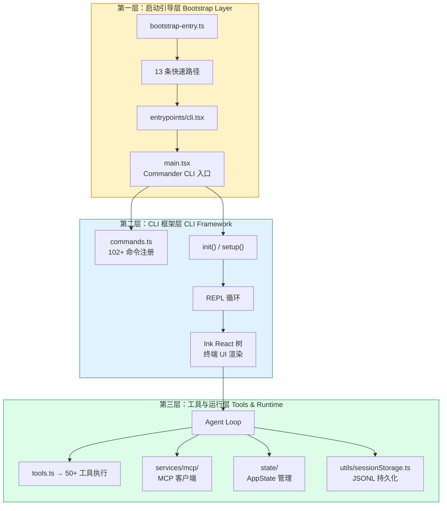
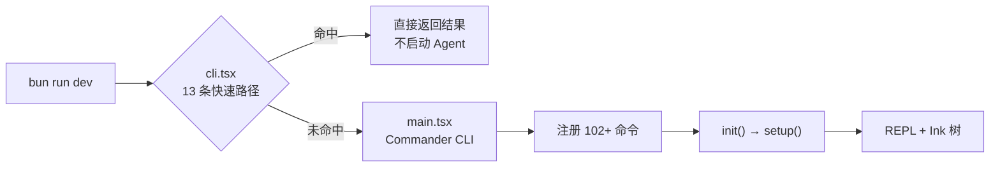
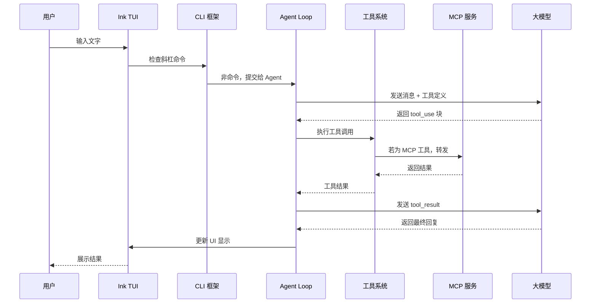
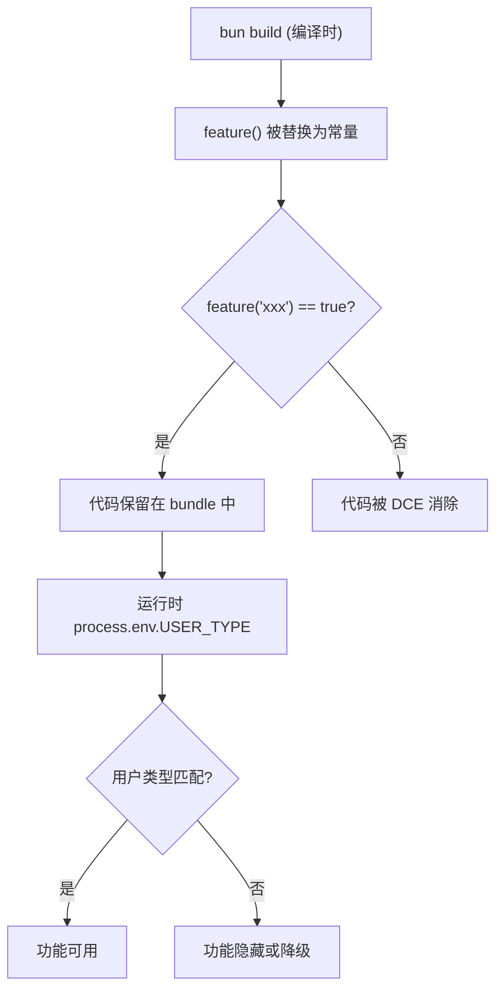

# Claude Code 的总体架构

## 三层架构总览

Claude Code 的源码按职责可以划分为三个层次。每个层次有明确的核心模块和边界协议：



### 第一层：启动引导层 (Bootstrap Layer)

**核心职责**：在用户运行 `claude` 命令后的最初几百毫秒内，完成环境检测、功能开关注入、快速路径分发。

这一层的核心模块包括：

| 模块 | 路径 | 职责 |
| --- | --- | --- |
| Bootstrap Entry | `src/bootstrap-entry.ts` | 注入 MACRO 全局变量（feature flags），决定编译时哪些代码被消除 |
| CLI Entrypoint | `src/entrypoints/cli.tsx` | 检测 13 条快速路径（见下方），未命中则引导至主 CLI |
| Feature Flags | `src/feature.ts` | 编译时 `feature()` + 运行时 `process.env.USER_TYPE` 双机制控制 |
| Migrations | `src/migrations/` | 11 个启动时迁移脚本，确保配置版本与代码版本匹配 |

**13 条快速路径** 包括：打印版本号、Chrome MCP 模式、Computer Use 模式、远程控制模式、daemon 模式、后台会话模式、查看帮助、配置命令直接执行、直接执行单条命令（`claude "写一个单元测试"`）、会话恢复选择器等。



### 第二层：CLI 框架层 (CLI Framework)

**核心职责**：建立整个交互式环境——命令注册、会话初始化、终端 UI 渲染、用户输入处理。

这一层的核心模块：

| 模块 | 路径 | 职责 |
| --- | --- | --- |
| Main CLI | `src/main.tsx` | Commander 框架主入口，注册全部子命令 |
| Commands Registry | `src/commands.ts` | 102+ import 条目，将命令模块注册到系统中 |
| Init / Setup | `src/init.ts` / `src/setup.ts` | 配置加载、工作目录检测、会话初始化 |
| Ink TUI | React + Ink 组件 | 终端中的 React 渲染，消息列表、输入框、状态条 |

Commander.js 是一个成熟的 Node.js CLI 框架。Claude Code 利用它的子命令系统实现了 `claude` 命令下的所有子命令（`claude config`、`claude mcp`、`claude chrome` 等）。但斜杠命令（如 `/help`、`/clear`）是另一套独立的命令系统，通过四管道加载机制实现。

### 第三层：工具与运行层 (Tools & Runtime)

**核心职责**：Agent 核心循环——模型交互、工具执行、状态管理、数据持久化。

这是最厚的一层，按目录结构可以分为：

```
src/
├── tools.ts              # 工具注册总入口，50+ 工具定义
├── tools/                # 各个工具的具体实现
│   ├── BashTool.ts       # 终端命令执行
│   ├── FileEditTool.ts   # 文件编辑
│   ├── FileReadTool.ts   # 文件读取
│   ├── FileWriteTool.ts  # 文件写入
│   ├── GlobTool.ts       # 文件搜索
│   ├── GrepTool.ts       # 内容搜索
│   ├── WebSearchTool.ts  # 网络搜索
│   ├── AgentTool.ts      # 子 Agent 调用
│   └── ...
├── services/mcp/         # MCP 客户端（连接外部服务）
├── state/                # AppState 管理器
├── bootstrap/state.ts    # Bootstrap 层状态（1758 行）
└── utils/sessionStorage.ts # JSONL 会话持久化
```

### 一次请求的完整链路

从用户输入到 UI 更新，数据流经三层中的所有关键模块：



## 三层架构的设计理念

Claude Code 的三层架构并非随意划分，而是反映了生产级 Agent 系统需要解决的核心问题：

| 层次 | 核心问题 | 设计目标 |
| --- | --- | --- |
| 启动引导层 | 用户输入 `claude` 后如何快速响应？ | 百毫秒级启动、13 条快速路径覆盖常见场景 |
| CLI 框架层 | 用户如何与 Agent 高效交互？ | 102+ 命令、React 驱动的终端 UI、直观的交互体验 |
| 工具与运行层 | Agent 如何安全地操作外部世界？ | 50+ 工具、多层权限控制、MCP 协议桥接 |

这种设计的核心优势：
- **关注点分离**：每一层只解决一个核心问题，降低跨层耦合
- **独立迭代**：启动逻辑的优化不影响工具层的安全策略
- **可扩展性**：新增工具或命令不需要修改其他层次的代码
- **便于排查**：问题可以快速定位到具体层次和模块

## 功能开关的双机制

Claude Code 有编译时和运行时两套功能控制机制：

**编译时：`feature()` 与 Dead Code Elimination**

```typescript
// src/feature.ts 中的 feature() 函数
// 在 Bun bundle 阶段被替换为常量 true/false
if (feature("ask-to")) {
  // 这段代码在 bundle 时如果 feature 为 false 会被完全消除
  registerAskToCommand();
}
```

这是通过 Bun bundle 的 macro 机制实现的。`feature()` 在编译时被替换为布尔常量，不可达分支会被 DCE 消除，不产生任何运行时开销。

**运行时：`process.env.USER_TYPE`**

编译后的可执行文件仍然可以通过环境变量控制行为。`USER_TYPE` 变量决定了哪些功能对当前用户开放——类似于一个超级粗粒度的 A/B 测试开关。



## 模块边界与协议类型

不同层之间的模块通过明确的协议通信：

| 桥梁 | 连接 | 协议 |
| --- | --- | --- |
| Bootstrap → CLI | `bootstrap-entry.ts` → `cli.tsx` | 动态 import + MACRO 全局变量 |
| CLI → Commands | `commands.ts` → 各命令模块 | Commander 子命令 + import |
| CLI → Agent | `main.tsx` → Agent Loop | 消息队列 + EventEmitter |
| Agent → Tools | `tools.ts` → 各工具实现 | `Tool` 接口 + 统一调用签名 |
| Tools → MCP | MCPTool → MCP Services | JSON-RPC over stdio/SSE |
| Agent → State | Agent Loop → AppState Store | Event 驱动的状态更新 |

## 架构的演进历史

根据源码结构和编译产物判断，Claude Code 的架构经历了以下演进：

1. **早期：单文件脚本**（~2023 年末）最初只是一个调用 Anthropic API 的脚本，几十个文件。
2. **模块化拆分**（~2024 年初）随着功能增多，拆分为 commands/、tools/、services/ 等目录。
3. **Ink TUI 引入**（~2024 年中）引入 React + Ink 替换原始的终端输出，获得组件化 UI 能力。
4. **MCP 服务层**（~2024 年末）MCP 协议发布后，新增 services/mcp/ 目录作为外部服务桥接层。
5. **Monorepo 雏形**（~2025 年初）代码量膨胀到需要进一步拆分，内部出现 vendor/ 和 shims/ 等兼容层。

今天你看到的源码树（claude-code-rev）是一个经过了至少一年以上迭代的产品级代码库。shims/ 和 vendor/ 目录的存在表明原始代码库可能引用了一些私有依赖或原生模块，需要在重建时做兼容处理。

## 小练习

1. **追踪快速路径**：在 `src/entrypoints/cli.tsx` 中找到 13 条快速路径的 switch/case 语句，逐一列出所有路径并尝试触发其中 3 条。
2. **理解 DCE 机制**：找到 `src/feature.ts` 和 `src/defaultFeatures.ts`，思考为什么需要编译时 DCE 和运行时 `USER_TYPE` 两套机制——只保留一套是否可行？
3. **画你自己的架构图**：不参考本页的架构图，用自己的理解画出 Claude Code 的架构分层和一次请求的完整数据流。然后对照源码验证你的理解。
