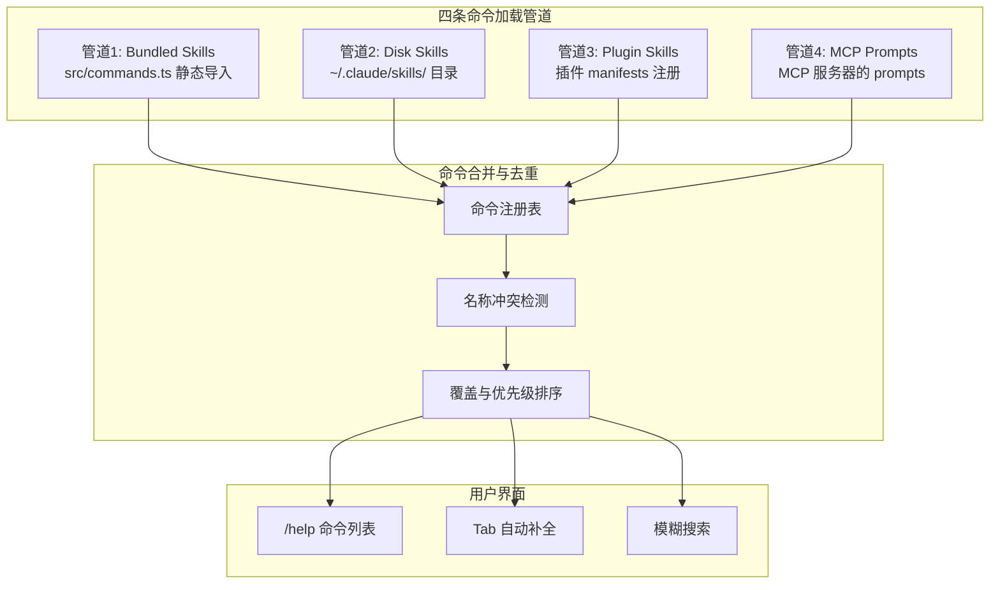
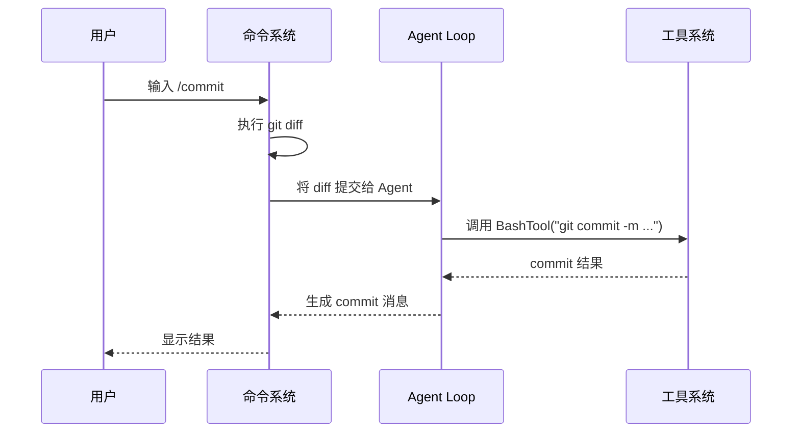
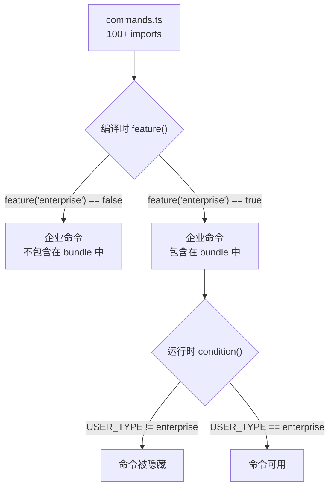

# 命令系统 (102+ Commands)

## 命令 vs 工具：两个完全不同的概念

在 Claude Code 中，**命令（Command）和工具（Tool）是两个独立的概念，服务于不同的目的**：

| 维度 | 命令 (Command) | 工具 (Tool) |
| --- | --- | --- |
| 调用者 | **用户**在终端中输入 | **大模型**在 Agent Loop 中调用 |
| 形式 | 斜杠开头：`/help` `/clear` `/config` | JSON tool_use 块 |
| 作用域 | 控制 Claude Code 本身的行为 | 操作外部环境（文件、终端、网络） |
| 注册机制 | `commands.ts` 中的 import | `tools.ts` 中的 Tool 接口实现 |
| 触发时机 | 用户主动发起 | 模型决策后自动执行 |
| 数量 | 102+ | 50+ |

这个区别非常重要：**命令是用户对 Claude Code 说的话，工具是 Claude Code 对外部世界做的事**。

## 四管道命令加载

Claude Code 的命令系统通过四条「管道」加载命令。每条管道有不同的来源和优先级：



| 管道 | 来源 | 特点 | 优先级 |
| --- | --- | --- | --- |
| Bundled Skills | `src/commands.ts` 中 100+ 个 import | 内置命令，始终可用 | 最高 |
| Disk Skills | 用户 `~/.claude/skills/` 目录 | 用户自定义，可热加载 | 中 |
| Plugin Skills | 插件 manifest 注册的命令 | 插件开发者定义 | 中 |
| MCP Prompts | MCP 服务器的 prompts 端点 | 外部服务提供 | 低 |

### 管道1：Bundled Skills (内置命令)

这是最大也是最重要的一条管道。`src/commands.ts` 文件中包含了 100+ import 语句，每个 import 导入一个命令模块。这些命令构成了 Claude Code 的核心交互能力。

```typescript
// src/commands.ts 的简化示意（实际有 100+ 条目）
import "/commands/help";
import "/commands/clear";
import "/commands/config";
import "/commands/commit";
import "/commands/diff";
import "/commands/compact";
import "/commands/context";
import "/commands/cost";
import "/commands/status";
import "/commands/theme";
import "/commands/effort";
import "/commands/mcp";
import "/commands/chrome";
import "/commands/desktop";
import "/commands/mobile";
import "/commands/session";
import "/commands/tasks";
import "/commands/memory";
import "/commands/skills";
// ... 还有 80+ 个 import
```

每个 import 的模块会调用一个注册函数，将命令信息添加到全局命令注册表中。这种设计使得命令可以独立开发和测试，每个命令文件就是一个自包含的模块。

### 管道2：Disk Skills (磁盘技能)

用户可以在 `~/.claude/skills/` 目录下放置自定义的 Markdown 文件。这些文件会被系统读取并注册为斜杠命令。每个文件代表一个「技能」——一段预定义的提示词模板。

```
~/.claude/skills/
├── review-pr.md       # → /review-pr 命令
├── write-test.md      # → /write-test 命令
└── deploy-check.md    # → /deploy-check 命令
```

这种机制使得用户可以轻松扩展 Claude Code 的能力，而不需要修改源码或安装插件。

### 管道3：Plugin Skills (插件技能)

已安装的插件可以通过其 manifest 文件注册自定义命令。这些命令在插件被启用后自动出现在命令列表中。

### 管道4：MCP Prompts (MCP 提示)

MCP 服务器可以暴露 `prompts` 端点，返回一组预定义的提示词模板。这些提示词也会被注册为命令，但优先级最低，仅在有同名冲突时可以被其他管道覆盖。

## 命令注册机制

每条命令的注册遵循统一的 API：

```typescript
// 命令注册接口（简化）
registerCommand({
  // 斜杠命令名称（不含斜杠）
  name: "help",

  // 帮助文本
  description: "显示帮助信息",

  // 命令是否对用户可见
  hidden?: false,

  // 命令的执行函数
  execute: async (args: string, context: CommandContext) => {
    // ...执行逻辑
  },

  // 条件注册：仅在条件满足时注册
  condition?: () => boolean,
});
```

`condition` 字段是功能开关的关键入口。一个命令可以通过 `condition` 控制哪些用户能看到它：

```typescript
// 仅企业用户可见的命令
registerCommand({
  name: "audit-log",
  description: "查看审计日志",
  condition: () => process.env.USER_TYPE === "enterprise",
  execute: async (args, ctx) => {
    // ...
  },
});
```

## 典型命令分类

102+ 命令可以按用途分为以下几类：

### 查看类

| 命令 | 用途 |
| --- | --- |
| `/help` | 显示所有可用命令 |
| `/status` | 查看当前会话状态 |
| `/context` | 查看当前上下文窗口使用情况 |
| `/cost` | 查看当前会话的 API 费用 |
| `/model` | 查看当前使用的模型 |

### 操作类

| 命令 | 用途 |
| --- | --- |
| `/clear` | 清除当前会话上下文 |
| `/commit` | 生成 git commit 消息 |
| `/diff` | 查看 git diff |
| `/compact` | 压缩会话上下文以节省 token |
| `/review` | 审查当前代码变更 |
| `/pr-create` | 创建 Pull Request |
| `/add` | 将文件添加到上下文 |

### 配置类

| 命令 | 用途 |
| --- | --- |
| `/config` | 查看和修改配置 |
| `/theme` | 切换 UI 主题 |
| `/effort` | 调整模型推理力度（effort 级别） |
| `/env` | 查看环境变量 |

### 外部集成类

| 命令 | 用途 |
| --- | --- |
| `/mcp` | 管理 MCP 服务器连接 |
| `/chrome` | 控制 Chrome 浏览器 |
| `/desktop` | 桌面自动化操作（截图、鼠标） |
| `/mobile` | 移动设备控制 |

### 会话管理类

| 命令 | 用途 |
| --- | --- |
| `/session` | 管理会话（列出、切换、删除） |
| `/resume` | 恢复之前的会话 |
| `/tasks` | 管理后台任务 |
| `/memory` | 管理记忆文件 |
| `/skills` | 管理技能列表 |

## 命令与工具的交互

虽然命令和工具是两个独立的概念，但它们在实际使用中经常配合：



另一个典型例子是 `/clear` 命令——它不会调用任何工具，而是直接操作会话状态，清除消息历史。而 `/config` 命令则通过文件读写工具来修改配置文件。

## 条件命令：功能开关在命令层的应用

与工具的编译时 DCE 不同，命令层使用更灵活的条件注册机制：

- **编译时**：通过 `feature()` 控制整个命令文件是否被包含在 bundle 中
- **运行时**：通过 `condition` 函数在注册时动态判断

这意味着同一个二进制文件可以为不同用户呈现不同的命令集合——企业用户看到 audit-log 命令，普通用户看不到。



## 小练习

1. **阅读 commands.ts**：打开 `src/commands.ts`，数一数有多少个 import 条目。找到 5 个条件注册的例子（带有 `condition` 或 `feature` 的）。
2. **追踪 /clear 的完整执行链路**：从用户输入 `/clear` 开始，到终端 UI 更新完成，跨越了多少个模块？追踪每一步的代码。
3. **创建一个本地技能**：在 `~/.claude/skills/` 目录下创建一个名为 `hello.md` 的文件，内容为 `你是一个友好的助手，以中文回复。`。然后在 Claude Code 中尝试 `/hello` 命令。
4. **命令 vs 工具辨析**：给出 5 个场景，判断应该用命令还是工具实现。例如：「用户想查看当前会话用了多少 token」——这应该是一个命令还是工具？为什么？
