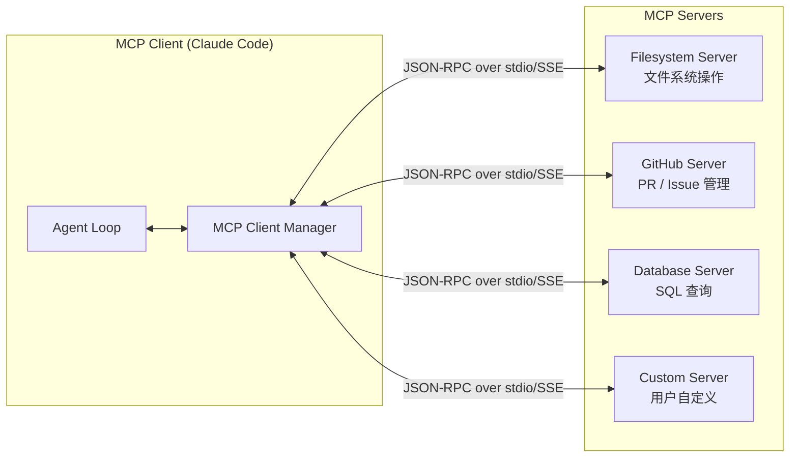
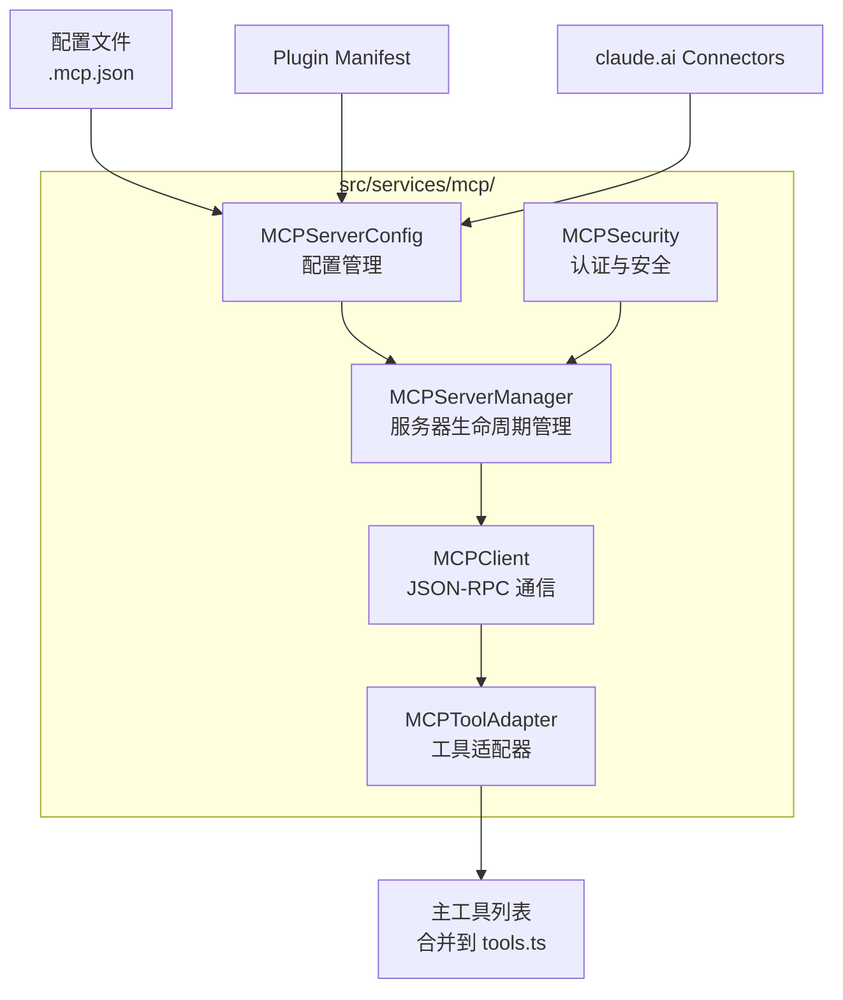
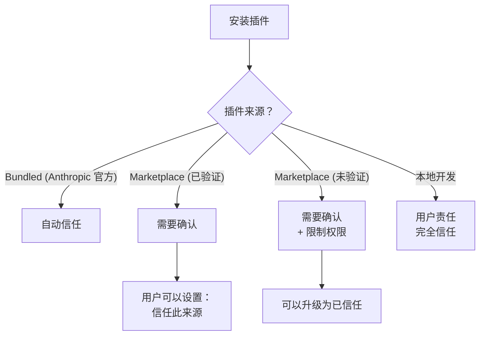

# MCP 与扩展机制

## MCP：Model Context Protocol

MCP（Model Context Protocol）是 Anthropic 推出的一种**标准化协议**，用于在大模型应用和外部工具/资源之间建立双向通信。它的设计目标类似于「AI 界的 USB-C」——让任何 MCP 兼容的客户端都能无缝使用任何 MCP 兼容的服务器。



### MCP 的三大核心能力

MCP 服务器可以向客户端暴露三类资源：

| 能力 | 描述 | 类比 |
| --- | --- | --- |
| **Tools**（工具） | 可被模型调用的函数 | 相当于 Claude Code 内置工具的远程版本 |
| **Resources**（资源） | 可被客户端读取的数据内容 | 相当于一个动态文件系统 |
| **Prompts**（提示词） | 预定义的提示词模板 | 相当于远程注册的斜杠命令 |

Claude Code 作为一个完整的 MCP 客户端，可以消费以上全部三类能力。

### 通信协议

MCP 使用 JSON-RPC 2.0 作为通信协议。传输层支持两种方式：

- **stdio**：通过子进程的标准输入/输出通信（最常用）
- **SSE**：通过 Server-Sent Events 进行 HTTP 流式通信（适用于远程服务器）

```typescript
// MCP JSON-RPC 调用示意
// 客户端 → 服务器：调用工具
{
  "jsonrpc": "2.0",
  "id": 1,
  "method": "tools/call",
  "params": {
    "name": "read_file",
    "arguments": {
      "path": "/path/to/file.txt"
    }
  }
}

// 服务器 → 客户端：返回结果
{
  "jsonrpc": "2.0",
  "id": 1,
  "result": {
    "content": [
      { "type": "text", "text": "文件内容..." }
    ]
  }
}
```

## Claude Code 的 MCP 客户端实现

Claude Code 的 MCP 客户端实现在 `src/services/mcp/` 目录下，是整个系统中最大最复杂的模块之一。它的核心职责包括：



| 模块 | 职责 |
| --- | --- |
| `MCPServerManager` | 管理 MCP 服务器的启动、停止、重连。每个服务器是一个独立的子进程 |
| `MCPClient` | 封装 JSON-RPC 通信细节，提供 `callTool`、`listTools`、`readResource` 等方法 |
| `MCPToolAdapter` | 将 MCP 服务器的工具定义包装为 Claude Code 的 `Tool` 接口，使其能并入主工具列表 |
| `MCPServerConfig` | 从多个来源读取 MCP 服务器配置并合并 |
| `MCPSecurity` | 管理服务器的身份认证、API key 存储和安全策略 |

### MCP 工具如何合并到主工具列表

当 MCP 服务器连接后，其暴露的工具通过 `MCPToolAdapter` 被包装为 Claude Code 原生工具：

```typescript
// MCPToolAdapter 的简化示意
class MCPToolAdapter implements Tool {
  constructor(
    private serverId: string,
    private mcpTool: MCPToolDefinition,
    private client: MCPClient
  ) {
    this.name = `${serverId}:${mcpTool.name}`;  // 命名空间前缀避免冲突
    this.description = mcpTool.description;
    this.inputSchema = mcpTool.inputSchema;
  }

  async *execute(input: JSONValue) {
    // 将调用转发到 MCP 服务器的 tools/call
    const result = await this.client.callTool(this.mcpTool.name, input);
    for (const content of result.content) {
      if (content.type === "text") {
        yield { type: "text", text: content.text };
      }
    }
  }
}
```

这种适配器模式意味着：**对 Agent Loop 来说，MCP 工具和内置工具没有区别**。它们共享同一个注册表、同一套权限检查、同一套执行管道。

## MCP 服务器配置来源

MCP 服务器的配置可以来自三个不同的来源：

| 来源 | 配置方式 | 示例 |
| --- | --- | --- |
| `.mcp.json` | 项目级配置文件 | `{ "servers": { "my-db": { "command": "node", "args": ["server.js"] } } }` |
| Plugin Manifest | 插件自带的服务器声明 | 插件安装时自动注册 |
| claude.ai Connectors | Anthropic 官方的连接器管理 | 通过 claude.ai 网页配置 |

三个来源的配置会在 MCPServerConfig 模块中被合并，并自动处理冲突：

```text
优先级：.mcp.json > Plugin Manifest > claude.ai Connectors
```

## Plugin 系统

Claude Code 的插件系统是其扩展性的重要支柱。插件可以：

- 注册新的斜杠命令
- 提供 MCP 服务器配置
- 注册自定义技能
- 修改 UI 行为

### 插件类型

| 类型 | 来源 | 安装方式 |
| --- | --- | --- |
| Bundled Plugins | Claude Code 内置 | 随安装自动可用 |
| Marketplace Plugins | 插件市场 | 通过 `/plugins` 命令安装 |
| Local Plugins | 本地开发 | 配置路径指向本地目录 |

### Trust 模型

插件安全是一个重要考量。Claude Code 实现了多级信任模型：



## Skill 系统

Skill（技能）是 Claude Code 中比插件更轻量的扩展方式。一个 skill 本质上是一段 Markdown 格式的提示词模板。

### Skill 的来源

| 来源 | 描述 | 示例 |
| --- | --- | --- |
| Bundled Skills | 随 Claude Code 内置的官方技能 | 如代码审查、安全审查 |
| Disk-loaded Skills | 用户放在 `~/.claude/skills/` 下的自定义技能 | 如 `/review-pr` 的提示词 |
| Plugin Skills | 插件注册的技能 | 安装插件后自动可用 |

### Skill 的按需加载

技能系统采用按需加载策略——只有用户通过 `/` 命令触发某个技能时，对应的 Markdown 文件才会被读取和解析。这与 MCP 服务器的「连接时加载」策略不同：

```typescript
// Skill 加载示意（简化）
class SkillManager {
  private skills: Map<string, Skill> = new Map();

  // 按需加载：用户触发 /xxx 时调用
  async loadSkill(name: string): Promise<Skill | null> {
    // 检查缓存
    if (this.skills.has(name)) return this.skills.get(name)!;

    // 按来源优先级查找
    for (const source of this.sources) {
      const skill = await source.findSkill(name);
      if (skill) {
        this.skills.set(name, skill);
        return skill;
      }
    }
    return null;  // 未找到
  }
}
```

## 扩展对比：MCP vs 插件 vs 技能 vs 自定义命令

| 维度 | MCP 服务器 | 插件 | 技能 | 自定义命令 |
| --- | --- | --- | --- | --- |
| 本质 | 独立进程，JSON-RPC 通信 | 配置 + 代码包 | Markdown 提示词文件 | TypeScript 代码模块 |
| 能力 | 工具、资源、提示词 | 命令、MCP、UI 修改 | 斜杠命令 | 斜杠命令 |
| 复杂度 | 高 | 中 | 低 | 低 |
| 隔离性 | 进程级隔离 | 取决于实现 | 无（纯文本） | 无（代码执行） |
| 适用场景 | 连接外部服务 | 复杂功能扩展 | 自定义工作流 | 快速功能添加 |
| 开发门槛 | 需实现 MCP 协议 | 需理解插件 API | 只需写 Markdown | 需了解命令注册 API |

## 小练习

1. **启动一个 MCP 服务器**：创建一个最简单的 MCP 服务器（可以参考 MCP 官方文档中的示例），使用 stdio 传输层启动，并在 Claude Code 中通过 `.mcp.json` 配置连接到它。
2. **追踪 MCP 工具调用链路**：在源码中找到 MCPToolAdapter 的实现——当模型调用 MCP 工具时，数据如何从 Agent Loop 流到外部服务器进程，再返回？
3. **分析 MCP 配置合并**：找到 `MCPServerConfig` 模块的配置合并逻辑。如果你同时有 `.mcp.json` 和插件配置了同一个服务器，会发生什么？
4. **创建你自己的 Skill**：写一个 Markdown 文件放在 `~/.claude/skills/` 下，定义一个你经常使用的工作流（如「整理每日工作日志」），然后在 Claude Code 中用斜杠命令测试它。
