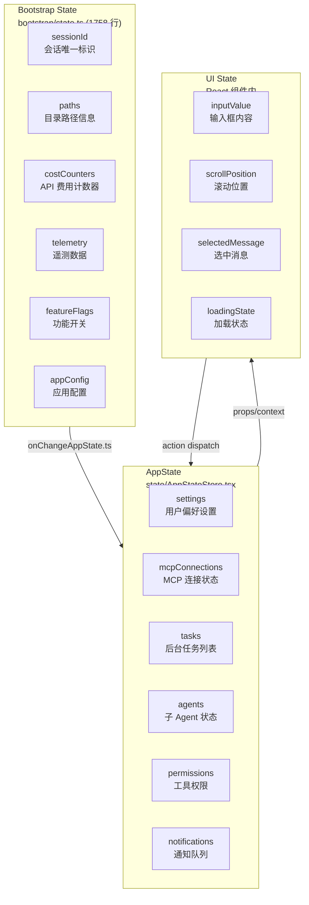
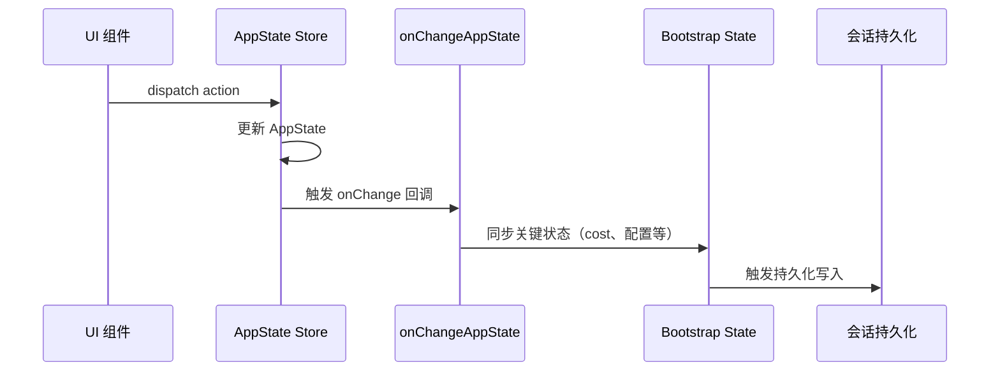
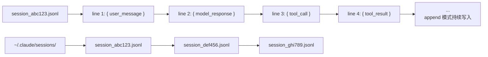
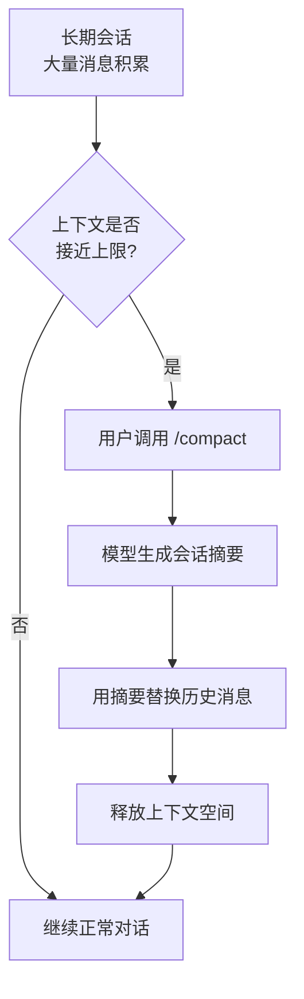

# 会话与状态管理

## 三层状态架构

Claude Code 的状态管理不像一个简单的前端应用那样只有一个状态树。它由三个独立但相互关联的状态层组成，每一层的生命周期、更新机制和消费者都不同：



### 第一层：Bootstrap State

**文件**：`src/bootstrap/state.ts`（1758 行）

这是最底层、生命周期最长的状态。它在 Claude Code 进程启动时初始化，贯穿整个进程的生命周期。它的职责包括：

- **Session Identity**：每个会话生成唯一 ID，用于日志、遥测和会话恢复
- **Paths**：存储工作目录、配置目录、缓存目录等路径信息
- **Cost Counters**：跟踪每个会话的 token 使用量和 API 费用
- **Telemetry**：收集使用数据（如果用户允许）
- **Feature Flags**：存储编译时和运行时的功能开关状态
- **App Config**：从配置文件读取的全局设置（如模型选择、effort 级别）

Bootstrap State 的更新频率低——主要在会话初始化时设置，然后在特定事件（如 cost 变化）时更新。它是一个类似「操作系统内核」的存在——CLI 框架层和工具运行层都依赖它。

```typescript
// bootstrap/state.ts 的简化示意
class BootstrapState {
  sessionId: string;
  startTime: number;
  config: AppConfig;
  costCounter: { inputTokens: number; outputTokens: number; cost: number };
  featureFlags: Map<string, boolean>;
  paths: {
    cwd: string;
    configDir: string;
    cacheDir: string;
    sessionDir: string;
  };

  // 更新 cost 计数器
  addCost(input: number, output: number, cost: number) {
    this.costCounter.inputTokens += input;
    this.costCounter.outputTokens += output;
    this.costCounter.cost += cost;
  }
}
```

### 第二层：AppState

**文件**：`src/state/AppStateStore.tsx` 及相关文件

这是在 Agent Loop 运行过程中动态变化的状态层。它管理所有与当前 Agent 运行相关的状态：

- **Settings**：用户在当前会话中的偏好设置（如 effort 级别、主题）
- **MCP Connections**：所有 MCP 服务器的连接状态和工具列表
- **Tasks**：后台运行的任务列表及其进度
- **Agents**：子 Agent 实例的状态
- **Permissions**：用户对工具的授权决策（allow/deny/ask）
- **Notifications**：需要显示给用户的通知消息

AppState 使用 React 风格的 state management 模式——通常是一个 Context Provider 配合 useReducer 或类似于 Zustand 的状态管理库。当状态变化时，会自动触发 UI 层重新渲染。

```typescript
// AppState 的简化示意
interface AppState {
  settings: {
    effort: "low" | "medium" | "high";
    theme: "light" | "dark";
    verbose: boolean;
  };
  mcpConnections: Map<string, {
    status: "connected" | "connecting" | "disconnected" | "error";
    tools: ToolDefinition[];
    serverInfo: MCPServerInfo;
  }>;
  tasks: TaskInfo[];
  permissions: Map<string, "allow" | "deny" | "ask">;
  notifications: Notification[];
}
```

### 第三层：UI State

UI State 分散在每个 React 组件内部，通过 `useState` 或 `useReducer` 管理。它只与渲染相关，不涉及业务逻辑：

- 输入框的当前文本值
- 消息列表的滚动位置
- 当前选中的消息或工具调用
- 模态框的打开/关闭状态
- 动画和过渡状态

UI State 是三个层次中最「薄」的一层——因为大部分业务状态已经提升到了 AppState 或 Bootstrap State 中。

## 三层之间的通信桥

三层状态之间不是完全独立的。AppState 的变化需要写回 Bootstrap State，使其在会话持久化时被保存。这个桥梁是 `onChangeAppState.ts`：



这种设计确保了：

1. **UI 组件不需要知道 Bootstrap State 的存在**——它们只与 AppState 交互
2. **AppState 不需要关心持久化逻辑**——Bridge 层负责同步
3. **Bootstrap State 保持轻量和稳定**——不会被频繁的 UI 更新干扰

## 会话持久化：JSONL Append 模式

当用户在 Claude Code 中工作时，每次交互（用户输入 + 模型响应 + 工具调用）都被记录为一个 JSONL（JSON Lines）文件。



**路径**：`~/.claude/sessions/<sessionId>.jsonl`

**格式**：每行一个 JSON 对象，代表一次交互中的一个事件。

**Append 模式**：文件只追加、不修改。这意味着即使会话中途崩溃，已写入的记录不会丢失。这也意味着会话文件可以流式读取。

**存储位置**：不同于 `/config` 和 `/skills` 命令处理的「记录」，JSONL 文件存放在 `~/.claude/sessions/` 目录下，可以手动查看和删除。

## 会话恢复与分支

Claude Code 支持两种方式来查看历史会话：

### 恢复（Resume）

通过 `/resume` 命令或 session picker，用户可以选择一个之前的会话并继续。系统会：

1. 从 JSONL 文件中读取所有历史消息
2. 将这些消息填入初始上下文
3. 恢复 Bootstrap State 中的 cost 计数器
4. 启动一个新的 Agent Loop，从历史记录末尾继续

### 分支（Branch）

在恢复会话的基础上，用户可以选择一个历史时间点，从那里开始一个新的分支。这类似于 git 的分支概念：

```text
Session A: ── M1 ── M2 ── M3 ── M4 （原始会话）
                            │
Session B:                  └── M5 ── M6 （分支会话）
```

分支会在一个新的 JSONL 文件中记录，并在其头部引用父会话的 ID 和分支点。

## 会话压缩机制（Compact）

长时间运行的会话会积累大量消息。当上下文窗口接近限制时，Claude Code 提供了 `/compact` 命令来压缩会话内容。

压缩的工作原理：

1. 将当前消息列表发送给模型，要求模型生成一个摘要
2. 用摘要替换原始消息内容（保留工具定义和系统提示）
3. 清理不再需要的中间 tool_result
4. 更新 cost 计数器以反映新的 token 使用量



压缩不是无损的——部分细节会被摘要取代。但对于长期运行的项目工作，它是维持上下文窗口在合理范围内的必要手段。

## 小练习

1. **定位 JSONL 文件**：运行 Claude Code 并发送几条消息，然后打开 `~/.claude/sessions/` 目录，查看生成的 JSONL 文件内容。试着理解每条记录的格式。
2. **阅读 bootstrap/state.ts**：打开 `src/bootstrap/state.ts`，找出所有被持久化的状态字段。哪些字段在会话恢复时会被重建？哪些不会？
3. **追踪一次 cost 更新**：在源码中搜索 `addCost` 或 `costCounter`，找到 cost 计数器被调用的所有位置。这些调用分别来自哪些模块？
4. **实现一个简化版的 session compact（思路练习）**：如果让你实现 `/compact` 命令，你会如何处理？用什么 prompt 让模型生成摘要？如何处理摘要丢失的信息？
