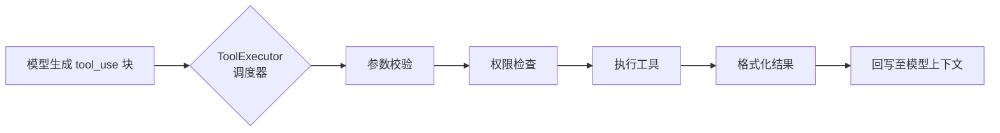
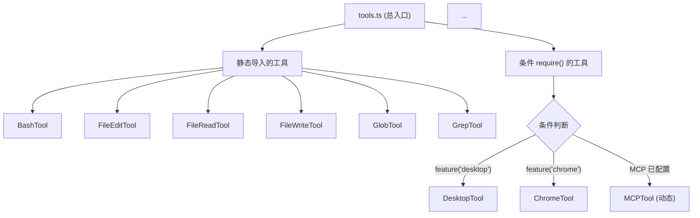

# 工具系统 (50+ Tools)

## 工具：Agent 连接外部世界的接口

在大模型的世界里，工具（Tool）是模型与外部环境之间的桥梁。模型本身无法执行代码、读取文件或访问互联网——它能做的只是生成文本或返回特殊格式的 tool_use 块。**工具系统就是这些 tool_use 块的执行引擎**。

Claude Code 注册了 50+ 个工具，每个工具封装了一个具体的能力：执行终端命令、编辑文件、搜索代码、调用外部 MCP 服务等。当模型决定需要某个能力时，它在响应中返回一个 tool_use 块，Agent Loop 会将其路由到对应的工具实现。



## 核心工具分类

Claude Code 的工具可以按用途分为以下几大类：

### 文件操作类

Claude Code 的核心工具，因为 AI 编码助手的主要工作就是操作代码文件。

| 工具名称 | 类名 | 职责 |
| --- | --- | --- |
| `Bash` | `BashTool` | 在用户终端中执行任意 shell 命令，是整个系统中最具权力的工具 |
| `FileEdit` | `FileEditTool` | 对文件进行精确的行级编辑，支持插入、替换、删除 |
| `FileRead` | `FileReadTool` | 读取文件内容到模型上下文中，支持按行偏移读取 |
| `FileWrite` | `FileWriteTool` | 创建或覆盖写入整个文件 |
| `Glob` | `GlobTool` | 使用 glob 模式搜索文件路径 |
| `Grep` | `GrepTool` | 在文件内容中搜索匹配模式的行（基于 ripgrep） |
| `FileSearch` | `FileSearchTool` | 按文件名模糊搜索 |

### 搜索与信息类

| 工具名称 | 类名 | 职责 |
| --- | --- | --- |
| `WebSearch` | `WebSearchTool` | 使用内置搜索引擎搜索互联网 |
| `WebFetch` | `WebFetchTool` | 获取网页原始内容 |
| `Task` | `TaskTool` | 在后台运行独立任务，支持并行操作 |

### MCP 与外部集成类

| 工具名称 | 类名 | 职责 |
| --- | --- | --- |
| `MCP` | `MCPTool` | 通过 MCP 协议调用外部服务的工具（通用包装器） |
| `Chrome` | `ChromeTool` | 控制 Chrome 浏览器自动化操作 |
| `Desktop` | `DesktopTool` | 计算机桌面操作（截图、鼠标、键盘） |

### Agent 与控制类

| 工具名称 | 类名 | 职责 |
| --- | --- | --- |
| `Agent` | `AgentTool` | 启动子 Agent 实例，用于复杂任务的分解执行 |
| `Skill` | `SkillTool` | 调用已注册的 skill（预定义的提示词模板） |
| `Todo` | `TodoTool` | 创建和管理待办事项列表 |
| `ToolSearch` | `ToolSearchTool` | 在工具列表中搜索合适的工具——工具本身的搜索工具 |

## 工具注册机制

工具的注册有两种路径：



**静态导入**：大部分核心工具在 `src/tools.ts` 中通过静态 import 引入。这意味着它们始终存在于 bundle 中，无论用户是否使用。

**条件 require()**：一些工具（如 DesktopTool、ChromeTool）仅在特定条件满足时加载。使用 `feature()` 宏在编译时决定是否包含这些工具的代码。MCPTool 更特殊——它不是在编译时注册的，而是在运行时根据用户配置的 MCP 服务器动态创建工具实例。

## 工具定义规范

每个工具都遵循统一的 `Tool` 接口：

```typescript
interface Tool {
  // 工具名称，模型在 tool_use 中引用
  name: string;

  // 工具描述，模型决定是否调用时的依据
  description: string;

  // JSON Schema 格式的参数定义
  inputSchema: ToolInputJSONSchema;

  // 工具配置选项
  options?: {
    // 是否需要用户确认才能执行
    requiresApproval?: boolean;
    // 是否应该对用户隐藏
    hiddenFromUser?: boolean;
    // 工具分类标签
    tags?: string[];
  };

  // 核心执行方法
  execute(input: JSONValue): AsyncGenerator<StreamChunk>;
}
```

`execute` 方法是一个异步生成器（AsyncGenerator），它逐步产生 `StreamChunk`——这些 chunk 可以是文本输出、工具状态更新、或终止信号。这种设计使得工具可以在长时间执行（如 Bash 命令）过程中流式输出中间结果，而不必等整个命令执行完毕。

### 一个真实的工具示例（简化）

```typescript
// FileReadTool 的简化示意
class FileReadTool implements Tool {
  name = "FileRead";
  description = "读取文件内容，每行附带行号";
  inputSchema = {
    type: "object",
    properties: {
      file_path: { type: "string", description: "文件绝对路径" },
      offset: { type: "number", description: "起始行号" },
      limit: { type: "number", description: "最多读取行数" },
    },
    required: ["file_path"],
  };

  async *execute(input) {
    const { file_path, offset, limit } = input;
    const file = Bun.file(file_path);
    const content = await file.text();
    const lines = content.split("\n");
    const start = offset ?? 0;
    const end = limit ? start + limit : lines.length;
    const output = lines.slice(start, end)
      .map((line, i) => `${start + i + 1}\t${line}`)
      .join("\n");
    yield { type: "text", text: output };
  }
}
```

## 工具执行链路

工具从模型生成到执行完成，经历以下步骤：

1. **模型生成 tool_use**：模型在响应中返回 `{ type: "tool_use", name: "Bash", input: { command: "ls -la" } }`
2. **名称匹配**：Agent Loop 在注册的工具列表中按 `name` 查找对应的 Tool 实例
3. **参数校验**：使用 `inputSchema`（JSON Schema）校验模型生成的参数
4. **权限检查**：检查该工具是否在用户的 allow/deny 列表中，是否需要确认
5. **执行**：调用工具的 `execute` 方法，传入校验后的参数
6. **流式输出**：通过 `AsyncGenerator` 逐步收集工具的中间输出
7. **结果格式化**：将最终结果格式化为 `tool_result` 块
8. **回写上下文**：将 `tool_result` 追加到消息列表，供模型下一轮使用

```mermaid
sequenceDiagram
  participant Model as 大模型
  participant Loop as Agent Loop
  participant Registry as 工具注册表
  participant Tool as 具体工具
  participant Env as 外部环境

  Model->>Loop: tool_use: Bash("ls -la")
  Loop->>Registry: 查找 BashTool
  Registry-->>Loop: 返回 BashTool 实例
  Loop->>Loop: 参数校验
  Loop->>Loop: 权限检查
  Loop->>Tool: execute({ command: "ls -la" })
  Tool->>Env: Bun.spawn(["ls", "-la"])
  Env-->>Tool: stdout 流
  Tool-->>Loop: StreamChunk(text)
  Tool-->>Loop: StreamChunk(text)
  Tool-->>Loop: StreamChunk(final)
  Loop->>Model: tool_result: "total 24\n..."

```

## 工具权限系统

工具的权限控制是安全的核心。Claude Code 实现了多层级门控：

**第一层：编译时门控**
`feature()` 宏决定某些工具根本不在 bundle 中存在。例如，如果 bundle 时没有启用 `chrome` feature，ChromeTool 的代码就不存在。

**第二层：allow/deny 列表**
用户可以在配置中设置工具的 allow/deny 列表：

```typescript
// 示例：工具权限配置
const toolPolicy = {
  allow: ["FileRead", "FileWrite", "Glob", "Grep"],  // 白名单
  deny: ["Bash"],                                       // 黑名单
  // 不在 allow 列表中、但也不在 deny 中的工具需要用户确认
};
```

如果某个工具既不在 allow 也不在 deny 中，Agent 会弹出一个确认提示，询问用户是否允许当前操作。

**第三层：运行时环境隔离**
BashTool 执行命令时，可以通过 `cwd`、`env` 等参数控制命令的运行环境，防止命令逃逸。此外，BashTool 有超时机制，防止命令无限执行。

## 工具的搜索机制：ToolSearchTool

Claude Code 有一个元工具——`ToolSearchTool`，用于在 50+ 工具中搜索合适的工具。当模型不确定应该调用哪个工具时，可以使用 ToolSearchTool 来探索可用的选项：

```typescript
// ToolSearchTool 的核心逻辑（简化）
class ToolSearchTool implements Tool {
  name = "ToolSearch";
  description = "搜索可用的工具";

  async *execute(input) {
    const { query, category } = input;
    let results = allTools;

    if (category) {
      results = results.filter(t => t.options?.tags?.includes(category));
    }

    if (query) {
      const q = query.toLowerCase();
      results = results.filter(t =>
        t.name.toLowerCase().includes(q) ||
        t.description.toLowerCase().includes(q)
      );
    }

    yield { type: "text", text: formatToolList(results) };
  }
}
```

这个工具的存在意味着：Claude Code 的模型不需要记住所有 50+ 工具的名称和用法。它可以在需要时「查字典」找到正确的工具。

## 小练习

1. **阅读工具注册表**：打开 `src/tools.ts`，列出所有静态导入的工具和条件加载的工具。哪些工具是所有用户都有的？哪些是特定用户才有的？
2. **理解 StreamChunk**：找到 `StreamChunk` 的类型定义（在 `src/types.ts` 附近），列出所有可能的 chunk 类型。为什么工具系统选择 AsyncGenerator 而非简单的 Promise？
3. **追踪权限检查**：在源码中找到工具的权限检查逻辑。当用户对一个工具选择「总是允许」或「总是拒绝」时，这个偏好如何保存和恢复？
4. **创建自定义工具（思路练习）**：如果要给 Claude Code 添加一个 `DockerTool`，使其能在容器中执行命令，你需要实现哪些接口？它与 BashTool 在权限和安全上有什么不同？
