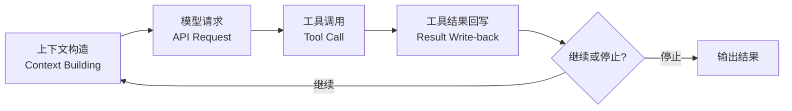
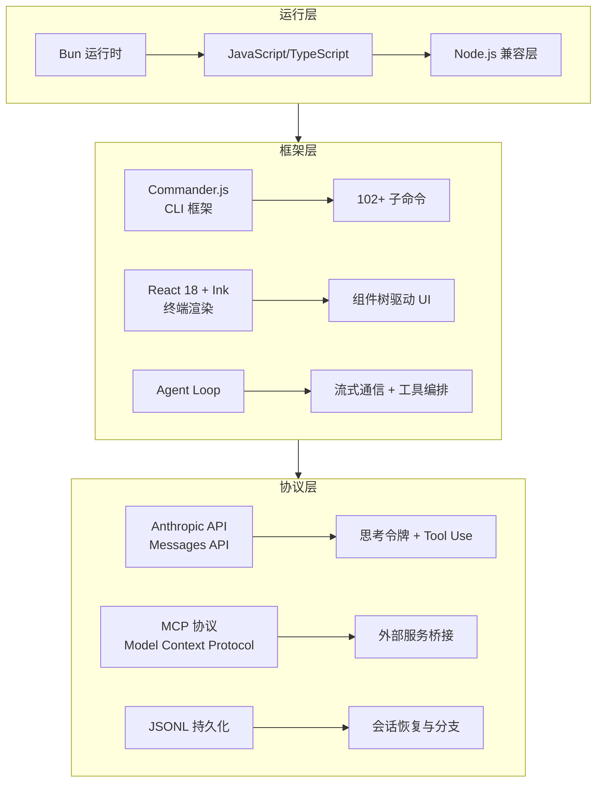

# Claude Code 到底是什么

## 一句话定义

**Claude Code 是 Anthropic 官方出品的终端 AI Agent**。它不是大模型的简单 CLI 包装器，而是一个围绕大模型构建的完整运行时系统——一个能在终端环境里自主理解代码、执行命令、读写文件、调用外部服务的智能代理。

如果你用过 GitHub Copilot 在 IDE 里的行内补全，或用过 Cursor 的对话式编辑，Claude Code 的定位比它们更进一步：它运行在终端中，不依赖任何 IDE，可以直接操作你的整个开发环境。

## 最小闭环：Agent Loop

Claude Code 的核心运行逻辑可以浓缩为一个循环：



这个闭环的每一步都有精密的工程实现：

| 步骤 | 职责 | 关键实现 |
| --- | --- | --- |
| 上下文构造 | 将系统提示、会话历史、工具定义、当前文件状态拼装为一次模型请求 | `constructSystemPrompt()` 动态组装 |
| 模型请求 | 调用 Anthropic API，发送完整请求体 | 流式 SSE 接收，支持思考令牌 |
| 工具调用 | 解析模型返回的 tool_use 块，匹配注册工具 | `ToolExecutor` 路由到具体工具实现 |
| 结果回写 | 将工具执行结果注入下一轮对话 | `formatToolResult()` 格式化为 tool_result 块 |
| 继续/停止 | 判断是否需要继续循环，或停止输出 | 基于 max_tokens、stop_reason、用户中断 |

这个闭环在 Agent 设计模式中被称为 ReAct（Reasoning + Acting）模式。Claude Code 的创新之处不在于这个模式本身，而在于它的实现深度——它不是一个几百行的框架，而是一个数十万行的生产级系统。

## 与通用 Agent 框架的设计对比

Claude Code 虽然是 Anthropic 官方出品的终端 Agent，但其架构设计在很多方面代表了 Agent 框架发展的重要方向。与其他常见 Agent 框架相比：

| 维度 | Claude Code | 常见 Agent 框架 |
| --- | --- | --- |
| 定位 | 生产级终端 AI Agent | 通用 Agent 开发框架 |
| 代码规模 | ~60 万行（含恢复期 shim） | 数千至数万行 |
| 运行环境 | Bun 运行时 | 任意 Node.js/Python |
| 工具数量 | 50+ | 通常 10-20 个 |
| 命令系统 | 102+ 斜杠命令 | 一般无内置命令系统 |
| TUI 渲染 | React + Ink 终端 UI | 纯文本或基础 CLI 输出 |
| MCP 支持 | 内置完整 MCP 客户端 | 需手动集成或通过插件 |
| 会话管理 | JSONL 持久化 + 恢复 + 分支 | 部分框架支持基础持久化 |
| 功能开关 | 编译时 DCE + 运行时门控 | 多数仅有运行时配置 |

如果你通过小型 Agent 框架学会了 Agent 的最小闭环（ReAct 模式），那么 Claude Code 展示的是这个闭环在真实产品中需要面对的所有工程复杂性。

## 技术栈一览

Claude Code 的技术栈选择反映了它对性能和生态的权衡：



为什么选这些技术？

- **Bun 运行时**：提供原生 TypeScript 执行、闪电级启动速度、内置打包器。Claude Code 充分利用 Bun 的 `bun:ffi`、`Bun.file`、`Bun.spawn` 等原生 API 实现文件操作和子进程管理。编译时功能开关通过 Bun 的 bundle macro 实现 DCE（Dead Code Elimination）。
- **React + Ink**：用 React 组件模型描述终端 UI。每个 UI 元素（输入框、消息列表、状态条）都是一个 React 组件，状态管理用熟悉的 `useState`/`useReducer`，副作用用 `useEffect`。这使复杂的终端交互逻辑获得了前端工程的成熟模式。
- **Commander.js**：Node.js 生态最成熟的 CLI 框架，支持子命令嵌套、自动 `--help`、参数解析。Claude Code 用它注册 102+ 个斜杠命令，每个命令是一个独立的 module。
- **MCP 协议**：Anthropic 自家的标准化工具协议，Claude Code 的 MCP 客户端实现是整个系统中最大最复杂的模块之一，管理外部服务的连接、认证、工具发现和路由。

## 最小Demo：一个 Agent Loop 的骨架

为了让概念更具体，下面是一个极度简化的 Agent Loop 示意。真实的 Claude Code 实现比这复杂两个数量级，但核心骨架是相同的：

```typescript
// 极度简化的 Agent Loop 示意
async function agentLoop(userInput: string) {
  const messages = [{ role: "user", content: userInput }];

  while (true) {
    // 1. 上下文构造
    const systemPrompt = buildSystemPrompt(currentTools, sessionContext);

    // 2. 模型请求
    const response = await anthropic.messages.create({
      model: "claude-sonnet-4-20250514",
      system: systemPrompt,
      messages,
      tools: toolDefinitions,
      max_tokens: 8192,
    });

    // 3. 处理响应
    for (const block of response.content) {
      if (block.type === "text") {
        process.stdout.write(block.text);
      } else if (block.type === "tool_use") {
        // 4. 工具调用
        const result = await executeTool(block.name, block.input);
        // 5. 结果回写
        messages.push({ role: "user", content: [{ type: "tool_result", tool_use_id: block.id, content: result }] });
      }
    }

    // 6. 继续或停止
    if (response.stop_reason === "end_turn") break;
  }
}
```

## 小练习

1. **阅读源码**：在 `claude-code-rev` 中找到 `src/main.tsx`，搜索 `agentLoop` 或 `processMessage` 函数，观察真实 Agent Loop 的实现——它和上面的骨架有何不同？
2. **追踪一次工具调用**：从用户输入 "帮我搜索项目中的 TODO 注释" 开始，追踪这会触发哪些工具？最终结果如何呈现给用户？
3. **对比练习**：参考一个你熟悉的小型 Agent 框架（如 LangChain、Vercel AI SDK），对比其 Agent Loop 实现与 Claude Code 的差异。列出至少 3 个 Claude Code 独有的工程细节（提示：关注工具权限系统、会话持久化、MCP 集成等方面）。
