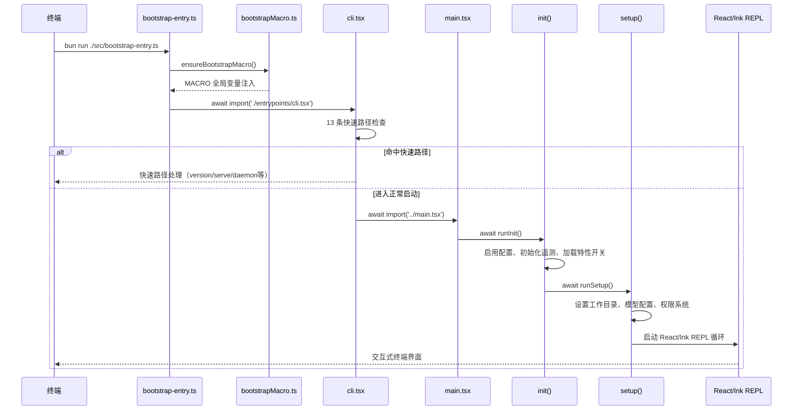

# Demo 1：启动流程解析

## 概述

本 Demo 分析 Claude Code 的完整启动流程，从终端输入 `claude` 命令开始，到最终进入交互式 REPL 的全链路。理解这个流程帮助你掌握任何生产级 CLI 应用的入口设计模式。

Claude Code 的启动不是简单的 `main()` 函数调用，而是一个精心设计的**三阶段引导系统**，包含 13 条快速路径检查和动态模块加载机制。

## 启动链路概览



## 第一阶段：MACRO 注入

### bootstrapMacro.ts

启动的最前端，在 `bootstrap-entry.ts` 中被调用，负责向 `globalThis` 注入编译时常量：

```typescript
// src/bootstrapMacro.ts
const defaultMacro: MacroConfig = {
  VERSION: pkg.version,        // 包版本号
  BUILD_TIME: '',              // 构建时间戳
  PACKAGE_URL: pkg.name,       // 包 URL
  NATIVE_PACKAGE_URL: pkg.name,
  VERSION_CHANGELOG: '',
  ISSUES_EXPLAINER: 'file an issue at https://github.com/anthropics/claude-code/issues',
  FEEDBACK_CHANNEL: 'github',
}

export function ensureBootstrapMacro(): void {
  if (!('MACRO' in globalThis)) {
    (globalThis as any).MACRO = defaultMacro;
  }
}
```

这些常量在构建时被 Bun 打包器内联，使得 `console.log(`${MACRO.VERSION} (Claude Code)`)` 在运行时不需要读取 `package.json`。

### bootstrap-entry.ts

只有两行核心逻辑，但它是整个应用的入口：

```typescript
import { ensureBootstrapMacro } from './bootstrapMacro'
ensureBootstrapMacro()
await import('./entrypoints/cli.tsx')
```

这里的动态 `import()` 是关键设计决策——它确保 MACRO 注入发生在任何其他模块加载之前。

## 第二阶段：13 条快速路径

`cli.tsx` 的核心逻辑是一个包含 **13 条快速路径**的多路分支。每条路径都是独立的"出口"，处理一个特定的 CLI 场景：

| 序号 | 快速路径 | 触发条件 | 描述 |
|------|----------|----------|------|
| 1 | `--version` / `-v` | `args[0] === '--version'` | 零依赖版本输出 |
| 2 | `--dump-system-prompt` | Ant-only 内部工具 | 提取系统提示词 |
| 3 | `--claude-in-chrome-mcp` | `args[2] === '--claude-in-chrome-mcp'` | Chrome MCP 服务 |
| 4 | `--chrome-native-host` | `args[2] === '--chrome-native-host'` | Chrome 原生宿主 |
| 5 | `--computer-use-mcp` | `feature('CHICAGO_MCP')` | 计算机使用 MCP |
| 6 | `--daemon-worker` | `feature('DAEMON')` | 守护进程工作线程 |
| 7 | `remote-control` / `rc` | `feature('BRIDGE_MODE')` | 远程控制模式 |
| 8 | `daemon` | `feature('DAEMON')` | 长期运行守护进程 |
| 9 | `ps` / `logs` / `attach` / `kill` | `feature('BG_SESSIONS')` | 后台会话管理 |
| 10 | `new` / `list` / `reply` | `feature('TEMPLATES')` | 模板任务命令 |
| 11 | `environment-runner` | `feature('BYOC_ENVIRONMENT_RUNNER')` | 环境运行器 |
| 12 | `self-hosted-runner` | `feature('SELF_HOSTED_RUNNER')` | 自托管运行器 |
| 13 | `--worktree --tmux` | tmux + worktree 标志 | 工作树模式 |

每条快速路径使用动态 `import()` 延迟加载依赖模块，例如：

```typescript
// Fast-path for --version/-v: zero module loading needed
if (args.length === 1 && (args[0] === '--version' || args[0] === '-v' || args[0] === '-V')) {
  console.log(`${MACRO.VERSION} (Claude Code)`);
  return;
}

// Fast-path for `claude daemon [subcommand]`: long-running supervisor.
if (feature('DAEMON') && args[0] === 'daemon') {
  const { daemonMain } = await import('../daemon/main.js');
  await daemonMain(args.slice(1));
  return;
}
```

### 设计要点

1. **零开销快速路径**：`--version` 路径不需要加载任何其他模块，毫秒级响应
2. **按需加载**：非共用的模块只有命中对应路径时才加载
3. **编译时消除**：`feature()` 调用在 Bun 构建时会被 DCE，非公开构建中的功能完全消除
4. **启动性能分析**：所有路径都调用 `profileCheckpoint()` 记录时间戳

## 第三阶段：Commander CLI 组装

未命中任何快速路径时，流程进入 `main.tsx`：

```typescript
// main.tsx (简化)
async function main(): Promise<void> {
  startCapturingEarlyInput();
  
  // 1. 解析 CLI 参数
  program
    .name('claude')
    .version(MACRO.VERSION)
    .description('Anthropic\'s AI assistant for terminal')
    .option('--model <model>', 'Model to use')
    .option('--tools <tools>', 'Tool preset')
    .option('--bg', 'Run in background')
    // ... 更多选项

  // 2. 注册全部 102+ 子命令
  registerAllCommands(program);
  
  // 3. 调用 init → setup → REPL
  await cliMain(program);
}
```

`registerAllCommands` 从 `src/commands.ts` 加载所有命令定义，通过 4 条加载管道完成：

- **管道 1**：静态 import（约 60 个命令）
- **管道 2**：条件 `require()`（约 10 个命令，通过 `feature()` 或 `USER_TYPE` 控制）
- **管道 3**：后续加载（依赖初始化结果的动态命令）
- **管道 4**：插件系统（第三方通过 MCP 注册的命令）

## 练习

### 练习 1：跟踪 --version 路径

阅读 `cli.tsx` 中 `--version` 快速路径的实现。请描述：
- 为什么这条路径不需要加载 `startupProfiler`
- MACRO.VERSION 在构建时是如何被内联的
- 如果移除这个快速路径，启动时间会受多大影响

### 练习 2：添加一个新的快速路径

假设你要添加一个新的快速路径 `--schema`，用于输出 JSON Schema 格式的配置文件模板。请写出需要修改的代码位置和大致实现：

```typescript
// 你的实现
if (args[0] === '--schema') {
  // 在这里补全代码
}
```

### 练习 3：分析 feature() 设计

`feature()` 函数来自 `import { feature } from 'bun:bundle'`。请通过代码搜索找到：
1. `feature()` 函数的实现位置
2. 它是如何工作在 Bun 构建时的
3. 编译时消除的条件代码在运行时是否仍包含在 bundle 中

### 练习 4：比较快速路径数量

Claude Code 当前有 13 条快速路径。请逐一列出每条路径的必要性，从"非必要"到"必要"排序，并说明你的理由。

### 练习 5：实战——跟踪一次完整启动

在本地运行 `bun run src/dev-entry.ts` 并添加 `--debug-startup` 标志后，观察控制台输出的性能时间戳。绘制出以下时间点的时间线：
- `cli_entry`
- `cli_before_main_import`
- `cli_after_main_import`
- `cli_after_main_complete`
