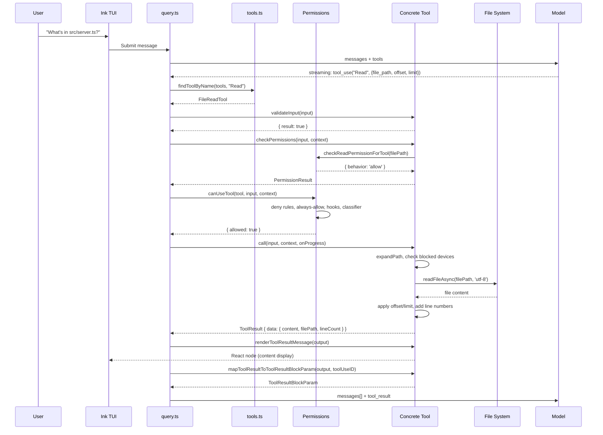

# Demo: Tracing a Tool Execution End-to-End

> Follow a single tool call through the entire Claude Code pipeline — from model output through permission checks, execution, and result rendering.

---

## Part 1: Complete Execution Trace (File Read)

Let's trace what happens when the model decides to read a file. Consider the user asking: *"What does the main function in `src/server.ts` do?"*

### Step 1: Model generates `tool_use`

The model emits a tool_use block as part of its assistant response:

```json
{
  "type": "tool_use",
  "id": "toolu_abc123",
  "name": "Read",
  "input": {
    "file_path": "/Users/jwangkun/project/src/server.ts",
    "offset": 1,
    "limit": 50
  }
}
```

### Step 2: Query Engine receives the block

In `query.ts` (the main execution loop), the streaming response is parsed and each `tool_use` block is routed to the tool execution subsystem. The `claude.ts` service that calls the Anthropic API processes the stream, identifies `content_block_stop` events, and extracts the tool name + input JSON.

The tool is looked up by name via `findToolByName(tools, 'Read')` which checks both the primary name `'Read'` and aliases, returning `FileReadTool`.

### Step 3: Input Validation

The runtime calls `FileReadTool.inputSchema.parse(input)`:

```typescript
// FileReadTool/FileReadTool.ts — inputSchema (Zod)
const inputSchema = lazySchema(() =>
  z.strictObject({
    file_path: z.string().describe('...'),
    offset: z.number().optional().describe('...'),
    limit: z.number().optional().describe('...'),
  })
)
```

The `lazySchema()` wrapper defers schema construction until first use — important for circular dependencies and startup performance.

### Step 4: validateInput() runs

```typescript
// FileReadTool/FileReadTool.ts (pseudocode from the full implementation)
async validateInput(input, context) {
  // 1. Check for blocked device paths
  if (isBlockedDevicePath(input.file_path)) {
    return { result: false, message: 'Cannot read from blocked device path', errorCode: 1 }
  }
  // 2. Check file existence (async)
  const exists = await fileExists(input.file_path)
  if (!exists) {
    return { result: false, message: `File not found: ${input.file_path}`, errorCode: 2 }
  }
  return { result: true }
}
```

If validation fails, the error is returned as a `tool_result` and the model sees the error message, never reaching permissions or execution.

### Step 5: checkPermissions()

```typescript
// FileReadTool delegates to the filesystem permission system
async checkPermissions(input: Input, context: ToolUseContext) {
  const permission = await checkReadPermissionForTool(input.file_path, context)
  return permission
}
```

The permission system (`src/utils/permissions/filesystem.ts`) checks:
1. **Deny rules** — Is this file path in the deny list?
2. **Always-allow rules** — Is it in an always-allowed directory?
3. **Always-ask rules** — Does it require explicit approval?
4. **Denial tracking** — Have we asked too many times?

The result is a `PermissionResult`: `{ behavior: 'allow', updatedInput }` or `{ behavior: 'ask', message: '...' }`.

### Step 6: canUseTool() — Hooks and Classifier

After the tool-level check, `canUseTool()` runs additional checks:

```typescript
// src/hooks/useCanUseTool.ts (conceptual flow)
async function canUseTool(tool, input, context) {
  // 1. Pre-tool-use hooks (user-defined in CLAUDE.md)
  for (const hook of preToolUseHooks) {
    const result = await hook(tool, input)
    if (result === 'block') return { allowed: false }
  }
  
  // 2. Auto-mode classifier (if enabled)
  if (autoMode) {
    const classification = await classifier.classify(tool, input)
    if (classification === 'allow') return { allowed: true }
    if (classification === 'deny') return { allowed: false }
    // 'ask' falls through to permission prompt
  }

  // 3. Permission prompt (if needed)
  return showPermissionPrompt(tool, input)
}
```

### Step 7: Tool Execution (`call()`)

```typescript
// FileReadTool/FileReadTool.ts — call method (simplified)
async call(input, context, canUseTool, parentMessage, onProgress) {
  const filePath = expandPath(input.file_path)
  
  // Report progress to UI
  onProgress?.({ toolUseID: parentMessage.toolUseId, data: { type: 'read' } })
  
  // Read the file
  const content = await readFileAsync(filePath, 'utf-8')
  
  // Apply line offset/limit
  const lines = content.split('\n')
  const selectedLines = lines.slice(input.offset - 1, input.limit ? input.offset - 1 + input.limit : undefined)
  
  // Add line numbers
  const result = addLineNumbers(selectedLines.join('\n'), input.offset)
  
  // Trigger file read analytics
  logFileOperation({ operation: 'read', filePath })
  
  // Discover skills for this path
  discoverSkillDirsForPaths(filePath, context)
  
  return { data: { content: result, filePath, lineCount: selectedLines.length } }
}
```

### Step 8: Result Rendering

The tool's `renderToolResultMessage()` generates the Ink/React UI:

```typescript
// FileReadTool/UI.tsx (simplified)
renderToolResultMessage(output, progressMessages, options) {
  return (
    <Box flexDirection="column">
      <Text color="green">Read {output.filePath} ({output.lineCount} lines)</Text>
      <Text>{output.content}</Text>
    </Box>
  )
}
```

### Step 9: Result Serialization

The output is converted to an API-compatible `tool_result` block:

```typescript
// FileReadTool mapToolResultToToolResultBlockParam
mapToolResultToToolResultBlockParam(content, toolUseID) {
  // If content exceeds maxResultSizeChars, persist to disk
  // and return a preview reference
  return {
    tool_use_id: toolUseID,
    type: 'tool_result',
    content: content.content
  }
}
```

For `FileReadTool`, `maxResultSizeChars` is set to `Infinity` (the tool already self-bounds via its `limit` parameter), so results are never persisted to disk.

### Step 10: Context Append

The `tool_result` block is appended to the message history and sent back to the model in the next API request, completing the turn.

---

## Part 2: Execution Flow Diagram



---

## Part 3: Code Trace Through Source Files

Here is the actual execution path in the source code when a tool call is processed:

| Step | Source File | What Happens |
|------|-------------|--------------|
| 1 | `services/api/claude.ts` | Streams API response, detects `content_block_stop`, extracts tool_use blocks |
| 2 | `query.ts` (around line ~400) | Receives tool_use, looks up tool by name from merged tools pool |
| 3 | `Tool.ts` `findToolByName()` | Linear search checking `tool.name === name` or `tool.aliases?.includes(name)` |
| 4 | `Tool.ts` `validateInput()` | Calls tool.inputSchema.parse() to validate the JSON arguments |
| 5 | `utils/permissions/filesystem.ts` | Permission check — reads rules from app state, matches patterns |
| 6 | `hooks/useCanUseTool.ts` | Pre-tool hooks (CLAUDE.md), auto-classifier, denial tracking |
| 7 | Tool's `call()` method | The actual work — file I/O, network requests, agent spawning |
| 8 | Tool's `renderToolResultMessage()` | Generates Ink JSX for the terminal UI |
| 9 | Tool's `mapToolResultToToolResultBlockParam()` | Serializes to API format |
| 10 | `utils/toolResultStorage.ts` | Persists large results to disk beyond maxResultSizeChars |

### Key Source Files Reference

- **Tool interface**: `src/Tool.ts` (lines 362-695)
- **Tool builder**: `src/Tool.ts` `buildTool()` (lines 783-792)
- **Tool defaults**: `src/Tool.ts` `TOOL_DEFAULTS` (lines 757-769)
- **Tool registry**: `src/tools.ts` `getAllBaseTools()` (lines 193-251)
- **Tool filtering**: `src/tools.ts` `filterToolsByDenyRules()` (lines 262-269)
- **Tool assembly**: `src/tools.ts` `assembleToolPool()` (lines 345-367)
- **Permission constants**: `src/constants/tools.ts` (all 113 lines)
- **BashTool call method**: `src/tools/BashTool/BashTool.tsx` (line ~500+)
- **FileEditTool input schema**: `src/tools/FileEditTool/types.ts`
- **MCPTool proxy**: `src/tools/MCPTool/MCPTool.ts` (lines 27-77)

---

## Part 4: Exercise — Trace Web Search Execution

Try to trace the execution of a web search request step by step, starting from the model calling `WebSearch` with `{ query: "latest React docs" }`.

### Questions to Answer:

1. **Which file handles the `isEnabled()` check for WebSearchTool, and what does it verify?**
   - Look at `src/tools/WebSearchTool/WebSearchTool.ts` line 168-193. It checks the API provider (`firstParty`, `vertex`, `foundry`) and model version (Claude 4.0+ for Vertex).

2. **How does WebSearchTool differ from other tools in its `call()` method?**
   - Unlike most tools that perform direct I/O, WebSearchTool spawns a **sub-query** using `queryModelWithStreaming()` (line 268), passing a `web_search_20250305` beta tool schema. It delegates the actual search to Claude's API.

3. **What permission check pattern does WebSearchTool use?**
   - It returns `{ behavior: 'passthrough' }` from `checkPermissions()` (line 209), meaning it falls through to the general permission system. It also registers `suggestions` for `addRules` so users can auto-approve future searches.

4. **Why does `extractSearchText()` return an empty string?**
   - Line 229-234: The renderToolResultMessage only shows "Did N searches in Xs" chrome. The actual search results never appear on screen (they're in the tool_result sent to the model, not in the UI), so there's nothing to index for transcript search.

5. **What happens when `max_uses` (8) is exceeded?**
   - The API enforces the limit. The tool schema hardcodes `max_uses: 8` (line 82) in `makeToolSchema()`.

### Part 5: Advanced — Understanding `buildTool()` Internals

The `buildTool()` function at `src/Tool.ts` line 783-792 is the factory for all tools:

```typescript
export function buildTool<D extends AnyToolDef>(def: D): BuiltTool<D> {
  return {
    ...TOOL_DEFAULTS,     // safe defaults (isEnabled=true, isConcurrencySafe=false, etc.)
    userFacingName: () => def.name,  // name as default
    ...def,                // tool-specific overrides
  } as BuiltTool<D>
}
```

The type machinery (`BuiltTool<D>`, `DefaultableToolKeys`, `ToolDefaults`) ensures that:
- Required fields (name, inputSchema, outputSchema, call, etc.) must be provided
- Optional fields (isEnabled, isReadOnly, etc.) get filled in automatically
- The return type accurately reflects what was provided vs. defaulted

This means every tool export looks like:
```typescript
export const MyTool = buildTool({
  name: 'MyTool',
  inputSchema: ...,
  outputSchema: ...,
  async call(input, context) { ... },
  // Only override what's needed:
  isConcurrencySafe() { return true },
  isReadOnly() { return true },
})
```

Without having to spell out `isEnabled: () => true`, `checkPermissions: ...`, etc. every time.
