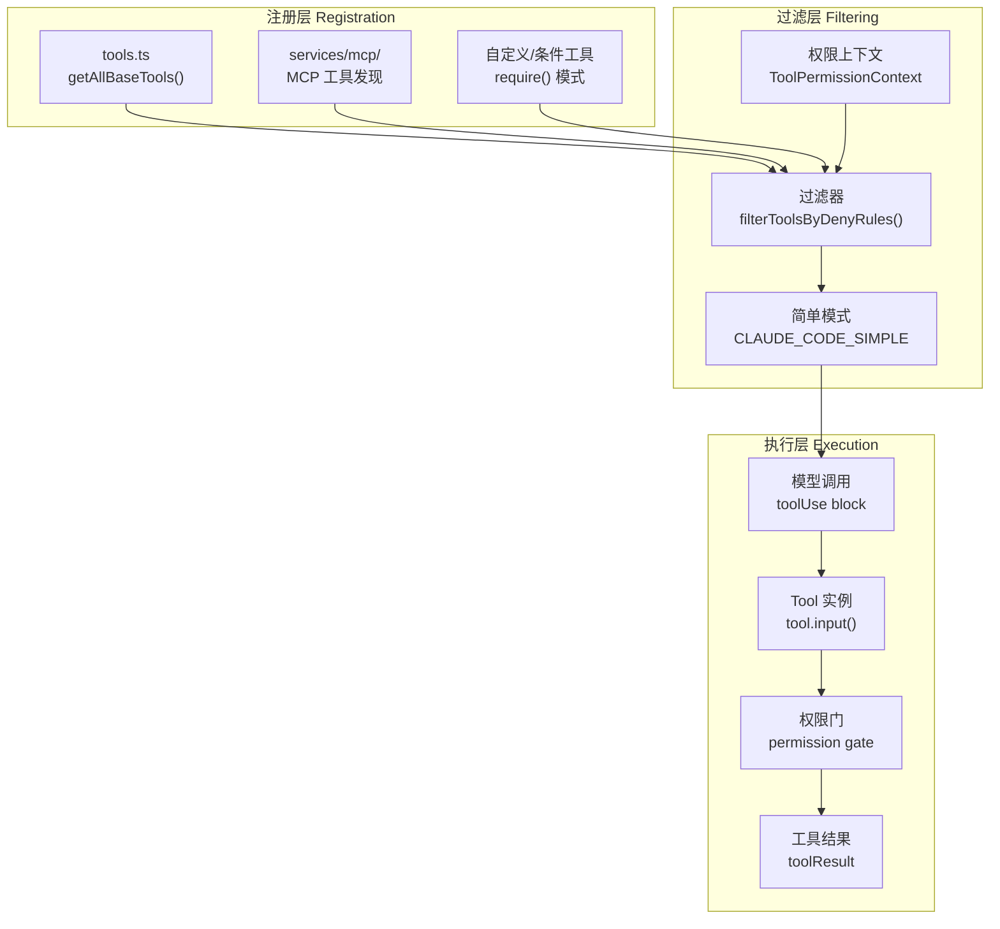
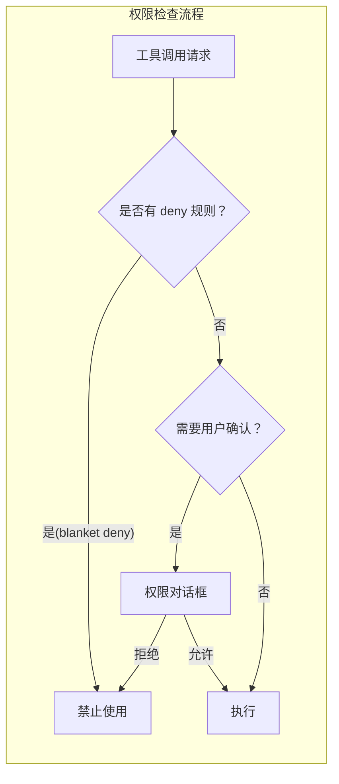

# Demo 2：工具系统

## 概述

Claude Code 拥有 50 多个工具（Tools），这是大模型与终端交互的核心能力层。每个工具都是一个独立的类，封装了工具的定义（名称、描述、输入 schema）、权限控制和执行逻辑。

本 Demo 分析工具系统的完整设计：如何注册、如何过滤、如何执行，以及权限系统如何工作。

## 工具系统架构



## Tool 接口定义

核心接口在 `Tool.ts` 中定义，每个工具必须实现这个接口：

```typescript
// src/Tool.ts (核心字段)
export interface Tool {
  name: string                          // 工具名称，如 Bash, FileRead, WebSearch
  description: string                   // 给模型看的描述文本
  inputSchema: ToolInputJSONSchema      // JSON Schema 格式的输入约束
  isEnabled(): boolean                  // 运行时是否启用
  input(input: any, context: ToolContext): AsyncGenerator<ToolResult>
  // 可选的权限检查
  permissionCheck?: (context: ToolPermissionContext) => PermissionResult
  // MCP 工具信息（如果是 MCP 工具）
  mcpInfo?: { serverName: string; toolName: string }
}
```

## 工具注册机制

### 静态注册（主要路径）

`tools.ts` 中的 `getAllBaseTools()` 函数汇集所有可用工具：

```typescript
export function getAllBaseTools(): Tools {
  return [
    AgentTool,           // Agent 子代理
    TaskOutputTool,      // 任务输出
    BashTool,            // 终端命令执行
    ...(hasEmbeddedSearchTools() ? [] : [GlobTool, GrepTool]),
    ExitPlanModeV2Tool,  // 退出计划模式
    FileReadTool,        // 读取文件
    FileEditTool,        // 编辑文件
    FileWriteTool,       // 写入文件
    NotebookEditTool,    // Jupyter Notebook 编辑
    WebFetchTool,        // 网页抓取
    TodoWriteTool,       // 待办事项
    WebSearchTool,       // 网页搜索
    TaskStopTool,        // 任务停止
    AskUserQuestionTool, // 询问用户
    SkillTool,           // 技能调用
    EnterPlanModeTool,   // 进入计划模式
    // ... 条件工具
  ];
}
```

### 条件注册

有些工具通过 `feature()` 或 `USER_TYPE` 环境变量条件加载：

```typescript
// 条件 import：仅 Ant 内部可用
const REPLTool =
  process.env.USER_TYPE === 'ant'
    ? require('./tools/REPLTool/REPLTool.js').REPLTool
    : null

// 条件 import：通过 feature() 编译时 DCE
const WebBrowserTool = feature('WEB_BROWSER_TOOL')
  ? require('./tools/WebBrowserTool/WebBrowserTool.js').WebBrowserTool
  : null
```

### 惰性加载

为避免循环依赖，部分工具使用惰性加载（函数内 `require()`）：

```typescript
const getTeamCreateTool = () =>
  require('./tools/TeamCreateTool/TeamCreateTool.js').TeamCreateTool
```

## 权限门系统

每个工具调用前都经过权限检查。系统使用分层权限模型：



权限规则来自：
- **用户配置文件**：`~/.claude/settings.json`
- **项目配置文件**：`.claude/settings.json`
- **CLI 参数**：通过 `--allowed-tools` 和 `--disallowed-tools` 标志

```typescript
// 权限检查示例
import { getDenyRuleForTool } from './utils/permissions/permissions.js'

export function filterToolsByDenyRules<T extends { name: string }>(
  tools: readonly T[],
  permissionContext: ToolPermissionContext
): T[] {
  return tools.filter(tool => !getDenyRuleForTool(permissionContext, tool))
}
```

## 工具类型分类

| 类别 | 工具名 | 说明 |
|------|--------|------|
| 文件操作 | FileReadTool, FileEditTool, FileWriteTool, GlobTool, GrepTool | 读/写/搜索文件 |
| 终端执行 | BashTool, PowerShellTool, REPLTool | 执行 Shell 命令 |
| 网络访问 | WebFetchTool, WebSearchTool | HTTP 请求和搜索 |
| 模型交互 | AgentTool, AskUserQuestionTool, SkillTool | 子代理和人机交互 |
| 任务管理 | TaskCreateTool, TaskStopTool, TaskOutputTool | 并行任务 |
| MCP | ListMcpResourcesTool, ReadMcpResourceTool | MCP 资源操作 |
| 内部工具 | ConfigTool, TungstenTool, TestingPermissionTool | Ant 内部运维 |

## MCPTool 包装器

外部 MCP 服务器暴露的工具通过 `MCPTool` 包装器合并到工具列表。每当一个 MCP 服务器连接成功，它的工具被包装为 `MCPTool` 实例，添加到全局工具列表。

```typescript
// MCPTool 包装器概念
class MCPTool implements Tool {
  constructor(
    public name: string,
    public description: string,
    public inputSchema: ToolInputJSONSchema,
    private serverName: string,
    private serverConnection: MCPServerConnection
  ) {}

  async *input(input: any, context: ToolContext) {
    // 通过 MCP 协议调用远程工具
    const result = await this.serverConnection.callTool(this.name, input);
    yield result;
  }
}
```

## 简单模式

当设置了 `CLAUDE_CODE_SIMPLE=1` 环境变量（或使用了 `--bare` 标志），工具列表被缩减为只有三个核心工具：

```typescript
// 简单模式：仅核心工具
const simpleTools: Tool[] = [BashTool, FileReadTool, FileEditTool]
```

这种设计让 Claude Code 可以在受限环境中运行，或用于特定场景（如仅代码审查）。

## 练习

### 练习 1：追踪工具执行路径

选取一个你常用的工具（如 `FileReadTool`），跟踪从用户输入斜杠命令到工具执行的完整代码路径。画出执行流程图，标注每个阶段涉及的文件。

### 练习 2：添加一个自定义工具

假设你要添加一个名为 `WeatherTool` 的新工具，用于查询天气。请写出：

1. 新建工具类所需的文件结构
2. 需要在 `tools.ts` 中哪些地方注册
3. 工具类的骨架代码

### 练习 3：分析条件注册模式

阅读 `tools.ts` 中所有条件 `require()` 调用，列出：
- 哪些工具仅限 Ant 内部使用
- 哪些工具通过 `feature()` 标记条件编译
- 为什么有些工具使用惰性加载（函数内 require）而非顶层条件 require

### 练习 4：权限规则实验

在 `~/.claude/settings.json` 中添加以下规则，然后运行 Claude Code 并尝试使用 WebFetchTool：

```json
{
  "permissions": {
    "deny": [
      { "tool": "WebFetch", "reason": "禁止网络访问" }
    ]
  }
}
```

观察：
- 工具列表是否还包含 `WebFetch`
- 调用时是否会显示明确的拒绝信息
- 如何查看当前的权限状态

### 练习 5：简单模式实验

运行 `CLAUDE_CODE_SIMPLE=1 claude` 对比正常模式下的工具列表差异。有多少工具被隐藏了？背后的过滤逻辑在哪里实现？
