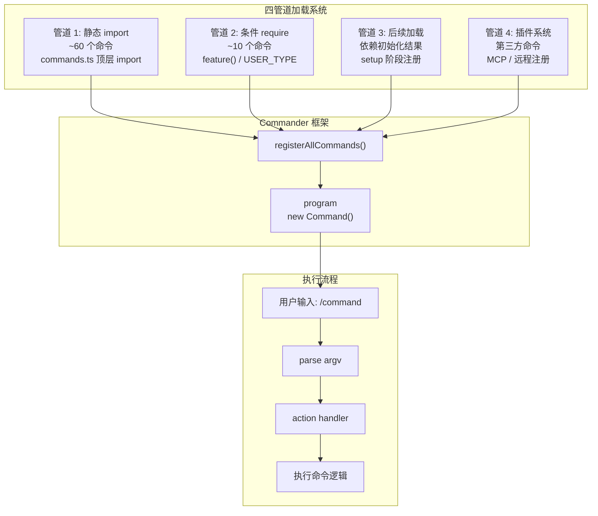
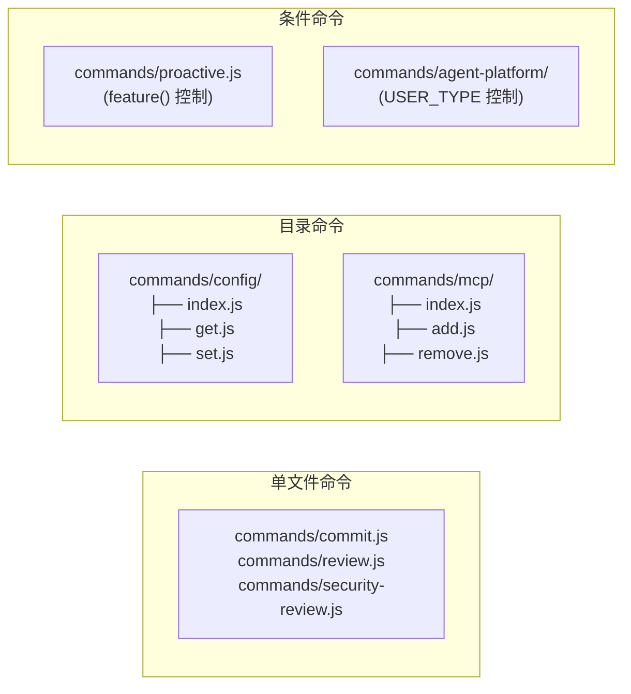

# Demo 3：命令机制

## 概述

Claude Code 拥有 **102+ 个斜杠命令**（Commands），是用户与 Claude Code 交互的主要方式。命令系统与工具系统（Tools）有明显的分工：**命令是人用的，工具是模型用的**。

本 Demo 分析命令系统的四管道加载架构、命令目录文件结构和 DCE 模式。

## 命令系统架构



## Command 接口

每个命令模块导出一个符合 `Command` 接口的对象：

```typescript
// src/commands.ts 中定义的 Command 类型
export interface Command {
  name: string                    // 命令名称，如 'init', 'config', 'help'
  description?: string            // 简短说明
  aliases?: string[]              // 别名，如 'i' 是 'init' 的别名
  isEnabled?: () => boolean       // 启用检查
  action: (args: any, options: any) => Promise<void> | void
  // Commander 扩展
  arguments?: string              // 参数定义
  options?: Option[]              // 选项定义
  subcommands?: Command[]         // 子命令
}
```

## 四管道命令加载

### 管道 1：静态 import（主要路径）

`commands.ts` 中约 60 个命令通过顶层静态 import 注册：

```typescript
// src/commands.ts (静态导入部分)
import addDir from './commands/add-dir/index.js'
import autofixPr from './commands/autofix-pr/index.js'
import clear from './commands/clear/index.js'
import commit from './commands/commit.js'
import config from './commands/config/index.js'
import help from './commands/help/index.js'
import init from './commands/init.js'
import login from './commands/login/index.js'
import mcp from './commands/mcp/index.js'
import memory from './commands/memory/index.js'
import review, { ultrareview } from './commands/review.js'
import session from './commands/session/index.js'
import skills from './commands/skills/index.js'
// ... 约 60 个 import
```

每个命令对应一个文件或目录。当命令逻辑复杂时，使用目录结构（如 `config/index.js`）；当命令简单时，使用单文件（如 `commit.js`）。

### 管道 2：条件 require

约 10 个命令通过编译时 DCE 或运行时条件控制：

```typescript
// 条件 require：通过 feature() 编译时 DCE
const proactive =
  feature('PROACTIVE') || feature('KAIROS')
    ? require('./commands/proactive.js').default
    : null

const assistantCommand = feature('KAIROS')
  ? require('./commands/assistant/index.js').default
  : null

const bridge = feature('BRIDGE_MODE')
  ? require('./commands/bridge/index.js').default
  : null

const voiceCommand = feature('VOICE_MODE')
  ? require('./commands/voice/index.js').default
  : null

// 条件 require：仅 Ant 内部可用
const agentsPlatform =
  process.env.USER_TYPE === 'ant'
    ? require('./commands/agents-platform/index.js').default
    : null
```

### 管道 3：后续加载

部分命令依赖初始化结果（如配置加载、用户认证），在 `setup()` 阶段动态注册。

### 管道 4：插件系统

第三方通过 MCP 协议注册的命令，或通过 skill 系统发现的自定义命令。

## 命令目录结构



## 命令与工具的区别

| 维度 | 命令 (Commands) | 工具 (Tools) |
|------|----------------|--------------|
| 使用者 | 终端用户 | AI 模型（Claude） |
| 触发方式 | 斜杠命令 `/init` | 模型 tool_use block |
| 注册方式 | Commander.js 子命令 | getAllBaseTools() |
| 数量 | 102+ | 50+ |
| 执行上下文 | 终端交互 | Agent Loop |
| 示例 | `/init`, `/config`, `/help` | Bash, FileRead, WebSearch |

## DCE 模式分析

`feature()` 函数在 Bun 编译时评估，不满足条件的分支被完全消除：

```typescript
// 这个文件中的 feature() 在 bun build 阶段评估
import { feature } from 'bun:bundle'

// 对外部构建（npm 发布版），非标准命令被 DCE 消除
const voiceCommand = feature('VOICE_MODE')
  ? require('./commands/voice/index.js').default
  : null

// 运行时条件评估的是 process.env，不是 feature()
const antOnlyCommand = 
  process.env.USER_TYPE === 'ant'
    ? require('./commands/agents-platform/index.js').default
    : null
```

关键区别：
- **`feature('X')`**：编译时评估，构建时直接消除不满足条件的代码
- **`process.env.USER_TYPE`**：运行时评估，代码始终包含在 bundle 中

## 练习

### 练习 1：绘制命令树

在 `commands.ts` 中找到所有静态 import 的命令，创建一个完整的命令树：

```
claude
├── init
├── config
│   ├── get
│   └── set
├── help
├── mcp
│   ├── add
│   └── remove
...
```

列出每个命令的源文件路径。

### 练习 2：分析条件命令

找到 `commands.ts` 中所有通过 `feature()` 控制的条件命令，为每个命令回答：
- `feature()` 的标记名称是什么
- 这个命令在外部构建中是否可用
- 该命令的源文件存放位置

### 练习 3：添加一个新命令

假设你要添加 `/summarize` 命令。请写出：

1. 新建的源文件内容（骨架）
2. 需要在 `commands.ts` 中添加的 import 代码
3. 如何在 Commander 中注册这个子命令

```typescript
// 新建 commands/summarize.js
export default {
  name: 'summarize',
  // 完善这个对象
}
```

### 练习 4：追踪一条命令的执行

选取 `/config` 命令，跟踪从用户在终端输入 `/config set theme dark` 到执行的完整链路。画出数据流图，标注涉及的每个文件和函数。

### 练习 5：管道 3 后续加载

搜索 `setup()` 或初始化过程中动态注册命令的代码。哪些命令不是在启动时注册的？为什么它们需要延迟注册？
