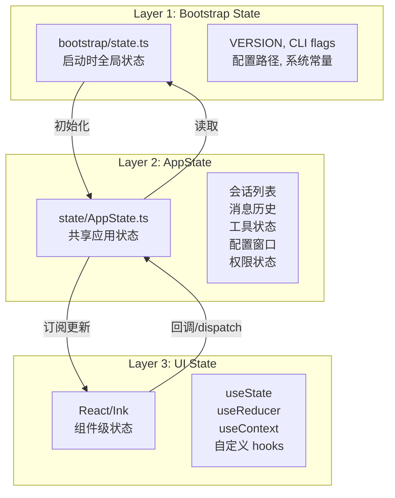
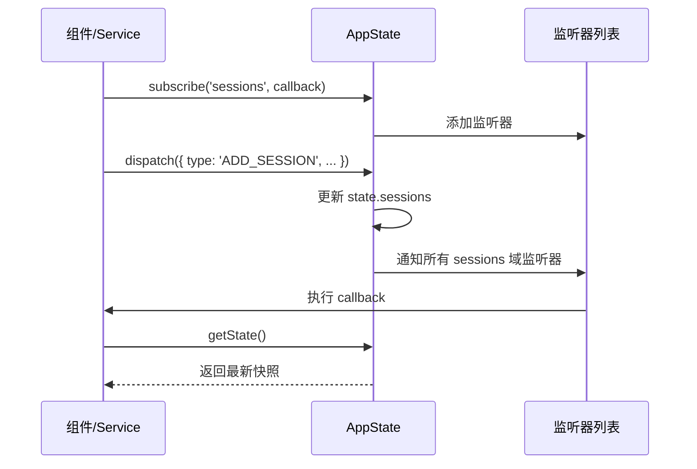
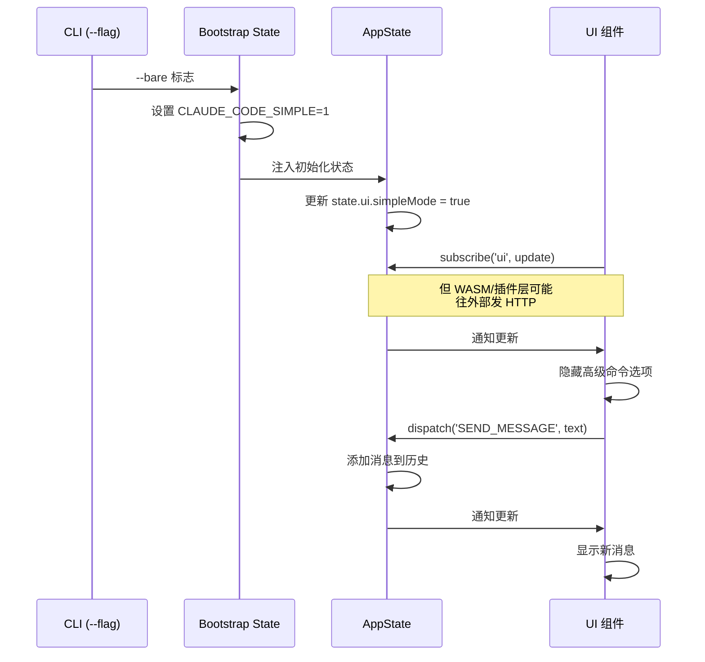

# Demo 4：会话与状态

## 概述

Claude Code 的会话状态管理采用**三层架构**，将不同关注点的状态分离管理。这个设计借鉴了传统 Web 应用的分层状态管理思想，但针对终端 AI Agent 场景做了针对性优化。

本 Demo 分析三层状态如何协同工作、状态变更如何在层间传播，以及会话持久化机制。

## 三层状态架构



## Layer 1：Bootstrap State

Bootstrap State 是启动时确定的全局状态，一旦初始化就不会在运行时改变。它包含：

```typescript
// src/bootstrap/state.ts 的概念结构
export interface BootstrapState {
  // 版本信息
  version: string
  buildTime: string

  // CLI 标志（解析后的命令行参数）
  cliFlags: {
    model?: string
    tools?: string
    bg?: boolean
    bare?: boolean
    worktree?: boolean
    // ...
  }

  // 环境信息
  configPaths: {
    userConfig: string   // ~/.claude/settings.json
    projectConfig: string // .claude/settings.json
    sessionsDir: string   // ~/.claude/sessions/
  }

  // 初始化结果
  initResult: {
    configLoaded: boolean
    telemetryEnabled: boolean
    featureFlags: Map<string, boolean>
  }
}
```

这个层的特点：
- **只读**：启动后不再修改
- **全局可访问**：通过模块级导出引用
- **可序列化**：用于会话恢复

## Layer 2：AppState

AppState 是一个集中的、可观察的状态存储，使用发布-订阅模式。它是三层架构的**核心枢纽**：

```typescript
// src/state/AppState.ts 的核心设计
class AppState {
  // 状态域
  private state: {
    sessions: Session[]
    messages: Message[]
    tools: ToolState
    config: ConfigWindowState
    permissions: PermissionState
    ui: UIState
  }

  // 发布-订阅
  private listeners: Map<string, Set<() => void>>

  // 状态读取
  getState(): AppStateSnapshot

  // 状态更新：触发通知
  dispatch(action: AppAction): void

  // 订阅特定域的变化
  subscribe(domain: string, listener: () => void): () => void

  // 批量更新：合并多个变更
  batch(updates: Partial<AppStateSnapshot>): void
}
```

### Pub/Sub 通信模式



### AppStateStore（React 绑定）

`AppStateStore.tsx` 是 AppState 与 React 组件的桥梁：

```typescript
// src/state/AppStateStore.tsx
function AppStateProvider({ children }: { children: React.ReactNode }) {
  const storeRef = useRef(new AppState())

  return (
    <AppStateContext.Provider value={storeRef.current}>
      {children}
    </AppStateContext.Provider>
  )
}

function useAppState(): AppStateSnapshot {
  const store = useContext(AppStateContext)
  const [state, setState] = useState(store.getState())

  useEffect(() => {
    return store.subscribe('*', () => {
      setState(store.getState())
    })
  }, [store])

  return state
}
```

## Layer 3：UI State

UI State 是 React 组件内部的状态，包括：

- **组件可见性**：Spinner 是否显示、面板是否展开
- **输入状态**：当前输入框内容、光标位置、历史记录
- **临时状态**：加载动画、动画效果
- **主题/样式**：颜色、字体、布局

这些状态纯属 UI 范畴，不需要持久化或跨组件共享。

## 状态域划分

| 状态域 | 所属层 | 描述 | 持久化 |
|--------|--------|------|--------|
| 会话列表 (sessions) | AppState | 当前打开的会话 | JSONL 文件 |
| 消息历史 (messages) | AppState | 每轮对话的消息 | JSONL 文件 |
| 工具状态 (tools) | AppState | 工具启用/禁用 | 会话内 |
| 配置 (config) | AppState | 配置窗口状态 | 配置文件 |
| 权限 (permissions) | AppState | 权限规则和审批 | 配置 + 内存 |
| UI 状态 (ui) | 混合 | 组件状态 | 无 |
| CLI 标志 | Bootstrap | 命令行参数 | 无 |

## 会话持久化

会话通过 JSONL（JSON Lines）文件持久化到 `~/.claude/sessions/` 目录：

```typescript
// src/utils/sessionStorage.ts 的概念
class SessionStorage {
  private sessionsDir: string

  // 保存会话
  async saveSession(session: Session): Promise<void> {
    const path = join(this.sessionsDir, `${session.id}.jsonl`)
    const lines = session.messages.map(m => JSON.stringify(m))
    await writeFile(path, lines.join('\n'))
  }

  // 恢复会话
  async loadSession(id: string): Promise<Session> {
    const path = join(this.sessionsDir, `${id}.jsonl`)
    const content = await readFile(path, 'utf-8')
    const messages = content.split('\n')
      .filter(Boolean)
      .map(line => JSON.parse(line))
    return { id, messages }
  }

  // 分支浏览
  async listBranches(id: string): Promise<string[]> {
    // 从会话文件的分支标记中提取分支列表
  }
}
```

## 跨层通信



## 练习

### 练习 1：追踪状态域

在 AppState 中找到所有状态域的定义。为每个域回答：
- 它属于三层架构中的哪一层
- 哪些组件订阅了这个域
- 哪些操作会修改这个域

### 练习 2：分析订阅模式

查看 `AppState.subscribe()` 的实现。回答：
- 通配符订阅 `'*'` 是如何处理的
- 订阅返回的取消函数是如何清理的
- 如何避免订阅泄漏（内存泄漏）

### 练习 3：理解会话恢复

运行 `claude` 开始一个对话，然后退出并重新运行。找到 `~/.claude/sessions/` 目录下的 JSONL 文件，阅读内容并回答：
- 消息的格式是怎样的
- 如何在文件中表示多轮对话
- 分支信息存储在哪里

### 练习 4：实现一个简单的状态管理

写一个简化版的 AppState 实现，支持：
- `getState()` 获取当前状态
- `dispatch(action)` 更新状态并通知
- `subscribe(domain, callback)` 订阅变更
- `batch(updates)` 批量更新

```typescript
class SimpleAppState {
  // 你的实现
}
```

### 练习 5：状态性能分析

如果有 1000 条消息的历史记录，每次 `dispatch` 都会触发全部 UI 组件重新渲染吗？分析 AppState 的细粒度订阅机制如何避免不必要的重渲染。
