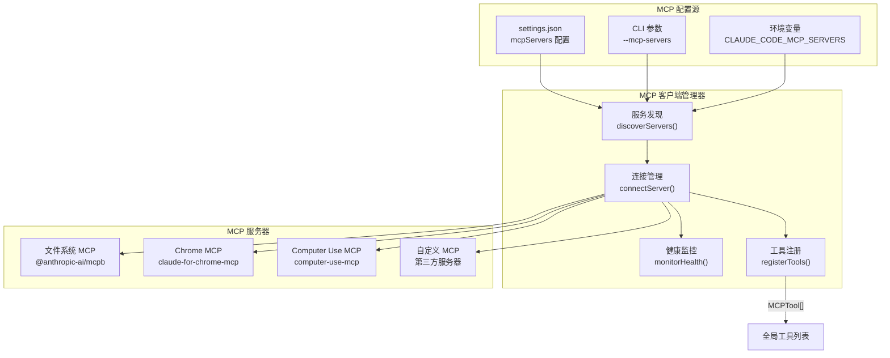
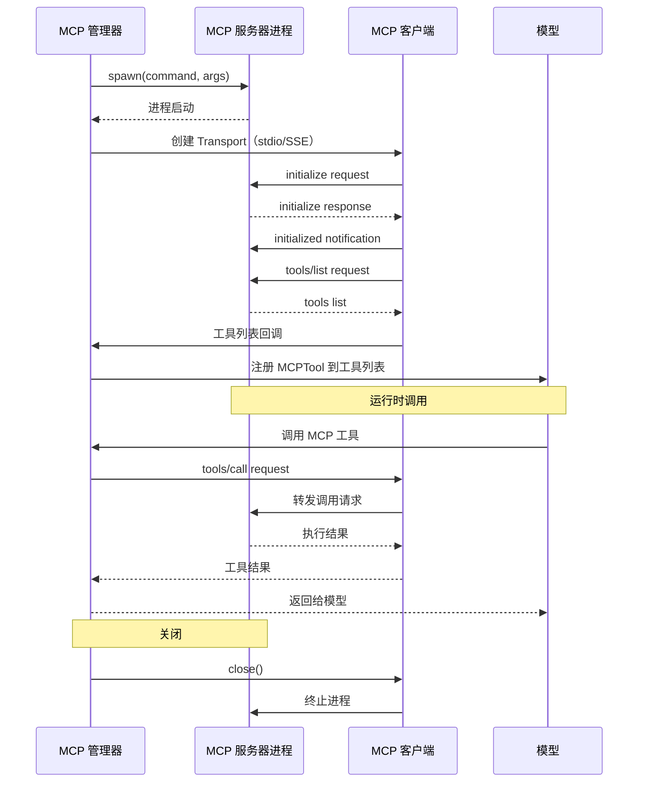

# Demo 5：MCP 集成

## 概述

MCP（Model Context Protocol）是 Anthropic 推出的开放协议，允许第三方服务器通过标准接口向 AI 模型暴露工具和资源。Claude Code 内置了一个完整的 MCP 客户端实现，管理 MCP 服务器发现、连接生命周期和工具路由。

本 Demo 分析 MCP 客户端架构、服务发现机制，以及 MCP 工具如何合并到主工具列表。

## MCP 客户端架构



## 服务发现

MCP 服务器的配置来自多个源，按优先级合并：

### 配置文件

`settings.json` 中定义 MCP 服务器：

```json
{
  "mcpServers": {
    "filesystem": {
      "command": "npx",
      "args": ["-y", "@anthropic-ai/mcpb"],
      "env": {}
    },
    "database": {
      "url": "http://localhost:3001/mcp",
      "headers": {
        "Authorization": "Bearer token"
      }
    }
  }
}
```

### 发现流程

```typescript
// services/mcp/discovery.ts 的概念
async function discoverServers(): Promise<MCPServerConfig[]> {
  const servers: MCPServerConfig[] = []

  // 1. 从 settings.json 加载
  const userConfig = await loadUserConfig()
  servers.push(...parseMcpServers(userConfig))

  // 2. 从项目配置加载
  const projectConfig = await loadProjectConfig()
  servers.push(...parseMcpServers(projectConfig))

  // 3. 从命令行参数加载
  const cliServers = parseCliMcpServers()
  servers.push(...cliServers)

  // 4. 从环境变量加载
  const envServers = parseEnvMcpServers()
  servers.push(...envServers)

  // 5. 去重（同名服务器后面覆盖前面）
  return deduplicate(servers)
}
```

## 连接生命周期



### 传输层

MCP 支持两种传输协议：

1. **stdio 传输**：通过子进程的标准输入/输出通信
   - 适合本地工具
   - 低延迟、不需要网络
   - 生命周期绑定到客户端连接

2. **SSE 传输**：通过 HTTP Server-Sent Events 通信
   - 适合远程服务
   - 支持连接复用
   - 需要 HTTP 服务器支持

## 工具注册流程

MCP 工具通过 `MCPTool` 包装器被合并到主工具列表：

```typescript
// services/mcp/toolRegistration.ts 的概念
async function registerMcpTools(
  serverName: string,
  connection: MCPServerConnection,
  toolRegistry: ToolRegistry
): Promise<void> {
  // 1. 获取服务器工具列表
  const tools = await connection.listTools()

  // 2. 包装为 MCPTool
  const mcpTools: MCPTool[] = tools.map(tool => ({
    name: tool.name,
    description: tool.description,
    inputSchema: tool.inputSchema,
    mcpInfo: { serverName, toolName: tool.name },
    async *input(input, context) {
      const result = await connection.callTool(tool.name, input)
      yield result
    }
  }))

  // 3. 注册到工具列表
  for (const tool of mcpTools) {
    toolRegistry.register(tool)
  }
}
```

注册后的 MCP 工具与原生工具同样处理，包括权限检查、输出展示等。

## 内置 MCP 服务器

Claude Code 自带多个内置 MCP 服务器：

| 服务器 | 实现 | 用途 |
|--------|------|------|
| Chrome MCP | `utils/claudeInChrome/` | 浏览器自动化 |
| Computer Use | `utils/computerUse/` | 桌面操作（截图、点击） |
| File System | `vendor/mcpb/` | 增强文件操作 |
| Sandbox Runtime | 外部 SDK | 沙箱执行环境 |

这些服务器通过快速路径启动（详见 Demo 1），而不是通过 MCP 配置发现。

## 练习

### 练习 1：追踪一次 MCP 调用

选择你的一个 MCP 服务器配置（或创建一个简单的 MCP 测试服务器），使用 `claude` 调用该服务器的工具。记录完整的调用链路：

```
用户输入 → 模型选择工具 → MCP 客户端 → 传输层 → MCP 服务器 → 结果返回
```

### 练习 2：添加第三方 MCP 服务器

在 `settings.json` 中添加一个 MCP 服务器配置（如 SQLite 数据库 MCP）：

```json
{
  "mcpServers": {
    "sqlite": {
      "command": "uvx",
      "args": ["mcp-server-sqlite", "--db-path", "./test.db"]
    }
  }
}
```

观察：
- 启动时控制台是否输出了连接信息
- `/mcp` 命令是否能看到新的工具
- 模型是否能正常调用 MCP 工具

### 练习 3：分析 MCPTool 包装器

在 `tools.ts` 中搜索 `MCPTool` 相关的代码。回答：
- MCPTool 与原生 Tool 在接口上有什么区别
- ListMcpResourcesTool 和 ReadMcpResourceTool 是做什么的
- MCP 工具的命名空间是如何处理的（`mcp__server__toolName`）

### 练习 4：连接失败处理

阅读 MCP 客户端连接管理的相关代码。回答：
- 如果 MCP 服务器启动失败，整个 Claude Code 会崩溃吗
- 重试策略是怎样的
- 如何在运行时查看 MCP 服务器状态

### 练习 5：构建一个简单 MCP 服务器

用 TypeScript 编写一个简单的 MCP 服务器，暴露一个 `greet` 工具，接受 `name` 参数并返回问候语。然后通过 Claude Code 的 MCP 配置连接到它。

```typescript
// 你的 MCP 服务器实现
import { Server } from '@modelcontextprotocol/sdk/server/index.js'
// ...
```
