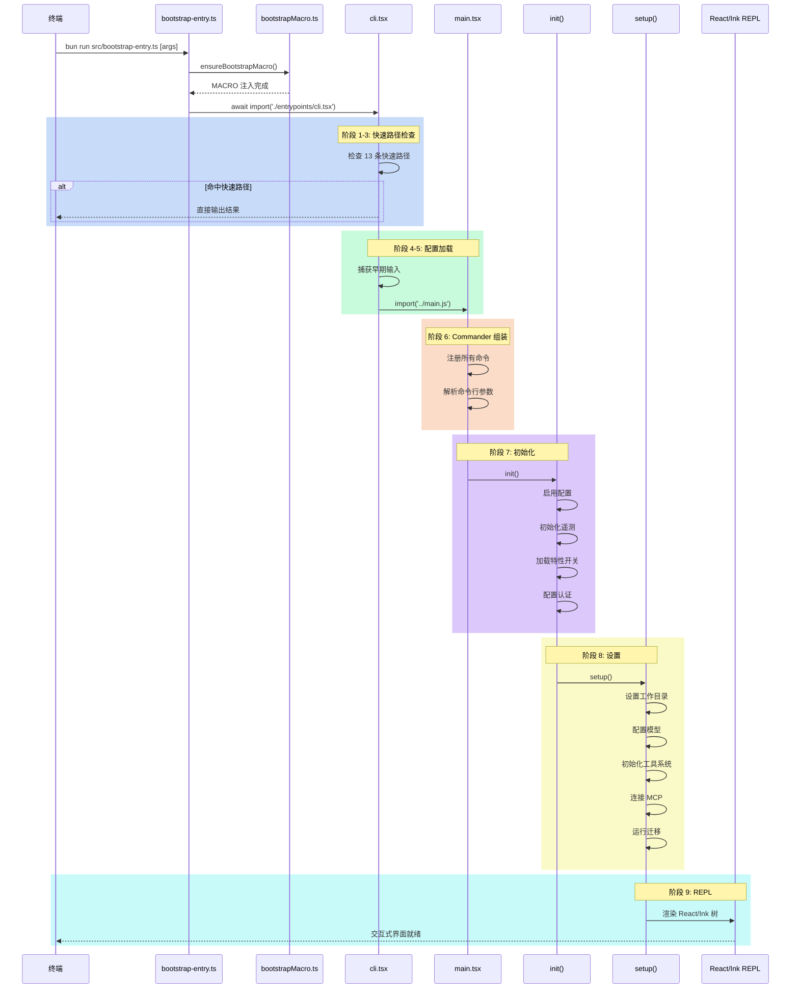
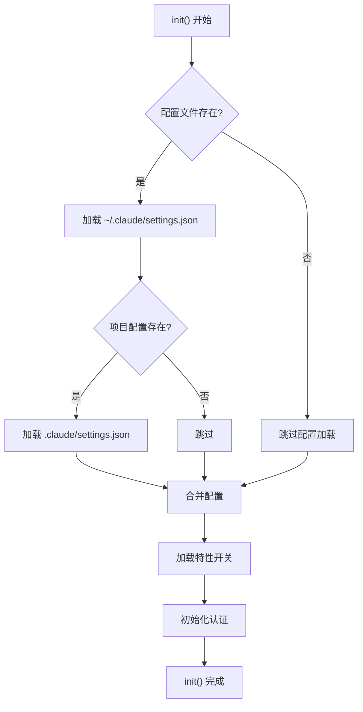

# 启动链路详解

## 概述

Claude Code 的完整启动流程包含 9 个阶段，从终端输入命令到交互式界面就绪。本节详细分析每个阶段的职责、涉及的文件和关键代码路径。

## 9 阶段启动流程



## 阶段 1-3：快速路径检查

**涉及文件**：`cli.tsx`

**详细流程**：

1. **Corepack 修复**：`process.env.COREPACK_ENABLE_AUTO_PIN = '0'`
2. **远程环境配置**：如果 `CLAUDE_CODE_REMOTE=true`，设置 Node 最大堆内存为 8GB
3. **消融基线**：如果 `CLAUDE_CODE_ABLATION_BASELINE=true`，设置一系列禁用标志
4. **13 条快速路径判定**：逐条检查命令行参数

```typescript
// 快速路径的启动时序
// 路径 1: --version — 零模块加载
// 路径 2-6: Chrome/Computer Use — 动态 import 特定模块
// 路径 7: remote-control — 配置加载 + 认证检查
// 路径 8: daemon — 配置加载 + 遥测初始化
// 路径 9: ps/logs/attach/kill — 配置加载 + 会话管理
// 路径 10: new/list/reply — 模板任务
// 路径 11-12: environment-runner/self-hosted-runner — 独立运行器
// 路径 13: worktree-tmux — tmux 集成
```

## 阶段 4-5：配置加载

**涉及文件**：`cli.tsx`（后半部分）, `utils/startupProfiler.js`, `utils/earlyInput.js`

```typescript
// 捕获早期输入
const { startCapturingEarlyInput } = await import('../utils/earlyInput.js')
startCapturingEarlyInput()
// 这是在 CLI 完全加载前捕获用户输入的机制
// 防止用户打字在加载过程中被丢失
```

**启动性能分析初始化**：
```typescript
const { profileCheckpoint } = await import('../utils/startupProfiler.js')
profileCheckpoint('cli_entry')
// ... 在关键路径上调用
profileCheckpoint('cli_before_main_import')
profileCheckpoint('cli_after_main_import')
profileCheckpoint('cli_after_main_complete')
```

## 阶段 6：Commander 组装

**涉及文件**：`main.tsx`, `commands.ts`

Commander 组装过程：

1. 创建 `program` 实例
2. 设置程序元数据（名称、版本、描述）
3. 注册全局选项（`--model`, `--tools`, `--bg` 等）
4. 调用 `registerAllCommands()` 注册所有子命令
5. 解析命令行参数

```typescript
// main.tsx 的 Commander 组装概念
const program = new Command()
  .name('claude')
  .version(MACRO.VERSION)
  .description('Anthropic\'s AI assistant for terminal')
  .option('--model <model>', 'Which model to use')
  .option('--tools <preset>', 'Tool preset')
  .option('--bg', 'Run in background')

// 注册所有子命令
registerCommands(program)
```

## 阶段 7：初始化 (init)

**涉及文件**：`main.tsx` 中的 `init()` 函数

```typescript
async function init(): Promise<void> {
  // 1. 启用配置文件
  enableConfigs()
  
  // 2. 初始化遥测（如果启用）
  initSinks()
  
  // 3. 加载特性开关（GrowthBook 等）
  await loadFeatureFlags()
  
  // 4. 设置认证
  await setupAuth()
  
  // 5. 创建 Bootstrap State
  bootstrapState = createBootstrapState()
  
  // 6. 初始化 AppState
  appState = new AppState(bootstrapState)
}
```

### 配置加载顺序



## 阶段 8：设置 (setup)

**涉及文件**：`main.tsx` 中的 `setup()` 函数

```typescript
async function setup(): Promise<void> {
  // 1. 设置工作目录
  await setupWorkingDirectory()
  
  // 2. 配置 AI 模型
  await setupModel()
  
  // 3. 初始化工具系统
  await setupTools()
  
  // 4. 连接 MCP 服务器
  await connectMcpServers()
  
  // 5. 运行启动迁移
  await runMigrations()
  
  // 6. 恢复之前会话（如果有）
  await resumeSession()
}
```

### 迁移系统

Claude Code 在启动时运行版本迁移脚本，位置在 `src/migrations/`：

| 迁移脚本 | 用途 |
|----------|------|
| 迁移 1-11 | 配置格式升级、会话文件迁移、权限规则兼容等 |

迁移脚本在每次启动时检查当前版本与上次运行的版本差异，只运行需要的新迁移。

## 阶段 9：REPL 启动

**涉及文件**：`main.tsx`, `components/*`

REPL（Read-Eval-Print Loop）的启动：

1. 创建 Ink 渲染器实例
2. 挂载 React 组件树
3. 进入事件循环

```typescript
// REPL 启动的概念代码
async function startREPL(): Promise<void> {
  const { render } = await import('ink')
  
  const { waitUntilExit } = render(
    <AppStateProvider>
      <App />
    </AppStateProvider>
  )
  
  // 等待用户退出
  await waitUntilExit
}
```

## 练习

1. 在 `main.tsx` 中找到 `init()` 和 `setup()` 函数的实现位置，标注它们之间的调用关系
2. 分析迁移系统如何确保迁移只运行一次（幂等性）
3. 跟踪配置加载流程，列出所有配置文件的读取顺序和优先级规则
4. 在启动链路中添加一个自定义的启动时检查（如网络连接检测），并记录到启动性能分析
