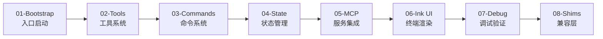

# 重建路线

## 概述

要透彻理解 Claude Code 的源码，建议按照以下顺序逐层分析。这条路线的设计遵循从外层到内层、从抽象到具体的阅读策略。

## 推荐阅读顺序



## 各步骤概览

| 步骤 | 主题 | 核心文件 | 阅读目标 | 预估时间 |
|------|------|----------|----------|----------|
| 1 | Bootstrap 入口 | `bootstrap-entry.ts`, `cli.tsx`, `bootstrapMacro.ts` | 理解启动流程和快速路径 | 30 分钟 |
| 2 | 工具系统 | `tools.ts`, `Tool.ts`, `tools/` | 理解工具注册和权限 | 45 分钟 |
| 3 | 命令系统 | `commands.ts`, `commands/` | 理解四管道加载 | 30 分钟 |
| 4 | 状态管理 | `bootstrap/state.ts`, `state/AppState.ts` | 理解三层架构 | 45 分钟 |
| 5 | MCP 服务 | `services/mcp/` | 理解 MCP 客户端 | 30 分钟 |
| 6 | Ink UI 渲染 | `components/`, Ink | 理解终端渲染 | 30 分钟 |
| 7 | 调试验证 | 全局 | 实践操作 | 30 分钟 |
| 8 | Shim 兼容层 | `shims/` | 理解恢复限制 | 15 分钟 |

## 环境准备

### 前置条件

| 工具 | 最低版本 | 备注 |
|------|----------|------|
| Bun | >=1.3.5 | 必须，不能用 Node.js 替代 |
| Node.js | >=24.0.0 | 部分依赖需要 |
| Git | 任意 | 版本管理 |
| TypeScript | >=5.0 | 类型理解 |

### 安装 Bun

```bash
# macOS / Linux
curl -fsSL https://bun.sh/install | bash

# 验证安装
bun --version  # 需 >= 1.3.5
```

### 克隆并安装依赖

```bash
# 克隆还原项目
git clone <repository-url> claude-code-rev
cd claude-code-rev

# 安装依赖（使用 Bun）
bun install

# 验证安装
bun run src/bootstrap-entry.ts --version
# 应输出: 999.0.0-restored (Claude Code)
```

### 推荐编辑器设置

```json
// .vscode/settings.json
{
  "typescript.preferences.importModuleSpecifier": "relative",
  "typescript.preferences.importModuleSpecifierEnding": "js",
  "typescript.enablePromptUseWorkspaceTsdk": true,
  "editor.formatOnSave": true,
  "editor.defaultFormatter": "biome",
  "[typescript]": {
    "editor.defaultFormatter": "biome"
  }
}
```

## 阅读技巧

### 1. 从入口开始

不要从头读到尾。从 `bootstrap-entry.ts` 开始，跟踪它的执行路径。在阅读时，问自己三个问题：

- 这个模块在整体架构中的位置？（启动层/框架层/核心层/数据层）
- 它的设计动机是什么？（性能/可扩展性/安全性）
- 如果由我来实现，会怎么做？

### 2. 使用搜索工具

```bash
# 搜索接口定义
grep -r "export interface Tool" src/

# 搜索特定的 import
grep -r "from.*bootstrapMacro" src/

# 搜索 feature flag 使用
grep -r "feature(" src/ | grep -v node_modules
```

### 3. 关注模式

还原源码中反复出现的模式：

- **动态 import 模式**：用于延迟加载快速路径
- **条件 require 模式**：用于编译时 DCE
- **Pub/Sub 模式**：用于状态变更通知
- **包装器模式**：用于 MCP 工具适配

### 4. 注意还原痕迹

由于这是从 source map 还原的代码，注意以下痕迹：

- 文件后缀为 `.js` 而非 `.ts`（还原后未改后缀）
- 注释中包含 `eslint-disable` 等构建标记
- 尾部有 base64 source map 引用（不影响阅读）
- 部分私有模块被 shim 替换（详见 Step 8）

## 阅读清单

### Step 1 阅读清单

- [ ] `src/bootstrapMacro.ts` — 理解 MACRO 注入
- [ ] `src/bootstrap-entry.ts` — 理解入口
- [ ] `src/entrypoints/cli.tsx` — 理解 13 条快速路径

### Step 2 阅读清单

- [ ] `src/Tool.ts` — 理解 Tool 接口
- [ ] `src/tools.ts` — 理解注册机制
- [ ] `src/tools/BashTool/BashTool.js` — 理解工具实现

### Step 3 阅读清单

- [ ] `src/commands.ts` — 理解命令注册
- [ ] `src/commands/init.js` — 理解一个简单命令
- [ ] `src/commands/config/index.js` — 理解一个复杂命令

### Step 4 阅读清单

- [ ] `src/bootstrap/state.ts` — Bootstrap State
- [ ] `src/state/AppState.ts` — AppState
- [ ] `src/state/AppStateStore.tsx` — React 绑定

### Step 5 阅读清单

- [ ] `src/services/mcp/types.js` — MCP 类型
- [ ] `src/services/mcp/client.js` — MCP 客户端

### Step 6 阅读清单

- [ ] `src/components/Spinner.js` — 理解 Ink 组件
- [ ] 阅读 Ink 官方文档了解基本原则

### Step 7 阅读清单

- [ ] 运行 `bun run dev` 验证启动
- [ ] 尝试不同的快速路径

### Step 8 阅读清单

- [ ] `shims/color-diff-napi/` — 理解 shim 原理

## 配套文档

每步对应的详细分析文档：

| 步骤 | 文档 |
|------|------|
| Step 1 | `docs/project/build-01-bootstrap.md` |
| Step 2 | `docs/project/build-02-tools.md` |
| Step 3 | `docs/project/build-03-commands.md` |
| Step 4 | `docs/project/build-04-state.md` |
| Step 5 | `docs/project/build-05-mcp.md` |
| Step 6 | `docs/project/build-06-ink-ui.md` |
| Step 7 | `docs/project/build-07-debug.md` |
| Step 8 | `docs/project/build-08-shims.md` |

## 常见问题

### Q: 我能否修改代码并运行？

可以。Bun 支持直接运行 TypeScript，你修改 `src/` 目录中的文件后直接 `bun run src/bootstrap-entry.ts` 即可看到效果。

### Q: 运行时报错怎么办？

部分错误可能是 shim 包不完整导致的。参考 `docs/reference/pitfalls.md` 中的常见错误列表。你也可以查看 `docs/project/build-07-debug.md` 中的调试指南。

### Q: 需要了解 React 吗？

不需要深入。Ink 是终端版本的 React，基本的组件和 hooks 概念就够用。

### Q: 学习这个有什么实用价值？

理解 Claude Code 的架构不仅让你能更高效地使用它，更重要的是学习一个生产级 AI Agent 的设计模式——这些模式可以应用到你自己的项目中。
