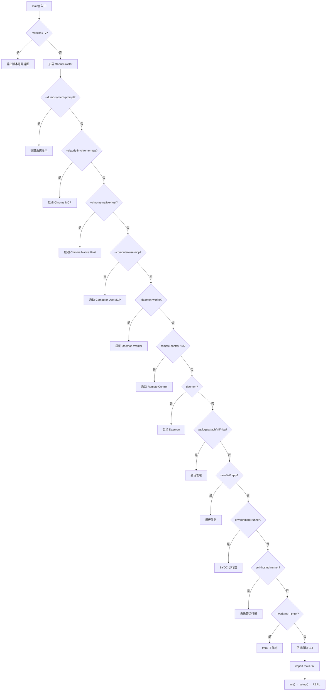

# Step 1：Bootstrap 入口

## 分析目标

理解 Claude Code 从 `bun run` 到完整的 Commander CLI 就绪的全过程。重点分析：
1. MACRO 常量的注入机制
2. 13 条快速路径的判定和执行
3. 完整 CLI 的组装和初始化

## 核心文件

| 文件 | 角色 | 关键路径 |
|------|------|----------|
| `src/bootstrap-entry.ts` | 应用入口 | 3 行代码 |
| `src/bootstrapMacro.ts` | MACRO 常量 | 全局变量注入 |
| `src/entrypoints/cli.tsx` | CLI 引导器 | 13 条快速路径 |
| `src/main.tsx` | CLI 主逻辑 | Commander 组装 + init/setup |

## 深入分析

### bootstrapMacro.ts — 编译时常量注入

```typescript
import pkg from '../package.json'

type MacroConfig = {
  VERSION: string
  BUILD_TIME: string
  PACKAGE_URL: string
  NATIVE_PACKAGE_URL: string
  VERSION_CHANGELOG: string
  ISSUES_EXPLAINER: string
  FEEDBACK_CHANNEL: string
}

const defaultMacro: MacroConfig = {
  VERSION: pkg.version,
  BUILD_TIME: '',
  PACKAGE_URL: pkg.name,
  NATIVE_PACKAGE_URL: pkg.name,
  VERSION_CHANGELOG: '',
  ISSUES_EXPLAINER: 'file an issue at https://github.com/anthropics/claude-code/issues',
  FEEDBACK_CHANNEL: 'github',
}

export function ensureBootstrapMacro(): void {
  if (!('MACRO' in globalThis)) {
    (globalThis as any).MACRO = defaultMacro
  }
}
```

**设计关键**：
- 在 Bun 构建时，`VERSION` 和 `PACKAGE_URL` 被内联为字符串字面量
- `ensureBootstrapMacro()` 使用幂等检查（`if (!('MACRO' in globalThis))`），确保多次调用安全
- 运行时读取 `MACRO.VERSION` 不需要解析 `package.json`，避免 I/O 开销

### bootstrap-entry.ts — 极简入口

```typescript
import { ensureBootstrapMacro } from './bootstrapMacro'

ensureBootstrapMacro()

await import('./entrypoints/cli.tsx')
```

**为什么这么短？**
- MACRO 注入必须在任何其他模块前完成
- 动态 `import()` 确保 `cli.tsx` 在 MACRO 就绪后才执行
- 文件本身不需要导出任何内容——它只是导入链的起点

### cli.tsx — 13 条快速路径

这是启动流程中最关键的文件。它定义了一个 `async function main()`，包含以下逻辑：



**启动性能分析**：
每条快速路径都调用 `profileCheckpoint(name)` 记录时间戳：

```typescript
const { profileCheckpoint } = await import('../utils/startupProfiler.js')
profileCheckpoint('cli_entry')
```

这些时间戳可以在调试模式下输出，帮助定位启动性能瓶颈。

### feature() — 编译时代码消除

```typescript
import { feature } from 'bun:bundle'
```

`feature()` 是 Bun 构建时的特殊函数。在 `bun build` 阶段，它被静态评估：

```typescript
// 如果 feature('BRIDGE_MODE') 在构建配置中为 false，
// 整个 if 块在编译时被消除（dead code elimination）
if (feature('BRIDGE_MODE') && (args[0] === 'remote-control' || /* ... */)) {
  // 这个块在外部构建中完全不存在
  const { bridgeMain } = await import('../bridge/bridgeMain.js')
  await bridgeMain(args.slice(1))
  return
}
```

这与 `process.env.USER_TYPE === 'ant'` 的区别：后者在运行时评估，代码始终包含在 bundle 中。

### 更新重定向和 --bare

在 13 条快速路径之后，还有一些后续处理：

```typescript
// 重定向 --update/--upgrade 到 update 子命令
if (args.length === 1 && (args[0] === '--update' || args[0] === '--upgrade')) {
  process.argv = [process.argv[0]!, process.argv[1]!, 'update']
}

// --bare 提前设置 SIMPLE 模式
if (args.includes('--bare')) {
  process.env.CLAUDE_CODE_SIMPLE = '1'
}
```

`--bare` 标志需要在 `main.tsx` 加载前设置，因为 Commander 在模块评估阶段就会读取 `CLAUDE_CODE_SIMPLE` 来决定是否注册完整命令集。

### main.tsx — CLI 组装

未命中快速路径时，`cli.tsx` 最后一步：

```typescript
const { startCapturingEarlyInput } = await import('../utils/earlyInput.js')
startCapturingEarlyInput()
profileCheckpoint('cli_before_main_import')
const { main: cliMain } = await import('../main.js')
profileCheckpoint('cli_after_main_import')
await cliMain()
profileCheckpoint('cli_after_main_complete')
```

`startCapturingEarlyInput()` 开始捕获用户在 CLI 完全启动前的输入，避免早期输入丢失。

## 关键观察

1. **零开销版本查询**：`--version` 路径不加载任何额外模块
2. **按需加载**：每个快速路径使用动态 `import()`，只有命中时才加载对应模块
3. **编译时消除**：`feature()` 标记的功能在外部构建中被完全消除
4. **启动时序**：通过 `profileCheckpoint` 监控启动性能

## 练习

1. 分析 `bootstrapMacro.ts` 中 `BUILD_TIME` 为空字符串的情况，这是还原丢失还是原设计如此？
2. 在 `cli.tsx` 中添加一个 `--echo` 快速路径，输出 `args` 后退出
3. 比较 `feature()` 和 `process.env.USER_TYPE` 在构建和运行时的行为差异
