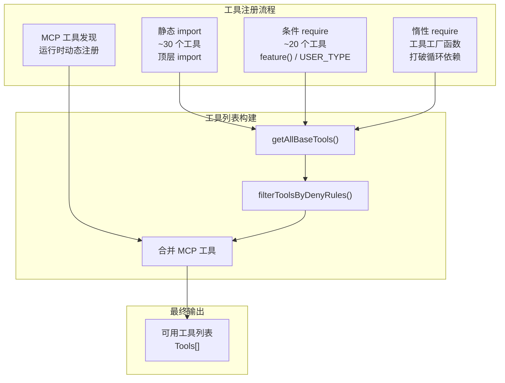
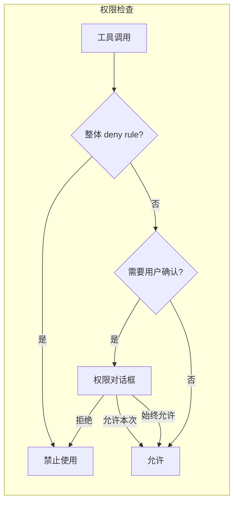

# Step 2：工具系统

## 分析目标

理解 Claude Code 工具系统的完整架构：工具接口定义、注册机制、条件编译和权限管控。

## 核心文件

| 文件 | 角色 |
|------|------|
| `src/Tool.ts` | Tool 接口和类型定义 |
| `src/tools.ts` | 工具注册中心 |
| `src/tools/*/` | 50+ 工具实现 |
| `src/utils/permissions/permissions.ts` | 权限规则引擎 |

## Tool 接口

```typescript
// src/Tool.ts (核心定义)
export interface Tool {
  name: string
  description: string
  inputSchema: ToolInputJSONSchema
  isEnabled(): boolean
  input(input: any, context: ToolContext): AsyncGenerator<ToolResult>

  // 可选的挂载点
  permissionCheck?: (context: ToolPermissionContext) => PermissionResult
  mcpInfo?: { serverName: string; toolName: string }
}
```

### 关键设计

**`input()` 是 AsyncGenerator**：
```typescript
async *input(input: any, context: ToolContext) {
  // 可以产生多个中间结果
  yield { type: 'progress', progress: '正在执行...' }
  const result = await doSomething(input)
  yield { type: 'result', data: result }
}
```

这让工具可以在执行过程中向模型推送进度更新，而不仅仅返回最终结果。

**`isEnabled()` 是运行时检查**：
```typescript
class WebSearchTool implements Tool {
  isEnabled(): boolean {
    // 检查 API key 是否可用
    return !!process.env.WEB_SEARCH_API_KEY
  }
}
```

这也意味着工具可以随环境变化动态启用/禁用。

## 注册机制



### 静态注册

```typescript
// 来自静态 import 的工具
export function getAllBaseTools(): Tools {
  return [
    AgentTool,         // 子代理
    BashTool,          // 终端
    FileReadTool,      // 读文件
    FileEditTool,      // 编辑文件
    FileWriteTool,     // 写文件
    WebFetchTool,      // 网页抓取
    WebSearchTool,     // 网页搜索
    AskUserQuestionTool, // 询问用户
    SkillTool,         // 技能
    GlobTool,          // 文件搜索
    GrepTool,          // 文本搜索
    // ... 更多
  ]
}
```

静态导入的工具在模块加载时就会被执行，因此它们需要在模块顶级完成所有初始化。

### 条件注册

```typescript
// 编译时 DCE
const WebBrowserTool = feature('WEB_BROWSER_TOOL')
  ? require('./tools/WebBrowserTool/WebBrowserTool.js').WebBrowserTool
  : null

// 运行时门控
const REPLTool = process.env.USER_TYPE === 'ant'
  ? require('./tools/REPLTool/REPLTool.js').REPLTool
  : null
```

条件工具在 `tools.ts` 中通过三元运算符条件加载，然后通过扩展运算符（spread）添加到 `getAllBaseTools()` 的返回数组中：

```typescript
// 条件加载
...(WebBrowserTool ? [WebBrowserTool] : []),
...(SleepTool ? [SleepTool] : []),
...cronTools,  // cronTools 本身已经经过条件判断
```

### 惰性加载

```typescript
// 惰性 require 打破循环依赖
const getTeamCreateTool = () =>
  require('./tools/TeamCreateTool/TeamCreateTool.js').TeamCreateTool

const getTeamDeleteTool = () =>
  require('./tools/TeamDeleteTool/TeamDeleteTool.js').TeamDeleteTool
```

这些工具直到实际被调用时才执行 `require()`，避免了模块加载时的循环依赖。

## 权限系统



### 权限规则来源

| 来源 | 文件 | 优先级 |
|------|------|--------|
| 用户配置 | `~/.claude/settings.json` | 高 |
| 项目配置 | `.claude/settings.json` | 中 |
| CLI 参数 | `--allowed-tools / --disallowed-tools` | 低 |

### 工具级别过滤

```typescript
export function filterToolsByDenyRules<T extends { name: string }>(
  tools: readonly T[],
  permissionContext: ToolPermissionContext
): T[] {
  return tools.filter(tool => !getDenyRuleForTool(permissionContext, tool))
}
```

这个过滤发生在**工具列表构建时**，而非工具调用时。被 deny 的工具在模型看到它们之前就被移除了。

## 简单模式 (Simple Mode)

当 `CLAUDE_CODE_SIMPLE=1` 时，工具列表缩减为三个核心工具：

```typescript
const simpleTools: Tool[] = [BashTool, FileReadTool, FileEditTool]
```

这是通过 `getTools()` 函数的早期返回实现的。在协调器模式下，还会额外包含 `AgentTool` 和 `TaskStopTool`。

## 练习

1. 在 `tools.ts` 中统计条件工具的数量，区分 `feature()` 和 `USER_TYPE` 两种模式
2. 找到所有使用惰性 `require()` 的工具，分析它们为什么需要惰性加载
3. 添加一个简单的日志工具 `LogTool`，记录工具调用日志到文件，然后注册到 `getAllBaseTools()`
