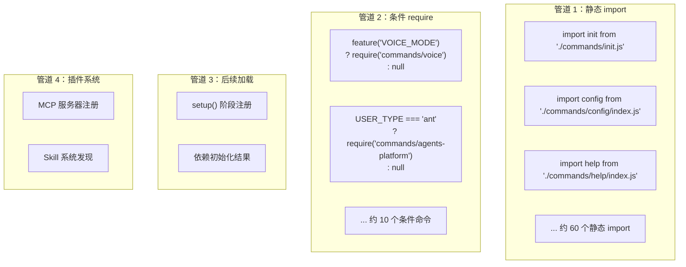

# Step 3：命令系统

## 分析目标

理解 Claude Code 的命令系统架构，包括命令接口定义、四管道加载机制、命令目录结构，以及 DCE（死代码消除）模式。

## 核心文件

| 文件 | 角色 |
|------|------|
| `src/commands.ts` | 命令注册中心，四管道加载 |
| `src/commands/*` | 102+ 命令实现 |
| `src/main.tsx` (部分) | Commander 程序组装 |

## Command 接口

命令模块导出的对象遵循以下结构：

```typescript
interface Command {
  name: string               // 命令名称，如 'init'
  description?: string       // 命令描述
  aliases?: string[]         // 别名，如 ['i'] 是 'init' 的别名
  isEnabled?: () => boolean  // 启用条件检查
  arguments?: string         // 参数定义
  options?: Option[]         // 选项定义
  subcommands?: Command[]    // 子命令
  action: (args: any, options: any, command: any) => Promise<void> | void
}
```

### 单文件命令 vs 目录命令

**单文件命令**（简单命令）：

```typescript
// src/commands/commit.js
export default {
  name: 'commit',
  description: 'Create a git commit with AI-generated message',
  async action(args: any) {
    // 实现逻辑
  }
}
```

**目录命令**（复杂命令，包含子命令）：

```
commands/config/
├── index.js           # 默认导出主命令
├── get.js            # config get 子命令
└── set.js            # config set 子命令
```

## 四管道加载机制



### 管道 1：依赖静态 import 的命令

这是主要路径，90% 的命令通过这种方式注册：

```typescript
// commands.ts 静态导入示例
import init from './commands/init.js'
import commit from './commands/commit.js'
import review, { ultrareview } from './commands/review.js'
import config from './commands/config/index.js'
import mcp from './commands/mcp/index.js'
import session from './commands/session/index.js'
import help from './commands/help/index.js'
import clear from './commands/clear/index.js'
// ... 继续约 60 个 import
```

每个 import 对应一个命令模块，模块的默认导出是 Commander 的 `Command` 对象或工厂函数。

### 管道 2：条件 require

受 `feature()` 或 `USER_TYPE` 控制的命令：

```typescript
// 通过 feature() 控制的命令
const proactive = feature('PROACTIVE') || feature('KAIROS')
  ? require('./commands/proactive.js').default
  : null

const bridge = feature('BRIDGE_MODE')
  ? require('./commands/bridge/index.js').default
  : null

const voiceCommand = feature('VOICE_MODE')
  ? require('./commands/voice/index.js').default
  : null

// 通过 USER_TYPE 控制的命令
const agentsPlatform = process.env.USER_TYPE === 'ant'
  ? require('./commands/agents-platform/index.js').default
  : null
```

### 管道 3：后续加载

部分命令在 `init()` 或 `setup()` 完成后动态注册。这是因为这些命令依赖初始化结果（如配置加载、用户认证等）：

```typescript
// 示例：setup() 阶段的延迟注册
async function setup() {
  const config = await loadConfig()
  
  if (config.plugins) {
    for (const plugin of config.plugins) {
      program.addCommand(plugin.command)
    }
  }
}
```

### 管道 4：插件系统

第三方命令通过 MCP 协议或 Skill 系统注册。这是运行时的动态扩展点，不在 `commands.ts` 中定义。

## 命令实现模式

命令的实现通常遵循以下模式：

```typescript
// 一个典型命令的实现
export default {
  name: 'session',
  description: 'Manage sessions',
  subcommands: [
    {
      name: 'list',
      description: 'List all sessions',
      action: async () => {
        const sessions = await loadSessions()
        displaySessions(sessions)
      }
    },
    {
      name: 'delete',
      description: 'Delete a session',
      arguments: '<id>',
      action: async (id: string) => {
        await deleteSession(id)
        console.log(`Session ${id} deleted`)
      }
    }
  ]
}
```

## DCE 模式分析

### feature() 编译时消除

当 Bun 构建时，`feature('X')` 调用被替换为布尔字面量：

```typescript
// 源码
const bridge = feature('BRIDGE_MODE')
  ? require('./commands/bridge/index.js').default
  : null

// 如果 BRIDGE_MODE=false 的构建
const bridge = false
  ? require('./commands/bridge/index.js').default
  : null

// 经过 minifier 后
const bridge = null
```

### process.env 运行时检查

```typescript
// 源码 — 代码始终保留在 bundle 中
const agentsPlatform = process.env.USER_TYPE === 'ant'
  ? require('./commands/agents-platform/index.js').default
  : null
```

Bundle 始终包含 `agents-platform` 模块，但运行时仅在 `USER_TYPE=ant` 时加载。

## 命令 vs 工具对照

| 维度 | 命令 (Commands) | 工具 (Tools) |
|------|----------------|--------------|
| 用户 | 终端操作者 | AI 模型 |
| 触发 | `/command` 斜杠输入 | `tool_use` block |
| 注册 | Commander `program.addCommand()` | `getAllBaseTools()` |
| 数量 | 102+ | 50+ |
| 模块 | `commands.ts` + `commands/` 目录 | `tools.ts` + `tools/` 目录 |
| 执行 | 直接函数调用 | Agent Loop 中的 AsyncGenerator |

## 练习

1. 从 `commands.ts` 的静态 import 列表中提取所有命令名称，生成一个完整的命令树
2. 分析为什么 `commands/init.js` 和 `commands/init-verifiers.js` 是两个独立文件
3. 找到至少一个使用 `isEnabled()` 检查的命令，分析它的启用条件
4. 在 `commands.ts` 中添加一个新的 `echo` 命令，输出用户输入的参数
