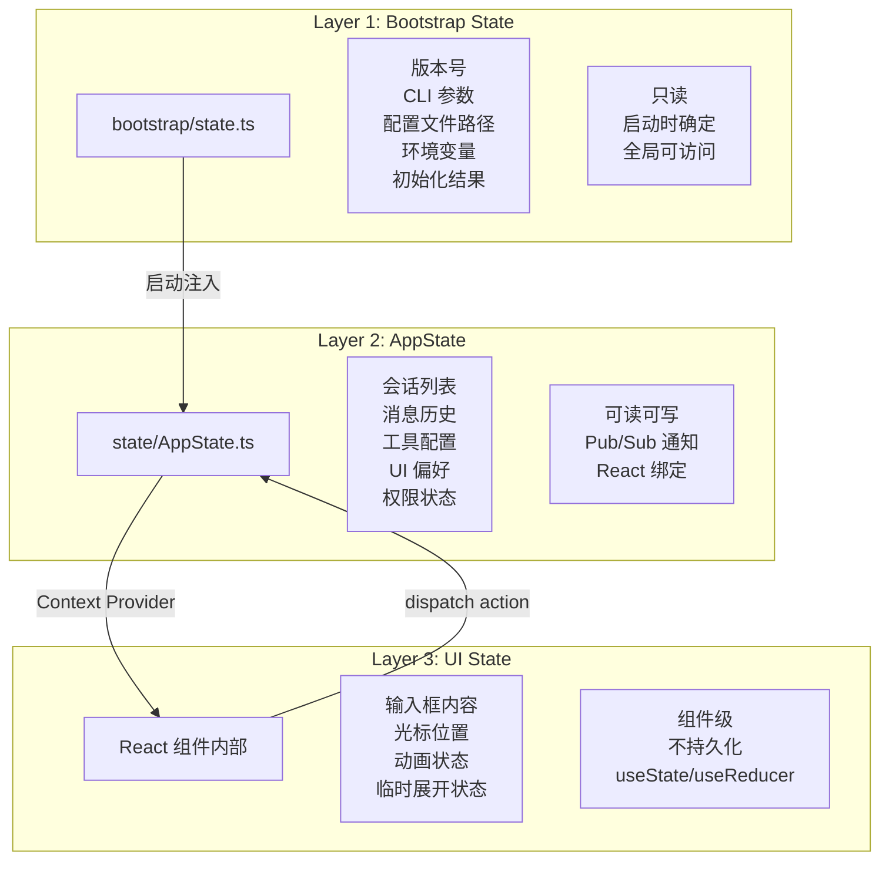

# Step 4：状态管理

## 分析目标

理解 Claude Code 的三层状态管理架构：Bootstrap State、AppState 和 UI State 各自的职责和协作方式。

## 核心文件

| 文件 | 角色 |
|------|------|
| `src/bootstrap/state.ts` | Bootstrap State — 启动时确定的不变状态 |
| `src/state/AppState.ts` | AppState — 可观察的共享状态 |
| `src/state/AppStateStore.tsx` | React Context 绑定 |

## 三层架构



## Layer 1：Bootstrap State

Bootstrap State 在启动过程中由 `bootstrap/state.ts` 创建和填充：

```typescript
// bootstrap/state.ts 的概念设计
export interface BootstrapState {
  // 不可变信息
  version: string
  sessionId: string
  startTime: number

  // CLI 标志
  cliFlags: {
    model?: string
    toolPreset?: string
    allowTools?: string[]
    disallowTools?: string[]
    bg?: boolean
    bare?: boolean
    verbose?: boolean
    worktree?: boolean
  }

  // 路径信息
  paths: {
    userConfig: string
    projectConfig: string
    sessionsDir: string
    logsDir: string
  }

  // 初始化结果
  initState: {
    configLoaded: boolean
    telemetryEnabled: boolean
    authStatus: 'none' | 'anon' | 'authenticated'
    featureFlags: Record<string, boolean>
  }
}
```

### 特点

1. **不可变性**：启动后不再修改
2. **全局单例**：通过模块导出或全局引用访问
3. **可序列化**：支持会话恢复时重建
4. **松耦合**：不依赖 React 或任何 UI 框架

## Layer 2：AppState

AppState 是状态管理的核心，实现了一个发布-订阅模式的状态存储：

```typescript
// state/AppState.ts 的简化概念
class AppState {
  // 状态域
  private domains = new Map<string, DomainState>()

  // 订阅者
  private subscribers = new Map<string, Set<() => void>>()

  // 读取状态快照
  getSnapshot(): AppStateSnapshot {
    return Object.fromEntries(this.domains)
  }

  // 读取特定域
  getDomain<T>(name: string): T {
    return this.domains.get(name) as T
  }

  // 更新——触发通知
  dispatch(action: AppAction): void {
    // 更新状态
    this.reduce(action)
    // 通知订阅者
    this.notify(action.domain)
  }

  // 订阅——返回取消函数
  subscribe(domain: string, listener: () => void): () => void {
    if (!this.subscribers.has(domain)) {
      this.subscribers.set(domain, new Set())
    }
    this.subscribers.get(domain)!.add(listener)
    return () => this.subscribers.get(domain)?.delete(listener)
  }

  // 批量更新
  batch(updates: Partial<AppStateSnapshot>): void {
    for (const [key, value] of Object.entries(updates)) {
      this.domains.set(key, value)
    }
    this.notify('*')  // 全局通知
  }

  private notify(domain: string): void {
    // 通知特定域的订阅者
    this.subscribers.get(domain)?.forEach(fn => fn())
    // 同时通知全局订阅者
    this.subscribers.get('*')?.forEach(fn => fn())
  }

  private reduce(action: AppAction): void {
    // 根据 action.type 更新对应域
  }
}
```

### 状态域划分

| 域名称 | 存储内容 | 变更操作 |
|--------|----------|----------|
| `sessions` | 当前打开的会话列表 | `ADD_SESSION`, `REMOVE_SESSION`, `UPDATE_SESSION` |
| `messages` | 每轮对话的消息 | `ADD_MESSAGE`, `UPDATE_MESSAGE`, `CLEAR_MESSAGES` |
| `tools` | 工具启用/禁用状态 | `TOGGLE_TOOL`, `UPDATE_TOOL_STATE` |
| `config` | 配置窗口状态 | `OPEN_CONFIG`, `CLOSE_CONFIG`, `UPDATE_CONFIG` |
| `permissions` | 权限规则和审批记录 | `GRANT_PERMISSION`, `DENY_PERMISSION` |
| `ui` | UI 偏好和主题设置 | `SET_THEME`, `TOGGLE_SIMPLE_MODE` |

## Layer 3：UI State (React/Ink)

UI State 是 React 组件内部的标准状态管理，使用 `useState`、`useReducer` 和自定义 hooks：

```typescript
// 组件内部 UI State 示例
function MessageList() {
  const [isScrolling, setIsScrolling] = useState(false)
  const [expandedMessages, setExpandedMessages] = useState<Set<string>>(new Set())

  return (
    <Box flexDirection="column">
      {messages.map(msg => (
        <Message key={msg.id} expanded={expandedMessages.has(msg.id)} />
      ))}
    </Box>
  )
}
```

UI State 的特点：
- **短生命周期**：随组件挂载/卸载而创建/销毁
- **不持久化**：应用重启后不保留
- **不跨组件共享**：通过 props 或 context 传递

## 层间通信

### Bootstrap → AppState

Bootstrap State 在 `init()` 阶段注入到 AppState：

```typescript
async function init() {
  const bootstrapState = createBootstrapState()
  
  // 注入到 AppState
  const appState = new AppState({
    ...bootstrapState,
    sessions: [],
    messages: [],
    // ...
  })
  
  return { bootstrapState, appState }
}
```

### AppState ←→ UI State

通过 `AppStateStore.tsx` 的 React Context 绑定：

```typescript
// AppStateStore.tsx
function AppStateProvider({ children }: { children: React.ReactNode }) {
  const storeRef = useRef(new AppState())
  const [, forceUpdate] = useState(0)

  useEffect(() => {
    return storeRef.current.subscribe('*', () => {
      forceUpdate(n => n + 1)
    })
  }, [])

  return (
    <AppStateContext.Provider value={storeRef.current}>
      {children}
    </AppStateContext.Provider>
  )
}

// 使用 hook 读取状态
function useSessions() {
  const store = useContext(AppStateContext)
  const [sessions, setSessions] = useState(store.getDomain('sessions'))

  useEffect(() => {
    return store.subscribe('sessions', () => {
      setSessions(store.getDomain('sessions'))
    })
  }, [store])

  return sessions
}
```

## 练习

1. 分析 `bootstrap/state.ts` 中所有字段，找出哪些在启动后不会再被修改
2. 查看 `AppState.subscribe()` 的实现，确认不同域的订阅是否共享同一个事件循环
3. 在 AppState 中添加一个新的 `notifications` 域，支持通知的添加和清除操作
4. 分析如果订阅者在 `dispatch` 过程中取消订阅，会发生什么？是否有保护措施？
