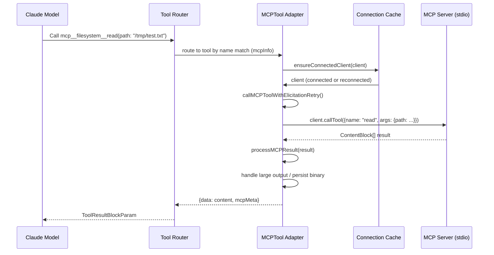
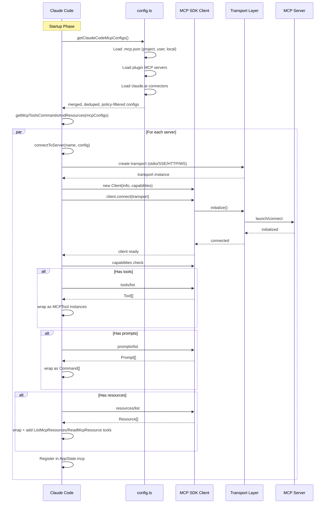
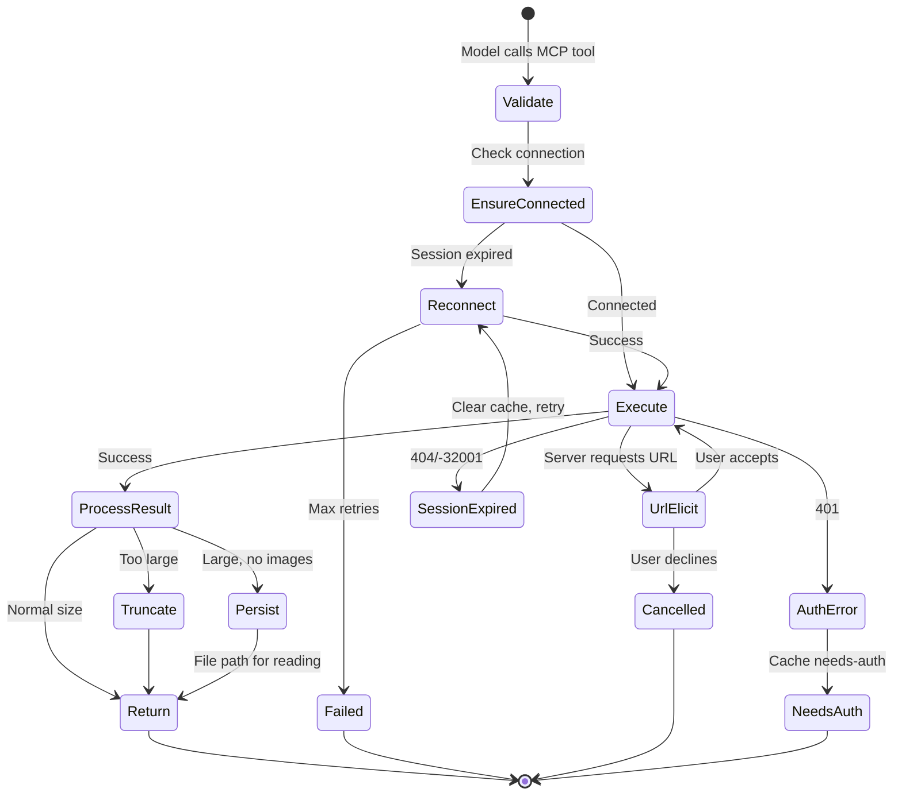

# MCP Deep Dive: Build Step, Connection Flow, and Architecture

> A practical deep dive into Claude Code's MCP implementation with code examples, connection flow diagrams, and architectural analysis.

## 1. The MCP Stack

Claude Code's MCP implementation spans three layers:

1. **Infrastructure Layer** (`src/services/mcp/`) — Connection management, configuration, transport
2. **Adapter Layer** (`src/tools/MCPTool/`) — Tool definition, UI rendering, progress tracking
3. **State Layer** (`src/state/AppState.ts` + `useManageMCPConnections.ts`) — React state management

## 2. Connection Flow: End to End

Here is the complete flow when a model calls `mcp__filesystem__read`:



### Detailed Connection Sequence



## 3. Configuration Loading with Code Examples

### How `.mcp.json` is loaded (from `config.ts`)

```typescript
// Project-scoped: walks from CWD up to root
async function loadProjectConfigs() {
  let currentDir = getCwd()
  const dirs: string[] = []
  while (currentDir !== parse(currentDir).root) {
    dirs.push(currentDir)
    currentDir = dirname(currentDir)
  }
  
  // Process root → CWD (closer files win)
  for (const dir of dirs.reverse()) {
    const mcpJsonPath = join(dir, '.mcp.json')
    const { config, errors } = parseMcpConfigFromFilePath({
      filePath: mcpJsonPath,
      expandVars: true,
      scope: 'project',
    })
    if (config?.mcpServers) {
      Object.assign(allServers, addScopeToServers(config.mcpServers, scope))
    }
  }
}
```

### How env vars are expanded (from `config.ts`)

```typescript
// Environment variable expansion in MCP config values
function expandEnvVars(config: McpServerConfig): {
  expanded: McpServerConfig
  missingVars: string[]
} {
  // Handles:
  // - ${VAR_NAME} substitution in command, args, url, env, headers
  // - Reports missing vars as warnings (doesn't block connection)
  // - Each type has its own expansion logic
  switch (config.type) {
    case undefined:
    case 'stdio': {
      const stdioConfig = config as McpStdioServerConfig
      expanded = {
        ...stdioConfig,
        command: expandString(stdioConfig.command),
        args: stdioConfig.args.map(expandString),
        env: stdioConfig.env ? mapValues(stdioConfig.env, expandString) : undefined,
      }
    }
    // ...
  }
}
```

## 4. Transport Layer Architecture

### stdio Transport

The most common transport — launches a subprocess and communicates via stdin/stdout:

```typescript
// From client.ts (simplified)
transport = new StdioClientTransport({
  command: finalCommand,
  args: finalArgs,
  env: { ...subprocessEnv(), ...serverRef.env },
  stderr: 'pipe',
})
```

Key details:
- `CLAUDE_CODE_SHELL_PREFIX` env var can wrap the command (e.g., `bun run`)
- Environment inherits the parent process via `subprocessEnv()`
- stderr is piped and accumulated (capped at 64MB to prevent memory leaks)
- Process cleanup uses SIGINT → SIGTERM → SIGKILL escalation (500ms total)
- Docker containers may require explicit SIGINT/SIGTERM for graceful shutdown

### SSE Transport

For remote servers using Server-Sent Events:

```typescript
transport = new SSEClientTransport(new URL(serverRef.url), {
  authProvider: new ClaudeAuthProvider(name, serverRef),
  fetch: wrapFetchWithTimeout(wrapFetchWithStepUpDetection(createFetchWithInit(), authProvider)),
  requestInit: {
    headers: { 'User-Agent': getMCPUserAgent(), ...combinedHeaders },
  },
  eventSourceInit: {
    fetch: async (url, init) => {
      // Long-lived connection — no timeout wrapper
      const tokens = await authProvider.tokens()
      return fetch(url, {
        ...init,
        headers: { Authorization: `Bearer ${tokens.access_token}`, ... },
      })
    },
  },
})
```

Critical: the EventSource (SSE stream) uses a DIFFERENT fetch than POST requests — the EventSource is long-lived, so it MUST NOT have the `wrapFetchWithTimeout` wrapper that POST requests use.

### Streamable HTTP Transport

For HTTP-based MCP servers:

```typescript
transport = new StreamableHTTPClientTransport(new URL(serverRef.url), {
  authProvider: new ClaudeAuthProvider(name, serverRef),
  fetch: wrapFetchWithTimeout(wrapFetchWithStepUpDetection(createFetchWithInit(), authProvider)),
  requestInit: {
    headers: {
      'User-Agent': getMCPUserAgent(),
      ...(sessionIngressToken && !hasOAuthTokens && {
        Authorization: `Bearer ${sessionIngressToken}`,
      }),
      ...combinedHeaders,
    },
  },
})
```

Note: The `Accept` header for Streamable HTTP is normalized to include `application/json, text/event-stream` to satisfy strict servers.

### WebSocket Transport

For WebSocket-based MCP servers:

```typescript
// Bun's WebSocket supports headers/proxy/tls natively
wsClient = new globalThis.WebSocket(serverRef.url, {
  protocols: ['mcp'],
  headers: wsHeaders,
  proxy: getWebSocketProxyUrl(serverRef.url),
  tls: tlsOptions || undefined,
})
transport = new WebSocketTransport(wsClient)
```

## 5. Tool Call Flow with Error Handling



## 6. Key Design Decisions

### 6.1 Memoization Strategy

The MCP system uses layered memoization:

| Function | Cache Key | Cache Size | Purpose |
|----------|-----------|------------|---------|
| `connectToServer` | `name + JSON.stringify(config)` | unbounded (memoize) | Reuse connections |
| `fetchToolsForClient` | server name | 20 (LRU) | Reuse tool listings |
| `fetchCommandsForClient` | server name | 20 (LRU) | Reuse command listings |
| `fetchResourcesForClient` | server name | 20 (LRU) | Reuse resource listings |

When a connection drops (onclose), all four caches for that server are cleared simultaneously to ensure fresh data on reconnect.

### 6.2 Content Size Management

MCP tool results can be very large. The pipeline handles this:

1. Estimate content size in tokens
2. If within limits → return directly
3. If too large → two strategies:
   - **Environment disabled**: Fall back to old truncation (warns user)
   - **File persistence**: Save to disk, return instructions to read the file
4. If content contains images → always use truncation (file persistence would lose image compression)

### 6.3 URL Elicitation Retry

When an MCP server requests URL authorization (error code -32042), up to 3 retries are attempted:

```typescript
for (let attempt = 0; attempt < 3; attempt++) {
  try {
    return await callToolFn({ ... })
  } catch (error) {
    if (error.code !== -32042) throw error  // Not an elicitation error
    // Process URL elicitations
  }
}
```

Each URL elicitation:
1. Runs hook handlers (can auto-accept)
2. Falls through to UI dialog (ElicitationDialog)
3. User accepts → retry tool call
4. User declines → return cancellation message

## 7. Performance Considerations

### Connection Batching

Servers are partitioned by type and connected with different concurrency limits:

```typescript
const localServers = configEntries.filter(([_, config]) => isLocalMcpServer(config))
const remoteServers = configEntries.filter(([_, config]) => !isLocalMcpServer(config))

// Local: 3 concurrent (avoid process spawning contention)
// Remote: 20 concurrent (network I/O bound)
await Promise.all([
  processBatched(localServers, getMcpServerConnectionBatchSize(), processServer),
  processBatched(remoteServers, getRemoteMcpServerConnectionBatchSize(), processServer),
])
```

### Connection Timeout

The connection timeout (configurable via `MCP_TIMEOUT`) defaults to 30 seconds:

```typescript
function getConnectionTimeoutMs(): number {
  return parseInt(process.env.MCP_TIMEOUT || '', 10) || 30000
}
```

### Tool Call Timeout

Tool calls use `AbortSignal.timeout()` but wrapped carefully:

```typescript
// Use AbortController + setTimeout instead of AbortSignal.timeout()
// to avoid ~2.4KB of native memory per request lingering for 60s
const controller = new AbortController()
const timer = setTimeout(
  c => c.abort(new DOMException('The operation timed out.', 'TimeoutError')),
  MCP_REQUEST_TIMEOUT_MS,
  controller,
)
timer.unref?.()
```

This prevents memory buildup from many concurrent tool calls.

## 8. Architecture Summary

```mermaid
flowchart TD
    subgraph "External"
        MCP1[MCP Server<br/>stdio: npx/docker/uvx]
        MCP2[MCP Server<br/>SSE/HTTP: remote API]
        MCP3[MCP Server<br/>WebSocket: live connection]
        MCP4[MCP Server<br/>claude.ai proxy]
        REG[Official MCP Registry<br/>api.anthropic.com]
    end

    subgraph "Claude Code MCP Client"
        CFG[config.ts<br/>Configuration Management]
        CON[client.ts<br/>Connection Pool]
        AUTH[auth.ts<br/>OAuth Provider]
        UMC[useManageMCPConnections.ts<br/>State Management]
        OR[officialRegistry.ts<br/>Registry Prefetch]
    end

    subgraph "Tool & Command Integration"
        MCPT[MCPTool Adapter]
        LMR[ListMcpResources]
        RMR[ReadMcpResource]
        MCPA[McpAuthTool]
        SK[SkillTool<br/>for MCP prompts]
    end

    subgraph "CLI"
        APP[AppState.mcp]
        TUI[/mcp command UI]
        TUI2[/plugin command UI]
    end

    MCP1 --> CON
    MCP2 --> CON
    MCP3 --> CON
    MCP4 --> CON
    REG --> OR

    CFG --> CON
    CON --> AUTH
    CON --> UMC
    UMC --> APP

    CON --> MCPT
    CON --> LMR
    CON --> RMR
    CON --> MCPA
    CON --> SK

    MCPT --> APP
    LMR --> APP
    RMR --> APP
    MCPA --> APP
    SK --> APP

    APP --> TUI
    APP --> TUI2
```

## 9. Notable Source Code Patterns

### Priority Merge for Config Scopes

```typescript
// config.ts: merge in precedence order (plugin < user < project < local)
const configs = Object.assign(
  {},
  dedupedPluginServers,   // lowest precedence
  userServers,
  approvedProjectServers,
  localServers,           // highest precedence
)
```

### Auto-Classifier Input for MCP Tools

```typescript
// client.ts: encode MCP tool input for security classification
export function mcpToolInputToAutoClassifierInput(
  input: Record<string, unknown>,
  toolName: string,
): string {
  const keys = Object.keys(input)
  return keys.length > 0
    ? keys.map(k => `${k}=${String(input[k])}`).join(' ')
    : toolName
}
```

### Session Expiry Detection

```typescript
// client.ts: detect HTTP session expiry
export function isMcpSessionExpiredError(error: Error): boolean {
  const httpStatus = 'code' in error ? (error as Error & { code?: number }).code : undefined
  if (httpStatus !== 404) return false
  // MCP servers return: {"error":{"code":-32001,"message":"Session not found"}}
  return (
    error.message.includes('"code":-32001') ||
    error.message.includes('"code": -32001')
  )
}
```

## Key Source Files

| File | Lines | Purpose |
|------|-------|---------|
| `src/services/mcp/client.ts` | 3348 | Core MCP client — connection, tool calls, resource/prompt fetching |
| `src/services/mcp/config.ts` | 1579 | Configuration loading, policy, CRUD operations |
| `src/services/mcp/useManageMCPConnections.ts` | 1141 | React connection lifecycle hook |
| `src/services/mcp/types.ts` | 259 | Type definitions |
| `src/services/mcp/auth.ts` | — | OAuth authentication |
| `src/tools/MCPTool/MCPTool.ts` | 77 | Tool adapter shell |
| `src/services/mcp/officialRegistry.ts` | 79 | Registry prefetch |
| `src/services/mcp/normalization.ts` | — | Name normalization |
