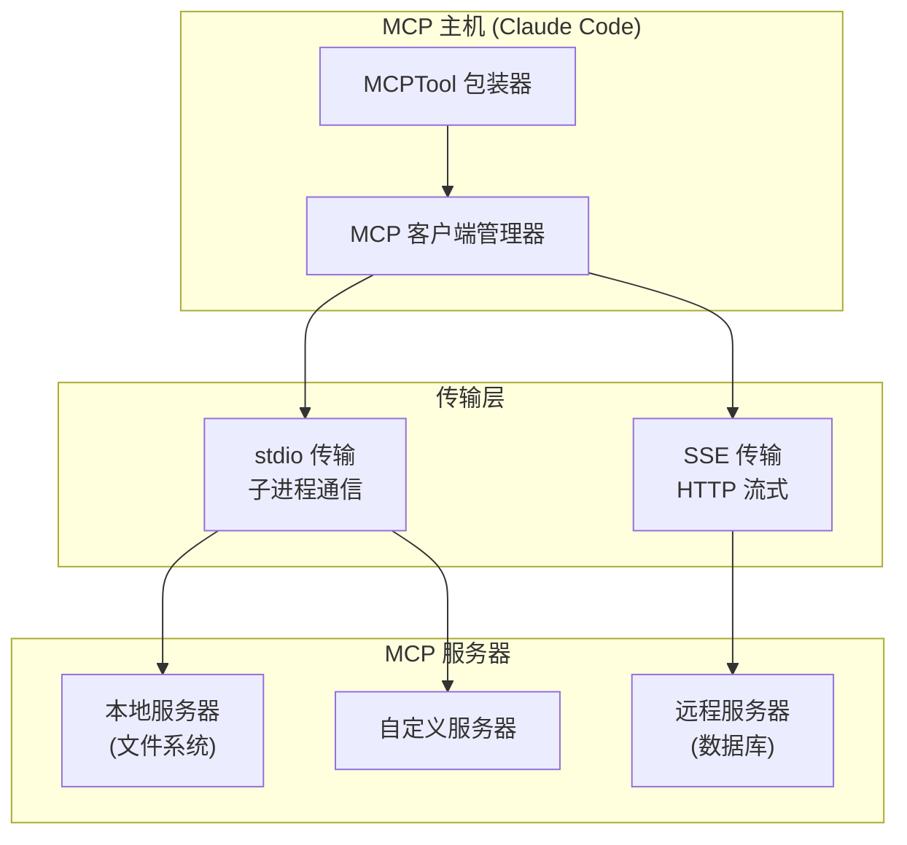
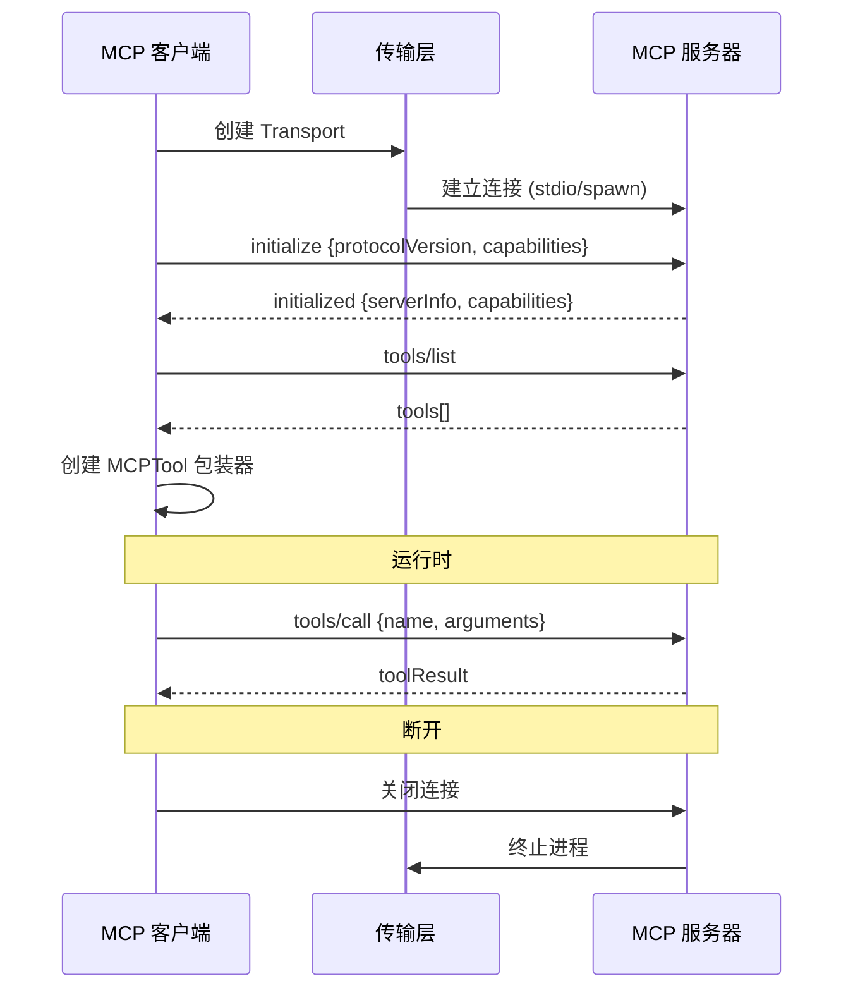

# Step 5：MCP 服务

## 分析目标

理解 Claude Code 的 MCP 客户端实现，包括服务发现、连接生命周期管理和工具路由。

## 核心文件

| 文件 / 目录 | 角色 |
|-------------|------|
| `src/services/mcp/types.js` | MCP 相关类型定义 |
| `src/services/mcp/client.js` | MCP 客户端核心 |
| `src/services/mcp/config.js` | MCP 配置解析 |
| `src/tools/ListMcpResourcesTool/` | MCP 资源列表工具 |
| `src/tools/ReadMcpResourceTool/` | MCP 资源读取工具 |

## MCP 协议概述

MCP（Model Context Protocol）是一个基于 JSON-RPC 的开放协议，定义了 AI 模型与外部工具/资源的交互方式。



### 核心协议方法

| 方法 | 方向 | 说明 |
|------|------|------|
| `initialize` | 客户端 → 服务器 | 协议版本协商和能力声明 |
| `initialized` | 客户端 → 服务器 | 初始化完成通知 |
| `tools/list` | 客户端 → 服务器 | 获取服务器提供的工具列表 |
| `tools/call` | 客户端 → 服务器 | 调用指定工具 |
| `resources/list` | 客户端 → 服务器 | 获取资源列表 |
| `resources/read` | 客户端 → 服务器 | 读取指定资源 |
| `ping` | 双向 | 心跳检测 |

## 服务发现

MCP 服务器的配置来自多个数据源，按优先级合并：

### 配置源

1. **用户全局配置**：`~/.claude/settings.json` 中的 `mcpServers` 字段
2. **项目本地配置**：`.claude/settings.json`
3. **CLI 参数**：`--mcp-servers` 或 `--mcp-config`
4. **环境变量**：`CLAUDE_CODE_MCP_SERVERS`

### 配置格式

```json
{
  "mcpServers": {
    "filesystem": {
      "command": "npx",
      "args": ["-y", "@anthropic-ai/mcpb"],
      "env": {
        "MCPB_DEBUG": "1"
      }
    },
    "database": {
      "url": "http://localhost:3001/mcp",
      "headers": {
        "Authorization": "Bearer sk-..."
      }
    }
  }
}
```

### 发现流程

```typescript
// 概念：服务发现
async function discoverServers(): Promise<MCPServerConfig[]> {
  const configs: MCPServerConfig[] = []

  // 1. 加载用户配置
  const userSettings = await readJSON('~/.claude/settings.json')
  configs.push(...parseServerConfigs(userSettings.mcpServers))

  // 2. 加载项目配置
  const projectSettings = await readJSON('.claude/settings.json')
  configs.push(...parseServerConfigs(projectSettings.mcpServers))

  // 3. 解析 CLI 参数
  const cliConfigs = parseCliMcpFlags()
  configs.push(...cliConfigs)

  // 4. 去重：后出现的覆盖先出现的（同名）
  return deduplicateBy(configs, 'name')
}
```

## 连接管理



### 连接状态管理

```typescript
enum ConnectionState {
  DISCONNECTED,   // 初始状态
  CONNECTING,     // 正在连接
  CONNECTED,      // 连接成功
  ERROR,          // 连接失败
  RECONNECTING,   // 自动重连中
}

class MCPServerConnection {
  state: ConnectionState = ConnectionState.DISCONNECTED
  serverName: string
  transport: Transport
  tools: MCPToolDefinition[]

  async connect(): Promise<void> {
    this.state = ConnectionState.CONNECTING
    try {
      await this.transport.start()
      await this.initialize()
      this.tools = await this.listTools()
      this.state = ConnectionState.CONNECTED
    } catch (err) {
      this.state = ConnectionState.ERROR
      throw err
    }
  }
}
```

## MCP 工具路由

MCP 工具被包装为 `MCPTool` 实例，合并到全局工具列表。工具的命名空间使用 `mcp__serverName__toolName` 格式：

```typescript
// MCP 工具包装器的概念
class MCPToolWrapper implements Tool {
  name: string           // 例如 'mcp__filesystem__read_file'
  description: string
  inputSchema: object
  mcpInfo: {
    serverName: string   // 'filesystem'
    toolName: string     // 'read_file'
  }

  async *input(input: any, context: ToolContext) {
    const result = await this.connection.callTool(
      this.mcpInfo.toolName,
      input
    )
    yield { type: 'result', data: result }
  }
}
```

## 练习

1. 阅读 `src/services/mcp/` 目录下的文件，绘制完整的 MCP 工具调用时序图
2. 配置一个本地 MCP 服务器（如 SQLite），观察工具列表的变化
3. 分析 MCP 连接失败时 Claude Code 的行为——是优雅降级还是崩溃退出？
4. 阅读 `ListMcpResourcesTool` 和 `ReadMcpResourceTool` 的实现，分析它们与 `MCPTool` 的关系
