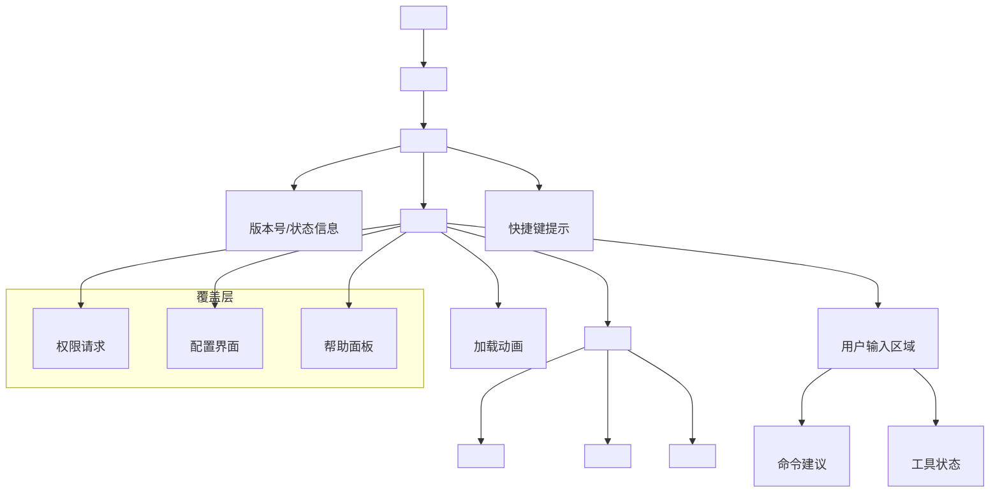

# Step 6：Ink UI 渲染

## 分析目标

理解 Claude Code 如何使用 React 和 Ink 实现终端 UI 渲染。重点分析组件树结构、渲染管道和关键组件。

## 核心文件

| 文件 | 角色 |
|------|------|
| `src/main.tsx` (部分) | Ink app 初始化和渲染 |
| `src/components/*` | React 组件 |
| `src/hooks/*` | 自定义 hooks |
| `src/context/*` | React Context |

## Ink 简介

Ink 是 Vercel 开发的终端 React 渲染器。它使用 `react-reconciler` 实现了一个自定义宿主环境，将 React 组件渲染到终端而非 DOM。

```typescript
// Ink 的基本用法
import { render, Box, Text } from 'ink'
import React from 'react'

function App() {
  return (
    <Box flexDirection="column" padding={1}>
      <Text color="green">Hello, Claude Code!</Text>
    </Box>
  )
}

const { waitUntilExit } = render(<App />)
```

Ink 支持的组件：

- `<Box>`：Flexbox 布局容器
- `<Text>`：文本节点
- `<Newline>`：换行
- `<Spacer>`：弹性空间
- `<Transform>`：文本转换
- `<Static>`：静态子节点
- `<AppContext>`：应用上下文

## Claude Code 组件树



## 屏幕状态管理

Claude Code 的 UI 包含多种屏幕状态，通过 React 状态驱动切换：

```typescript
type ScreenState =
  | 'loading'        // 初始加载
  | 'interactive'    // 正常交互
  | 'permission'     // 权限对话框
  | 'config'         // 配置窗口
  | 'help'           // 帮助面板
  | 'exiting'        // 正在退出

function App() {
  const [screen, setScreen] = useState<ScreenState>('loading')

  useEffect(() => {
    // init → setup → 完成后切换到 interactive
    initialize().then(() => setScreen('interactive'))
  }, [])

  switch (screen) {
    case 'loading':
      return <LoadingScreen />
    case 'interactive':
      return <InteractiveScreen onScreenChange={setScreen} />
    case 'permission':
      return <PermissionDialog onComplete={() => setScreen('interactive')} />
    // ...
  }
}
```

## 关键组件详解

### Spinner — 加载动画

```typescript
// src/components/Spinner.js
function Spinner({ message }: { message?: string }) {
  const [frame, setFrame] = useState(0)
  const frames = ['⠋', '⠙', '⠹', '⠸', '⠼', '⠴', '⠦', '⠧', '⠇', '⠏']
  
  useInterval(() => {
    setFrame(f => (f + 1) % frames.length)
  }, 80) // 每 80ms 更新一帧

  return (
    <Box>
      <Text color="cyan">{frames[frame]}</Text>
      {message && <Text>{' ' + message}</Text>}
    </Box>
  )
}
```

### MessageList — 对话历史

```typescript
function MessageList() {
  const messages = useAppState(state => state.messages)
  const ref = useRef<Box>(null)

  // 自动滚动到最新消息
  useEffect(() => {
    ref.current?.scrollToEnd()
  }, [messages.length])

  return (
    <Box flexDirection="column" ref={ref}>
      {messages.map(msg => (
        <MessageBubble key={msg.id} message={msg} />
      ))}
    </Box>
  )
}
```

### InputBox — 用户输入

```typescript
function InputBox() {
  const [input, setInput] = useState('')
  const [history, setHistory] = useState<string[]>([])
  const [historyIdx, setHistoryIdx] = useState(-1)

  const handleSubmit = () => {
    if (input.trim()) {
      dispatch({ type: 'SEND_MESSAGE', text: input })
      setHistory(prev => [...prev, input])
      setInput('')
      setHistoryIdx(-1)
    }
  }

  const handleKeyDown = (key: string) => {
    if (key === 'upArrow') {
      // 上箭头：历史导航
      const newIdx = Math.min(historyIdx + 1, history.length - 1)
      setHistoryIdx(newIdx)
      setInput(history[history.length - 1 - newIdx] || '')
    }
    // ...
  }

  return <TextInput value={input} onChange={setInput} onSubmit={handleSubmit} />
}
```

## Ink 渲染性能

终端渲染面临的特殊挑战：

1. **有限更新区域**：终端不像 DOM 可以局部更新，Ink 每次重新渲染都会写入整个终端区域
2. **输出频率控制**：过高的渲染频率会导致终端闪烁
3. **文本溢出**：终端宽度固定，文本换行需要手动处理

Ink 对此的优化：

```typescript
// Ink 使用 batch 更新机制合并多次渲染
// 在同一帧内多次 setState 只会触发一次终端写入
function useBatchedState<T>(initial: T): [T, (v: T) => void] {
  const [state, setState] = useState(initial)
  const batchRef = useRef(false)

  const batchedSetState = useCallback((value: T) => {
    if (!batchRef.current) {
      batchRef.current = true
      requestAnimationFrame(() => {
        batchRef.current = false
        setState(value)
      })
    }
  }, [])

  return [state, batchedSetState]
}
```

## 练习

1. 在 Claude Code 中找到 Ink 渲染初始化代码（`render(<App />)` 调用的位置）
2. 分析 `Spinner` 组件的动画帧率和效果实现
3. 尝试修改 `InputBox` 组件，添加一个简单的输入提示功能
4. 阅读 Ink 官方文档，理解 Ink 如何通过 `react-reconciler` 实现终端渲染
