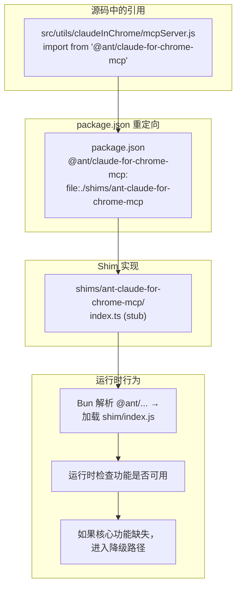

# Step 8：Shim 兼容层

## 分析目标

理解还原项目中 7 个 shim 包的作用、它们替换了什么、以及 Shim 系统的工作原理和局限。

## 什么是 Shim

在 `claude-code-rev` 项目中，Shim（垫片）是还原团队为无法通过 source map 恢复的私有模块编写的替代实现。这些私有模块可能是：

1. **Ant 内部的闭源工具**：如 `color-diff-napi` 是仅在 Ant 内部使用的原生 C++ 模块
2. **Bun 原生模块**：如 `modifiers-napi` 使用了 Bun 未公开的内部 API
3. **操作系统特定模块**：如 `url-handler-napi` 需要调用 macOS/Windows 的原生 URL 处理 API

## 7 个 Shim 包

| Shim 包 | 替换目标 | 原模块用途 | 还原程度 |
|---------|----------|-----------|---------|
| `color-diff-napi` | @anthropic-ai/color-diff-napi | 终端颜色差异对比 | 基础功能可用 |
| `modifiers-napi` | @anthropic-ai/modifiers-napi | 键盘修饰键处理 | 基础功能可用 |
| `url-handler-napi` | @anthropic-ai/url-handler-napi | 系统 URL 协议处理 | 基础功能可用 |
| `ant-claude-for-chrome-mcp` | @ant/claude-for-chrome-mcp | Chrome 浏览器 MCP 集成 | 存根（stub） |
| `ant-computer-use-input` | @ant/computer-use-input | 计算机使用输入处理 | 存根（stub） |
| `ant-computer-use-mcp` | @ant/computer-use-mcp | 计算机使用 MCP 服务器 | 存根（stub） |
| `ant-computer-use-swift` | @ant/computer-use-swift | 计算机使用 Swift 原生模块 | 存根（stub） |

## Shim 实现模式

### 类型 1：基础功能可用

```typescript
// shims/color-diff-napi/index.ts
// 该 shim 提供了与原模块兼容的 API 接口
// 但底层实现使用纯 JavaScript 而非原生 C++

export function colorDiff(a: string, b: string): number {
  // 简单的颜色差异计算（原版使用 napi-rs 加速）
  const aClean = a.replace(/\x1b\[\d+m/g, '')
  const bClean = b.replace(/\x1b\[\d+m/g, '')
  return aClean === bClean ? 0 : 1
}

export function applyDiff(text: string, diff: Diff[]): string {
  // 简易实现
  return diff.reduce((acc, d) => {
    return acc.slice(0, d.start) + d.text + acc.slice(d.end)
  }, text)
}
```

### 类型 2：存根（Stub）

```typescript
// shims/ant-claude-for-chrome-mcp/index.ts
// 由于无法获取原始源码，该 shim 仅提供必要的类型导出
// 实际功能在运行时会被快速路径绕过

export class ChromeMcpServer {
  async start(): Promise<void> {
    console.error('[Shim] Chrome Mcp Server is a stub - full functionality not available')
  }
}
```

## Shim 系统工作原理



### 注册方式

在 `package.json` 中，通过 `file:` 协议将私有包名指向 shim 目录：

```json
{
  "dependencies": {
    "color-diff-napi": "file:./shims/color-diff-napi",
    "modifiers-napi": "file:./shims/modifiers-napi",
    "url-handler-napi": "file:./shims/url-handler-napi",
    "@ant/claude-for-chrome-mcp": "file:./shims/ant-claude-for-chrome-mcp",
    "@ant/computer-use-input": "file:./shims/ant-computer-use-input",
    "@ant/computer-use-mcp": "file:./shims/ant-computer-use-mcp",
    "@ant/computer-use-swift": "file:./shims/ant-computer-use-swift"
  }
}
```

Bun 在解析 `import from '@ant/claude-for-chrome-mcp'` 时，会按照 `package.json` 的映射，将路径重定向到 `shims/ant-claude-for-chrome-mcp/index.js`。

## 还原了什么 / 丢失了什么

| 方面 | 还原的 | 丢失的 |
|------|--------|--------|
| 核心架构 | 完整还原 — bootstrap, CLI, 工具, 命令, 状态管理 | — |
| MCP 客户端 | 完整还原 — 协议实现, 连接管理 | 部分 Ant 内部 MCP 服务器 |
| 工具系统 | 50+ 工具的接口和核心逻辑 | 如 REPLTool 的完整功能 |
| 命令系统 | 102+ 命令的定义和注册 | Ant 内部命令的完整实现 |
| Ink UI | 组件结构和渲染逻辑 | — |
| 原生性能 | — | napi-rs 加速的 C++ 模块 |
| 远程控制 | 协议和架构 | Ant 内部基础设施 |
| Chrome 集成 | 调用链路 | Chrome 原生模块 |

## Shim 的限制

1. **性能损失**：原生 C++ 模块的 shim 版本可能慢 10-100 倍
2. **功能缺失**：Stub shim 在运行时可能触发未实现错误
3. **无法升级**：Shim 与特定版本绑定，无法跟随原始项目更新
4. **测试不充分**：Shim 代码没有经过 Ant 内部的 QA 流程

## 练习

1. 浏览 `shims/` 目录下的每个 shim 包，了解其实现方式
2. 尝试使用被 shim 的模块，记录哪些功能正常工作，哪些抛出错误
3. 为一个 shim 包编写更完整的实现（只需要满足当前源码的调用需求）
4. 分析如果完全移除某个 shim，对 Claude Code 启动和执行会产生什么影响
