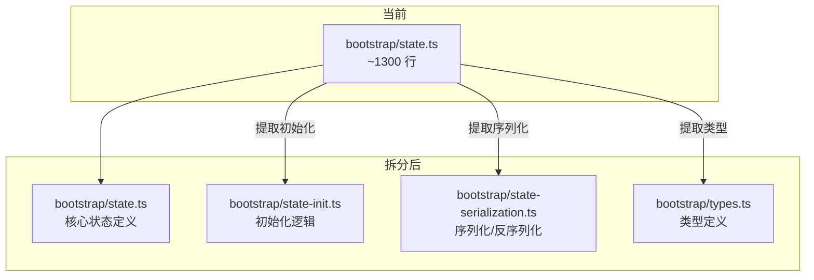

# 扩展方向

## 概述

`claude-code-rev` 还原源码树为学习和实验提供了极好的基础。这一节探讨在还原源码基础上可以进行的扩展方向，从增加测试到架构重构，再到补充缺失功能。

## 方向 1：补充单元测试

还原的源码树几乎没有测试覆盖。这是最有价值的扩展方向之一。

### 测试目标

| 模块 | 测试重点 | 推荐框架 |
|------|----------|----------|
| `bootstrapMacro.ts` | MACRO 注入的幂等性 | Bun:test |
| `cli.tsx` | 快速路径路由 | Bun:test + mock |
| `tools.ts` | 工具注册列表正确性 | Bun:test |
| `Tool.ts` | 工具接口一致性 | Bun:test |
| `commands.ts` | 命令注册完整性 | Bun:test |
| `bootstrap/state.ts` | 状态初始化 | Bun:test |

### 示例测试

```typescript
// tests/bootstrapMacro.test.ts
import { describe, it, expect } from 'bun:test'
import { ensureBootstrapMacro } from '../src/bootstrapMacro.js'

describe('bootstrapMacro', () => {
  it('should inject MACRO into globalThis', () => {
    delete (globalThis as any).MACRO
    ensureBootstrapMacro()
    expect((globalThis as any).MACRO).toBeDefined()
    expect((globalThis as any).MACRO.VERSION).toBe('999.0.0-restored')
  })

  it('should be idempotent', () => {
    const first = (globalThis as any).MACRO
    ensureBootstrapMacro()
    const second = (globalThis as any).MACRO
    expect(first).toBe(second)
  })
})
```

### 集成测试

```typescript
// tests/integration/bootstrap.test.ts
import { describe, it, expect } from 'bun:test'

describe('Bootstrap Flow', () => {
  it('should handle --version fast-path', async () => {
    const logSpy = vi.spyOn(console, 'log')
    
    process.argv = ['bun', 'src/bootstrap-entry.ts', '--version']
    await import('../src/bootstrap-entry.js')
    
    expect(logSpy).toHaveBeenCalledWith('999.0.0-restored (Claude Code)')
  })
})
```

## 方向 2：重构 Bootstrap State

`bootstrap/state.ts` 是源码树中最大的单体文件之一（约 1300 行），拆分为多个模块可以大幅提高可维护性。

### 建议拆分方案



### 重构步骤

1. 将类型定义分离到 `types.ts`
2. 将初始化逻辑提取到 `state-init.ts`
3. 将序列化/反序列化提取到 `state-serialization.ts`
4. 核心 `state.ts` 只保留操作方法和公开 API

## 方向 3：统一命令管道

当前 4 条命令加载管道可以通过统一接口简化：

```typescript
// 建议的统一命令注册接口
interface CommandRegistry {
  register(command: CommandDefinition): void
  
  // 条件注册
  registerWhen(condition: () => boolean, command: CommandDefinition): void
  
  // 延迟注册
  registerDeferred(factory: () => CommandDefinition): void
  
  // 批量注册
  registerAll(commands: CommandDefinition[]): void
}

class DefaultCommandRegistry implements CommandRegistry {
  private commands = new Map<string, CommandDefinition>()
  private deferred: Array<() => CommandDefinition> = []
  private conditions: Array<{ condition: () => boolean; command: CommandDefinition }> = []

  register(command: CommandDefinition): void {
    this.commands.set(command.name, command)
  }

  registerAll(commands: CommandDefinition[]): void {
    for (const command of commands) {
      this.register(command)
    }
  }

  registerWhen(condition: () => boolean, command: CommandDefinition): void {
    if (condition()) {
      this.register(command)
    } else {
      this.conditions.push({ condition, command })
    }
  }

  registerDeferred(factory: () => CommandDefinition): void {
    this.deferred.push(factory)
  }

  finalize(): void {
    // 检查条件注册
    for (const { condition, command } of this.conditions) {
      if (condition()) {
        this.commands.set(command.name, command)
      }
    }
    // 实例化延迟注册
    for (const factory of this.deferred) {
      const command = factory()
      this.commands.set(command.name, command)
    }
  }
}
```

## 方向 4：替换 Shim 为真实实现

当前 7 个 shim 包可以使用真实实现替换，逐步减少与原始项目的差距。

### 替换优先级

| 优先级 | Shim 包 | 替换方案 | 难度 |
|--------|---------|----------|------|
| P0 | `color-diff-napi` | 使用 chalk 或开源终端颜色库 | 低 |
| P1 | `modifiers-napi` | 使用原生 Node.js keypress 事件 | 低 |
| P2 | `url-handler-napi` | 使用 `open` npm 包 | 低 |
| P3 | `ant-claude-for-chrome-mcp` | 使用 Puppeteer/Playwright 实现 | 中 |
| P4 | `ant-computer-use-mcp` | 使用 RobotJS 或 Jimp 实现 | 高 |
| P5 | `ant-computer-use-input` | 使用 ioHook 实现 | 高 |
| P6 | `ant-computer-use-swift` | 放弃 Swift 依赖，使用跨平台方案 | 高 |

### 示例：替换 color-diff-napi

```typescript
// 使用 chalk 替代 color-diff-napi
import chalk from 'chalk'

export function colorDiff(a: string, b: string): number {
  const strippedA = stripAnsi(a)
  const strippedB = stripAnsi(b)
  return strippedA === strippedB ? 0 : 1
}

export function applyDiff(text: string, diff: Array<{ start: number; end: number; text: string }>): string {
  let result = text
  // 逆序应用 diff 以保持位置正确
  const sorted = [...diff].sort((a, b) => b.start - a.start)
  for (const d of sorted) {
    result = result.slice(0, d.start) + d.text + result.slice(d.end)
  }
  return result
}
```

## 方向 5：添加新特性

在现有架构基础上添加新特性：

### 新的 MCP 服务器连接器

```typescript
// 示例：Docker MCP 连接器
export const dockerMcpConfig: MCPServerConfig = {
  name: 'docker',
  command: 'docker',
  args: ['run', '-i', '--rm', 'mcp/docker'],
  tools: [
    { name: 'list_containers', description: 'List Docker containers' },
    { name: 'exec_command', description: 'Execute command in a container' },
  ]
}

// 向 MCP 管理器注册
mcpManager.registerServer(dockerMcpConfig)
```

### 新的 UI 组件

```typescript
// 示例：Dashboard 面板
function Dashboard() {
  const systemInfo = useSystemInfo()
  const sessionStats = useSessionStats()

  return (
    <Box flexDirection="column" borderStyle="round" padding={1}>
      <Text bold>Dashboard</Text>
      <Text>System: {systemInfo.os} ({systemInfo.cpu})</Text>
      <Text>Sessions: {sessionStats.total}</Text>
      <Text>Tokens: {sessionStats.totalTokens}</Text>
    </Box>
  )
}
```

## 方向 6：性能回归测试

建立性能基准测试，监控每次修改对启动时间和内存的影响：

```typescript
// 性能基准测试
const benchmarks = {
  'bootstrap-version-path': {
    command: 'bun run src/bootstrap-entry.ts -- --version',
    expected: { maxTime: 100 }, // ms
  },
  'bootstrap-full-cli': {
    command: 'bun run src/bootstrap-entry.ts -- --help',
    expected: { maxTime: 500 },
  },
  'tools-getAllBaseTools': {
    command: 'bun run benchmarks/tools.bench.ts',
    expected: { maxTime: 200 },
  },
}
```

## 练习

1. 选择一个 shim 包，编写一个完整的替代实现
2. 为 `bootstrapMacro.ts` 和 `cli.tsx` 编写单元测试
3. 设计一个命令注册接口，能够统一当前 4 条管道
4. 实现一个 `Dashboard` 组件，显示当前会话的状态信息
5. 创建一个性能基准测试脚本，监控启动时间
