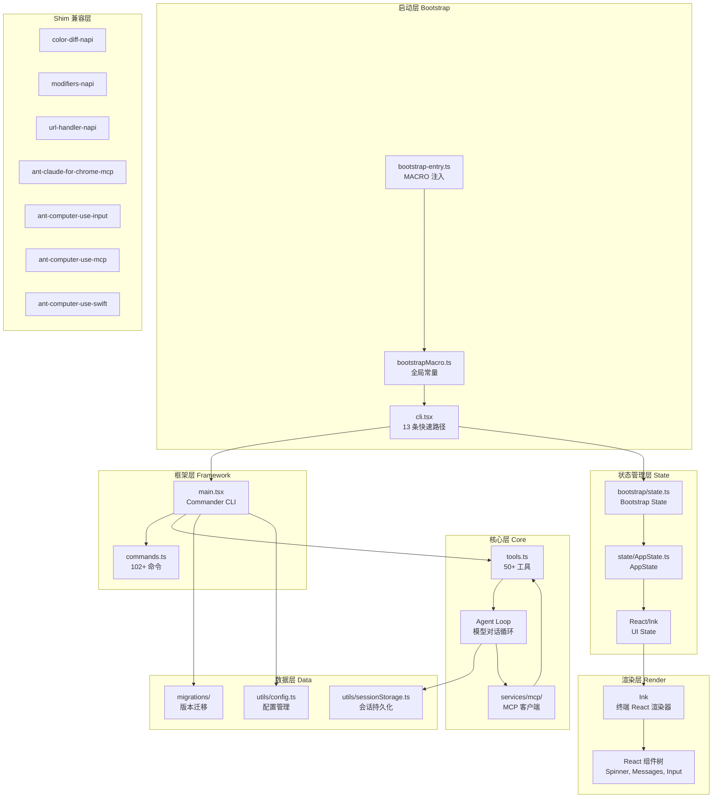

# 源码重建分析总览

## 项目背景

`claude-code-rev` 是一个从 `@anthropic-ai/claude-code` npm 包的 source map 逆向还原的源码树。它不是一个官方项目，而是一个教学和研究资源，旨在让开发者能够阅读和理解 Claude Code 的内部实现。

### 为什么需要还原

Anthropic 在其 npm 发布版本中对源文件进行了打包和混淆（经过 `bun build`），因此标准的 `npm install @anthropic-ai/claude-code` 得到的是一组压缩后的 bundle，而非可读的 TypeScript 源码。

还原团队通过以下方式恢复源码树：

1. **Source Map 提取**：从发布包中提取 source map 数据
2. **源码重建**：根据 source map 的 `sourcesContent` 字段重建原始 TypeScript 文件
3. **Shim 补齐**：对无法还原的私有模块，编写 shim 包占位
4. **依赖注入**：恢复缺失的 `node_modules` 依赖

### 项目规格

| 指标 | 数值 |
|------|------|
| 包名 | `@anthropic-ai/claude-code` |
| 还原版本 | `999.0.0-restored` |
| TypeScript 源文件 | 500+（估算） |
| 工具 (Tools) 数量 | 50+ |
| 命令 (Commands) 数量 | 102+ |
| Shim 包数量 | 7 |
| 依赖项 | 90+ |
| 运行时要求 | Bun >=1.3.5, Node >=24.0.0 |
| UI 框架 | React + Ink (终端 React 渲染) |
| CLI 框架 | Commander |
| 构建工具 | Bun Bundler |

## 整体架构



## 目录结构

```
claude-code-rev/
├── src/
│   ├── bootstrap-entry.ts       # 应用入口
│   ├── bootstrapMacro.ts        # MACRO 常量注入
│   ├── entrypoints/
│   │   └── cli.tsx              # CLI 入口（13 条快速路径）
│   ├── main.tsx                  # Commander CLI 主逻辑
│   ├── tools.ts                  # 工具注册中心
│   ├── Tool.ts                   # Tool 接口定义
│   ├── commands.ts               # 命令注册中心
│   ├── bootstrap/
│   │   └── state.ts             # Bootstrap State
│   ├── state/
│   │   ├── AppState.ts          # AppState 定义
│   │   └── AppStateStore.tsx    # React 绑定
│   ├── services/
│   │   └── mcp/                 # MCP 客户端实现
│   ├── tools/                   # 50+ 工具实现子目录
│   ├── commands/                # 102+ 命令实现子目录
│   ├── components/              # Ink React 组件
│   ├── utils/                   # 工具函数
│   ├── constants/               # 常量定义
│   ├── hooks/                   # React Hooks
│   └── cli/                     # CLI 辅助功能
├── shims/                       # 7 个 shim 包
├── vendor/                      # 供应商代码
└── package.json                 # 还原后配置
```

## 架构特点

### 优势

1. **启动性能优化**：13 条快速路径确保最常见的操作（如 `--version`）不加载完整 CLI
2. **编译时 DCE**：通过 `feature()` 实现条件编译，减小 bundle 体积
3. **关注点分离**：工具系统、命令系统、状态管理三权分立
4. **MCP 开放架构**：支持通过标准协议扩展工具能力
5. **会话持久化**：JSONL 格式的会话文件支持恢复和分支

### 缺陷（可重构）

1. **Bootstrap 单体**：`cli.tsx` 的 13 条快速路径全部写在一个文件
2. **`main.tsx` 内联分支**：初始化流程条件分支过多
3. **四管道冗余**：4 条命令加载管道有功能重叠
4. **代码重复**：部分工具实现存在重复代码
5. **循环依赖**：工具和命令系统之间存在循环引用

## 与参考项目对比

| 维度 | claude-code-rev | 典型的 Agent 框架 |
|------|----------------|-------------------|
| 运行时 | Bun | Node.js |
| UI 渲染 | React/Ink 终端渲染 | 通常无 UI |
| 工具系统 | 50+ 内置工具 + MCP | 通常 < 10 工具 |
| 命令系统 | 102+ 内置命令 | 通常 < 20 命令 |
| MCP 支持 | 完整客户端实现 | 可选 |
| 构建方式 | Bun Bundler + DCE | 标准 TS 编译 |
| 许可 | 专有（仅供学习） | 通常开源 |
