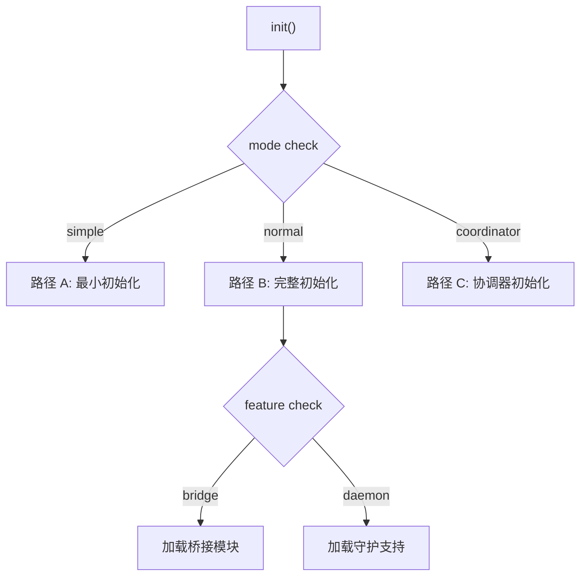
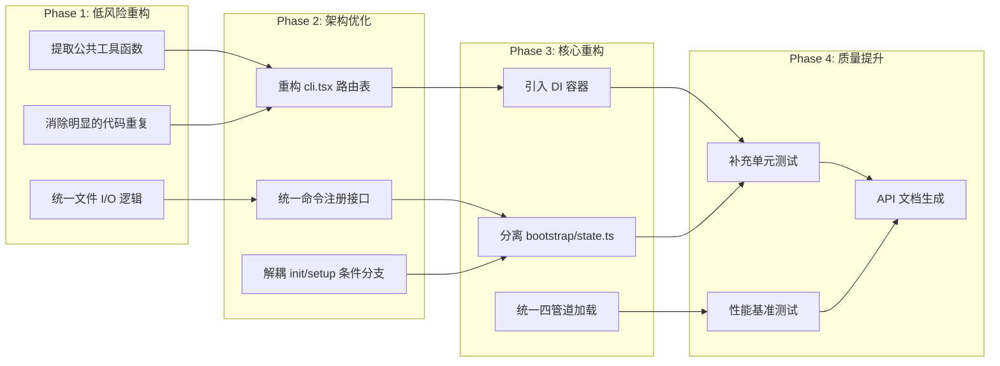

# 架构分析与重构方案

## 概述

通过对 `claude-code-rev` 源码树的全面分析，我们发现了一些架构层面的结构性问题、代码重复和性能瓶颈。本节详细分析这些问题，并给出一个 4 阶段的重构方案。

## 问题分析

### 1. Bootstrap 单体文件

**问题位置**：`src/entrypoints/cli.tsx` — 13 条快速路径集中在一个文件

**问题描述**：
- 一个文件承担了启动路由的全部职责
- 每条快速路径都有独立的模块依赖和错误处理逻辑
- 文件长度约 300 行，但每条路径的可维护性较差
- 新增快速路径需要修改同一个文件

```typescript
// 当前结构：13 条 if-else 链
async function main(): Promise<void> {
  const args = process.argv.slice(2)

  if (args[0] === '--version') { /* ... */ return }
  if (feature('DUMP_SYSTEM_PROMPT') && args[0] === '--dump-system-prompt') { /* ... */ return }
  if (args[0] === '--claude-in-chrome-mcp') { /* ... */ return }
  // ... 10 条更多路径
  if (args[0] === 'self-hosted-runner') { /* ... */ return }
  
  // 正常启动
}
```

**重构建议**：
```typescript
// 使用路由表重构
const fastPathRoutes: FastPathRoute[] = [
  { match: '--version', handler: versionHandler },
  { match: '--dump-system-prompt', feature: 'DUMP_SYSTEM_PROMPT', handler: dumpSystemPromptHandler },
  { match: '--claude-in-chrome-mcp', handler: claudeInChromeHandler },
  // ...
]
```

### 2. main.tsx 内联分支

**问题位置**：`src/main.tsx` — 初始化流程条件分支过多

**问题描述**：
- `init()` 和 `setup()` 函数包含大量条件分支
- 不同模式（简单模式、协调模式、REPL 模式）的初始化路径交织在一起
- 新增模式需要修改核心初始化函数



**重构建议**：使用策略模式分离不同模式的初始化逻辑。

### 3. 四管道命令加载冗余

**问题位置**：`src/commands.ts` — 4 条加载管道

**问题描述**：
- 管道 1（静态 import）和管道 2（条件 require）在功能上重叠
- 管道 3（后续加载）的逻辑分散在多个文件中
- 管道 4（插件系统）与 MCP 系统耦合

**数据对比**：

| 管道 | 命令数 | 加载时机 | 控制机制 |
|------|--------|----------|----------|
| 1: 静态 import | ~60 | 启动时 | 编译时绑定 |
| 2: 条件 require | ~10 | 启动时 | feature() / USER_TYPE |
| 3: 后续加载 | ~20 | setup() 后 | 初始化结果 |
| 4: 插件系统 | 动态 | 运行时 | MCP / Skill |

**重构建议**：统一为懒加载注册模式，所有命令通过一个统一接口注册。

### 4. 代码重复

**问题位置**：多个工具实现

**重复模式示例**：
- `BashTool` 和 `PowerShellTool` 有大量相同的 Shell 执行逻辑
- `FileEditTool`、`FileReadTool`、`FileWriteTool` 共享文件 I/O 逻辑
- `GlobTool` 和 `GrepTool` 共享搜索路径解析逻辑

**重构建议**：提取公共基类或工具函数：

```typescript
// 提取共享的文件操作基类
abstract class FileTool implements Tool {
  abstract name: string
  abstract description: string

  protected async readFile(path: string): Promise<string> {
    // 共享的文件读取逻辑
  }

  protected async validatePath(path: string): Promise<void> {
    // 共享的路径验证逻辑
  }
}
```

### 5. 循环依赖

**问题涉及**：
- `tools.ts` ↔ `utils/toolSearch.ts`
- `tools.ts` ↔ `tools/TeamCreateTool/TeamCreateTool.ts`
- `commands.ts` ↔ `utils/permissions/`

**当前解决方案**：惰性 `require()` 如 `getTeamCreateTool = () => require(...)`

**重构建议**：引入依赖注入容器，避免模块级的循环引用。

## 四阶段重构方案



### Phase 1：低风险重构（预估 2-3 天）

| 任务 | 文件 | 预期收益 |
|------|------|----------|
| 提取文件 I/O 基类 | `tools/File*Tool/` | 减少 30% 重复代码 |
| 统一 Shell 执行逻辑 | `BashTool`, `PowerShellTool` | 提高安全性 |
| 提取搜索工具基类 | `GlobTool`, `GrepTool` | 统一路径处理 |

### Phase 2：架构优化（预估 3-5 天）

| 任务 | 文件 | 预期收益 |
|------|------|----------|
| 路由表重构 | `cli.tsx` | 提高可扩展性 |
| 统一命令注册 | `commands.ts` | 简化命令添加流程 |
| 策略模式初始化 | `main.tsx` | 提高模式隔离性 |

### Phase 3：核心重构（预估 5-7 天）

| 任务 | 涉及文件 | 预期收益 |
|------|----------|----------|
| 依赖注入容器 | 全局 | 消除循环依赖 |
| Bootstrap State 拆分 | `bootstrap/state.ts` | 提高可测试性 |
| 管道统一 | `commands.ts` | 简化加载逻辑 |

### Phase 4：质量提升（预估 3-5 天）

| 任务 | 工具 | 预期收益 |
|------|------|----------|
| 单元测试 | Vitest / Bun:test | 提高代码质量 |
| 性能基准 | Bun benchmark | 防止性能退化 |
| API 文档 | TSDoc / TypeDoc | 提高可读性 |

## 风险评估

| 重构阶段 | 风险等级 | 主要风险 |
|----------|----------|----------|
| Phase 1 | 低 | 功能回归（通过测试覆盖） |
| Phase 2 | 中 | 入口逻辑改动影响启动 |
| Phase 3 | 高 | 架构改变可能引入新 bug |
| Phase 4 | 低 | 主要是增量工作 |

## 练习

1. 在 `cli.tsx` 中识别可以提取为独立路由处理器的快速路径
2. 分析 `BashTool` 和 `PowerShellTool` 的共同逻辑，设计一个共享基类
3. 为 `tools.ts` 的惰性加载函数设计一个依赖注入替代方案
4. 评估将 `bootstrap/state.ts` 拆分为多个独立模块的影响
