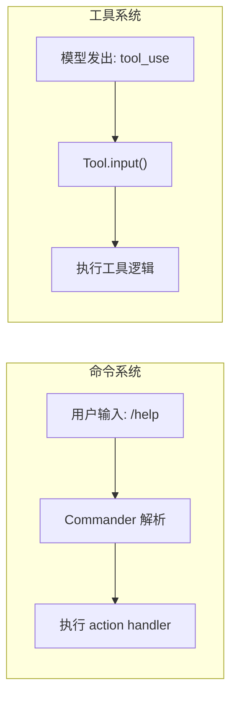

# 常见错误

## 误解 1：误认 `feature()` 为运行时函数

**错误理解**：
```typescript
// 错误理解：认为 feature('X') 在运行时动态判断
if (feature('BRIDGE_MODE')) {
  // 认为这里的代码可能在运行时执行
}
```

**正确理解**：
```typescript
// 正确理解：feature('X') 在 Bun 构建时静态评估
// 如果构建配置中 BRIDGE_MODE=false，这个 if 块在编译时被完全消除
// npm 发布的版本中不包含这段代码
import { feature } from 'bun:bundle'
```

**如何区分**：

| 写法 | 评估时机 | 代码是否存在于 bundle |
|------|----------|----------------------|
| `feature('X')` | 编译时 | 否（条件为 false 时） |
| `process.env.USER_TYPE === 'ant'` | 运行时 | 是 |
| `!!process.env.SOME_FLAG` | 运行时 | 是 |

## 误解 2：信任所有还原代码为原始源码

**错误理解**：认为还原后的 TypeScript 文件与原始 Anthropic 仓库中的代码一致。

**实际情况**：

1. **文件后缀**：还原后的文件为 `.js` 后缀，但内容可能是 TypeScript
2. **注释丢失**：Source map 中的注释可能不完整
3. **变量名恢复**：部分局部变量名可能不是原始名称
4. **Shim 替换**：私有模块的导入被替换为 shim 包
5. **Source map 残留**：文件末尾包含 base64 source map 引用

```typescript
// 文件末尾的 source map——不影响功能
//# sourceMappingURL=data:application/json;charset=utf-8;base64,...
```

**建议**：将还原代码视为"近似表示"，而非精确副本。核心架构和逻辑是准确的，但细节可能有偏差。

## 误解 3：忽略 Shim 包的影响

**错误理解**：认为所有依赖都与原始项目一致。

**实际情况**：

```json
{
  "dependencies": {
    "color-diff-napi": "file:./shims/color-diff-napi",
    "@ant/claude-for-chrome-mcp": "file:./shims/ant-claude-for-chrome-mcp"
  }
}
```

这些 `file:` 协议的依赖指向 shim 目录，而非原始的 npm 包。

**常见后果**：
- Chrome MCP 功能可能不完整
- Computer Use 功能可能不可用
- 原生性能模块被纯 JS 替代

**如何检查**：查看 `shims/` 目录下的每个包，确认其实现完整度。

## 误解 4：混淆命令（Commands）和工具（Tools）

**错误理解**：认为 `/command` 斜杠命令和模型调用的 tool 是同一个系统。

**实际情况**：



| 维度 | 命令 (Commands) | 工具 (Tools) |
|------|----------------|--------------|
| 调用者 | 终端用户 | AI 模型 |
| 触发方式 | 文本输入 `/command` | tool_use block |
| 注册位置 | `commands.ts` | `tools.ts` |
| 框架 | Commander.js | 自定义 AsyncGenerator |
| 数量 | 102+ | 50+ |

**混淆后果**：在阅读源码时会找错文件，比如在 `tools.ts` 中寻找 `/config` 命令的实现。

## 误解 5：忽略条件 `require()` 模式

**错误理解**：认为所有 `require()` 调用都会在模块加载时执行。

**实际情况**：`tools.ts` 和 `commands.ts` 中使用了多种 `require()` 模式：

```typescript
// 模式 1：顶层条件 require — 在模块加载时执行
const REPLTool = process.env.USER_TYPE === 'ant'
  ? require('./tools/REPLTool/REPLTool.js').REPLTool
  : null

// 模式 2：惰性 require（函数内）— 在调用时执行
const getTeamCreateTool = () =>
  require('./tools/TeamCreateTool/TeamCreateTool.js').TeamCreateTool

// 模式 3：IIFE 中的 require
const WorkflowTool = feature('WORKFLOW_SCRIPTS')
  ? (() => {
      require('./tools/WorkflowTool/bundled/index.js').initBundledWorkflows()
      return require('./tools/WorkflowTool/WorkflowTool.js').WorkflowTool
    })()
  : null
```

**分析每个模式的执行时机**：
- 模式 1：立即执行
- 模式 2：延迟执行（仅在函数被调用时）
- 模式 3：立即执行（IIFE）

## 误解 6：混淆快速路径和正常路径

**错误理解**：认为 `cli.tsx` 之后一定是 `main.tsx` 的完整流程。

**实际情况**：13 条快速路径中有 12 条在 `main.tsx` 之前就返回了。只有未命中任何路径时才进入正常启动：

```typescript
// 如果命中任意快速路径，main() 在对应 return 语句退出
// 下面的代码仅在未命中所有路径时执行
const { main: cliMain } = await import('../main.js')
await cliMain()
```

## 误解 7：认为所有工具都在 tools 目录

**错误理解**：认为 `src/tools/` 目录包含了所有工具实现。

**实际情况**：部分工具通过 MCP 协议由外部服务器提供，部分工具内联在 `src/tools.ts` 中定义（如 `ToolSearchTool` 等资源工具）。

**工具存在的三种形式**：
1. **原生工具**：`src/tools/BashTool/BashTool.js` — 直接 TypeScript 实现
2. **MCP 工具**：通过 `MCPTool` 包装器，由外部 MCP 服务器提供
3. **内联工具**：部分资源类工具直接在 `tools.ts` 或相关文件中定义

## 检查清单

当遇到源码分析困惑时，依次检查：

- [ ] 这个模块是命令 (Command) 还是工具 (Tool)？
- [ ] 这个 import 是静态导入还是条件 require？
- [ ] 这段代码在编译时（`feature()`）还是运行时（`process.env`）评估？
- [ ] 这个依赖是原始 npm 包还是 shim 包？
- [ ] 我正在阅读的代码是快速路径的一部分还是正常启动流程？
- [ ] 这个文件是否包含尾部 source map？
- [ ] 这个功能的文件后缀是 `.ts` 还是 `.js`？
