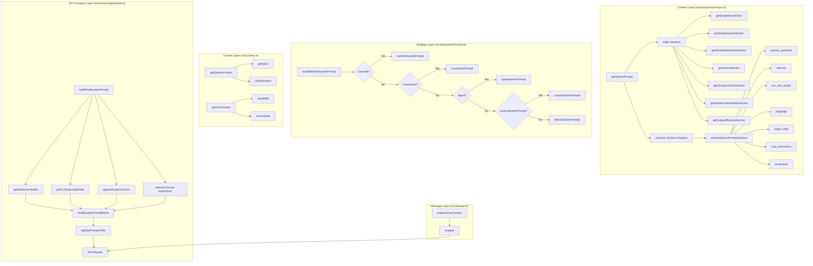

# 系统提示词来源参考

> 更新时间: 2026-05-26

本文档列出了所有对 Claude Code 系统提示词有贡献的源代码文件和配置来源，按组装优先顺序排列。

---

## 一、组装流水线总览

```
┌─────────────────────────────────────────────────────────────────┐
│ 1. CLI 前缀层                                                    │
│    src/constants/system.ts → getCLISyspromptPrefix()             │
│    "You are Claude Code, Anthropic's official CLI for Claude."   │
├─────────────────────────────────────────────────────────────────┤
│ 2. 归属头部层                                                    │
│    src/constants/system.ts → getAttributionHeader(fingerprint)   │
│    "x-anthropic-billing-header: cc_version=...; cc_entrypoint=.."│
├─────────────────────────────────────────────────────────────────┤
│ 3. 内容层 (可替换策略)                                            │
│    src/utils/systemPrompt.ts → buildEffectiveSystemPrompt()      │
│    ├─ overrideSystemPrompt (--system-prompt 参数)                │
│    ├─ coordinatorMode 提示词                                      │
│    ├─ agentSystemPrompt (--agent 参数)                            │
│    ├─ customSystemPrompt (--system-prompt 参数)                  │
│    └─ defaultSystemPrompt (getSystemPrompt 返回值)                │
├─────────────────────────────────────────────────────────────────┤
│ 4. 静态段 (边界前 → 可全局缓存)                                    │
│    src/constants/prompts.ts                                      │
│    ├─ getSimpleIntroSection()                                    │
│    ├─ getSimpleSystemSection()                                   │
│    ├─ getSimpleDoingTasksSection()                               │
│    ├─ getActionsSection()                                        │
│    ├─ getUsingYourToolsSection(enabledTools)                     │
│    ├─ getSimpleToneAndStyleSection()                             │
│    └─ getOutputEfficiencySection()                               │
├─────────────────────────────────────────────────────────────────┤
│ 5. 边界标记                                                      │
│    __SYSTEM_PROMPT_DYNAMIC_BOUNDARY__                            │
├─────────────────────────────────────────────────────────────────┤
│ 6. 动态段 (通过 registry 管理)                                     │
│    src/constants/systemPromptSections.ts                          │
│    ├─ session_guidance          → getSessionSpecificGuidance     │
│    ├─ memory                    → loadMemoryPrompt               │
│    ├─ ant_model_override        → getAntModelOverrideSection     │
│    ├─ env_info_simple           → computeSimpleEnvInfo           │
│    ├─ language                  → getLanguageSection             │
│    ├─ output_style              → getOutputStyleSection          │
│    ├─ mcp_instructions          → getMcpInstructionsSection      │
│    ├─ scratchpad                → getScratchpadInstructions      │
│    ├─ frc                       → getFunctionResultClearingSec   │
│    ├─ summarize_tool_results    → SUMMARIZE_TOOL_RESULTS_SECTION │
│    ├─ numeric_length_anchors    → (ant-only)                    │
│    ├─ token_budget              → (feature-gated)               │
│    └─ brief                     → (feature-gated)               │
├─────────────────────────────────────────────────────────────────┤
│ 7. 系统上下文 (追加层)                                             │
│    src/utils/api.ts → appendSystemContext(systemPrompt, ctx)     │
│    └─ src/context.ts → getSystemContext()                         │
│       ├─ gitStatus: 当前 Git 分支、状态、最近提交                  │
│       └─ cacheBreaker: 可选缓存破坏器 (ant-only)                 │
├─────────────────────────────────────────────────────────────────┤
│ 8. 工具 Schema (API 协议层)                                       │
│    在 claude.ts 中作为独立参数发送，非系统提示词文本的一部分         │
├─────────────────────────────────────────────────────────────────┤
│ 9. Advisor/Chrome 指令 (API 组装时注入)                          │
│    src/services/api/claude.ts                                    │
│    ├─ ADVISOR_TOOL_INSTRUCTIONS    (advisor 模式)                │
│    └─ CHROME_TOOL_SEARCH_INSTRUCTIONS (Chrome 工具搜索)          │
├─────────────────────────────────────────────────────────────────┤
│ 10. 用户上下文 (消息层)                                            │
│     src/utils/api.ts → prependUserContext(messages, ctx)         │
│     └─ src/context.ts → getUserContext()                         │
│        ├─ claudeMd: 所有 CLAUDE.md 内容                          │
│        └─ currentDate: 当前日期                                  │
└─────────────────────────────────────────────────────────────────┘
```

---

## 二、各来源文件详情

### 2.1 核心系统提示词构造

| 文件 | 关键导出 | 作用 |
|------|---------|------|
| `src/constants/prompts.ts` | `getSystemPrompt()` | 系统提示词主入口，组装所有段 |
| `src/constants/prompts.ts` | `DEFAULT_AGENT_PROMPT` | 子代理默认提示词 |
| `src/constants/prompts.ts` | `enhanceSystemPromptWithEnvDetails()` | 子代理环境信息补充 |
| `src/constants/prompts.ts` | `SYSTEM_PROMPT_DYNAMIC_BOUNDARY` | 静/动态内容边界标记 |
| `src/constants/prompts.ts` | `computeEnvInfo()` | 环境信息生成（完整版） |
| `src/constants/prompts.ts` | `computeSimpleEnvInfo()` | 环境信息生成（简洁版，当前默认） |
| `src/constants/systemPromptSections.ts` | `systemPromptSection()` | 创建可缓存的动态段 |
| `src/constants/systemPromptSections.ts` | `DANGEROUS_uncachedSystemPromptSection()` | 创建每次重新计算的动态段 |
| `src/constants/systemPromptSections.ts` | `resolveSystemPromptSections()` | 解析并缓存所有动态段 |
| `src/constants/systemPromptSections.ts` | `clearSystemPromptSections()` | 清除段缓存（/clear、/compact） |
| `src/constants/system.ts` | `getCLISyspromptPrefix()` | CLI 身份前缀（区分三种模式） |
| `src/constants/system.ts` | `getAttributionHeader()` | API 归属头部 |
| `src/constants/system.ts` | `CLI_SYSPROMPT_PREFIXES` | 所有可能的前缀值集合 |
| `src/constants/cyberRiskInstruction.ts` | `CYBER_RISK_INSTRUCTION` | 网络安全指令（Safeguards 团队拥有） |
| `src/constants/outputStyles.ts` | `OUTPUT_STYLE_CONFIG` | 输出风格定义（Explanatory/Learning 等） |

### 2.2 上下文管理

| 文件 | 关键导出 | 作用 |
|------|---------|------|
| `src/context.ts` | `getUserContext()` | 用户上下文（CLAUDE.md + 日期）memoized |
| `src/context.ts` | `getSystemContext()` | 系统上下文（git 状态 + 缓存破坏器）memoized |
| `src/context.ts` | `getGitStatus()` | Git 状态信息（分支、变更、最近提交） |
| `src/context.ts` | `getSystemPromptInjection()` | 系统提示词注入（ant-only 调试） |
| `src/context.ts` | `setSystemPromptInjection()` | 设置注入内容，清除缓存 |

### 2.3 CLAUDE.md 处理

| 文件 | 关键导出 | 作用 |
|------|---------|------|
| `src/utils/claudemd.ts` | `getMemoryFiles()` | 加载所有 CLAUDE.md 文件，memoized |
| `src/utils/claudemd.ts` | `getClaudeMds()` | 格式化内存文件为带标签的文本 |
| `src/utils/claudemd.ts` | `processMemoryFile()` | 递归处理单文件及其 @include |
| `src/utils/claudemd.ts` | `processMdRules()` | 处理 .claude/rules/*.md 目录 |
| `src/utils/claudemd.ts` | `getManagedAndUserConditionalRules()` | 获取有条件的规则 |
| `src/utils/claudemd.ts` | `processConditionedMdRules()` | 按 frontmatter 路径过滤规则 |
| `src/utils/claudemd.ts` | `filterInjectedMemoryFiles()` | 过滤自动记忆（可选） |
| `src/utils/claudemd.ts` | `isMemoryFilePath()` | 判断路径是否为内存文件 |
| `src/utils/claudemd.ts` | `resetGetMemoryFilesCache()` | 缓存重置（触发 InstructionsLoaded hook） |
| `src/utils/claudemd.ts` | `clearMemoryFileCaches()` | 缓存清除（不触发 hook） |

### 2.4 自动记忆系统

| 文件 | 关键导出 | 作用 |
|------|---------|------|
| `src/memdir/memdir.ts` | `loadMemoryPrompt()` | 加载自动记忆指令（系统提示词动态段） |
| `src/memdir/memdir.ts` | `buildMemoryPrompt()` | 构造完整记忆提示词（含 MEMORY.md 内容） |
| `src/memdir/memdir.ts` | `buildMemoryLines()` | 构造记忆行为指令（不含内容） |
| `src/memdir/memdir.ts` | `buildSearchingPastContextSection()` | 记忆检索指导 |
| `src/memdir/memdir.ts` | `truncateEntrypointContent()` | 截断 MEMORY.md 到限制（200 行/25KB） |
| `src/memdir/memoryTypes.ts` | `TYPES_SECTION_INDIVIDUAL` | 记忆类型定义 |
| `src/memdir/memoryTypes.ts` | `WHEN_TO_ACCESS_SECTION` | 何时访问记忆的指导 |
| `src/memdir/memoryTypes.ts` | `WHAT_NOT_TO_SAVE_SECTION` | 什么不该保存 |
| `src/memdir/paths.ts` | `getAutoMemPath()` | 自动记忆目录路径 |

### 2.5 系统提示词策略层

| 文件 | 关键导出 | 作用 |
|------|---------|------|
| `src/utils/systemPrompt.ts` | `buildEffectiveSystemPrompt()` | 根据运行模式选择最终系统提示词 |
| `src/utils/systemPrompt.ts` | `asSystemPrompt()` | 类型转换辅助函数 |
| `src/utils/systemPromptType.ts` | `SystemPrompt` 类型 | `string[]` 的类型别名 |

### 2.6 API 传输层

| 文件 | 关键导出 | 作用 |
|------|---------|------|
| `src/utils/api.ts` | `splitSysPromptPrefix()` | 分割系统提示词为缓存块 |
| `src/utils/api.ts` | `appendSystemContext()` | 追加系统上下文到系统提示词 |
| `src/utils/api.ts` | `prependUserContext()` | 前置用户上下文到消息列表 |
| `src/services/api/claude.ts` | `buildSystemPromptBlocks()` | 构建 API 可用块的包装函数 |
| `src/services/api/claude.ts` | 系统提示词最终组装 | 添加头部、前缀、Advisor 指令 |

### 2.7 代理系统提示词

| 文件 | 关键导出 | 作用 |
|------|---------|------|
| `src/tools/AgentTool/prompt.ts` | `getPrompt()` | Agent 工具提示词 |
| `src/tools/AgentTool/prompt.ts` | `shouldInjectAgentListInMessages()` | 代理列表注入方式控制 |
| `src/tools/AgentTool/prompt.ts` | `formatAgentLine()` | 格式化单行代理描述 |

### 2.8 工具提示词（工具 Schema 使用说明）

每个工具在 `src/tools/<ToolName>/prompt.ts` 中都有独立的 prompt 定义，它们作为工具 Schema 的一部分（`prompt` 字段）发送到 API。以下是不完整的列表：

| 文件 | 工具 |
|------|------|
| `src/tools/FileReadTool/prompt.ts` | Read |
| `src/tools/FileEditTool/prompt.ts` | Edit |
| `src/tools/FileWriteTool/prompt.ts` | Write |
| `src/tools/GlobTool/prompt.ts` | Glob |
| `src/tools/GrepTool/prompt.ts` | Grep |
| `src/tools/BashTool/prompt.ts` | Bash |
| `src/tools/MCPTool/prompt.ts` | MCP（提示词由客户端动态生成） |
| `src/tools/SkillTool/prompt.ts` | Skill |
| `src/tools/DiscoverSkillsTool/prompt.ts` | DiscoverSkills |
| `src/tools/WebSearchTool/prompt.ts` | WebSearch |
| `src/tools/WebFetchTool/prompt.ts` | WebFetch |
| `src/tools/TaskCreateTool/prompt.ts` | TaskCreate |
| `src/tools/TaskUpdateTool/prompt.ts` | TaskUpdate |
| `src/tools/TaskGetTool/prompt.ts` | TaskGet |
| `src/tools/TaskListTool/prompt.ts` | TaskList |
| `src/tools/TaskStopTool/prompt.ts` | TaskStop |
| `src/tools/AgentTool/prompt.ts` | Agent |
| `src/tools/AskUserQuestionTool/prompt.ts` | AskUserQuestion |
| `src/tools/SleepTool/prompt.ts` | Sleep |
| `src/tools/BriefTool/prompt.ts` | Brief |
| `src/tools/NotebookEditTool/prompt.ts` | NotebookEdit |
| `src/tools/SendMessageTool/prompt.ts` | SendMessage |
| `src/tools/SendUserFileTool/prompt.ts` | SendUserFile |
| `src/tools/ToolSearchTool/prompt.ts` | ToolSearch |
| `src/tools/ListMcpResourcesTool/prompt.ts` | ListMcpResources |
| `src/tools/ReadMcpResourceTool/prompt.ts` | ReadMcpResource |
| `src/tools/SnipTool/prompt.ts` | Snip |
| `src/tools/ConfigTool/prompt.ts` | Config |
| `src/tools/EnterPlanModeTool/prompt.ts` | EnterPlanMode |
| `src/tools/ExitPlanModeTool/prompt.ts` | ExitPlanMode |
| `src/tools/EnterWorktreeTool/prompt.ts` | EnterWorktree |
| `src/tools/ExitWorktreeTool/prompt.ts` | ExitWorktree |
| `src/tools/TeamCreateTool/prompt.ts` | TeamCreate |
| `src/tools/TeamDeleteTool/prompt.ts` | TeamDelete |
| `src/tools/TerminalCaptureTool/prompt.ts` | TerminalCapture |
| `src/tools/LSPTool/prompt.ts` | LSP |
| `src/tools/TodoWriteTool/prompt.ts` | TodoWrite |
| `src/tools/ScheduleCronTool/prompt.ts` | ScheduleCron |
| `src/tools/RemoteTriggerTool/prompt.ts` | RemoteTrigger |
| `src/tools/REPLTool/prompt.ts` | REPL（常量） |
| `src/tools/PowerShellTool/prompt.ts` | PowerShell |

---

## 三、组装优先级顺序

### 3.1 内容层优先级

当 `buildEffectiveSystemPrompt()` 决定使用哪个系统提示词时：

```
1. overrideSystemPrompt     ← 最高优先级（REPL 循环模式）
2. coordinatorMode 提示词    ← --coordinator 模式
3. agentSystemPrompt         ← --agent 参数
   (Proactive 模式下追加到默认提示词后)
4. customSystemPrompt        ← --system-prompt 参数
5. defaultSystemPrompt       ← 标准 getSystemPrompt()
+ appendSystemPrompt (始终追加到最后)  ← --append-system-prompt 参数
```

### 3.2 CLAUDE.md 优先级

```
Managed  →  User  →  Project（从根目录到 CWD）  →  Local  →  AutoMem  →  TeamMem
(最低)                                                                      (最高)
```

目录遍历顺序：从根目录 `/` 到当前工作目录 CWD，越靠近 CWD 的文件优先级越高。

### 3.3 缓存作用域优先级

```
global  >  org  >  null（不缓存）
```

- `global`：跨组织共享（静态系统提示词段）
- `org`：组织内共享（CLI 前缀、工具 Schema）
- `null`：不缓存（归属头部、动态段、用户上下文）

---

## 四、Feature Gate 条件

以下功能条件性地修改系统提示词：

| Feature | 影响 | 代码位置 |
|---------|------|---------|
| `PROACTIVE` | 启用自主运行模式，重构系统提示词 | `prompts.ts:466-489` |
| `KAIROS` | 自动模式变体，增加 Brief 段 | `prompts.ts:552-554` |
| `KAIROS_BRIEF` | 精简自动模式 | `prompts.ts:552-554` |
| `TOKEN_BUDGET` | Token 预算管理指令 | `prompts.ts:538-551` |
| `EXPERIMENTAL_SKILL_SEARCH` | DiscoverSkills 工具和提醒 | `prompts.ts:333-341` |
| `CACHED_MICROCOMPACT` | Function Result Clearing 段 | `prompts.ts:821-839` |
| `BREAK_CACHE_COMMAND` | 缓存破坏器注入 | `context.ts:131-148` |
| `VERIFICATION_AGENT` | 验证代理指令 | `prompts.ts:391-395` |
| `TEAMMEM` | 团队记忆系统 | `memdir.ts` |
| `COORDINATOR_MODE` | 协调器模式 | `systemPrompt.ts:62-75` |
| `HISTORY_SNIP` | 消息 ID 标签 | `messages.ts` |
| `NATIVE_CLIENT_ATTESTATION` | 客户端证明头部 | `system.ts:82` |
| `CONTEXT_1M_BETA_HEADER` | 1M 上下文窗口 | `context.ts` |
| `CCR_AUTO_CONNECT` | 远程连接 | `config.ts` |
| `BASH_CLASSIFIER` | Bash 分类器 | `messages.ts` |
| `tengu_moth_copse` (GrowthBook) | 跳过内存索引注入 | `claudemd.ts:1142-1151` |
| `tengu_paper_halyard` (GrowthBook) | 跳过项目级 CLAUDE.md | `claudemd.ts:1158-1166` |
| `tengu_attribution_header` (GrowthBook) | 归属头部开关 | `system.ts:52-57` |
| `tengu_agent_list_attach` (GrowthBook) | 代理列表注入方式 | `AgentTool/prompt.ts:59-64` |
| `tengu_toolref_defer_j8m` (GrowthBook) | 工具引用延迟策略 | `messages.ts` |
| `tengu_chair_sermon` (GrowthBook) | 系统提醒合并策略 | `messages.ts` |
| `tengu_amber_prism` (GrowthBook) | 自动记忆纠正提示 | `messages.ts` |

---

## 五、环境变量对系统提示词的影响

| 环境变量 | 影响 |
|---------|------|
| `CLAUDE_CODE_SIMPLE` | 使用极简单提示词（仅身份 + CWD + 日期） |
| `CLAUDE_CODE_DISABLE_CLAUDE_MDS` | 禁用所有 CLAUDE.md 加载 |
| `CLAUDE_CODE_DISABLE_AUTO_MEMORY` | 禁用自动记忆 |
| `CLAUDE_CODE_ADDITIONAL_DIRECTORIES_CLAUDE_MD` | 从额外目录加载 CLAUDE.md |
| `CLAUDE_CODE_REMOTE` | 跳过 Git 状态获取 |
| `CLAUDE_CODE_COORDINATOR_MODE` | 启用协调器模式 |
| `USER_TYPE=ant` | Ant 内部指令（更详细、更多安全检查） |
| `CLAUDE_CODE_AGENT_LIST_IN_MESSAGES` | 代理列表注入方式覆盖 |
| `CLAUDE_CODE_DISABLE_EXPERIMENTAL_BETAS` | 禁用实验性工具 |
| `CLAUDE_CODE_MAX_CONTEXT_TOKENS` | 覆盖上下文窗口大小 |
| `CLAUDE_CODE_DISABLE_1M_CONTEXT` | 禁用 1M 上下文 |
| `CLAUDE_CODE_ATTRIBUTION_HEADER` | 归属头部开关 |
| `SLASH_COMMAND_TOOL_CHAR_BUDGET` | 技能列表字符预算覆盖 |

---

## 六、Mermaid 图表

### 系统提示词组装流水线



### 缓存作用域分配

```mermaid
graph LR
    subgraph "System Prompt Array"
        S1[Attribution Header]
        S2[CLI Prefix]
        S3[Static Content]
        S4[SYSTEM_PROMPT_DYNAMIC_BOUNDARY]
        S5[Dynamic Sections]
        S6[System Context]
    end

    subgraph "Cache Scopes"
        C1[null]
        C2[null → org]
        C3[global]
        C4[null]
    end

    S1 --> C1
    S2 -->|MCP mode| C2
    S3 --> C3
    S5 --> C4
    S6 --> C4

    subgraph "Tool Schemas"
        T1[Tool definitions with prompts]
        T1 -->|org cache| T2[{cache_control}]
    end
```

### CLAUDE.md 加载优先级

```mermaid
graph TB
    subgraph "getMemoryFiles"
        L1[Managed: /etc/claude-code/CLAUDE.md]
        L1 --> L2[User: ~/.claude/CLAUDE.md]
        L2 --> L3[Project: CWD-to-Root walk]
        L3 --> L4[CLAUDE.md in each dir]
        L3 --> L5[.claude/CLAUDE.md]
        L3 --> L6[.claude/rules/*.md]
        L4 --> L7[Local: CLAUDE.local.md]
        L5 --> L7
        L6 --> L7
        L7 --> L8[AutoMem: MEMORY.md]
        L8 --> L9[TeamMem: team/MEMORY.md]
    end

    subgraph "Priority (higher = later)"
        P1[Managed: 1]
        P2[User: 2]
        P3[Project: 3]
        P4[Local: 4]
        P5[AutoMem: 5]
        P6[TeamMem: 6]
    end

    L1 --> P1
    L2 --> P2
    L3 --> P3
    L7 --> P4
    L8 --> P5
    L9 --> P6

    subgraph "CLAUDE.md @include"
        I1[@path → resolved path]
        I1 --> I2[Recursive up to depth 5]
        I2 --> I3[Circular reference detection]
    end
```
