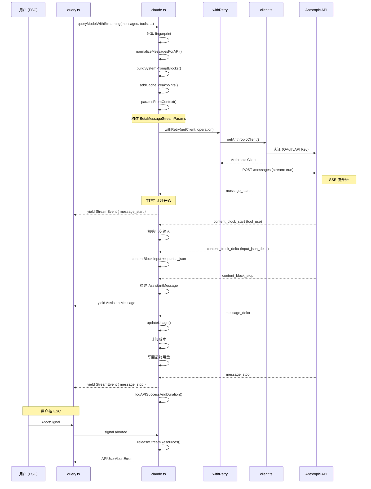
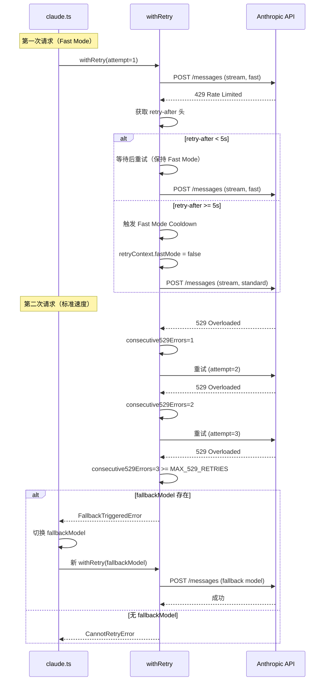
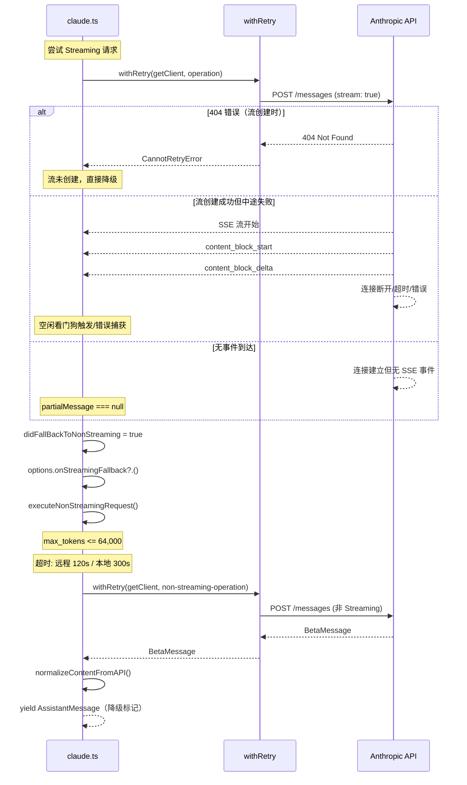
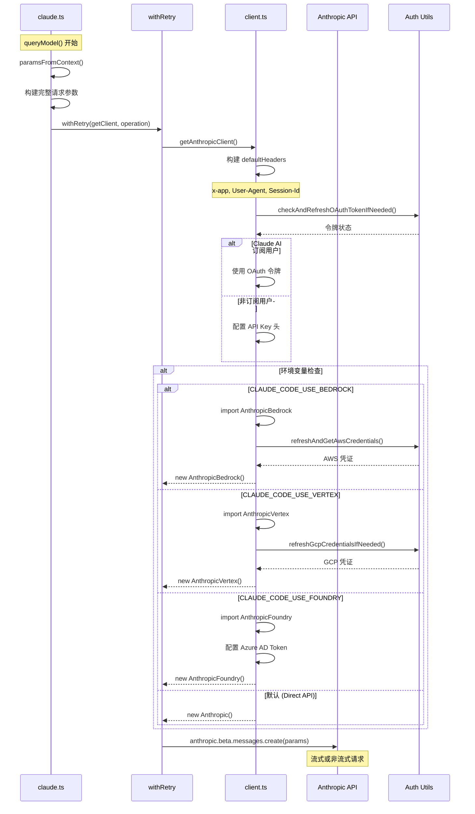

# Claude Code API 客户端深度解析

> 本文基于 `src/services/api/claude.ts`（3419 行）、`client.ts`、`withRetry.ts`、`errors.ts`、`logging.ts` 等源码文件，深入剖析 Claude Code 与 Anthropic API 通信的完整架构。

---

## 目录

1. [架构概览](#1-架构概览)
2. [客户端工厂模式：多 Provider 支持](#2-客户端工厂模式多-provider-支持)
3. [请求构造：从 Message 到 API 格式](#3-请求构造从-message-到-api-格式)
4. [Streaming 实现：SSE 事件解析](#4-streaming-实现sse-事件解析)
5. [重试逻辑与错误处理](#5-重试逻辑与错误处理)
6. [Token 计数与用量追踪](#6-token-计数与用量追踪)
7. [认证体系：API Key 与 OAuth](#7-认证体系api-key-与-oauth)
8. [请求取消：AbortController 集成](#8-请求取消abortcontroller-集成)
9. [响应处理：Stream 事件到结构化消息](#9-响应处理stream-事件到结构化消息)
10. [缓存策略：Prompt Caching 深度实现](#10-缓存策略prompt-caching-深度实现)
11. [限流与配额管理](#11-限流与配额管理)
12. [超时配置](#12-超时配置)
13. [完整的请求响应流程时序图](#13-完整的请求响应流程时序图)

---

## 1. 架构概览

Claude Code 的 API 客户端采用**分层架构**，从外到内依次为：

```
┌─────────────────────────────────────────────┐
│            query.ts（主逻辑层）                │
│   ┌────────────────────────────────────┐     │
│   │   queryModelWithStreaming /        │     │
│   │   queryModelWithoutStreaming       │     │
│   └────────────┬───────────────────────┘     │
│                │ yield*                    │
│                ▼                           │
│   ┌────────────────────────────────────┐     │
│   │     queryModel（内部核心 1017 行）    │     │
│   │    - 消息规范化                      │     │
│   │    - Beta 头构造                     │     │
│   │    - Streaming 事件循环              │     │
│   │    - 非 Streaming 降级              │     │
│   └────────────────────────────────────┘     │
│                │                         │
│                ▼                           │
│   ┌────────────────────────────────────┐     │
│   │  withRetry（重试生成器）               │     │
│   │  - 529 容错 / 模型降级               │     │
│   │  - 指数退避 / 持久重试               │     │
│   └────────────┬───────────────────────┘     │
│                │                         │
│                ▼                           │
│   ┌────────────────────────────────────┐     │
│   │  getAnthropicClient（客户端工厂）     │     │
│   │  - Direct API / Bedrock / Vertex   │     │
│   │  - Foundry / 自定义 Provider       │     │
│   └────────────────────────────────────┘     │
└─────────────────────────────────────────────┘
```

### 核心文件职责

| 文件 | 行数 | 职责 |
|------|------|------|
| `claude.ts` | 3419 | API 请求构造、Streaming 解析、降级逻辑、用量追踪 |
| `client.ts` | ~200 | 多 Provider 客户端工厂 (Direct/Bedrock/Vertex/Foundry) |
| `withRetry.ts` | ~600 | 统一重试机制、529 容错、模型降级、指数退避 |
| `errors.ts` | ~200 | 错误分类、错误消息生成 |
| `logging.ts` | ~300 | API 请求/成功/错误的 Telemetry 日志 |
| `errorUtils.ts` | - | 连接错误详情提取 |
| `emptyUsage.ts` | - | 空用量初始值定义 |

---

## 2. 客户端工厂模式：多 Provider 支持

### 2.1 getAnthropicClient

`client.ts` 中的 `getAnthropicClient()` 函数是客户端工厂，根据环境变量选择不同的 SDK：

```typescript
export async function getAnthropicClient({
  apiKey, maxRetries, model, fetchOverride, source
}: { ... }): Promise<Anthropic>
```

**多 Provider 路由逻辑**（`client.ts:153-230`）：

```typescript
// Bedrock 路由
if (isEnvTruthy(process.env.CLAUDE_CODE_USE_BEDROCK)) {
  const { AnthropicBedrock } = await import('@anthropic-ai/bedrock-sdk')
  return new AnthropicBedrock(bedrockArgs) as unknown as Anthropic
}

// Foundry (Azure) 路由
if (isEnvTruthy(process.env.CLAUDE_CODE_USE_FOUNDRY)) {
  const { AnthropicFoundry } = await import('@anthropic-ai/foundry-sdk')
  return new AnthropicFoundry(foundryArgs) as unknown as Anthropic
}

// Vertex AI 路由
if (isEnvTruthy(process.env.CLAUDE_CODE_USE_VERTEX)) {
  const { AnthropicVertex } = await import('@anthropic-ai/vertex-sdk')
  return new AnthropicVertex(vertexArgs) as unknown as Anthropic
}

// 默认：Direct API（First-party Anthropic）
return new Anthropic(ARGS)
```

### 2.2 公共客户端配置

所有 Provider 共享的配置（`client.ts:141-152`）：

```typescript
const ARGS = {
  defaultHeaders,
  maxRetries,
  timeout: parseInt(process.env.API_TIMEOUT_MS || String(600 * 1000), 10),
  dangerouslyAllowBrowser: true,
  fetchOptions: getProxyFetchOptions({ forAnthropicAPI: true }),
}
```

### 2.3 自定义请求头

每个请求携带丰富的标识性头信息（`client.ts:105-116`）：

```typescript
const defaultHeaders = {
  'x-app': 'cli',
  'User-Agent': getUserAgent(),
  'X-Claude-Code-Session-Id': getSessionId(),
  ...customHeaders,
  ...(containerId ? { 'x-claude-remote-container-id': containerId } : {}),
  ...(remoteSessionId ? { 'x-claude-remote-session-id': remoteSessionId } : {}),
}
```

### 2.4 VCR 包装

所有 API 调用都包裹了 VCR（Virtual Client Recorder）用于回放测试：

```typescript
yield* withStreamingVCR(messages, async function* () {
  yield* queryModel(messages, systemPrompt, thinkingConfig, tools, signal, options)
})
```

---

## 3. 请求构造：从 Message 到 API 格式

### 3.1 Options 类型定义

`Options` 类型（`claude.ts:676-707`）定义了每个 API 请求的完整参数集：

```typescript
export type Options = {
  getToolPermissionContext: () => Promise<ToolPermissionContext>
  model: string
  toolChoice?: BetaToolChoiceTool | BetaToolChoiceAuto
  isNonInteractiveSession: boolean
  extraToolSchemas?: BetaToolUnion[]
  maxOutputTokensOverride?: number
  fallbackModel?: string
  onStreamingFallback?: () => void
  querySource: QuerySource
  agents: AgentDefinition[]
  hasAppendSystemPrompt: boolean
  fetchOverride?: ClientOptions['fetch']
  enablePromptCaching?: boolean
  skipCacheWrite?: boolean
  temperatureOverride?: number
  effortValue?: EffortValue
  mcpTools: Tools
  queryTracking?: QueryChainTracking
  agentId?: AgentId
  outputFormat?: BetaJSONOutputFormat
  fastMode?: boolean
  advisorModel?: string
  taskBudget?: { total: number; remaining?: number }
}
```

### 3.2 Message 到 API 格式的转换链

`queryModel()` 内部（`claude.ts:1017`）执行以下转换步骤：

**Step 1: 消息规范化** (`claude.ts:1266`)

```typescript
let messagesForAPI = normalizeMessagesForAPI(messages, filteredTools)
```

这个函数将内部 `Message` 类型转换为 Anthropic SDK 的 `MessageParam`。规范化包括：
- 合并连续的 User/Assistant 消息
- 清理 Tool Result 块中的冗余内容
- 处理 ToolUse/Text 等内部格式

**Step 2: Tool Search 后处理** (`claude.ts:1283-1296`)

如果模型不支持 Tool Search，则剥离 `tool_reference` 和 `caller` 字段：

```typescript
if (!useToolSearch) {
  messagesForAPI = messagesForAPI.map(msg => {
    switch (msg.type) {
      case 'user': return stripToolReferenceBlocksFromUserMessage(msg)
      case 'assistant': return stripCallerFieldFromAssistantMessage(msg)
    }
  })
}
```

**Step 3: Tool Result 配对修复** (`claude.ts:1301`)

```typescript
messagesForAPI = ensureToolResultPairing(messagesForAPI)
```

用于修复远程恢复后可能出现的 `tool_use`/`tool_result` 不匹配问题。

**Step 4: 媒体项截断** (`claude.ts:1312-1315`)

```typescript
messagesForAPI = stripExcessMediaItems(messagesForAPI, API_MAX_MEDIA_PER_REQUEST)
```

API 限制每请求最多 100 个媒体项，超出时静默丢弃最旧的媒体。

**Step 5: 最终参数构建** (`claude.ts:1538-1728`, `paramsFromContext` 内部)

```typescript
const paramsFromContext = (retryContext: RetryContext) => {
  return {
    model: normalizeModelStringForAPI(options.model),
    messages: addCacheBreakpoints(messagesForAPI, enablePromptCaching, ...),
    system,
    tools: allTools,
    tool_choice: options.toolChoice,
    ...(useBetas && { betas: betasParams }),
    metadata: getAPIMetadata(),
    max_tokens: maxOutputTokens,
    thinking,
    ...(temperature !== undefined && { temperature }),
    ...extraBodyParams,
    ...(Object.keys(outputConfig).length > 0 && { output_config: outputConfig }),
    ...(speed !== undefined && { speed }),
  }
}
```

### 3.3 System Prompt 构建

`buildSystemPromptBlocks()`（`claude.ts:3213-3237`）将系统提示词分割为带缓存的块：

```typescript
export function buildSystemPromptBlocks(
  systemPrompt: SystemPrompt,
  enablePromptCaching: boolean,
  options?: { skipGlobalCacheForSystemPrompt?: boolean; querySource?: QuerySource }
): TextBlockParam[] {
  return splitSysPromptPrefix(systemPrompt, {
    skipGlobalCacheForSystemPrompt: options?.skipGlobalCacheForSystemPrompt,
  }).map(block => ({
    type: 'text',
    text: block.text,
    ...(enablePromptCaching && block.cacheScope !== null && {
      cache_control: getCacheControl({
        scope: block.cacheScope,
        querySource: options?.querySource,
      }),
    }),
  }))
}
```

系统提示词前缀（`claude.ts:1358-1369`）包括：

```typescript
systemPrompt = asSystemPrompt([
  getAttributionHeader(fingerprint),
  getCLISyspromptPrefix({...}),
  ...systemPrompt,
  ...(advisorModel ? [ADVISOR_TOOL_INSTRUCTIONS] : []),
  ...(injectChromeHere ? [CHROME_TOOL_SEARCH_INSTRUCTIONS] : []),
].filter(Boolean))
```

---

## 4. Streaming 实现：SSE 事件解析

### 4.1 Streaming 入口

两种 Streaming 模式对外暴露：

```typescript
// claude.ts:709-750
export async function queryModelWithoutStreaming({...}): Promise<AssistantMessage>

// claude.ts:752-780
export async function* queryModelWithStreaming({...}):
  AsyncGenerator<StreamEvent | AssistantMessage | SystemAPIErrorMessage, void>
```

两者最终都调用内部的 `queryModel()` 生成器（`claude.ts:1017`）。

### 4.2 使用原始 Stream 而非 BetaMessageStream

一个重要的实现决策（`claude.ts:1818-1831`）：

```typescript
// 使用原始 Stream 避免 O(n²) 的 partial JSON 解析
const result = await anthropic.beta.messages
  .create(
    { ...params, stream: true },
    {
      signal,
      ...(clientRequestId && {
        headers: { [CLIENT_REQUEST_ID_HEADER]: clientRequestId },
      }),
    },
  )
  .withResponse()
```

使用 `.withResponse()` 可以同时获取 request_id 和原始 Response 对象，这对后续的流控制（超时、取消、配额提取）至关重要。

### 4.3 Streaming 空闲超时看门狗

为了检测挂起的连接，实现了两级超时机制（`claude.ts:1868-1928`）：

```typescript
const STREAM_IDLE_TIMEOUT_MS = parseInt(
  process.env.CLAUDE_STREAM_IDLE_TIMEOUT_MS || '', 10
) || 90_000  // 默认 90 秒
const STREAM_IDLE_WARNING_MS = STREAM_IDLE_TIMEOUT_MS / 2  // 45 秒警告

resetStreamIdleTimer()  // 每收到一个 chunk 时重置
```

- **警告级别**：45 秒无数据时触发日志警告
- **杀死级别**：90 秒无数据时通过 `releaseStreamResources()` 断开连接并触发非 Streaming 降级

### 4.4 Streaming 事件循环

核心事件循环（`claude.ts:1940-2304`）：

```typescript
for await (const part of stream) {
  resetStreamIdleTimer()

  // 检测流停滞（30 秒以上无事件）
  if (lastEventTime !== null) {
    const timeSinceLastEvent = now - lastEventTime
    if (timeSinceLastEvent > STALL_THRESHOLD_MS) {  // 30 秒
      stallCount++
      totalStallTime += timeSinceLastEvent
    }
  }
  lastEventTime = now

  switch (part.type) {
    case 'message_start':
    case 'content_block_start':
    case 'content_block_delta':
    case 'content_block_stop':
    case 'message_delta':
    case 'message_stop':
  }
}
```

### 4.5 SSE 事件详细解析

**message_start** (`claude.ts:1980-1993`)：
- 记录首 Token 时间（TTFT）
- 初始化用量数据
- 捕获 `research` 字段（仅 Ant 内部）

**content_block_start** (`claude.ts:1995-2051`)：
- **tool_use**: 初始化空输入字符串 `input: ''`
- **server_tool_use**: 初始化空输入，检测 advisor 调用
- **text**: 初始化空文本 `text: ''`
- **thinking**: 初始化空思考和签名
- **advisor_tool_result**: 标记 advisor 调用结束

**content_block_delta** (`claude.ts:2053-2169`)：
- **text_delta**: 累积文本 `contentBlock.text += delta.text`
- **input_json_delta**: 累积工具调用 JSON `contentBlock.input += delta.partial_json`
- **thinking_delta**: 累积思考过程 `contentBlock.thinking += delta.thinking`
- **signature_delta**: 设置思考签名
- **citations_delta**: 占位，暂不处理
- **connector_text_delta**: 连接器文本增量

**content_block_stop** (`claude.ts:2171-2211`)：
- 将累积的内容块封装为 `AssistantMessage`
- 分配 UUID、时间戳
- yield 发送给消费者

**message_delta** (`claude.ts:2213-2293`)：
- 更新最终用量数据（`updateUsage()`）
- 记录 `stop_reason`
- 处理 `max_tokens` 和 `model_context_window_exceeded` 等截断情况
- 计算成本并累加到会话总成本
- 检查是否有拒绝响应

### 4.6 Streaming 停滞检测

`claude.ts:1935-1967` 监控 30 秒内的无事件间隙，并记录到 Telemetry：

```typescript
const STALL_THRESHOLD_MS = 30_000
if (timeSinceLastEvent > STALL_THRESHOLD_MS) {
  logEvent('tengu_streaming_stall', {
    stall_duration_ms: timeSinceLastEvent,
    stall_count: stallCount,
    event_type: part.type,
    model: options.model,
    request_id: streamRequestId,
  })
}
```

### 4.7 非 Streaming 降级

当 Streaming 失败时（超时、空流等），自动降级到非 Streaming 模式（`claude.ts:2464-2569`）：

```typescript
const result = yield* executeNonStreamingRequest(
  { model: options.model, source: options.querySource },
  {
    model: options.model,
    fallbackModel: options.fallbackModel,
    thinkingConfig,
    signal,
    initialConsecutive529Errors: is529Error(streamingError) ? 1 : 0,
  },
  paramsFromContext,
  // ...
)
```

这一降级可以通过 `CLAUDE_CODE_DISABLE_NONSTREAMING_FALLBACK` 环境变量禁用。

非 Streaming 请求的超时（`claude.ts:800-811`）：

```typescript
function getNonstreamingFallbackTimeoutMs(): number {
  const override = parseInt(process.env.API_TIMEOUT_MS || '', 10)
  if (override) return override
  return isEnvTruthy(process.env.CLAUDE_CODE_REMOTE) ? 120_000 : 300_000
}
```

非 Streaming 时，max_tokens 被限制在 `MAX_NON_STREAMING_TOKENS = 64_000`，同时调整 thinking 预算：

```typescript
export function adjustParamsForNonStreaming<T extends {
  max_tokens: number
  thinking?: BetaMessageStreamParams['thinking']
}>(params: T, maxTokensCap: number): T {
  const cappedMaxTokens = Math.min(params.max_tokens, maxTokensCap)
  const adjustedParams = { ...params }
  if (adjustedParams.thinking?.type === 'enabled' && adjustedParams.thinking.budget_tokens) {
    adjustedParams.thinking = {
      ...adjustedParams.thinking,
      budget_tokens: Math.min(adjustedParams.thinking.budget_tokens, cappedMaxTokens - 1),
    }
  }
  return { ...adjustedParams, max_tokens: cappedMaxTokens }
}
```

---

## 5. 重试逻辑与错误处理

### 5.1 withRetry 生成器模式

`withRetry.ts` 实现了一个**生成器模式的重试系统**（`withRetry.ts:170-517`）：

```typescript
export async function* withRetry<T>(
  getClient: () => Promise<Anthropic>,
  operation: (client: Anthropic, attempt: number, context: RetryContext) => Promise<T>,
  options: RetryOptions,
): AsyncGenerator<SystemAPIErrorMessage, T>
```

返回类型 `AsyncGenerator<SystemAPIErrorMessage, T>` 意味着：
- **yield（产出）**: 在重试等待期间发出 `SystemAPIErrorMessage`，让 UI 层显示重试消息
- **return（最终值）**: 成功时返回操作结果

### 5.2 RetryContext

```typescript
export interface RetryContext {
  maxTokensOverride?: number  // 上下文溢出时自动调整
  model: string
  thinkingConfig: ThinkingConfig
  fastMode?: boolean
}
```

### 5.3 自定义错误类型

```typescript
// 不可再重试的错误（已耗尽所有尝试）
export class CannotRetryError extends Error {
  constructor(
    public readonly originalError: unknown,
    public readonly retryContext: RetryContext,
  ) { ... }
}

// 模型降级信号（3 次 529 后触发）
export class FallbackTriggeredError extends Error {
  constructor(
    public readonly originalModel: string,
    public readonly fallbackModel: string,
  ) { ... }
}
```

### 5.4 529 重试与模型降级

对 Opus 模型的 529 有特殊处理（`withRetry.ts:326-365`）：

```typescript
if (is529Error(error) && (
  process.env.FALLBACK_FOR_ALL_PRIMARY_MODELS || isNonCustomOpusModel(options.model)
)) {
  consecutive529Errors++
  if (consecutive529Errors >= MAX_529_RETRIES) {  // MAX_529_RETRIES = 3
    if (options.fallbackModel) {
      throw new FallbackTriggeredError(options.model, options.fallbackModel)
    }
    throw new CannotRetryError(new Error(REPEATED_529_ERROR_MESSAGE), retryContext)
  }
}
```

背景请求（用户不可见）的 529 处理（`withRetry.ts:318-324`）：

```typescript
if (is529Error(error) && !shouldRetry529(options.querySource)) {
  throw new CannotRetryError(error, retryContext)
}
```

`FOREGROUND_529_RETRY_SOURCES` 定义了用户正在等待结果的查询源。

### 5.5 客户端刷新策略

特定错误会触发客户端刷新（`withRetry.ts:232-251`）：

```typescript
if (client === null ||
    (lastError instanceof APIError && lastError.status === 401) ||
    isOAuthTokenRevokedError(lastError) ||
    isBedrockAuthError(lastError) ||
    isVertexAuthError(lastError) ||
    isStaleConnection  // ECONNRESET/EPIPE
) {
  if (lastError instanceof APIError && lastError.status === 401) {
    await handleOAuth401Error(failedAccessToken)
  }
  client = await getClient()
}
```

### 5.6 指数退避算法

```typescript
export function getRetryDelay(
  attempt: number,
  retryAfterHeader?: string | null,
  maxDelayMs = 32000,
): number {
  if (retryAfterHeader) {
    const seconds = parseInt(retryAfterHeader, 10)
    if (!isNaN(seconds)) return seconds * 1000
  }
  const baseDelay = Math.min(BASE_DELAY_MS * Math.pow(2, attempt - 1), maxDelayMs)
  const jitter = Math.random() * 0.25 * baseDelay
  return baseDelay + jitter
}
```

`BASE_DELAY_MS = 500`，退避序列：500ms → 1000ms → 2000ms → 4000ms → ... → 封顶 32s

### 5.7 Fast Mode 限流处理

Fast Mode 在遭遇限流时有特殊处理策略（`withRetry.ts:267-305`）：

```typescript
if (wasFastModeActive && !isPersistentRetryEnabled() &&
    error instanceof APIError && (error.status === 429 || is529Error(error))) {
  const retryAfterMs = getRetryAfterMs(error)
  if (retryAfterMs !== null && retryAfterMs < SHORT_RETRY_THRESHOLD_MS) {
    // 短等待：保持 Fast Mode 继续重试（保护缓存）
    await sleep(retryAfterMs, options.signal, { abortError })
    continue
  }
  // 长等待：进入冷却，切换为标准速度
  triggerFastModeCooldown(Date.now() + cooldownMs, cooldownReason)
  retryContext.fastMode = false
  continue
}
```

### 5.8 持久重试模式

通过 `CLAUDE_CODE_UNATTENDED_RETRY` 启用（`withRetry.ts:91-104`）：

```typescript
const PERSISTENT_MAX_BACKOFF_MS = 5 * 60 * 1000   // 5 分钟
const PERSISTENT_RESET_CAP_MS = 6 * 60 * 60 * 1000  // 6 小时
const HEARTBEAT_INTERVAL_MS = 30_000                 // 30 秒心跳
```

将长时间等待切成 30 秒块，每块 yield `SystemAPIErrorMessage` 保持会话活动。

### 5.9 上下文溢出自动调整

当 API 返回 `input length and max_tokens exceed context limit` 错误时（`withRetry.ts:388-427`）：

```typescript
if (error instanceof APIError) {
  const overflowData = parseMaxTokensContextOverflowError(error)
  if (overflowData) {
    const { inputTokens, contextLimit } = overflowData
    const safetyBuffer = 1000
    const availableContext = Math.max(0, contextLimit - inputTokens - safetyBuffer)
    if (availableContext < FLOOR_OUTPUT_TOKENS) throw error
    retryContext.maxTokensOverride = Math.max(FLOOR_OUTPUT_TOKENS, availableContext, minRequired)
    continue  // 不等待，立即重试
  }
}
```

---

## 6. Token 计数与用量追踪

### 6.1 updateUsage（增量更新）

`updateUsage()`（`claude.ts:2924-2987`）处理 Streaming API 的增量用量更新：

```typescript
export function updateUsage(
  usage: Readonly<NonNullableUsage>,
  partUsage: BetaMessageDeltaUsage | undefined,
): NonNullableUsage {
  return {
    input_tokens:
      partUsage.input_tokens !== null && partUsage.input_tokens > 0
        ? partUsage.input_tokens : usage.input_tokens,
    cache_creation_input_tokens:
      partUsage.cache_creation_input_tokens !== null &&
      partUsage.cache_creation_input_tokens > 0
        ? partUsage.cache_creation_input_tokens : usage.cache_creation_input_tokens,
    // 所有标记为 > 0 才更新 —— 避免 message_delta 的清零
    ...
  }
}
```

**关键语义**：Anthropic 的 Streaming API 提供的是累计用量而非增量。`message_start` 设置初始值，`message_delta` 提供更新。由于 `message_delta` 可能发送显式的 0 值，代码只用正数更新。

### 6.2 accumulateUsage（跨轮累积）

```typescript
export function accumulateUsage(
  totalUsage: Readonly<NonNullableUsage>,
  messageUsage: Readonly<NonNullableUsage>,
): NonNullableUsage {
  return {
    input_tokens: totalUsage.input_tokens + messageUsage.input_tokens,
    cache_creation_input_tokens: /* 加法累积 */,
    cache_read_input_tokens: /* 加法累积 */,
    output_tokens: /* 加法累积 */,
    // 服务层、地理位置等使用最新值
    service_tier: messageUsage.service_tier,
    inference_geo: messageUsage.inference_geo,
    iterations: messageUsage.iterations,
  }
}
```

### 6.3 成本计算

```typescript
// claude.ts:2251-2256
const costUSDForPart = calculateUSDCost(resolvedModel, usage)
costUSD += addToTotalSessionCost(costUSDForPart, usage, options.model)
```

`calculateUSDCost` 使用模型名称和用量数据实时计算 USD 成本，并累加到会话总成本中。

---

## 7. 认证体系：API Key 与 OAuth

### 7.1 认证流程

```typescript
// client.ts:131-133
await checkAndRefreshOAuthTokenIfNeeded()
if (!isClaudeAISubscriber()) {
  await configureApiKeyHeaders(defaultHeaders, getIsNonInteractiveSession())
}
```

优先使用 OAuth Token；非订阅用户使用 API Key。

### 7.2 API Key 验证

`verifyApiKey()`（`claude.ts:530-586`）使用最小的 API 调用来验证 Key：

```typescript
export async function verifyApiKey(
  apiKey: string,
  isNonInteractiveSession: boolean,
): Promise<boolean> {
  if (isNonInteractiveSession) return true

  const model = getSmallFastModel()
  return await withRetry(() => getAnthropicClient({ apiKey, maxRetries: 3, model, ... }),
    async anthropic => {
      await anthropic.beta.messages.create({
        model, max_tokens: 1,
        messages: [{ role: 'user', content: 'test' }],
        ...
      })
      return true
    }, { maxRetries: 2, model, thinkingConfig: { type: 'disabled' } }
  ).catch(error => {
    if (error.message.includes('authentication_error')) return false
    throw error
  })
}
```

### 7.3 多 Provider 认证

| Provider | 认证方式 |
|----------|----------|
| Direct API | `ANTHROPIC_API_KEY` 或 OAuth Token |
| Bedrock | AWS 凭证（`refreshAndGetAwsCredentials`），支持 `AWS_BEARER_TOKEN_BEDROCK` |
| Vertex | GCP 凭证（`google-auth-library`） |
| Foundry | `ANTHROPIC_FOUNDRY_API_KEY` 或 Azure AD Token |

---

## 8. 请求取消：AbortController 集成

### 8.1 Signal 传递

`queryModel()` 接收 `AbortSignal` 参数，沿整个调用链传递到 SDK：

```typescript
const result = await anthropic.beta.messages
  .create(
    { ...params, stream: true },
    {
      signal,  // 外部传入的 AbortSignal
      ...(clientRequestId && {
        headers: { [CLIENT_REQUEST_ID_HEADER]: clientRequestId },
      }),
    },
  )
  .withResponse()
```

### 8.2 用户中止处理

ESC 键取消在 `queryModel()` 中捕获（`claude.ts:2434-2461`）：

```typescript
if (streamingError instanceof APIUserAbortError) {
  if (signal.aborted) {
    // 用户主动取消
    throw streamingError
  } else {
    // SDK 内部超时
    throw new APIConnectionTimeoutError({ message: 'Request timed out' })
  }
}
```

### 8.3 Stream 资源释放

```typescript
function releaseStreamResources(): void {
  cleanupStream(stream)  // 调用 stream.controller.abort()
  stream = undefined
  if (streamResponse) {
    streamResponse.body?.cancel().catch(() => {})
    streamResponse = undefined
  }
}
```

`releaseStreamResources()` 在 `finally` 块中执行（`claude.ts:2808-2831`），确保无论何种退出路径都会释放原生 socket 缓冲区，防止内存泄露。

---

## 9. 响应处理：Stream 事件到结构化消息

### 9.1 助手消息构建

在 `content_block_stop`（`claude.ts:2192-2211`）中，累积的内容块被封装为 `AssistantMessage`：

```typescript
const m: AssistantMessage = {
  message: {
    ...partialMessage,
    content: normalizeContentFromAPI([contentBlock], tools, options.agentId),
  },
  requestId: streamRequestId ?? undefined,
  type: 'assistant',
  uuid: randomUUID(),
  timestamp: new Date().toISOString(),
  ...(advisorModel && { advisorModel }),
}
```

### 9.2 最终用量回写

在 `message_delta`（`claude.ts:2229-2248`）中，由于消息在 `content_block_stop` 时已 yield，需要用**直接属性突变**而非对象替换来写入最终数据：

```typescript
if (lastMsg) {
  lastMsg.message.usage = usage
  lastMsg.message.stop_reason = stopReason
}
```

这样保护转录写入队列中的引用不被断开。

### 9.3 截断处理

当 `stop_reason === 'max_tokens'` 时（`claude.ts:2266-2276`）：

```typescript
yield createAssistantAPIErrorMessage({
  content: `${API_ERROR_MESSAGE_PREFIX}: Claude's response exceeded the ...`,
  apiError: 'max_output_tokens',
  error: 'max_output_tokens',
})
```

### 9.4 上下文窗口超限

`stop_reason === 'model_context_window_exceeded'` 时通过和 `max_output_tokens` 相同的路径处理，触发 `query.ts` 中的上下文压缩。

---

## 10. 缓存策略：Prompt Caching 深度实现

### 10.1 缓存启用开关

`getPromptCachingEnabled()`（`claude.ts:333-356`）支持按模型禁用：

```typescript
export function getPromptCachingEnabled(model: string): boolean {
  if (isEnvTruthy(process.env.DISABLE_PROMPT_CACHING)) return false
  if (isEnvTruthy(process.env.DISABLE_PROMPT_CACHING_HAIKU) && model === smallFastModel) return false
  // ... 同理 for Sonnet, Opus
  return true
}
```

### 10.2 cache_control 生成

`getCacheControl()`（`claude.ts:358-374`）：

```typescript
export function getCacheControl({ scope, querySource }): {
  type: 'ephemeral'
  ttl?: '1h'
  scope?: CacheScope
} {
  return {
    type: 'ephemeral',
    ...(should1hCacheTTL(querySource) && { ttl: '1h' }),
    ...(scope === 'global' && { scope }),
  }
}
```

### 10.3 1 小时 TTL 条件

`should1hCacheTTL()`（`claude.ts:393-434`）决定是否使用 1 小时缓存 TTL，涉及多层守卫：

```typescript
function should1hCacheTTL(querySource?: QuerySource): boolean {
  // 3P Bedrock 环境变量选择加入
  if (getAPIProvider() === 'bedrock' && isEnvTruthy(process.env.ENABLE_PROMPT_CACHING_1H_BEDROCK)) return true

  // 用户资格锁定（会话中不改变）
  let userEligible = getPromptCache1hEligible()
  if (userEligible === null) {
    userEligible = process.env.USER_TYPE === 'ant' ||
      (isClaudeAISubscriber() && !currentLimits.isUsingOverage)
    setPromptCache1hEligible(userEligible)
  }
  if (!userEligible) return false

  // GrowthBook 允许列表
  let allowlist = getPromptCache1hAllowlist()
  if (allowlist === null) {
    const config = getFeatureValue_CACHED_MAY_BE_STALE('tengu_prompt_cache_1h_config', {})
    allowlist = config.allowlist ?? []
    setPromptCache1hAllowlist(allowlist)
  }
  return querySource !== undefined &&
    allowlist.some(pattern =>
      pattern.endsWith('*') ? querySource.startsWith(pattern.slice(0, -1)) : querySource === pattern
    )
}
```

**关键设计**：通过 `getPromptCache1hEligible` 和 `getPromptCache1hAllowlist` 将资格和允许列表锁定在会话中，防止中途切换导致服务端缓存键变化（每次切换约 20K token 损失）。

### 10.4 缓存断点注入

`addCacheBreakpoints()`（`claude.ts:3063-3211`）在消息数组中插入缓存标记：

**核心规则**：每个请求只允许一个消息级别的 `cache_control` 标记，放在最后一条消息上：

```typescript
const markerIndex = skipCacheWrite ? messages.length - 2 : messages.length - 1
```

### 10.5 缓存编辑（Cached Microcompact）

当 `CACHED_MICROCOMPACT` 启用时，通过 `cache_edits` 块发送删除引用：

```typescript
const consumedCacheEdits = cachedMCEnabled ? consumePendingCacheEdits() : null
const consumedPinnedEdits = cachedMCEnabled ? getPinnedCacheEdits() : []
```

缓存编辑块使用 `deduplicateEdits()` 去重，并通过 `pinCacheEdits()` 固定在消息数组中的位置。

### 10.6 缓存破断检测

当 `PROMPT_CACHE_BREAK_DETECTION` 启用时（`claude.ts:1460-1486`），记录可能影响服务端缓存键的所有状态，请求完成后通过 `checkResponseForCacheBreak()` 检测 `cache_read_input_tokens` 是否为 0。

---

## 11. 限流与配额管理

### 11.1 配额状态提取

响应完成后，从响应头提取配额状态（`claude.ts:2394-2402`）：

```typescript
if (resp) {
  extractQuotaStatusFromHeaders(resp.headers)
  responseHeaders = resp.headers
}
```

错误时从错误对象提取（`claude.ts:2763-2766`）：

```typescript
if (error instanceof APIError) {
  extractQuotaStatusFromError(error)
}
```

### 11.2 Fast Mode 冷却

Fast Mode 遭遇限流时触发冷却（`withRetry.ts:293-304`）：

```typescript
const cooldownMs = Math.max(retryAfterMs ?? DEFAULT_FAST_MODE_FALLBACK_HOLD_MS, MIN_COOLDOWN_MS)
triggerFastModeCooldown(Date.now() + cooldownMs, cooldownReason)
```

---

## 12. 超时配置

### 12.1 SDK 超时

```typescript
timeout: parseInt(process.env.API_TIMEOUT_MS || String(600 * 1000), 10)
```

默认 10 分钟（600 秒），通过 `API_TIMEOUT_MS` 环境变量覆盖。

### 12.2 Streaming 空闲超时

由 `CLAUDE_ENABLE_STREAM_WATCHDOG` 和 `CLAUDE_STREAM_IDLE_TIMEOUT_MS` 控制（`claude.ts:1874-1878`）：

默认 90 秒，分两级（45 秒警告，90 秒断开）。

### 12.3 非 Streaming 降级超时

```typescript
function getNonstreamingFallbackTimeoutMs(): number {
  const override = parseInt(process.env.API_TIMEOUT_MS || '', 10)
  if (override) return override
  return isEnvTruthy(process.env.CLAUDE_CODE_REMOTE) ? 120_000 : 300_000
}
```

### 12.4 Max Output Tokens 控制

通过 `CLAUDE_CODE_MAX_OUTPUT_TOKENS` 环境变量覆盖默认值（`claude.ts:3399-3419`）：

```typescript
export function getMaxOutputTokensForModel(model: string): number {
  const maxOutputTokens = getModelMaxOutputTokens(model)
  const defaultTokens = isMaxTokensCapEnabled()
    ? Math.min(maxOutputTokens.default, CAPPED_DEFAULT_MAX_TOKENS)
    : maxOutputTokens.default
  return validateBoundedIntEnvVar(
    'CLAUDE_CODE_MAX_OUTPUT_TOKENS',
    process.env.CLAUDE_CODE_MAX_OUTPUT_TOKENS,
    defaultTokens,
    maxOutputTokens.upperLimit,
  ).effective
}
```

---

## 13. 完整的请求响应流程时序图

### 13.1 典型 Streaming 请求流程



### 13.2 重试与模型降级流程



### 13.3 Streaming 降级到非 Streaming



### 13.4 客户端创建与认证流程



---

## 核心设计模式总结

| 模式 | 位置 | 说明 |
|------|------|------|
| **AsyncGenerator** | `queryModel()`, `withRetry()` | 用 yield 实现中间状态推送，return 实现最终值 |
| **工厂函数** | `getAnthropicClient()` | 根据环境变量创建不同 Provider 的 SDK 实例 |
| **策略模式** | `getRetryDelay()` | 指数退避 + Retry-After 头优先策略 |
| **观察者模式** | `logAPIQuery()`/`logAPISuccessAndDuration()` | 通过 Telemetry 系统广播请求状态 |
| **模板方法** | `executeNonStreamingRequest()` | 统一非流式请求的创建、重试和结果提取 |
| **守卫模式** | `should1hCacheTTL()` | 多重条件守卫链决定缓存 TTL |
| **Latch 模式** | Beta 头粘滞 | 会话中一旦启用不再改变，保护缓存键 |
| **看门狗模式** | Stream idle watchdog | setTimeout 主动检测挂起连接 |
| **直接突变** | message_delta 回写 | 用属性突变而非对象替换保护引用链 |

---

> **相关文件**: `src/services/api/claude.ts` (3419行), `src/services/api/client.ts`, `src/services/api/withRetry.ts`, `src/services/api/errors.ts`, `src/services/api/logging.ts`, `src/services/api/emptyUsage.ts`, `src/services/errorUtils.ts`, `src/services/claudeAiLimits.ts`
