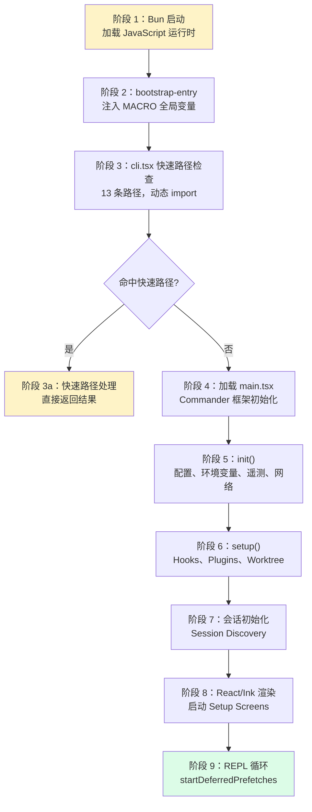
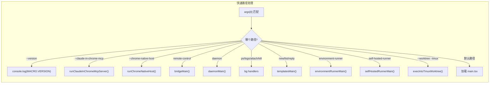
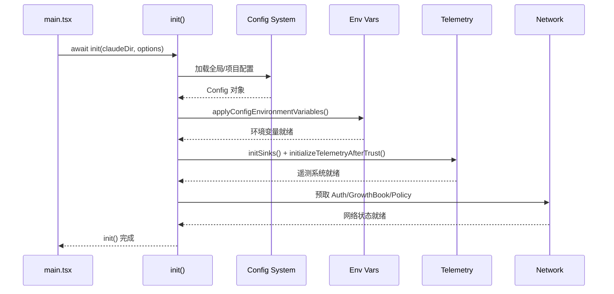
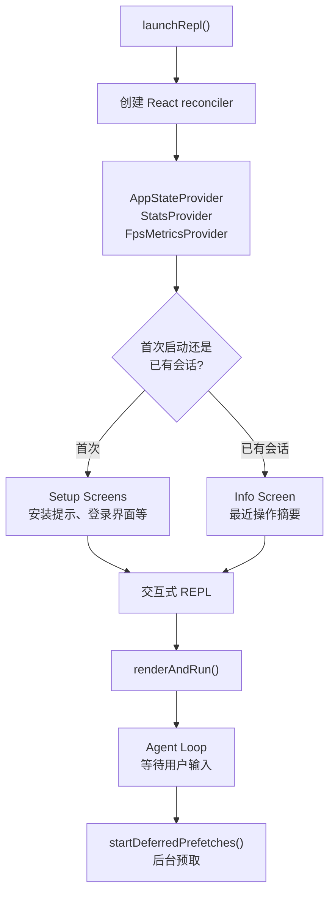
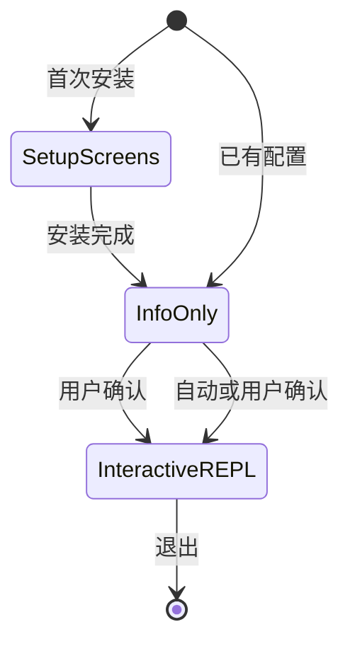

# 启动流程与 CLI 入口

> 从 `bun run dev` 到交互式 REPL，Claude Code 经历了 9 个阶段的启动序列。本文深入拆解每一阶段的代码逻辑、设计意图和性能特征。

## 9 阶段启动序列

从用户执行 `claude` 命令到进入交互式 REPL，Claude Code 的执行路径可以分为 9 个明确的阶段：



### 各阶段耗时估算

| 阶段 | 估算耗时 | 累计 | 说明 |
| --- | --- | --- | --- |
| Bun 运行时加载 | ~10ms | 10ms | Bun 是极速 JavaScript 运行时 |
| bootstrap-entry | <1ms | 10ms | 仅 5 行代码 |
| cli.tsx 快速路径检查 | ~5ms | 15ms | 动态 import 开销 |
| main.tsx 模块评估 | ~50ms | 65ms | 大量 import，主要瓶颈 |
| init() | ~30ms | 95ms | 配置、遥测、网络 |
| setup() | ~20ms | 115ms | Hooks、Plugins |
| 会话初始化 | ~10ms | 125ms | Session Discovery |
| React/Ink 渲染 | ~5ms | 130ms | 首次渲染 |
| REPL 循环 | ~5ms | 135ms | 用户交互准备完毕 |

**总计：约 135ms cold start**，其中 `main.tsx` 的模块评估是最主要的性能瓶颈。

## 阶段 2：bootstrap-entry.ts —— MACRO 全局变量注入

```typescript
// src/bootstrap-entry.ts —— 整个程序的终极入口（5 行）
import { ensureBootstrapMacro } from './bootstrapMacro'
ensureBootstrapMacro()
await import('./entrypoints/cli.tsx')
```

`ensureBootstrapMacro()` 的核心实现在 `bootstrapMacro.ts` 中：

```typescript
// src/bootstrapMacro.ts
export function ensureBootstrapMacro(): void {
  if (!('MACRO' in globalThis)) {
    ;(globalThis as typeof globalThis & { MACRO: MacroConfig }).MACRO = defaultMacro
  }
}
```

MACRO 对象包含以下字段，它们在构建时被 Bun bundle 内联（inline）到二进制中：

| 字段 | 来源 | 用途 |
| --- | --- | --- |
| `VERSION` | `package.json` 版本号 | 构建时内联到二进制 |
| `BUILD_TIME` | 构建时间戳 | 性能分析和调试 |
| `PACKAGE_URL` | npm 包名 | 更新检测 |
| `VERSION_CHANGELOG` | 变更日志 URL | CLI 更新通知 |
| `ISSUES_EXPLAINER` | GitHub Issues 链接 | 错误提示 |
| `FEEDBACK_CHANNEL` | 反馈渠道名 | 用户体验 |

设计意图：MACRO 在程序中通过 `MACRO.VERSION` 而非 `require('../package.json').version` 访问，这样 Bun 可以在 build 阶段将版本号直接内联为字符串常量，避免运行时读取 JSON 文件的开销。同时，MACRO 中的空字符串字段（如 `BUILD_TIME`、`VERSION_CHANGELOG`）也会被 DCE 优化为更紧凑的常量。

## 阶段 3：cli.tsx —— 13 条快速路径分发器

302 行的 `entrypoints/cli.tsx` 是 Claude Code 性能优化的核心。它的架构可以用一句话概括：**用一个 `async main()` 函数内的早期 return 链实现快速路径分发**。

```typescript
// src/entrypoints/cli.tsx —— 架构骨架
async function main(): Promise<void> {
  const args = process.argv.slice(2);

  // 快速路径 1: --version / -v —— 零模块加载
  if (args.length === 1 && (args[0] === '--version' || args[0] === '-v' || args[0] === '-V')) {
    console.log(`${MACRO.VERSION} (Claude Code)`);
    return;
  }

  // 启动性能记录器
  const { profileCheckpoint } = await import('../utils/startupProfiler.js');
  profileCheckpoint('cli_entry');

  // 快速路径 2~13: 各有独立的条件判断
  if (feature('DUMP_SYSTEM_PROMPT') && args[0] === '--dump-system-prompt') { ... }
  if (process.argv[2] === '--claude-in-chrome-mcp') { ... }
  else if (process.argv[2] === '--chrome-native-host') { ... }
  else if (feature('CHICAGO_MCP') && process.argv[2] === '--computer-use-mcp') { ... }
  if (feature('DAEMON') && args[0] === '--daemon-worker') { ... }
  if (feature('BRIDGE_MODE') && matchesRemoteArgs) { ... }
  if (feature('DAEMON') && args[0] === 'daemon') { ... }
  if (feature('BG_SESSIONS') && matchesBgArgs) { ... }
  if (feature('TEMPLATES') && matchesTemplateArgs) { ... }
  if (feature('BYOC_ENVIRONMENT_RUNNER') && ...) { ... }
  if (feature('SELF_HOSTED_RUNNER') && ...) { ... }
  if (hasTmuxFlag && worktree) { ... }

  // 未命中任何快速路径 -> 加载完整 CLI
  const { main: cliMain } = await import('../main.js');
  await cliMain();
}
```

### 快速路径的关键设计

1. **动态 import**：每条路径使用 `await import()` 按需加载模块，不命中就不加载
2. **feature() 守卫**：`feature()` 在编译时替换为布尔值，未启用的路径在 bundle 中被 DCE 消除
3. **并行启动优化**：`startMdmRawRead()` 和 `startKeychainPrefetch()` 在导入时即启动异步任务，与后续模块评估并行



## 阶段 4：main.tsx —— Commander 设置

当未命中快速路径时，cli.tsx 动态 import `main.tsx`（4690 行）。这个文件的模块评估本身就是启动过程中最大的性能瓶颈。

### Commander 框架初始化

`main.tsx` 使用 `@commander-js/extra-typings`（Commander 的类型安全版本）作为 CLI 框架：

```typescript
// main.tsx 的 Commander 设置（简化）
import { Command as CommanderCommand, InvalidArgumentError, Option } from '@commander-js/extra-typings';

const program = new CommanderCommand()
  .name('claude')
  .version(MACRO.VERSION)
  .description('An AI agent for your command line')

// 注册所有子命令
program
  .command('config')
  .description('View and modify Claude Code configuration')
  .action(async () => { ... })

program
  .command('mcp')
  .description('Manage MCP servers')
  .action(async () => { ... })

// 定义主 action handler（核心）
program.action(async (args, options) => {
  // 这是整个应用的真正入口
  await handleMainAction(args, options);
});
```

Commander 的 action handler 是所有非快速路径流量的统一入口。在这个 handler 内部，调用链如下：

```typescript
async function handleMainAction(args, options) {
  // 阶段 5: init()
  await init(claudeDir, options);
  
  // 阶段 6: setup()
  await setup();
  
  // 阶段 7-9: 会话初始化 + Ink 渲染 + REPL 循环
  await launchRepl(...);
}
```

### main.tsx 的 4600+ 行拆解

`main.tsx` 的庞大体积并非因为它负载过重，而是因为**大量的 import 语句和类型定义**：

| 代码类别 | 估算行数 |
| --- | --- |
| import 语句 | ~150 行 |
| 类型定义和接口 | ~300 行 |
| Commander program 设置 | ~200 行 |
| action handler 主体 | ~500 行 |
| `init()` 内联逻辑 | ~800 行 |
| `setup()` 内联逻辑 | ~600 行 |
| 会话选择逻辑 | ~500 行 |
| 启动提示和错误处理 | ~600 行 |
| 工具函数（内联） | ~400 行 |
| 其他 | ~600 行 |

由于它是从 source map 恢复的，部分行号可能包含被压缩过的代码展开行。

## 阶段 5：init() —— 配置、环境变量、遥测、网络

`init()` 是首个有复杂逻辑的阶段，包含四个子阶段：



```typescript
// entrypoints/init.ts 的逻辑（伪代码）
export async function init(claudeDir: string, options: CLIOptions) {
  // 1. 配置加载
  enableConfigs();
  loadGlobalConfig();
  loadProjectConfig();
  
  // 2. 环境变量
  applyConfigEnvironmentVariables();
  
  // 3. 遥测初始化
  const { initSinks } = await import('../utils/sinks.js');
  initSinks();
  initializeTelemetryAfterTrust();
  
  // 4. 网络预取（并行）
  await Promise.all([
    fetchBootstrapData(),
    prefetchAwsCredentialsAndBedRockInfoIfSafe(),
    prefetchOfficialMcpUrls(),
    loadPolicyLimits(),
    loadRemoteManagedSettings(),
    initializeGrowthBook(),
  ]);
}
```

## 阶段 6：setup() —— Hooks、Plugins、Worktree、Session Init

`setup()` 在 `init()` 完成后执行，专注于运行时的准备：

```typescript
// setup() 的逻辑（伪代码）
async function setup() {
  // 1. Hooks 初始化
  initBuiltinHooks();
  
  // 2. Plugins 加载
  await initBuiltinPlugins();
  
  // 3. Skills 初始化
  await initBundledSkills();
  
  // 4. Worktree 设置
  if (options.worktree) {
    setupWorktree();
  }
  
  // 5. 会话发现
  const sessions = await discoverSessions();
  if (sessions.length > 0) {
    showResumeChooser();
  }
  
  // 6. 验证器初始化
  initVerifiers();
}
```

### 关键细节：双阶段初始化分离

为什么要把初始化分为 `init()` 和 `setup()` 两个阶段？原因如下：

1. **依赖顺序**：`init()` 建立基础环境（配置、网络），`setup()` 依赖这些基础环境
2. **错误隔离**：`init()` 失败不需要继续，`setup()` 可以更细粒度地处理各组件失败
3. **性能记录**：两个阶段之间有明确的 checkpoint，方便分析启动性能
4. **会话恢复**：setup() 中的会话发现可能需要用户在 UI 中选择，不适合在基础初始化阶段处理

## 阶段 7-9：REPL 循环 —— React/Ink 树渲染

这是最后一个阶段，也是用户看到终端界面的时刻。



```typescript
// replLauncher.tsx —— REPL 启动器（伪代码）
export function launchRepl({
  stats,
  getFpsMetrics,
  initialState,
  mcpServers,
  ...rest
}) {
  const reactElement = (
    <BootstrapBoundary>
      <FpsMetricsProvider getFpsMetrics={getFpsMetrics}>
        <StatsProvider store={stats}>
          <AppStateProvider initialState={initialState} onChangeAppState={onChangeAppState}>
            <Box flexDirection="column" height="100%">
              {/* Setup screen 或 Info screen */}
              {showSetup ? <SetupScreen /> : <InfoScreen />}
              <Channel {...channelProps} />
              <REPL />
            </Box>
          </AppStateProvider>
        </StatsProvider>
      </FpsMetricsProvider>
    </BootstrapBoundary>
  );

  // 通过 react-reconciler 渲染到终端
  render(reactElement);
}
```

### 启动状态迁移

在 REPL 循环启动过程中，TUI 经历以下状态变迁：



## 关键代码展示

### 启动预热优化

```typescript
// main.tsx 开头的并行预热
import { profileCheckpoint } from './utils/startupProfiler.js';
profileCheckpoint('main_tsx_entry');

import { startMdmRawRead } from './utils/settings/mdm/rawRead.js';
startMdmRawRead();  // 后台 MDM 读取，与后续 import 并行

import { startKeychainPrefetch } from './utils/secureStorage/keychainPrefetch.js';
startKeychainPrefetch();  // 后台 Keychain 读取，与后续 import 并行
```

### 启动性能记录器

```typescript
// utils/startupProfiler.js
export function profileCheckpoint(name: string) {
  // 记录带名称的时间戳
  checkpoints.push({ name, time: performance.now() });
}

export function profileReport() {
  // 输出所有 checkpoint 的时间差，用于性能分析
  for (let i = 1; i < checkpoints.length; i++) {
    const delta = checkpoints[i].time - checkpoints[i-1].time;
    console.debug(`${checkpoints[i].name}: +${delta.toFixed(2)}ms`);
  }
}
```

## 启动优化技巧总结

从源码中可以学到以下优化技巧：

1. **动态 import 懒加载**：快速路径使用 `await import()` 而非顶层 `import`，避免加载不需要的模块
2. **编译时 DCE**：`feature()` 在构建时消除未启用的代码分支
3. **并行预热**：在模块评估期间并行启动 MDM 和 Keychain 读取
4. **极简顶层入口**：`bootstrap-entry.ts` 只做最必要的事（5 行）
5. **性能埋点**：内置 `profileCheckpoint` 系统，方便分析启动瓶颈

## 小练习

1. **添加自定义快速路径**：在 `cli.tsx` 中添加一条新的快速路径，实现 `--hello-world` 参数，打印 "Hello from Claude Code!" 后退出。
2. **性能跟踪**：在本地启动 Claude Code，添加 `--profile` 参数分析启动各阶段的耗时。
3. **理解 feature() 的作用**：搜索 `feature('DAEMON')` 在全局的使用处，理解编译时 DCE 的实际效果。
4. **简化启动流程**：参考 9 阶段模型，写一个微型 CLI 应用，包含快速路径分发和 init() -> setup() -> REPL 的三阶段初始化。
