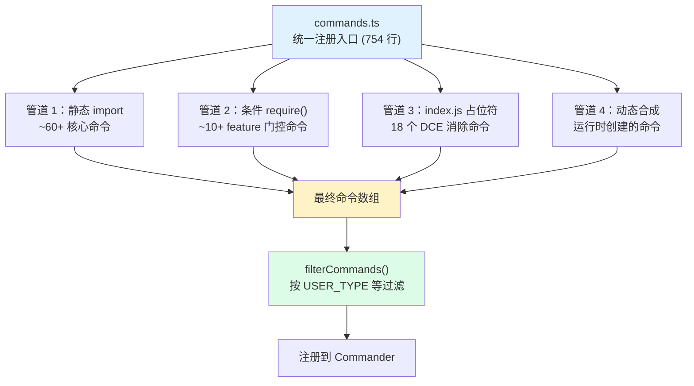
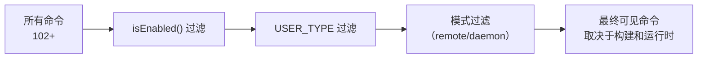
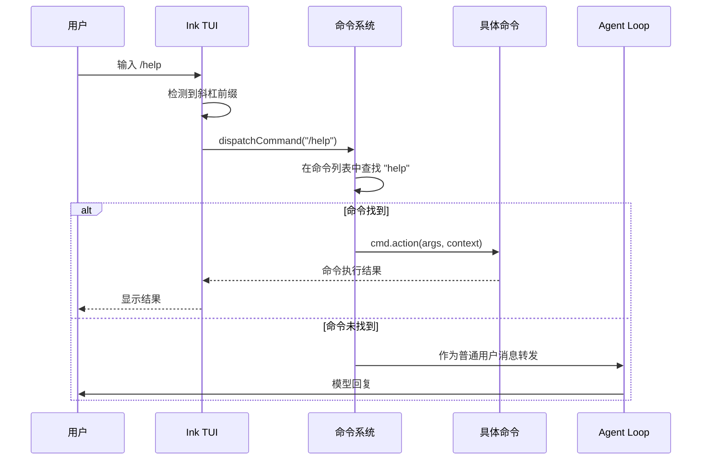

# 命令系统实现

> 102+ 命令通过四条并行管道注册到 Claude Code 中。本文拆解命令系统的四管道加载架构、命令的定义结构、条件门控机制，以及命令与工具的重叠边界。

## 命令系统总览

Claude Code 的命令系统是 CLI 中"用户主动触发"的部分。当你在终端输入 `/help`、`/clear`、`/config` 等指令时，背后是 102+ 个命令通过四条并行管道注册到系统中。



### 规模数据

| 度量 | 数值 |
| --- | --- |
| 命令总数 | 102+ |
| commands.ts 行数 | 754 |
| 核心命令（静态 import） | ~60+ |
| 条件命令（feature 门控） | ~10+ |
| index.js 占位符文件 | 18 |
| 子命令目录 | 40+ |

## 命令的结构定义

每个命令通过 `Command` 接口定义：

```typescript
// commands.ts 中定义的命令结构（简化）
export type Command = {
  name: string;                    // 命令名称（如 "help"）
  description: string;             // 描述文本
  isEnabled?: () => boolean;       // 启用条件
  isHidden?: boolean;              // 是否在列表中隐藏
  action: (args: string[], context: CommandContext) => Promise<void>;
};
```

与工具接口的对比：

| 属性 | Command | Tool | 说明 |
| --- | --- | --- | --- |
| `name`/`description` | 有 | 有 | 两者都有名称和描述 |
| `action`/`execute` | action | execute | 实现逻辑的函数 |
| `isEnabled` | 有 | 有 | 条件启用机制一致 |
| `parameters` | 无 | 有 | 工具需要参数定义（JSON Schema），命令不需要 |
| `isHidden` | 有 | 无 | 命令可以隐藏 |
| `canUseTool` | 无 | 可选 | 工具需要权限检查 |

## 四条并行加载管道

### 管道 1：静态 import（核心命令）

```typescript
// commands.ts —— 核心命令的静态导入
import help from './commands/help/index.js'
import clear from './commands/clear/index.js'
import config from './commands/config/index.js'
import mcp from './commands/mcp/index.js'
import session from './commands/session/index.js'
import skills from './commands/skills/index.js'
import commit from './commands/commit.js'
import review from './commands/review.js'
import init from './commands/init.js'
import memory from './commands/memory/index.js'
// ... ~60+ 个静态 import
```

这些命令在模块评估时全部加载，是每个构建中都包含的部分。

### 管道 2：条件 require()（feature 门控）

```typescript
// commands.ts —— 通过 feature() + require() 实现编译时 DCE
/* eslint-disable @typescript-eslint/no-require-imports */
const proactive = feature('PROACTIVE') || feature('KAIROS')
  ? require('./commands/proactive.js').default
  : null

const briefCommand = feature('KAIROS') || feature('KAIROS_BRIEF')
  ? require('./commands/brief.js').default
  : null

const assistantCommand = feature('KAIROS')
  ? require('./commands/assistant/index.js').default
  : null

const bridge = feature('BRIDGE_MODE')
  ? require('./commands/bridge/index.js').default
  : null

const voiceCommand = feature('VOICE_MODE')
  ? require('./commands/voice/index.js').default
  : null

const workflowsCmd = feature('WORKFLOW_SCRIPTS')
  ? require('./commands/workflows/index.js').default
  : null

const agentsPlatform = process.env.USER_TYPE === 'ant'
  ? require('./commands/agents-platform/index.js').default
  : null
```

关键设计模式：
- 使用 `const ... = feature('FLAG') ? require(...) : null` 三元运算符
- `feature()` 在编译时被替换，不可达分支被 DCE
- `process.env.USER_TYPE === 'ant'` 实现内部/外部构建的差异
- 条件命令的总数约为 10+ 条

### 管道 3：index.js 占位符（DCE 消除）

这是命令系统中最巧妙的设计之一。**18 个命令通过 index.js 文件作为 DCE 占位符注册**。

```javascript
// commands/add-dir/index.js —— DCE 占位符示例
// 在完整构建中，这个文件会被替换为实际的命令实现
export default {
  name: 'add-dir',
  description: 'Add a directory to the project',
  action: async () => { throw new Error('Not implemented'); }
}
```

这些占位符的作用：
1. **编译时标记**：让 commands.ts 可以统一注册所有命令，不知晓哪些被 DCE 消除
2. **运行时降级**：如果被 DCE 消除的命令在运行时被调用，抛出 "Not implemented" 错误
3. **保持注册表完整性**：commands.ts 不需要条件判断，所有命令都以相同方式注册

被占位符替换的命令可能包括 `commit-push-pr`、`install`、`security-review` 等在特定构建中被消除的命令。

### 管道 4：动态合成

部分命令在**运行时**动态创建，而非在模块评估时注册：

```typescript
// 动态命令的创建逻辑（伪代码）
export function getCommands(): Command[] {
  const commands = [
    ...staticCommands,
    ...conditionalCommands.filter(Boolean),
    ...dynamicCommands(),  // 运行时动态合成
  ];
  
  return filterCommandsForMode(commands, mode);
}
```

动态命令的例子可能包括：
- 根据用户安装的插件动态生成的命令
- 根据当前项目类型动态启用的命令
- 根据 MCP 服务器配置动态创建的命令

## 条件命令的过滤机制

命令系统通过多层过滤控制哪些命令最终对用户可见：



### 过滤代码

```typescript
// commands.ts 中的过滤逻辑
export function filterCommandsForMode(
  commands: Command[], 
  options: { isRemote: boolean }
): Command[] {
  return commands.filter(cmd => {
    // isEnabled 返回 false 则移除
    if (cmd.isEnabled && !cmd.isEnabled()) return false;
    // 远程模式过滤
    if (options.isRemote && isRemoteOnlyCommand(cmd)) return false;
    return true;
  });
}
```

## 命令注册到 Commander

经过四管道加载和过滤的命令，最终注册到 Commander 框架中：

```typescript
// commands.ts 中的注册逻辑（伪代码）
export function registerCommands(program: CommanderCommand, options: CLIOptions) {
  const commands = getCommands();
  
  for (const cmd of commands) {
    if (cmd.isEnabled && !cmd.isEnabled()) continue;
    
    const commanderCmd = program.command(cmd.name);
    commanderCmd.description(cmd.description);
    
    if (cmd.isHidden) {
      commanderCmd.hidden();
    }
    
    commanderCmd.action(async (...args) => {
      await cmd.action(args, { options });
    });
  }
}
```

## 命令的执行流程

当用户在终端输入斜杠命令时：



## 命令与工具的重叠边界

仔细阅读源码会发现，命令和工具在某些功能上有重叠：

| 功能 | 命令 | 工具 | 调用方式 |
| --- | --- | --- | --- |
| 文件读取 | 无 | `FileReadTool` | 仅模型调用 |
| 文件写入 | 无 | `FileWriteTool` | 仅模型调用 |
| Shell 执行 | 无 | `BashTool` | 仅模型调用 |
| 配置管理 | `/config` | `ConfigTool` | 用户或模型 |
| 帮助信息 | `/help` | `ToolSearchTool` | 用户或模型 |
| 会话管理 | `/session` | 无 | 仅用户 |
| 版本信息 | `/version` | 无 | 仅用户 |
| 任务管理 | 无 | `TaskCreateTool` 等 | 仅模型 |

重叠边界的原则：
1. **文件/网络操作**：只作为工具——模型自动决策更高效
2. **CLI 管理**：只作为命令——用户需要手动控制
3. **配置/搜索**：同时作为命令和工具——用户和模型都可能需要
4. **会话管理**：只作为命令——属于用户元操作，模型不应干预

这种分离使得用户和模型都有各自的操作入口，不会互相干扰。

## 关键代码展示

### 完整的命令注册流程

```typescript
// commands.ts —— 102+ 命令的完整注册流程
import addDir from './commands/add-dir/index.js'
// ... 60+ 静态 import

const proactive = feature('PROACTIVE') || feature('KAIROS')
  ? require('./commands/proactive.js').default : null
// ... 10+ 条件 require

export function getCommands(): Command[] {
  const commands: Command[] = [
    addDir, autofixPr, backfillSessions, btw,
    goodClaude, issue, feedback, clear, color,
    commit, copy, desktop, commitPushPr, compact,
    config, context, cost, diff, ctx_viz, doctor,
    memory, help, ide, init, initVerifiers,
    keybindings, login, logout, installGitHubApp,
    installSlackApp, breakCache, mcp, mobile,
    onboarding, pr_comments, releaseNotes, rename,
    resume, review, ultrareview, session, share,
    skills, status, tasks, teleport,
    securityReview, bughunter, terminalSetup,
    usage, theme, vim,
    agentsPlatform,         // 条件命令
    proactive,              // 条件命令
    briefCommand,           // 条件命令
    assistantCommand,       // 条件命令
    bridge,                 // 条件命令
    remoteControlServerCommand, // 条件命令
    voiceCommand,           // 条件命令
    forceSnip,              // 条件命令
    workflowsCmd,           // 条件命令
    webCmd,
  ].filter(Boolean);
  
  // 最后一步过滤
  return filterCommandsForMode(commands, {
    isRemote: process.env.CLAUDE_CODE_REMOTE === 'true'
  });
}
```

### DCE 占位符 index.js 的结构

```javascript
// commands/add-dir/index.js —— 典型的 DCE 占位符
// 在外部构建中被消除，保持 import 统一
export default {
  name: 'add-dir',
  description: 'Add a directory to the project',
  isHidden: true,  // 被消除的命令通常隐藏
  action: async () => {
    throw new Error(
      'This command is not available in this build of Claude Code'
    );
  }
};
```

## 命令系统的设计模式总结

1. **四管道加载**：静态导入保证核心功能、条件 require() 实现 DCE、占位符保证注册表完整、动态合成实现运行时扩展
2. **统一的 Command 接口**：所有命令共享 name/description/action/isEnabled/isHidden 结构
3. **多层过滤链**：编译时（feature 门控）-> 运行时（USER_TYPE）-> 执行时（isEnabled）
4. **命令/工具分离**：用户在 TUI 中控制命令，模型通过工具接口自动决策
5. **占位符模式**：通过最小实现的占位符统一注册表，允许 DCE 在构建时选择性地消除命令

## 小练习

1. **实现一个自定义命令**：参考现有命令的实现，创建一个 `/greet <name>` 命令，打印友好的问候语。通过四管道中的静态 import 管道注册。
2. **追踪命令注册流程**：在 `commands.ts` 的 `getCommands()` 中添加日志，输出现有命令的总数和分类。
3. **理解占位符机制**：找到 18 个 index.js 占位符文件，推断哪些命令在外部构建中被消除了。
4. **实现命令/工具桥接**：创建一个命令和一个工具共享同一个底层实现，验证 `ConfigTool` 和 `/config` 命令如何共享配置读写逻辑。
