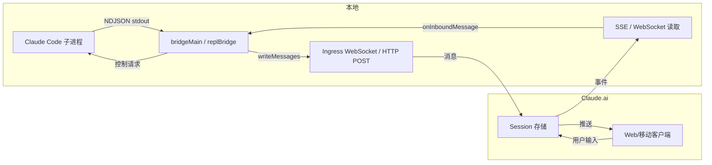

# Daemon 与 Bridge 系统深度分析

> 本文档深入分析 Claude Code 的两大后台基础设施：**Daemon 系统**（长期运行的后台监督进程）和 **Bridge 系统**（远程控制核心架构）。两者共同构建了 Claude Code 的持久化会话管理和远程协作能力。

---

## 目录

1. [Bridge 系统：远程控制架构](#bridge-系统远程控制架构)
   - [1.1 核心架构概述](#11-核心架构概述)
   - [1.2 工作轮询引擎](#12-工作轮询引擎)
   - [1.3 传输层：WebSocket vs SSE](#13-传输层websocket-vs-sse)
   - [1.4 消息中继与去重机制](#14-消息中继与去重机制)
   - [1.5 安全模型](#15-安全模型)
   - [1.6 文件同步与会话隔离](#16-文件同步与会话隔离)
   - [1.7 命令体系](#17-命令体系)
   - [1.8 Bridge 启用检查](#18-bridge-启用检查)
2. [Daemon 系统：后台监督进程](#daemon-系统后台监督进程)
   - [2.1 架构概述](#21-架构概述)
   - [2.2 Worker 进程管理](#22-worker-进程管理)
   - [2.3 后台会话支持](#23-后台会话支持)
   - [2.4 会话注册表](#24-会话注册表)
   - [2.5 Worker 通信协议](#25-worker-通信协议)
3. [Bridge 与 Daemon 的交互](#3-bridge-与-daemon-的交互)
4. [总结](#4-总结)

---

## Bridge 系统：远程控制架构

Bridge 系统是 Claude Code 的远程控制基础设施，允许用户通过 claude.ai 网页或移动应用远程操控本地运行的 Claude Code 会话。系统架构分布在 `src/bridge/` 目录下的约 30 个 TypeScript 文件中，总计超过 10,000 行代码。

### 1.1 核心架构概述

Bridge 系统分为两个主要实现路径：

**路径一：基于环境（Environment-based）的传统路径**

由 `bridgeMain.ts` 和 `replBridge.ts` 实现。这一路径通过 **Environments API** 进行工作调度：

```mermaid
flowchart TB
    subgraph Local["本地机器"]
        B[bridgeMain.ts<br/>runBridgeLoop] --> E[注册环境<br/>POST /v1/environments]
        E --> P[轮询工作<br/>GET /v1/environments/{id}/work]
        P --> W{有工作吗？}
        W -->|session| S[spawnSession<br/>执行子进程]
        W -->|healthcheck| H[健康检查]
        W -->|null| P
        S --> WS[WebSocket 连接<br/>Session-Ingress]
        WS -->|双向消息| CC[子 Claude Code 进程]
        CC -->|完成| D[onSessionDone]
        D --> SW[stopWork + archiveSession]
    end

    subgraph Server["Claude.ai 服务器"]
        EA[Environments API]
        EA --> PQ[工作队列]
        WQ[Web/mobile 用户] -->|创建 session| PQ
    end

    Local -->|poll/ack/heartbeat| EA
```

核心入口是 `bridgeMain.ts` 中的 `runBridgeLoop` 函数（约 1600 行），它接受 `BridgeConfig` 参数并启动一个永不退出的工作轮询循环：

```typescript
// src/bridge/bridgeMain.ts:141
export async function runBridgeLoop(
  config: BridgeConfig,
  environmentId: string,
  environmentSecret: string,
  api: BridgeApiClient,
  spawner: SessionSpawner,
  logger: BridgeLogger,
  signal: AbortSignal,
  backoffConfig: BackoffConfig = DEFAULT_BACKOFF,
  initialSessionId?: string,
  getAccessToken?: () => string | undefined | Promise<string | undefined>,
): Promise<void>
```

核心数据结构定义在 `types.ts` 中：

- **`BridgeConfig`**: 包含本地目录、机器名、Git 分支、最大会话数、spawn 模式（`single-session` / `worktree` / `same-dir`）、桥接 ID、工作类型等
- **`WorkResponse`**: 服务器返回的工作项，包含 `type`（session/healthcheck）、`id`、`environment_id`、`state`、`secret`（base64url 编码的 JSON）
- **`WorkSecret`**: 解码后的工作密钥，包含 JWT、API 基础 URL、认证 token、MCP 配置、环境变量等
- **`SessionHandle`**: 子进程句柄，包含 `done` Promise、`kill()`/`forceKill()` 方法、活动环缓冲区、当前访问 token

**路径二：无环境（Env-less）的新路径**

由 `remoteBridgeCore.ts` 实现。这一路径直接连接 Session-Ingress 层，跳过 Environments API：

```mermaid
flowchart LR
    subgraph Local2["本地 (Env-less)"]
        RBC[remoteBridgeCore.ts] -->|1. POST /v1/code/sessions| CS[(创建 Session)]
        CS -->|2. POST /v1/code/sessions/{id}/bridge| FC[获取 Worker JWT]
        FC -->|3. createV2ReplTransport| V2[v2 Transport<br/>SSETransport + CCRClient]
        V2 -->|4. createTokenRefreshScheduler| TR[Token 刷新]
        TR -->|5. 401 → rebuildTransport| V2
    end

    subgraph Server2["Claude.ai 服务器"]
        SAPI[Code Sessions API]
        SAPI -->|OAuth| JWT[Worker JWT]
        SSE[SSE 事件流]
        CCR[CCR /worker/* 端点]
    end

    V2 -->|读取| SSE
    V2 -->|写入| CCR
```

如 `remoteBridgeCore.ts` 的文件注释所述：

> 与 initBridgeCore（基于环境，约 2400 行）不同，该文件直接连接 session-ingress 层，无需 Environments API 的工作调度层。1. POST /v1/code/sessions → session.id；2. POST /v1/code/sessions/{id}/bridge → {worker_jwt, expires_in, api_base_url, worker_epoch}；3. createV2ReplTransport → SSE + CCRClient；4. createTokenRefreshScheduler → 主动 /bridge 重新调用；5. SSE 401 → 用新的 /bridge 凭证重建传输。

该路径由 `tengu_bridge_repl_v2` GrowthBook 标志控制，仅用于 REPL 会话（daemon/print 路径保持环境基础路径）。

### 1.2 工作轮询引擎

Bridge 系统的核心是 `runBridgeLoop` 中的 `while (!loopSignal.aborted)` 循环：

```typescript
// bridgeMain.ts:600 — 主轮询循环
while (!loopSignal.aborted) {
  const work = await api.pollForWork(environmentId, environmentSecret, loopSignal, reclaimOlderThanMs);
  // ...
  switch (work.data.type) {
    case 'healthcheck':
      await ackWork();
      break;
    case 'session':
      // 解码 secret、检查容量、spawn 子进程
      const secret = decodeWorkSecret(work.secret);
      // 决定 v1 还是 v2 传输
      if (secret.use_code_sessions === true || isEnvTruthy(process.env.CLAUDE_BRIDGE_USE_CCR_V2)) {
        // v2 路径：registerWorker → buildCCRv2SdkUrl
        workerEpoch = await registerWorker(sdkUrl, secret.session_ingress_token);
      } else {
        // v1 路径：WebSocket SDK URL
        sdkUrl = buildSdkUrl(config.sessionIngressUrl, sessionId);
      }
      const handle = spawner.spawn({ sessionId, sdkUrl, accessToken, useCcrV2, workerEpoch }, sessionDir);
      activeSessions.set(sessionId, handle);
      break;
  }
}
```

轮询循环的关键设计要点：

1. **心跳检测**：当活动会话数达到容量上限时，轮询循环进入心跳模式（heartbeat mode），定期向服务器发送心跳以延长租约。心跳间隔由 `non_exclusive_heartbeat_interval_ms` 控制（默认禁用），此时仍会定期恢复轮询以处理 token 刷新。

2. **错误恢复**：双重错误跟踪——连接错误（`connBackoff`）和一般错误（`generalBackoff`），两者各有独立的指数退避策略：
   - 初始延迟 2s（连接）/ 500ms（一般）
   - 最大延迟 2 分钟（连接）/ 30s（一般）
   - 放弃时间 10 分钟

3. **睡眠检测**：当轮询间隔远超预期退避时间时，系统检测到机器休眠/唤醒事件，重置错误预算并重新尝试（`bridgeMain.ts:108-109` 的 `pollSleepDetectionThresholdMs` 函数）。

4. **容量管理**：`capacityWake` 信号量在会话完成时唤醒睡眠中的轮询，使其立即接受新工作。

5. **Token 刷新**：`createTokenRefreshScheduler` 在 JWT 过期前 5 分钟启动刷新。v1 路径直接向子进程传递 OAuth token；v2 路径调用 `reconnectSession` 触发服务器重新调度。

### 1.3 传输层：WebSocket vs SSE

Bridge 系统支持两种传输协议：

| 特性 | v1 (HybridTransport) | v2 (SSETransport + CCRClient) |
|------|----------------------|-------------------------------|
| 读取 | WebSocket | SSE (Server-Sent Events) |
| 写入 | HTTP POST (batched) | HTTP POST to CCR /worker/* |
| SDK URL | `ws(s)://.../session_ingress/ws/{id}` | `https://.../v1/code/sessions/{id}` |
| 注册 | POST /v1/environments | POST /v1/code/sessions/{id}/bridge |
| 重连 | WS 自动重连 (10 分钟预算) | SSE 自动重连 + 401 恢复 |
| 序列号 | 0 (无 SSE seq-num) | SSE sequence-number 高水位 |
| 去重 | 服务端消息游标 | from_sequence_num / Last-Event-ID |

**v1 写入路径** (`HybridTransport.ts`):

`write()` → `streamEventBuffer` (100ms 延迟缓冲) → `SerialBatchEventUploader.enqueue()` → `postOnce()` (序列化 HTTP POST)

写入是序列化的（一次最多一个 POST 在途），以避免并发 Firestore 写入冲突。`SerialBatchEventUploader` 提供指数退避 + 抖动的重试机制。

**v2 写入路径** (`SSETransport.ts` + `ccrClient.ts`):

`write()` → `CCRClient.writeEvent()` → `SerialBatchEventUploader` → `POST /worker/events`

写入路径通过 HTTP POST 到 CCR 的 `/worker/*` 端点。`CCRClient` 还负责：

- 定期心跳（20 秒间隔，服务器 TTL 60 秒）
- `WorkerStateUploader` 状态报告（获取 worker 状态并上传）
- `reportDelivery()` 事件投递确认
- Token 过期前主动刷新

**断线恢复机制**：

在 `replBridge.ts` 中，`doReconnect()` 实现了两层恢复策略：

1. **策略一（原地重连）**：使用 `reuseEnvironmentId` 重新注册。如果后端返回相同环境 ID，调用 `reconnectSession()` 重新排队现有会话。`currentSessionId` 保持不变，URL 仍然有效，`previouslyFlushedUUIDs` 被保留。

2. **策略二（新会话回退）**：如果后端返回不同环境 ID（TTL 过期）或 `reconnectSession()` 抛出异常，归档旧会话并在新注册的环境上创建新会话。

在 `remoteBridgeCore.ts` 中，恢复更加直接：当 SSE 返回 401 时，用新的 `/bridge` 凭证重建整个传输，同时保留 SSE sequence-number 以避免历史重播（`remoteBridgeCore.ts:477-499` 的 `rebuildTransport` 函数）。

### 1.4 消息中继与去重机制

Bridge 的核心功能是在本地 REPL 和远程 claude.ai 之间中继消息：

**消息流向**：



**消息过滤**（`bridgeMessaging.ts`）：

只有三种消息类型被中继到桥接传输：

```typescript
// bridgeMessaging.ts:77-88
export function isEligibleBridgeMessage(m: Message): boolean {
  if ((m.type === 'user' || m.type === 'assistant') && m.isVirtual) return false
  return (
    m.type === 'user' ||
    m.type === 'assistant' ||
    (m.type === 'system' && m.subtype === 'local_command')
  )
}
```

**三层去重**：

1. **`BoundedUUIDSet`**（2000 项环缓冲区）：跟踪已发送的消息 UUID，防止回声消息重新注入。同时用于入站 UUID 去重，防御服务端重播。

2. **`previouslyFlushedUUIDs`**：跨会话持久化，防止初始历史消息在会话重启后被重新发送。

3. **`FlushGate`**：初始历史刷新期间的写入门控。在刷新期间的新消息被排队，等待刷新完成后按序释放，防止历史消息与实时消息交错（`flushGate.ts`）。

**控制请求处理**：

`bridgeMessaging.ts` 中的 `handleServerControlRequest` 处理来自服务器的控制请求（如权限提示、中断、模型切换、权限模式切换）。`sessionRunner.ts` 中的 `PermissionRequest` 类型（`control_request` with `subtype: 'can_use_tool'`）定义了工具调用的逐次权限检查。

### 1.5 安全模型

Bridge 系统的安全架构分层设计：

**认证层**：

- **OAuth 令牌**：Bridge API 调用使用 claude.ai OAuth token（通过 `bearerAuth`）。`bridgeApi.ts` 的 `createBridgeApiClient` 函数包装所有请求，自动处理 401 响应：
  - 调用 `onAuth401` 进行令牌刷新
  - 成功后重试一次原始请求
  - 失败后抛出 `BridgeFatalError`

- **Session Ingress JWT**：子 Claude Code 进程通过 `CLAUDE_CODE_SESSION_ACCESS_TOKEN` 环境变量接收会话入口 JWT，用于 WebSocket/SSE 认证。

- **工作密钥**：`workSecret.ts` 中的 `decodeWorkSecret` 解码 base64url 编码的 JSON 工作密钥，验证 `version === 1`。包含 `session_ingress_token`、`api_base_url`、认证信息、MCP 配置和环境变量。

**信任设备**（`trustedDevice.ts`）：

Bridge 会话在服务器端具有 `SecurityTier=ELEVATED`。当 `tengu_sessions_elevated_auth_enforcement` GrowthBook 标志启用时，所有桥接 API 请求都会发送 `X-Trusted-Device-Token` 头部。

令牌通过 `POST /auth/trusted_devices` 在登录期间注册（限于 `account_session.created_at < 10min` 内），存储在密钥链中（90 天滚动过期）。`readStoredToken` 被记忆化以避免每次轮询/心跳时都产生 `security` 子进程开销。

```typescript
// trustedDevice.ts:54-59
export function getTrustedDeviceToken(): string | undefined {
  if (!isGateEnabled()) {
    return undefined
  }
  return readStoredToken()
}
```

**策略限制**：

`initReplBridge.ts` 在启动前检查 `allow_remote_control` 策略：

```typescript
await waitForPolicyLimitsToLoad()
if (!isPolicyAllowed('allow_remote_control')) {
  logBridgeSkip('policy_denied', ...)
  onStateChange?.('failed', "disabled by your organization's policy")
  return null
}
```

**令牌过期防御**：

`initReplBridge.ts` 实现了跨进程退避机制。当检测到过期令牌（与 `expiresAt` 匹配）且连续失败 3 次时，跳过桥接初始化。令牌刷新后（新 `expiresAt`），计数器自动重置。

**版本检查**：

`bridgeEnabled.ts` 中的 `checkBridgeMinVersion` 和 `envLessBridgeConfig.ts` 中的 `checkEnvLessBridgeMinVersion` 确保运行中的 CLI 版本不低于最低要求，两套实现有各自独立的版本下限。

### 1.6 文件同步与会话隔离

**Spawn 模式**（`types.ts`）：

```typescript
export type SpawnMode = 'single-session' | 'worktree' | 'same-dir'
```

- **`single-session`**：在当前工作目录中运行一个会话，会话结束时桥接关闭
- **`worktree`**：每个会话获得一个隔离的 Git worktree，防止并发会话相互干扰`bridgeMain.ts:976-1015`
- **`same-dir`**：所有会话共享工作目录（可互相干扰）

**Worktree 创建**：

当 `spawnMode === 'worktree'` 且非首次会话时，`createAgentWorktree` 为每个会话创建独立的 Git worktree：

```typescript
// bridgeMain.ts:983-994
const wt = await createAgentWorktree(`bridge-${safeFilenameId(sessionId)}`)
sessionWorktrees.set(sessionId, {
  worktreePath: wt.worktreePath,
  worktreeBranch: wt.worktreeBranch,
  gitRoot: wt.gitRoot,
  hookBased: wt.hookBased,
})
sessionDir = wt.worktreePath
```

会话结束时通过 `removeAgentWorktree` 清理。`sessionWorktrees` Map 追踪所有活动的 worktree。

**崩溃恢复指针**：

`bridgePointer.ts` 在会话创建后写入崩溃恢复指针，包含 `sessionId`、`environmentId` 和 `source`。`claude remote-control --continue` 命令检测此指针并恢复会话。

**模板作业**：

`initReplBridge.ts` 还支持 `--print` 模式和 SDK 集成（`-p` 标志），将完整对话历史作为初始消息发送到服务器，使远程端能看到完整对话上下文。

### 1.7 命令体系

Bridge 系统通过多个入口点暴露：

**`claude remote-control` / `claude rc` / `claude remote` / `claude sync` / `claude bridge`**：

在 `cli.tsx:112` 进入快速路径：

```typescript
if (feature('BRIDGE_MODE') && (args[0] === 'remote-control' || args[0] === 'rc' || ...)) {
  // 1. 检查登录状态
  // 2. 检查启用状态（getBridgeDisabledReason）
  // 3. 检查最小版本
  // 4. 检查策略限制
  await bridgeMain(args.slice(1));
}
```

**`/remote-control` 斜杠命令**：

`commands/bridge/index.ts` 定义了一个 `local-jsx` 类型命令，封装了 `bridge.tsx` 的 React/Ink UI。用户运行 `/remote-control [name]` 时，显示 QR 码和会话 URL，支持断开/继续操作：

```typescript
const bridge = {
  type: 'local-jsx',
  name: 'remote-control',
  aliases: ['rc'],
  description: 'Connect this terminal for remote-control sessions',
  argumentHint: '[name]',
  isEnabled,
  get isHidden() { return !isEnabled() },
  immediate: true,
  load: () => import('./bridge.js'),
}
```

**`/bridge-kick` 调试命令**：

仅可在 `USER_TYPE=ant` 时使用的内部调试命令，用于注入桥接故障状态并手动测试恢复路径：

```
/bridge-kick close 1002          — 触发 WebSocket 关闭
/bridge-kick poll 404            — 下一个轮询返回 404
/bridge-kick register fail 3     — 接下来 3 次注册失败
/bridge-kick reconnect           — 调用 doReconnect()
/bridge-kick heartbeat 401       — 下一个心跳返回 401
/bridge-kick status              — 打印当前桥接状态
```

### 1.8 Bridge 启用检查

`bridgeEnabled.ts` 实现了多层启用检查：

```mermaid
flowchart TB
    A[isBridgeEnabled] --> B{feature('BRIDGE_MODE')}
    B -->|否| C[false]
    B -->|是| D{isClaudeAISubscriber}
    D -->|否| C
    D -->|是| E{tengu_ccr_bridge<br/>GrowthBook 标志}
    E -->|false| C
    E -->|true| F[true]
```

- **`isBridgeEnabled()`**：快速检查——使用缓存值，适用于 UI 可见性判断
- **`isBridgeEnabledBlocking()`**：阻塞式检查——缓存未命中时等待服务端响应（最长约 5s），写入磁盘缓存
- **`getBridgeDisabledReason()`**：诊断性检查——返回可操作的原因描述

```typescript
// bridgeEnabled.ts:70-86
export async function getBridgeDisabledReason(): Promise<string | null> {
  if (feature('BRIDGE_MODE')) {
    if (!isClaudeAISubscriber())
      return 'Remote Control requires a claude.ai subscription. ...'
    if (!hasProfileScope())
      return 'Remote Control requires a full-scope login token. ...'
    if (!getOauthAccountInfo()?.organizationUuid)
      return 'Unable to determine your organization for Remote Control eligibility. ...'
    if (!(await checkGate_CACHED_OR_BLOCKING('tengu_ccr_bridge')))
      return 'Remote Control is not yet enabled for your account.'
    return null
  }
  return 'Remote Control is not available in this build.'
}
```

**CCR Mirror 模式**：

`isCcrMirrorEnabled()` 检查是否启用了仅出站的 CCR mirror 模式——每个本地会话自动创建一个仅出站的并行远程控制会话，转发事件但不接收入站控制。由环境变量 `CLAUDE_CODE_CCR_MIRROR` 或 `tengu_ccr_mirror` GrowthBook 标志控制。

**`CCR_AUTO_CONNECT`**：

`getCcrAutoConnectDefault()` 返回 `remoteControlAtStartup` 的默认值。当 `CCR_AUTO_CONNECT` 构建标志存在且 `tengu_cobalt_harbor` 标志启用时，所有会话默认连接到 CCR。

---

## Daemon 系统：后台监督进程

Daemon 系统是 Claude Code 的后台监督基础设施，以**独立进程**形式运行，管理子 worker 进程的生命周期。不同于 Bridge 系统在 src/bridge/ 下有完整实现，Daemon 系统的部分文件（daemon/main.ts、daemon/workerRegistry.ts、cli/bg.ts）尚未在代码仓库中创建，但核心调度逻辑和 session 注册系统已就位。

### 2.1 架构概述

Daemon 系统由 `feature('DAEMON')` 构建标志门控。其设计目标包括：

- 长期运行的监督进程（不随终端会话退出）
- 管理子 worker 进程的生成、监控和销毁
- 支持后台会话（`--bg` 标志）
- 提供进程列表/日志/附着/终止等管理命令

```mermaid
flowchart TB
    subgraph Daemon["Daemon 监督进程"]
        DM[daemon/main.ts<br/>daemonMain]
        DM --> WR[workerRegistry.ts<br/>runDaemonWorker]
        WR -->|spawn| W1[Worker 1]
        WR -->|spawn| W2[Worker 2]
        WR -->|spawn| WN[Worker N]
    end

    subgraph SessionReg["Session Registry (~/.claude/sessions/)"]
        PID1[session_{pid1}.json<br/>kind: daemon]
        PID2[session_{pid2}.json<br/>kind: daemon-worker]
        PID3[session_{pid3}.json<br/>kind: bg]
    end

    W1 -->|register| PID1
    W2 -->|register| PID2
    WN -->|register| PID3

    subgraph Commands["管理命令"]
        PS[claude ps]
        LOGS[claude logs]
        ATTACH[claude attach]
        KILL[claude kill]
    end

    PS -->|读取| PID1 & PID2
    PS -->|读取| PID3
```

### 2.2 Worker 进程管理

**入口点**：

在 `cli.tsx:96-106` 中，`--daemon-worker` 标志触发 worker 进程的独立入口：

```typescript
// cli.tsx:100-106
if (feature('DAEMON') && args[0] === '--daemon-worker') {
  const { runDaemonWorker } = await import('../daemon/workerRegistry.js')
  await runDaemonWorker(args[1])
  return
}
```

```typescript
// cli.tsx:165-179
if (feature('DAEMON') && args[0] === 'daemon') {
  const { daemonMain } = await import('../daemon/main.js')
  await daemonMain(args.slice(1))
  return
}
```

Worker 进程通过 `workerRegistry.ts` 的 `runDaemonWorker(kind)` 函数启动，接收一个表示 worker 类型的参数。这允许 daemon 监督进程根据需求生成不同类型的 worker（例如，`daemon-worker`、`daemon`、`assistant`）。

**Session 类型**：

`concurrentSessions.ts` 定义了四种 session 类型：

```typescript
export type SessionKind = 'interactive' | 'bg' | 'daemon' | 'daemon-worker'
```

- **`interactive`**：标准交互式会话
- **`bg`**：后台会话（tmux 中的分离会话）
- **`daemon`**：daemon 监督进程自身
- **`daemon-worker`**：daemon 管理的 worker 进程

进程通过 `CLAUDE_CODE_SESSION_KIND` 环境变量继承类型，由生成进程（`--bg` 标志、daemon 监督进程）设置：

```typescript
// concurrentSessions.ts:31-37
function envSessionKind(): SessionKind | undefined {
  if (feature('BG_SESSIONS')) {
    const k = process.env.CLAUDE_CODE_SESSION_KIND
    if (k === 'bg' || k === 'daemon' || k === 'daemon-worker') return k
  }
  return undefined
}
```

### 2.3 后台会话支持

`--bg` / `--background` 标志允许在 tmux 会话中启动后台运行的 Claude Code 进程：

```
claude --bg [commands]
```

在 `cli.tsx:185-208` 中处理：

```typescript
if (feature('BG_SESSIONS') && (args[0] === 'ps' || args[0] === 'logs' || 
    args[0] === 'attach' || args[0] === 'kill' || 
    args.includes('--bg') || args.includes('--background'))) {
  const bg = await import('../cli/bg.js')
  switch (args[0]) {
    case 'ps':    await bg.psHandler(args.slice(1)); break
    case 'logs':  await bg.logsHandler(args[1]); break
    case 'attach': await bg.attachHandler(args[1]); break
    case 'kill':  await bg.killHandler(args[1]); break
    default:      await bg.handleBgFlag(args)
  }
  return
}
```

后台会话的特性：
- 在 tmux 会话中运行，与当前终端分离
- 退出路径（`/exit`、Ctrl+C、Ctrl+D）应分离客户端而不是终止进程
- 通过 `isBgSession()` 函数检测（`concurrentSessions.ts:44-46`）

### 2.4 会话注册表

会话注册表是一个基于文件系统的进程注册机制，所有 session 的 PID 文件存储在 `~/.claude/sessions/` 目录中：

```typescript
// concurrentSessions.ts:21-23
function getSessionsDir(): string {
  return join(getClaudeConfigHomeDir(), 'sessions')
}
```

**PID 文件结构**（`registerSession` 函数，`concurrentSessions.ts:59-108`）：

```typescript
await writeFile(pidFile, jsonStringify({
  pid: process.pid,
  sessionId: getSessionId(),
  cwd: getOriginalCwd(),
  startedAt: Date.now(),
  kind,                    // 'interactive' | 'bg' | 'daemon' | 'daemon-worker'
  entrypoint: process.env.CLAUDE_CODE_ENTRYPOINT,
  messagingSocketPath: process.env.CLAUDE_CODE_MESSAGING_SOCKET,  // UDS_INBOX
  name: process.env.CLAUDE_CODE_SESSION_NAME,
  logPath: process.env.CLAUDE_CODE_SESSION_LOG,
  agent: process.env.CLAUDE_CODE_AGENT,
}))
```

PID 文件在注册时写入，在进程退出时通过 `registerCleanup` 自动删除。

**辅助函数**：

- **`updateSessionName(name)`**：更新会话显示名称
- **`updateSessionBridgeId(bridgeSessionId)`**：记录桥接会话 ID，用于去重（同一会话如果同时可通过 UDS 和桥接访问，只显示一次）
- **`updateSessionActivity(patch)`**：推送实时活动状态（status、waitingFor），供 `claude ps` 读取
- **`countConcurrentSessions()`**：统计实时并发会话数（过滤僵死的 PID 文件），用于容量限制

```mermaid
flowchart TB
    subgraph Registry["Session Registry 生命周期"]
        A[进程启动] --> B[registerSession<br/>写入 ~/.claude/sessions/{pid}.json]
        B --> C[registerCleanup<br/>注册退出清理]
        C --> D[进程运行]
        D -->|updateSessionActivity| E[实时更新状态]
        D -->|更新 PID 文件| F[onSessionSwitch 等]
        D --> G[进程退出]
        G --> H[cleanup → 删除 PID 文件]
    end

    subgraph Query["查询命令"]
        PS2[claude ps] --> R[读取 sessions/ 目录]
        R --> K{/^\d+\.json$/ 格式}
        K -->|是| L[检查 PID 是否存活]
        L -->|存活| M[返回会话信息]
        L -->|已死| N[删除文件]
        K -->|否| O[跳过]
    end
```

**严格文件名验证**：

`countConcurrentSessions` 使用正则 `/^\d+\.json$/` 严格验证文件名，防止将非 PID 文件（如 `2026-03-14_notes.md`）误解析为 PID。

**跨平台处理**：

WSL 上跳过删除操作：当 `~/.claude/sessions/` 通过符号链接与 Windows 原生 Claude 共享时，WSL 无法检测 Windows 进程的存活状态，误删会导致数据丢失。

### 2.5 Worker 通信协议

Worker 进程的通信机制通过多种渠道实现：

**UDS Inbox**（`feature('UDS_INBOX')`）：

当启用时，每个 worker 进程在 PID 文件中记录其 `messagingSocketPath`（Unix Domain Socket 路径）。这允许向特定 worker 发送定向消息，无需共享文件系统轮询。`sessionIngressAuth.ts` 中的 `updateSessionIngressAuthToken` 暗示了入站认证 token 的更新机制，用于验证 UDS 消息的合法性。

**环境变量通信**：

Worker 进程通过多个环境变量接收配置和认证信息：

| 环境变量 | 用途 | 设置者 |
|----------|------|--------|
| `CLAUDE_CODE_SESSION_KIND` | Session 类型标记 | 生成进程 |
| `CLAUDE_CODE_SESSION_ACCESS_TOKEN` | Session Ingress JWT | bridge |
| `CLAUDE_CODE_SESSION_NAME` | 可读的 session 名称 | 生成进程 |
| `CLAUDE_CODE_SESSION_LOG` | 日志文件路径 | 生成进程 |
| `CLAUDE_CODE_AGENT` | Agent 标识符 | 生成进程 |
| `CLAUDE_CODE_USE_CCR_V2` | 启用 v2 传输 | bridge |
| `CLAUDE_CODE_WORKER_EPOCH` | CCR v2 worker epoch | bridge |
| `CLAUDE_CODE_MESSAGING_SOCKET` | UDS socket 路径 | 生成进程 |

**Process Tree 管理**：

Daemon 监督进程（daemon/main.ts）负责管理完整的进程树：
- 生成 worker 进程
- 通过 `CLAUDE_CODE_SESSION_KIND=daemon-worker` 标记 worker
- 使用 PID 文件追踪 worker 生命周期
- 在 worker 死亡时重新生成或通知用户

当使用 `claude kill <pid>` 命令时，入口点查找 PID 文件，定位目标会话的进程，然后发送终止信号。对于后台会话，这涉及向 tmux 会话发送信号。

`bridgeMain.ts` 中的 `SessionHandle` 接口展示了 worker 进程管理的模式：

```typescript
export type SessionHandle = {
  sessionId: string
  done: Promise<SessionDoneStatus>
  kill(): void            // SIGTERM
  forceKill(): void       // SIGKILL
  activities: SessionActivity[]
  currentActivity: SessionActivity | null
  accessToken: string
  lastStderr: string[]
  writeStdin(data: string): void
  updateAccessToken(token: string): void
}
```

**清理优先级**：

1. 先发送 SIGTERM（kill()），优雅退出
2. 等待 `backoffConfig.shutdownGraceMs`（默认 30 秒）
3. 发送 SIGKILL（forceKill()），强制终止
4. 调用 `stopWork()` 通知服务器
5. `removeAgentWorktree()` 清理文件系统
6. 最终 `deregisterEnvironment()` 从服务器注销

---

## 3. Bridge 与 Daemon 的交互

Bridge 和 Daemon 系统在某些方面深度融合：

**在 Daemon 中使用 Bridge**：

Daemon 可以直接使用 Bridge 核心（`initBridgeCore`），而无需经过完整的 REPL 初始化链——这就是 `BridgeCoreParams` 设计为"bootstrap-free"的原因：

```typescript
// replBridge.ts:91-95 — BridgeCoreParams 注释
/**
 * Explicit-param input to initBridgeCore. Everything initReplBridge reads
 * from bootstrap state (cwd, session ID, git, OAuth) becomes a field here.
 * A daemon caller (Agent SDK, PR 4) that never runs main.tsx fills these
 * in itself.
 */
```

当 Daemon 作为调用方时：

- 它提供自己的 `createSession` 实现（`sessionApi.ts` 中的 `createBridgeSessionLean`，仅 HTTP，orgUUID+model 由 daemon 提供）
- 使用 `writeSdkMessages()` 而非 `writeMessages()`，因为 daemon 没有 `Message[] → SDKMessage[]` 的转换依赖
- 传递静态 `getPollIntervalConfig`（60 秒心跳，工作租约 TTL 的 5 倍余量），而不是 GrowthBook 支持的动态配置
- 使用自己的 `onAuth401` 处理程序（AuthManager）
- 传递 `initialSSESequenceNum` 以实现跨进程重启的断点续传

**在 Bridge 中使用 Daemon 功能**：

Bridge 使用 `concurrentSessions.ts` 注册 session、更新活动状态和桥接 ID。`replBridgeHandle.ts` 中的 `setReplBridgeHandle` 在桥接连接时发布桥接会话 ID，使其他本地对等体能够将本地连接优先于远程连接（避免重复显示）。

**Agent SDK 集成**：

Daemon 设计的主要消费者之一是 Agent SDK（SDK 模式下的 `--assistant` 标志）。daemon 监督进程代表 SDK 管理 worker 生命周期，而 bridge 处理与 claude.ai 的通信。SDK 的 `claude_code_assistant` worker 类型让 claude.ai 的会话选择器能够按来源过滤（assistant 标签页只显示 assistant worker）。

**CCR Mirror 的桥梁**：

`isCcrMirrorEnabled()` 机制在两个系统之间建立了桥梁：每个本地 Daemon 管理的会话自动创建一个仅出站的 Bridge 连接，将事件转发到 claude.ai（双向可见性），同时保持入站控制仅在本地。

---

## 4. 总结

Claude Code 的 Bridge 和 Daemon 系统共同构成了一个**分层式远程控制与进程管理架构**：

| 维度 | Bridge 系统 | Daemon 系统 |
|------|-------------|-------------|
| 目的 | 远程控制（claude.ai ↔ 本地 CLI） | 后台进程管理 |
| 核心位置 | `src/bridge/`（~30 文件，10K+ 行） | `src/daemon/` + `src/cli/bg.ts` + `src/utils/concurrentSessions.ts` |
| 传输层 | WebSocket (v1) / SSE+HTTP (v2) | UDS + 环境变量 + PID 文件 |
| 状态管理 | Environments API + Work Poll Loop | 文件系统 Session Registry |
| 认证 | OAuth + JWT + Trusted Device | 环境变量 + PID 文件所有权 |
| 关键入口 | `runBridgeLoop()` / `initBridgeCore()` / `initEnvLessBridgeCore()` | `daemonMain()` / `runDaemonWorker()` / `bgHandler()` |
| 门控标志 | `feature('BRIDGE_MODE')` | `feature('DAEMON')` + `feature('BG_SESSIONS')` |
| 去重机制 | BoundedUUIDSet + previouslyFlushedUUIDs + FlushGate | PID 文件 + bridgeSessionId 交叉引用 |

Bridge 系统的核心设计理念是**从基于环境的轮询向无环境的直接连接演进**。v1 路径通过 Environments API 实现工作调度，而 v2（env-less）路径直接通过 OAuth 获取 Worker JWT 并建立 SSE 连接，大幅简化了架构。这解释了为何代码库同时存在 `replBridge.ts`（v1 核心）和 `remoteBridgeCore.ts`（v2 核心）两个实现。

Daemon 系统的设计则体现了**渐进式实现策略**：进程注册文件系统（`concurrentSessions.ts`）和 CLI 快速路径（`cli.tsx`）已完全实现，而实际的后台监督逻辑（`daemon/main.ts`、`workerRegistry.ts`）通过 feature flag 逐步交付。
