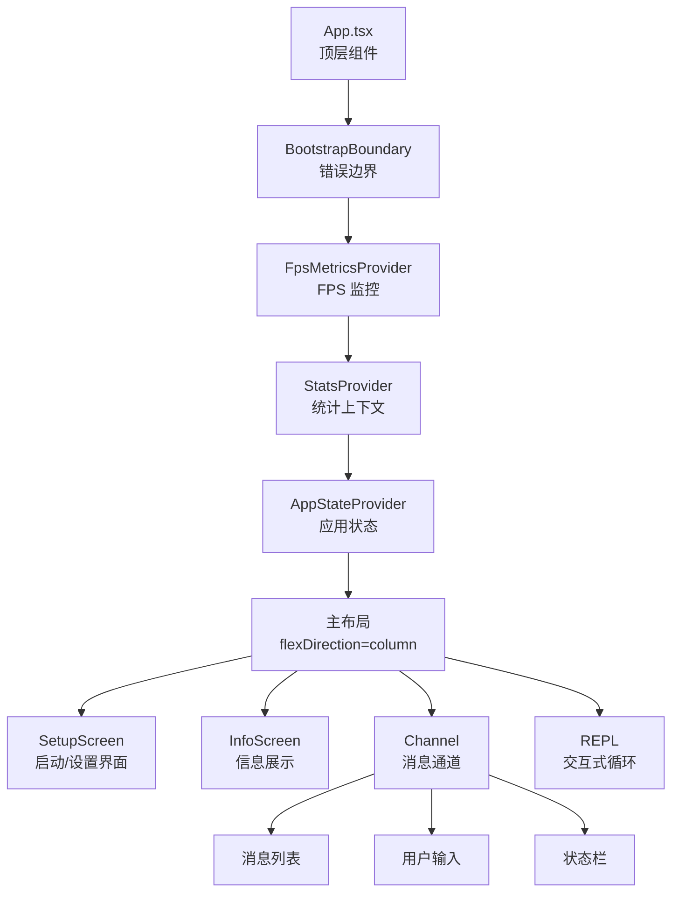
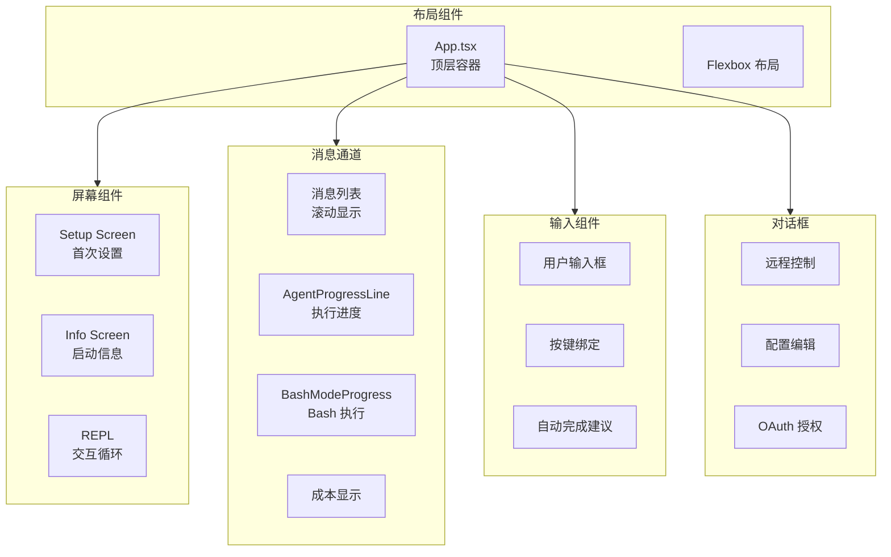
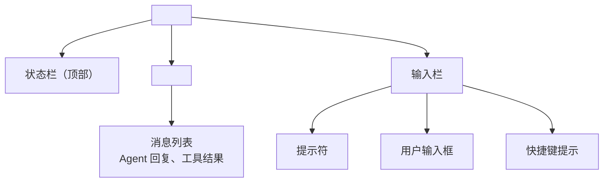
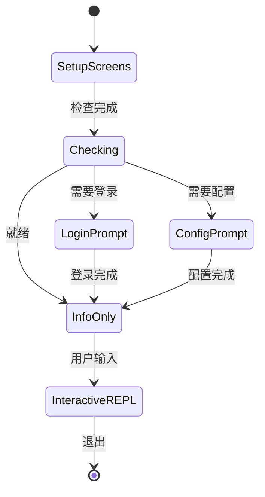

# Ink TUI 渲染引擎

> Ink 是一个用 React 组件渲染终端界面的框架。Claude Code 借助 Ink 在终端中构建了完整的交互式 UI：消息列表、输入框、状态栏、对话框——一切皆 React 组件。

## Ink 是什么

Ink 是 Vercel 开发的一个开源框架，它允许开发者用 React 组件描述终端 UI。

### 核心原理

Ink 的核心是一个自定义的 **React reconciler**（通过 `react-reconciler` 库实现）：

```
React 组件树          Ink reconciler         终端输出
<Box>                                          ┌──────────┐
  <Text bold>      ──>  virtual DOM    ──>    │ Hello!   │
  </Text>                                      └──────────┘
</Box>
```

Ink 的基本元素：

| Ink 组件 | 作用 | 类似 HTML |
| --- | --- | --- |
| `<Box>` | 布局容器（flexbox） | `<div>` |
| `<Text>` | 文本（支持颜色/样式） | `<span>` |
| `<Newline>` | 换行 | `<br>` |
| `<Spacer>` | 弹性空白 | flex: 1 |
| `<Transform>` | 文本变换 | CSS text-transform |
| `<Static>` | 静态子节点 | ReactDOM.hydrate |

### Ink 与标准 React 的差异

| 维度 | 标准 React (Web) | Ink (终端) |
| --- | --- | --- |
| 渲染目标 | DOM（浏览器） | 终端字符矩阵 |
| 布局 | CSS（像素级） | flexbox（字符级） |
| 颜色 | CSS 颜色 | ANSI 转义码 |
| 交互 | 鼠标/触摸 | 键盘输入 |
| 滚动 | CSS overflow | 终端原生滚动 |
| 动画 | CSS transitions | 帧刷新（setTimeout） |
| 组件库 | 极其丰富 | 有限自定义组件 |

## Claude Code 的 React 渲染树

Claude Code 在终端中维护了一棵 React 组件树，顶层组件是 `App.tsx`：



### App.tsx 详解

```tsx
// src/components/App.tsx —— 顶层组件（96 行）
export function App({ getFpsMetrics, stats, initialState, children }) {
  return (
    <BootstrapBoundary>
      <FpsMetricsProvider getFpsMetrics={getFpsMetrics}>
        <StatsProvider store={stats}>
          <AppStateProvider
            initialState={initialState}
            onChangeAppState={onChangeAppState}
          >
            {children}
          </AppStateProvider>
        </StatsProvider>
      </FpsMetricsProvider>
    </BootstrapBoundary>
  );
}
```

顶层组件只负责任意两个事：
1. **提供三层 Context**：FpsMetricsProvider、StatsProvider、AppStateProvider
2. **包裹错误边界**：BootstrapBoundary 捕获 React render 错误

实际的 UI 内容由 `children` prop 提供，这是由 `replLauncher.tsx` 注入的。

### BootstrapBoundary 错误边界

```tsx
class BootstrapBoundary extends React.Component {
  override state = { error: null };
  
  static override getDerivedStateFromError(error: Error) {
    return { error };
  }
  
  override render() {
    if (!this.state.error) {
      return this.props.children;
    }
    // 错误状态下的最小可读 UI
    return (
      <Box flexDirection="column" paddingX={1}>
        <Text color="red">Failed to initialize restored app bootstrap.</Text>
        <Text dimColor>{this.state.error.message}</Text>
      </Box>
    );
  }
}
```

## main.tsx 中的 React reconciler 初始化

Ink reconciler 的初始化发生在 `main.tsx` 的 action handler 中：

```typescript
// main.tsx 中的 Ink 初始化（伪代码）
import { render } from './ink.js';

async function handleMainAction(args, options) {
  // ... init() + setup()
  
  // 创建根 reconciler 实例
  const { waitUntilExit } = render(
    <App stats={stats} getFpsMetrics={getFpsMetrics} initialState={appState}>
      <Box flexDirection="column" height="100%">
        <IntroScreen />
        <Channel />     // 消息显示通道
        <Prompt />      // 用户输入提示
      </Box>
    </App>
  );
  
  // 等待 REPL 退出
  await waitUntilExit();
}
```

关键流程：
1. `render()` 创建 Ink 的 Reconciler 实例
2. Reconciler 将 React 组件树映射到终端字符矩阵
3. 终端内容的每次变化通过 ANSI 转义码增量更新
4. `waitUntilExit()` 返回一个 Promise，在 REPL 退出时 resolve

## 组件架构

主要 UI 组件及其职责：



### 主要组件清单

| 组件 | 文件 | 职责 |
| --- | --- | --- |
| `App` | `App.tsx` | 顶层容器，Context 提供者 |
| `Channel` | 内部组件 | 消息显示通道 |
| `AgentProgressLine` | `AgentProgressLine.tsx` | Agent 执行进度动画 |
| `BashModeProgress` | `BashModeProgress.tsx` | 终端命令执行进度 |
| `AutoUpdater` | `AutoUpdater.tsx` | 自动更新通知 |
| `BridgeDialog` | `BridgeDialog.tsx` | 远程控制对话框 |
| `AwsAuthStatusBox` | `AwsAuthStatusBox.tsx` | AWS 认证状态 |
| `ConfigurableShortcutHint` | `ConfigurableShortcutHint.tsx` | 快捷键提示 |
| `ContextSuggestions` | `ContextSuggestions.tsx` | 上下文建议 |
| `ContextVisualization` | `ContextVisualization.tsx` | 上下文可视化 |
| `CompactSummary` | `CompactSummary.tsx` | 紧凑摘要 |
| `CoordinatorAgentStatus` | `CoordinatorAgentStatus.tsx` | 多 Agent 状态 |
| `CostThresholdDialog` | `CostThresholdDialog.tsx` | 成本阈值警告 |
| `DevBar` | `DevBar.tsx` | 开发者调试栏 |
| `DiagnosticsDisplay` | `DiagnosticsDisplay.tsx` | 诊断信息 |
| `EffortIndicator` | `EffortIndicator.ts` | 努力程度指示器 |

## REPL Screen 的布局

REPL 屏幕的布局结构：



实际的终端显示效果：

```
┌─────────────────────────────────────────────────┐
│ ● Claude Code v1.0.0               模式: Agent  │  <- 状态栏
├─────────────────────────────────────────────────┤
│                                                 │
│  Hello! 我能帮你做什么？                         │  <- 消息列表
│                                                 │
│  ┌─ Tool Result ───────────────────────────┐    │
│  │ 文件内容已读取                               │    │
│  └────────────────────────────────────────────┘    │
│                                                 │
├─────────────────────────────────────────────────┤
│ > _                                       /help │  <- 输入栏
└─────────────────────────────────────────────────┘
```

## 启动过程中的 TUI 状态

### Setup Screens → Info-only → Interactive REPL



### 各状态的 TUI 输出差异

| 状态 | 可见组件 | 交互能力 |
| --- | --- | --- |
| SetupScreens | 安装向导、登录提示 | 有限 |
| InfoOnly | 启动信息摘要、最近操作 | 只读 |
| InteractiveREPL | 完整 REPL 布局 | 完全交互 |

## Ink 与标准 React 的深入对比

### 渲染差异

**标准 React（Web）**：
```
<div style="display: flex; padding: 10px; background: blue;">
  <span style="color: white; font-weight: bold;">Hello</span>
</div>
```
渲染结果：像素级精确的 UI，支持复杂的 CSS 样式。

**Ink（终端）**：
```tsx
<Box paddingX={1} backgroundColor="blue">
  <Text bold color="white">Hello</Text>
</Box>
```
渲染结果：字符级精确的 UI，颜色通过 ANSI 转义码实现。

### 事件处理差异

| 事件 | 标准 React | Ink |
| --- | --- | --- |
| 点击 | `onClick` | 不支持 |
| 键盘 | `onKeyDown` | `onKey`（自定义） |
| 鼠标 | `onMouseMove` | 不支持 |
| 输入 | `onChange` | `onInput` / `onSubmit` |
| Focus | `onFocus` / `onBlur` | 有限支持 |

### 生命周期差异

Ink 组件的生命周期与标准 React 相同（useEffect、useState 等），但 Ink 的 reconciler 不会做浏览器端的 DOM diffing——它的 diffing 是基于字符矩阵的。

## Ink 渲染的性能特性

由于终端是字符矩阵而非像素平面，Ink 的渲染有以下性能特性：

1. **完整帧重绘**：每次状态变化，Ink 会计算新的虚拟终端状态，然后通过 ANSI 码增量更新
2. **批处理**：React 的批处理机制保证短时间内多次 setState 不会导致多次终端写入
3. **阈值控制**：Ink 有最小更新时间间隔（默认 16ms ~ 60fps），避免过于频繁的重绘
4. **增量输出**：只有变化的部分会通过 ANSI 码写入终端，不是全部重绘

```typescript
// Ink reconciler 的渲染循环（概念）
function renderLoop() {
  // 1. React reconciler 计算新的虚拟 DOM
  // 2. Ink 将虚拟 DOM 映射为终端字符矩阵
  // 3. Ink 比较新旧字符矩阵，生成增量 ANSI 码
  // 4. 增量 ANSI 码写入 stdout
  // 5. 终端显示更新后的 UI
}
```

## 代码展示

### Ink 的自定义 reconciler

```typescript
// src/ink.ts —— Ink 的 reconciler 初始化（概念）
import Ink from 'ink';

// Ink 内部的工作方式（简化）
const reconciler = ReactReconciler({
  // 创建终端节点
  createInstance(type, props) {
    return new InkNode(type, props);
  },
  
  // 追加子节点
  appendChild(parent, child) {
    parent.appendChild(child);
  },
  
  // 更新终端输出
  commitUpdate(node, updatePayload) {
    node.applyUpdate(updatePayload);
    // 触发终端重绘
    renderToTerminal(rootNode);
  },
  
  // ... 其他 reconciler 方法
});
```

### REPL 启动器

```typescript
// src/replLauncher.tsx —— REPL 的 Ink 渲染
import React from 'react';
import { render, Box, Text } from './ink.js';

export function launchRepl(config) {
  const { rerender, waitUntilExit } = render(
    <App {...config.appProps}>
      <Box flexDirection="column" height="100%">
        <StatusBar />
        <Channel />
        <Prompt />
      </Box>
    </App>
  );
  
  return { rerender, waitUntilExit };
}
```

## 小练习

1. **调试 Ink 渲染树**：在 `App.tsx` 中添加一个 `console.log` 输出当前渲染的组件层级，启动 Claude Code 观察渲染树的结构。
2. **自定义终端组件**：用 Ink 实现一个简单的 `ProgressBar` 组件，显示百分比进度，并结合 Claude Code 的 `BashTool` 执行过程展示。
3. **理解渲染性能**：在 Ink reconciler 中添加耗时记录，分析每次状态变化导致的终端重绘开销。
4. **状态栏定制**：阅读状态栏的实现代码，尝试在状态栏中添加自定义信息，如当前工作目录或 Git 分支名称。
