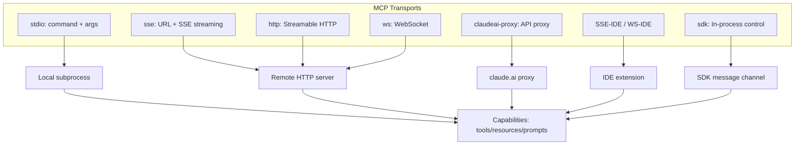
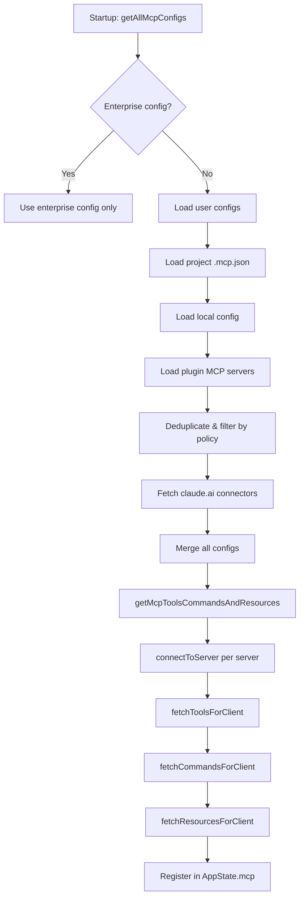
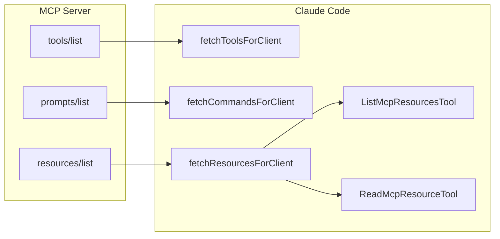
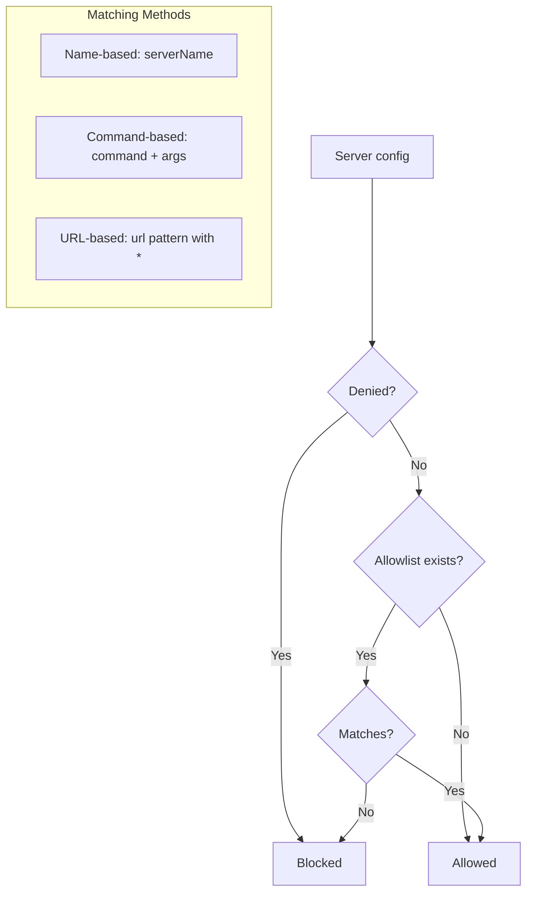

# MCP Client Deep Dive

> A comprehensive analysis of how Claude Code implements the Model Context Protocol (MCP) client — connecting to MCP servers, managing tools/resources/prompts, and integrating them into the agent's capabilities.

## 1. MCP Protocol Overview

Claude Code implements a full MCP client based on the `@modelcontextprotocol/sdk` package. MCP (Model Context Protocol) is a JSON-RPC-based protocol that allows LLM applications to discover and call tools, read resources, and fetch prompts from external servers.

### Protocol Layers

```
Application (Claude Code)
  └── MCP Client (src/services/mcp/client.ts)
       └── JSON-RPC Layer (@modelcontextprotocol/sdk)
            └── Transport Layer (stdio / SSE / HTTP / WebSocket)
                 └── MCP Server (external process or service)
```

### Supported Transport Types

| Transport | Config Type | Use Case |
|-----------|-------------|----------|
| stdio | `stdio` (or no type) | Local subprocess (npx, docker, uvx) |
| SSE | `sse` | Server-Sent Events over HTTP |
| Streamable HTTP | `http` | Standard HTTP request-response |
| WebSocket | `ws` | WebSocket persistent connection |
| SDK Control | `sdk` | In-process SDK-managed transport |
| claudeai-proxy | `claudeai-proxy` | via claude.ai API proxy |
| SSE-IDE | `sse-ide` | IDE extension SSE |
| WS-IDE | `ws-ide` | IDE extension WebSocket |



## 2. Client Lifecycle

The MCP client lifecycle follows a strict: Discovery → Connection → Registration → Execution → Cleanup sequence.



### 2.1 Discovery: Configuration Sources

Configuration is loaded by `getAllMcpConfigs()` in `config.ts` with a strict precedence order:

```
claude.ai connectors     (lowest precedence)
plugin MCP servers
user ~/.claude/mcp.json
project .mcp.json        (walked up from CWD to root)
local .claude/settings   (highest manual precedence)
dynamic / runtime config
enterprise managed       (exclusive — when present, all others are ignored)
```

### 2.2 Connection: `connectToServer()`

The main connection function is memoized by a cache key composed of `name + JSON.stringify(config)`:

```typescript
export const connectToServer = memoize(
  async (name, serverRef, serverStats?): Promise<MCPServerConnection> => { ... },
  getServerCacheKey,
)
```

The connection process:
1. **Select transport** based on `serverRef.type`
2. **Initialize auth provider** (ClaudeAuthProvider for remote servers)
3. **Create transport** with appropriate options
4. **Create SDK Client** with capabilities (roots, elicitation)
5. **Set up request handlers** (ListRoots, ElicitRequest)
6. **Connect with timeout** (default 30s, configurable via `MCP_TIMEOUT`)
7. **Register error/close handlers** for reconnection
8. **Register cleanup** for process termination (SIGINT → SIGTERM → SIGKILL escalation)

### 2.3 Tool Registration: `fetchToolsForClient()`

MCP tools are wrapped as Claude Code `Tool` objects via the `MCPTool` adapter (LRU-cached by server name, max 20 entries):

```typescript
export const fetchToolsForClient = memoizeWithLRU(
  async (client: MCPServerConnection): Promise<Tool[]> => { ... },
  (client) => client.name,
  MCP_FETCH_CACHE_SIZE,  // 20
)
```

Each MCP tool is wrapped with:

```typescript
{
  ...MCPTool,                    // Base MCPTool shell
  name: fullyQualifiedName,      // mcp__serverName__toolName
  mcpInfo: { serverName, toolName },
  isMcp: true,
  searchHint: tool._meta?.anthropic/searchHint,
  alwaysLoad: tool._meta?.anthropic/alwaysLoad,
  
  async call(args, context, ...) {
    // ensureConnectedClient → callToolWithElicitationRetry → processMCPResult
  },
  
  async checkPermissions() {
    return { behavior: 'passthrough', suggestions: [...] };
  },
  
  userFacingName() {
    return `${client.name} - ${displayName} (MCP)`;
  },
}
```

### 2.4 Prompt Registration: `fetchCommandsForClient()`

MCP prompts are converted to `Command` objects and follow the same invocation path as skills:

```typescript
export const fetchCommandsForClient = memoizeWithLRU(
  async (client: MCPServerConnection): Promise<Command[]> => { ... },
  (client) => client.name,
  MCP_FETCH_CACHE_SIZE,
)
```

MCP prompts become commands with names like `mcp__serverName__promptName`. They use the `getPromptForCommand()` hook to call `client.getPrompt()` from the MCP SDK.

### 2.5 Cleanup

Cleanup follows a three-stage signal escalation for stdio transports:

1. **SIGINT**: Gentle shutdown (like Ctrl+C), 100ms grace period
2. **SIGTERM**: Forceful termination, 400ms grace period
3. **SIGKILL**: Last resort kill (stdio subprocess only)
4. **Client close**: SDK-level `client.close()`

For in-process servers (Chrome MCP, Computer Use), cleanup closes the in-process server first, then the client.

## 3. MCP Server Configuration

### 3.1 The `.mcp.json` File Format

MCP servers are configured in `.mcp.json` files (project-scoped) or `~/.claude/mcp.json` (user-scoped):

```json
{
  "mcpServers": {
    "my-server": {
      "command": "npx",
      "args": ["-y", "@modelcontextprotocol/server-filesystem"],
      "env": {
        "MY_VAR": "value"
      }
    },
    "remote-server": {
      "type": "sse",
      "url": "https://example.com/sse",
      "headers": {
        "Authorization": "Bearer ${MY_TOKEN}"
      },
      "oauth": {
        "clientId": "my-client"
      }
    }
  }
}
```

### 3.2 Environment Variable Expansion

All env vars in MCP config values are expanded at parse time via `expandEnvVars()`:

```typescript
function expandEnvVars(config: McpServerConfig): {
  expanded: McpServerConfig
  missingVars: string[]
}
```

Missing variables are reported as warnings (not errors) — the connection will still proceed.

### 3.3 Scoped Configuration

Each server config carries a `scope` field indicating its source:

```typescript
export type ConfigScope = 'local' | 'user' | 'project' | 'dynamic' | 'enterprise' | 'claudeai' | 'managed'
```

Scopes determine override precedence: `local > project > user > plugin > claudeai`.

## 4. MCPTool Adapter

The `MCPTool` (`src/tools/MCPTool/MCPTool.ts`) is a shell tool definition that gets its actual behavior overridden at runtime by `mcpClient.ts`:

```typescript
export const MCPTool = buildTool({
  isMcp: true,
  isOpenWorld() { return false },
  name: 'mcp',           // Overridden
  async description() { return DESCRIPTION },   // Overridden
  async prompt() { return PROMPT },             // Overridden
  async call() { return { data: '' } },          // Overridden
  async checkPermissions() { ... },
  renderToolUseMessage,
  userFacingName: () => 'mcp',
  ...
})
```

The prompt and description are empty strings in the base — they get replaced with the actual MCP tool's description at runtime.

## 5. MCP Resource Management

Resources are fetched via `fetchResourcesForClient()` and exposed through two built-in tools:

- **`ListMcpResourcesTool`**: Lists available MCP resources
- **`ReadMcpResourceTool`**: Reads a specific resource by URI

Resources implement the `Resource` type from the MCP SDK with an added `server` field. Resource subscription is tracked in `capabilities.resources.subscribe`.



## 6. MCP Prompts as Commands

MCP prompts follow a different integration path than MCP tools. They are treated as skill-like commands:

```typescript
promptsToProcess.map(prompt => ({
  type: 'prompt' as const,
  name: 'mcp__' + normalizeNameForMCP(client.name) + '__' + prompt.name,
  description: prompt.description ?? '',
  isMcp: true,
  source: 'mcp',
  async getPromptForCommand(args: string) {
    const connectedClient = await ensureConnectedClient(client)
    const result = await connectedClient.client.getPrompt({ ... })
    // transform result content (text, audio, image, resource)
    return transformed.flat()
  },
}))
```

These are merged into the unified command registry via `mergeMcpCommands()` in `unifiedRegistry.ts`:

```typescript
export function mergeMcpCommands(
  diskCommands: Command[],
  mcpCommands: readonly Command[],
): Command[] {
  const mcpSkills = mcpCommands.filter(
    cmd => cmd.type === 'prompt' && cmd.loadedFrom === 'mcp' && !cmd.disableModelInvocation,
  )
  if (mcpSkills.length === 0) return diskCommands
  const diskNames = new Set(diskCommands.map(c => c.name))
  const uniqueMcp = mcpSkills.filter(c => !diskNames.has(c.name))
  return [...diskCommands, ...uniqueMcp]
}
```

## 7. MCP Authentication & Security

### 7.1 OAuth Flow

Remote MCP servers (SSE/HTTP) can declare OAuth requirements in their config:

```typescript
const McpOAuthConfigSchema = lazySchema(() =>
  z.object({
    clientId: z.string().optional(),
    callbackPort: z.number().int().positive().optional(),
    authServerMetadataUrl: z.string().url().startsWith('https://').optional(),
    xaa: z.boolean().optional(),
  }),
)
```

The `ClaudeAuthProvider` class (`auth.ts`) handles the OAuth dance:
1. **Discovery**: Fetches auth metadata from the well-known endpoint
2. **Authorization**: Opens browser for user consent
3. **Token exchange**: Exchanges auth code for tokens
4. **Token refresh**: Handles token lifecycle and 401 retry

### 7.2 Needs-Auth Cache

When a server returns 401, its auth-needs state is cached for 15 minutes:

```typescript
const MCP_AUTH_CACHE_TTL_MS = 15 * 60 * 1000 // 15 min
```

This prevents repeated connection attempts to servers that cannot authenticate. The cache is persisted to disk at `~/.claude/mcp-needs-auth-cache.json`.

### 7.3 Allow/Deny Policy

Enterprise policies can restrict MCP servers:



Policies are set via:
- `allowedMcpServers` — name, command, or URL pattern allowlist
- `deniedMcpServers` — name, command, or URL pattern denylist
- `allowManagedMcpServersOnly` — when true, only managed policy sources define the allowlist

SDK-type servers (in-process) are exempt from URL/command-based policy checks.

### 7.4 Session Ingress Authentication

For remote sessions, MCP server connections can use session ingress tokens:

```typescript
const sessionIngressToken = getSessionIngressAuthToken()
```

When present, this JWT is sent as an `Authorization: Bearer` header for all HTTP/SSE/WebSocket connections to the proxy.

### 7.5 Cross-App Access (XAA)

The `xaa` flag in OAuth config enables Cross-App Access per SEP-990. XAA configuration is shared across all XAA-enabled servers via `settings.xaaIdp`.

## 8. Connection Management & Error Handling

### 8.1 Reconnection Strategy

The system uses exponential backoff for reconnection in `useManageMCPConnections.ts`:

```typescript
const MAX_RECONNECT_ATTEMPTS = 5
const INITIAL_BACKOFF_MS = 1000
const MAX_BACKOFF_MS = 30000
```

### 8.2 Error Classification

Connection errors are classified for appropriate handling:

| Error Type | Detection | Action |
|-----------|-----------|--------|
| Session expired | 404 + JSON-RPC -32001 | Clear cache, reconnect |
| Connection reset | ECONNRESET | Track errors, reconnect on threshold |
| Connection timeout | ETIMEDOUT | Track errors, reconnect on threshold |
| Broken pipe | EPIPE | Track errors, reconnect on threshold |
| Host unreachable | EHOSTUNREACH | Track errors, reconnect on threshold |
| SSE reconnection exhausted | 'Maximum reconnection attempts' | Force-close transport |
| OAuth 401 | HTTP 401 from server | Enter needs-auth state, offer auth tool |

After 3 consecutive terminal errors, the transport is closed and the connection memoization cache is cleared so the next call creates a fresh connection.

### 8.3 Tool Call Timeout

Each MCP tool call has a default timeout of 100,000,000ms (~27.8 hours):

```typescript
const DEFAULT_MCP_TOOL_TIMEOUT_MS = 100_000_000
```

Configurable via `MCP_TOOL_TIMEOUT` environment variable. Progress is logged every 30 seconds for long-running tools.

### 8.4 Content Size Management

Large MCP tool results are handled by `processMCPResult()`:

1. Check if content needs truncation
2. If `ENABLE_MCP_LARGE_OUTPUT_FILES` is disabled, truncate
3. If content contains images, truncate (preserves image compression)
4. Save large output to file, return instructions to read it
5. If file save fails, return error message with hints about pagination

## 9. Official MCP Registry Prefetching

At startup, Claude Code prefetches the official MCP registry to identify known MCP server URLs:

```typescript
export async function prefetchOfficialMcpUrls(): Promise<void> {
  const response = await axios.get(
    'https://api.anthropic.com/mcp-registry/v0/servers?version=latest&visibility=commercial',
    { timeout: 5000 },
  )
  // Parse and normalize URLs
  officialUrls = new Set(normalizedUrls)
}
```

This is used by `isOfficialMcpUrl()` to check if a connected server is from the official registry (used for trust decisions and telemetry).

## 10. SDK MCP Server Integration

SDK MCP servers run in-process and are handled via `setupSdkMcpClients()`:

```typescript
export async function setupSdkMcpClients(
  sdkMcpConfigs: Record<string, McpSdkServerConfig>,
  sendMcpMessage: (serverName: string, message: JSONRPCMessage) => Promise<JSONRPCMessage>,
): Promise<{ clients: MCPServerConnection[]; tools: Tool[] }>
```

SDK servers use `SdkControlClientTransport` which routes messages through a control channel instead of stdio/network. This is used when the SDK (e.g., VSCode extension) manages MCP server lifecycle and routes messages between the CLI and the MCP server.

## 11. In-Process MCP Servers

Claude Code runs certain MCP servers in-process to avoid spawning subprocesses:

- **Chrome MCP server**: Run via `@ant/claude-for-chrome-mcp` package with `createLinkedTransportPair` for in-process communication
- **Computer Use MCP server**: Run via `createComputerUseMcpServerForCli()` — the CallTool handler is a stub, real dispatch goes through `wrapper.tsx`

```typescript
// From client.ts
const { createLinkedTransportPair } = await import('./InProcessTransport.js')
inProcessServer = createClaudeForChromeMcpServer(context)
const [clientTransport, serverTransport] = createLinkedTransportPair()
await inProcessServer.connect(serverTransport)
transport = clientTransport
```

## 12. Tool Routing: MCP vs Built-in

When the model calls a tool, the system checks if it's an MCP tool:

1. Tool name prefix check: `mcp__serverName__toolName` pattern
2. MCP info lookup via `tool.mcpInfo`
3. Route to MCP server's `callTool()` method
4. Process result (image resize, content truncation, file persistence)

Permission checking uses `getToolNameForPermissionCheck()` which returns the fully qualified `mcp__server__tool` name for MCP tools, preventing deny rules targeting built-ins from accidentally catching MCP replacements.

## Key Source Files

| File | Purpose |
|------|---------|
| `src/services/mcp/client.ts` | Core MCP client implementation (3348 lines) |
| `src/services/mcp/config.ts` | MCP configuration loading, scoping, policy |
| `src/services/mcp/types.ts` | Type definitions for configs, connections, resources |
| `src/services/mcp/auth.ts` | OAuth authentication provider |
| `src/services/mcp/useManageMCPConnections.ts` | React hook for connection lifecycle |
| `src/services/mcp/officialRegistry.ts` | Official MCP registry prefetch |
| `src/services/mcp/normalization.ts` | Server name normalization |
| `src/services/mcp/mcpStringUtils.ts` | MCP tool name parsing utilities |
| `src/services/mcp/envExpansion.ts` | Environment variable expansion |
| `src/services/mcp/headersHelper.ts` | MCP header helpers |
| `src/services/mcp/claudeai.ts` | claude.ai connector integration |
| `src/services/mcp/elicitationHandler.ts` | URL elicitation handling |
| `src/services/mcp/channelPermissions.ts` | Channel permission management |
| `src/services/mcp/InProcessTransport.ts` | In-process linked transport pairs |
| `src/services/mcp/SdkControlTransport.ts` | SDK control message transport |
| `src/tools/MCPTool/MCPTool.ts` | MCP tool adapter shell |
| `src/tools/MCPTool/prompt.ts` | MCP tool system prompt (overridden) |
| `src/tools/MCPTool/UI.tsx` | MCP tool UI rendering |
