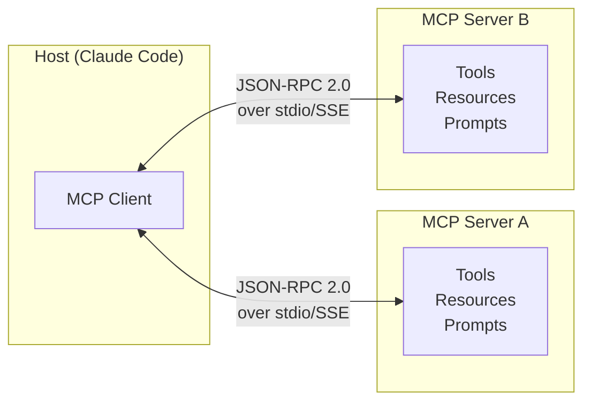
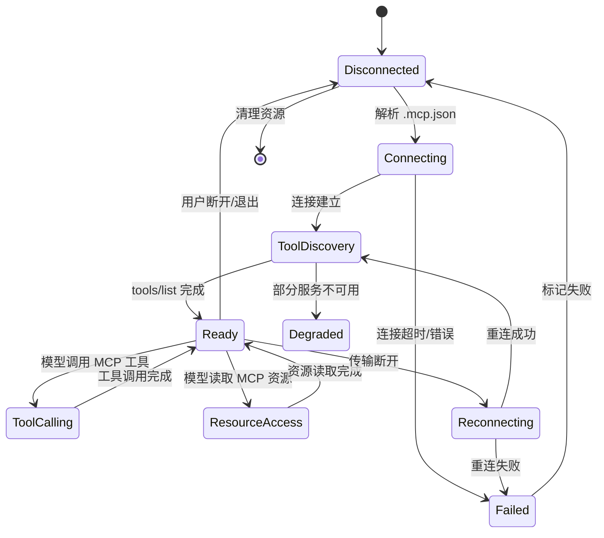
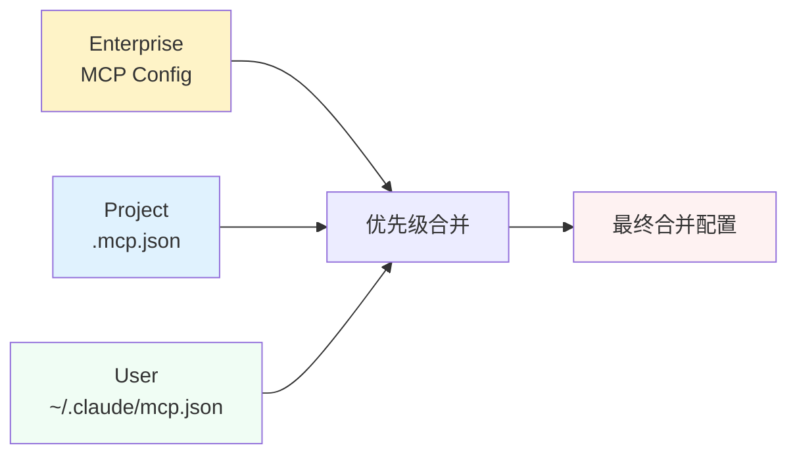
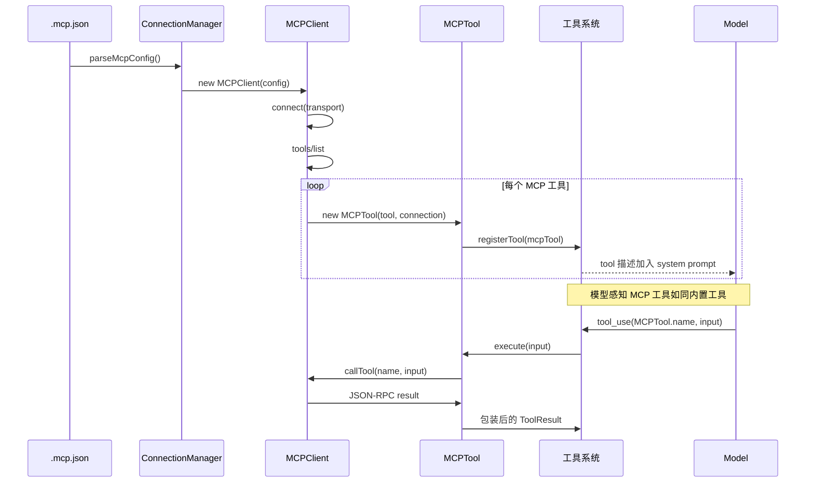
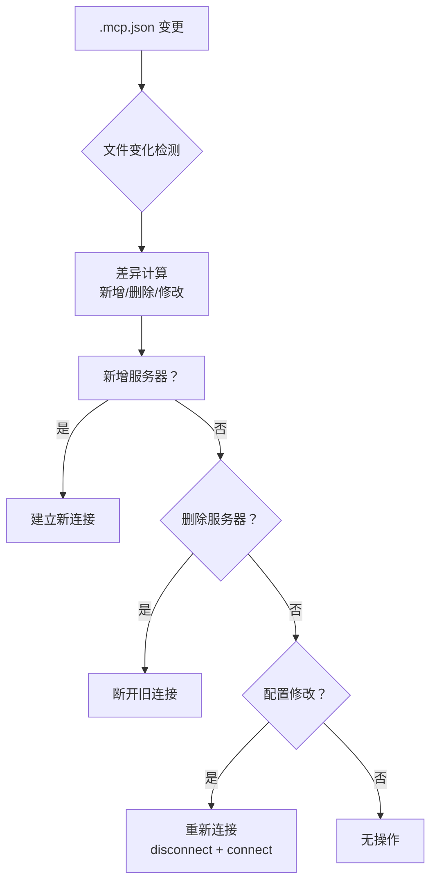

# MCP 客户端架构

> MCP（Model Context Protocol）是 Anthropic 推出的开放协议，允许 AI 模型通过标准化的接口与外部工具和数据源交互。Claude Code 内置了完整的 MCP 客户端实现，包含 23 个文件、完整的生命周期管理。

## MCP 协议基础

MCP 是 Anthropic 提出的一种 **client-server 架构**的开放协议：



### MCP 的核心能力

| 能力 | 说明 | 对应协议方法 |
| --- | --- | --- |
| **Tools** | 模型可调用的工具函数 | `tools/list`、`tools/call` |
| **Resources** | 模型可读取的数据资源 | `resources/list`、`resources/read` |
| **Prompts** | 预定义的提示词模板 | `prompts/list`、`prompts/get` |
| **Transport** | 底层通信方式 | stdio、SSE 等 |

### JSON-RPC 通信示例

```json
// 客户端 -> 服务端：列出工具
{
  "jsonrpc": "2.0",
  "method": "tools/list",
  "params": {},
  "id": 1
}

// 服务端 -> 客户端：返回工具列表
{
  "jsonrpc": "2.0",
  "result": {
    "tools": [
      {
        "name": "get_weather",
        "description": "获取指定城市的天气信息",
        "inputSchema": {
          "type": "object",
          "properties": {
            "city": { "type": "string" }
          },
          "required": ["city"]
        }
      }
    ]
  },
  "id": 1
}
```

## src/services/mcp/ 目录结构

MCP 客户端实现在 `src/services/mcp/` 目录下，包含 23 个文件：

```
services/mcp/
├── client.ts                   # MCP 客户端核心
├── config.ts                   # .mcp.json 配置解析
├── types.ts                    # 类型定义
├── utils.ts                    # 工具函数
│
├── MCPConnectionManager.tsx    # 连接管理器（React 组件）
├── useManageMCPConnections.ts  # 连接管理 React Hook
│
├── InProcessTransport.ts       # 进程内传输
├── SdkControlTransport.ts      # SDK 控制传输
│
├── auth.ts                     # OAuth 授权
├── oauthPort.ts                # OAuth 端口监听
├── headersHelper.ts            # HTTP 头处理
├── envExpansion.ts             # 环境变量展开
│
├── normalization.ts            # 配置标准化
├── mcpStringUtils.ts           # 字符串处理
│
├── channelAllowlist.ts         # 通道白名单
├── channelNotification.ts      # 通道通知
├── channelPermissions.ts       # 通道权限
│
├── claudeai.ts                 # Claude AI 集成
├── officialRegistry.ts         # 官方 MCP Registry
│
├── elicitationHandler.ts       # MCP 诱导处理
├── vscodeSdkMcp.ts             # VS Code SDK 集成
│
├── xaa.ts                      # 扩展认证
└── xaaIdpLogin.ts              # 扩展 IdP 登录
```

## MCP 客户端生命周期

一个 MCP 客户端连接从建立到断开的完整生命周期：



### 生命周期核心代码

```typescript
// services/mcp/client.ts —— MCP 客户端核心（伪代码）
export class MCPClient {
  private connection: Client | null = null;
  private tools: Tool[] = [];
  private resources: Resource[] = [];
  
  async connect(config: ServerConfig) {
    // 1. 创建传输层
    const transport = config.transport === 'stdio' 
      ? new StdioClientTransport({ command: config.command })
      : new SSEClientTransport(config.url);
    
    // 2. 创建 MCP SDK Client
    this.connection = new Client({
      name: 'claude-code',
      version: MACRO.VERSION,
    });
    
    // 3. 建立连接
    await this.connection.connect(transport);
    
    // 4. 发现工具
    const toolsResult = await this.connection.listTools();
    this.tools = toolsResult.tools.map(t => new MCPTool(t, this));
    
    // 5. 发现资源
    const resourcesResult = await this.connection.listResources();
    this.resources = resourcesResult.resources;
  }
  
  async callTool(name: string, args: Record<string, unknown>) {
    return this.connection.callTool({ name, arguments: args });
  }
  
  async disconnect() {
    await this.connection.close();
    this.connection = null;
    this.tools = [];
    this.resources = [];
  }
}
```

## .mcp.json 配置格式

MCP 服务器的配置通过 `.mcp.json` 文件管理：

```json
{
  "mcpServers": {
    "filesystem": {
      "command": "npx",
      "args": ["-y", "@anthropic-ai/mcp-server-filesystem"],
      "env": {
        "NODE_PATH": "/usr/local/lib/node_modules"
      }
    },
    "github": {
      "command": "npx",
      "args": ["-y", "@modelcontextprotocol/mcp-server-github"],
      "transport": "stdio"
    },
    "custom-api": {
      "url": "https://api.example.com/mcp",
      "headers": {
        "Authorization": "Bearer ${GITHUB_TOKEN}"
      },
      "transport": "sse"
    }
  }
}
```

### Scoped 配置管理

`.mcp.json` 配置支持三级作用域管理：

| 作用域 | 配置文件位置 | 优先级 | 用途 |
| --- | --- | --- | --- |
| User | `~/.claude/mcp.json` | 最低 | 个人 MCP 配置 |
| Project | `./.mcp.json` | 中 | 项目级 MCP 配置 |
| Enterprise | 策略分发 | 最高 | 企业统一 MCP 配置 |

配置合并逻辑：



配置合并代码：

```typescript
// services/mcp/config.ts —— 配置合并（伪代码）
export function mergeMcpConfigs(
  enterprise: McpConfig,
  project: McpConfig,
  user: McpConfig
): McpConfig {
  // 作用域优先级：enterprise > project > user
  // 同名服务器配置合并，异名服务器全部保留
  return {
    mcpServers: {
      ...user.mcpServers,
      ...project.mcpServers,
      ...enterprise.mcpServers,
    }
  };
}
```

## MCPTool：工具代理到模型

`MCPTool` 是 MCP 服务器的工具到 Claude Code 工具系统的**桥梁**：

```typescript
// MCPTool —— 将 MCP 工具包装为统一 Tool 接口（伪代码）
export class MCPTool implements Tool {
  public name: string;
  public description: string;
  public parameters: JSONSchema;
  
  constructor(
    private mcpTool: ToolDefinition,
    private connection: MCPClient
  ) {
    this.name = mcpTool.name;
    this.description = mcpTool.description;
    this.parameters = mcpTool.inputSchema;
  }
  
  async execute({ input }: ToolParams): Promise<ToolResult> {
    try {
      // 通过 JSON-RPC 调用 MCP 服务器
      const result = await this.connection.callTool(this.name, input);
      
      return {
        content: result.content.map(c => ({
          type: c.type,
          text: c.text,
        })),
        isError: result.isError,
      };
    } catch (error) {
      return {
        content: [{ type: 'text', text: `MCP Error: ${error.message}` }],
        isError: true,
      };
    }
  }
  
  // 启用状态由连接管理器控制
  isEnabled() {
    return this.connection.isConnected();
  }
}
```

### 工具注册流程



## MCP 资源的获取和缓存

除了工具，MCP 还支持资源（Resources）——模型可以读取的结构化数据：

```typescript
// services/mcp/client.ts —— 资源管理（伪代码）
export class MCPClient {
  private resourceCache: Map<string, Resource> = new Map();
  
  async listResources() {
    const result = await this.connection.listResources();
    for (const resource of result.resources) {
      this.resourceCache.set(resource.uri, resource);
    }
    return result.resources;
  }
  
  async readResource(uri: string) {
    // 检查缓存
    const cached = this.resourceCache.get(uri);
    if (cached && !cached.isExpired()) {
      return cached.content;
    }
    
    // 从 MCP 服务器读取
    const result = await this.connection.readResource({ uri });
    this.resourceCache.set(uri, {
      ...result,
      cachedAt: Date.now(),
    });
    return result.contents;
  }
}
```

资源的模型感知通过 `ListMcpResourcesTool` 和 `ReadMcpResourceTool` 实现：

```typescript
// 列出所有 MCP 资源（对模型可见的工具）
export class ListMcpResourcesTool implements Tool {
  name = 'ListMcpResources';
  description = 'List all available MCP resources';
  
  async execute() {
    const allResources = getAllMcpConnections()
      .flatMap(c => c.resources);
    return {
      content: [{ type: 'text', text: JSON.stringify(allResources) }]
    };
  }
}

// 读取特定的 MCP 资源
export class ReadMcpResourceTool implements Tool {
  name = 'ReadMcpResource';
  description = 'Read a specific MCP resource by URI';
  
  async execute({ input: { uri } }) {
    const content = await readMcpResource(uri);
    return { content: [{ type: 'text', text: content }] };
  }
}
```

## MCP 连接管理器

`MCPConnectionManager` 是一个 React 组件，管理所有 MCP 连接的生命周期：

```tsx
// services/mcp/MCPConnectionManager.tsx —— 连接管理器（伪代码）
export function MCPConnectionManager({ config }: Props) {
  const [connections, setConnections] = useState<MCPClient[]>([]);
  const [status, setStatus] = useState<ConnectionStatus>('connecting');
  
  useEffect(() => {
    async function initConnections() {
      const parsedConfig = parseMcpConfig(config);
      
      for (const [name, serverConfig] of Object.entries(parsedConfig)) {
        const client = new MCPClient(name, serverConfig);
        try {
          await client.connect();
          setConnections(prev => [...prev, client]);
        } catch (error) {
          console.error(`Failed to connect MCP server ${name}:`, error);
          // 单服务器失败不影响其他服务器
        }
      }
      
      setStatus('ready');
    }
    
    initConnections();
    
    return () => {
      // 清理所有连接
      connections.forEach(c => c.disconnect());
    };
  }, [config]);
  
  // 注册连接到工具系统
  useEffect(() => {
    if (status === 'ready') {
      registerMcpTools(connections);
    }
  }, [status, connections]);
  
  return null; // 非可视化组件
}
```

## 官方 MCP Registry 的预取

Claude Code 在启动时会预取官方 MCP Registry 的配置，使用户可以快速安装流行的 MCP 服务器：

```typescript
// services/mcp/officialRegistry.ts —— 官方注册表预取（伪代码）
export async function prefetchOfficialMcpUrls() {
  try {
    const response = await fetch('https://registry.mcp.io/api/featured');
    const data = await response.json();
    
    // 缓存到本地，供后续 mcp install 命令使用
    cacheOfficialMcpServers(data.servers);
    
    return data.servers;
  } catch {
    // 网络不可用时，使用本地缓存的版本
    return getCachedOfficialMcpServers();
  }
}
```

## 传输层实现

MCP 支持两种主要的传输方式：

### stdio 传输

```typescript
// services/mcp/SdkControlTransport.ts —— stdio 传输（伪代码）
class StdioTransport {
  private process: ChildProcess;
  
  async start() {
    // 启动子进程
    this.process = spawn(this.config.command, this.config.args, {
      env: { ...process.env, ...this.config.env },
      stdio: ['pipe', 'pipe', 'pipe'],
    });
    
    // 管道：进程 stdout -> MCP 消息
    this.process.stdout.on('data', this.handleMessage);
    
    // 管道：MCP 消息 -> 进程 stdin
    this.sendMessage = (msg) => {
      this.process.stdin.write(JSON.stringify(msg) + '\n');
    };
  }
}
```

### SSE 传输

```typescript
class SSETransport {
  private eventSource: EventSource;
  
  async start() {
    // 连接 SSE 端点
    this.eventSource = new EventSource(this.config.url);
    
    // 接收服务端推送的事件
    this.eventSource.onmessage = this.handleMessage;
    
    // 发送消息通过 HTTP POST
    this.sendMessage = async (msg) => {
      await fetch(this.config.url, {
        method: 'POST',
        headers: this.config.headers,
        body: JSON.stringify(msg),
      });
    };
  }
}
```

## 连接复用与热重载

Claude Code 的 MCP 客户端支持连接复用和热重载：



## 小练习

1. **实现一个自定义 MCP 服务器**：按照 MCP 协议规范，用 Python 或 Node.js 实现一个简单的天气预报 MCP 服务器，在 `.mcp.json` 中配置连接后测试。
2. **分析 MCPTool 的注册流程**：在 `MCPConnectionManager.tsx` 中添加日志，观察 MCP 工具如何被包装并注册到工具系统。
3. **跟踪 JSON-RPC 消息**：在 `client.ts` 中添加消息拦截器，记录客户端和服务器之间的所有 JSON-RPC 通信。
4. **理解 scoped 配置**：分别创建 user 和 project 级别的 `.mcp.json`，测试配置合并的实际行为。
