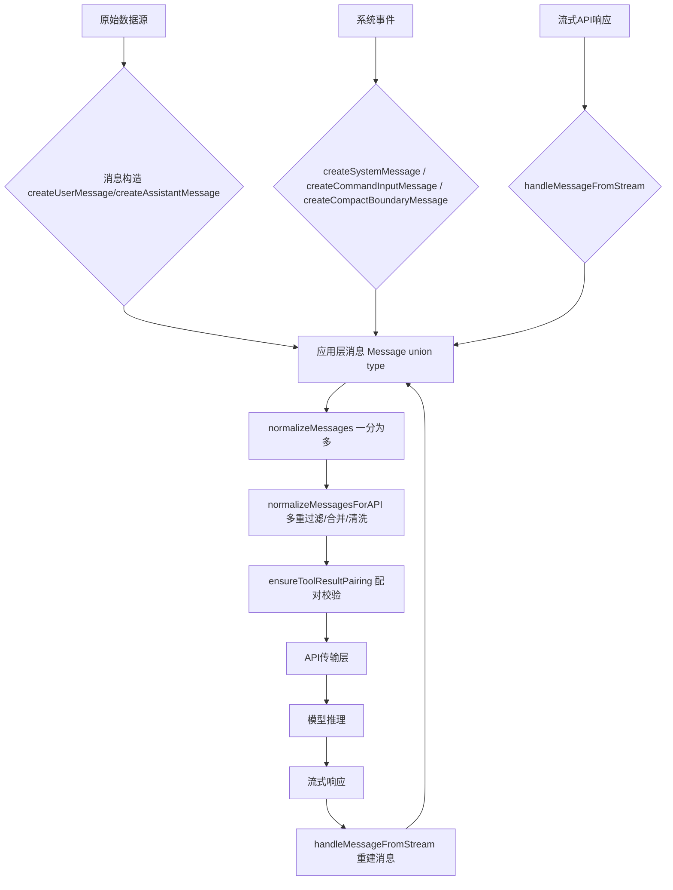
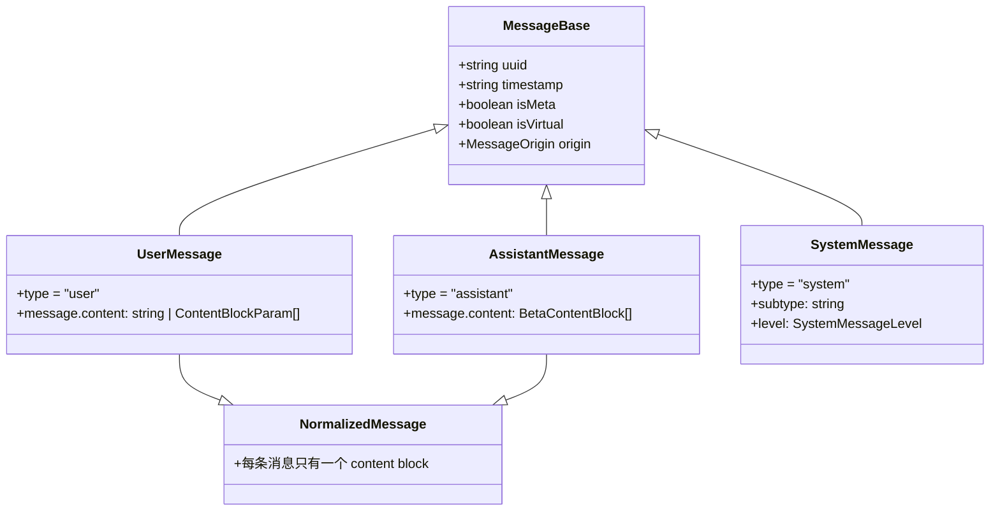
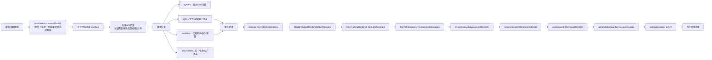
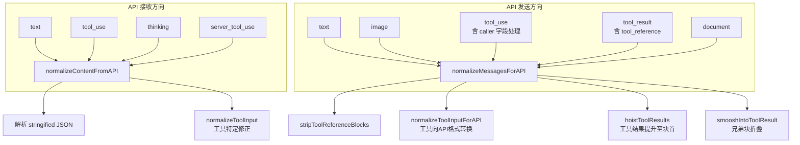

# Claude Code 消息构造系统深度解析

> 源码路径：`src/utils/messages.ts` (5512 行) + `src/types/message.ts` (135 行)

## 概述

消息构造系统是 Claude Code 内部信息流转的中枢。它负责将用户输入、模型响应、工具调用结果、系统事件等异构数据统一为结构化的消息格式，经过归一化（Normalization）、合并（Merge）、序列化（Serialization）后发送到 API 传输层，同时处理来自 API 流式响应的反序列化和实时渲染。



---

## 1. 消息类型层次结构

Claude Code 的核心消息类型定义在 `src/types/message.ts` 中，通过 `Message` 联合类型组合多种子类型：

```typescript
// src/types/message.ts
export type Message =
  | UserMessage         // 用户消息
  | AssistantMessage    // 助手消息
  | ProgressMessage     // 进度消息
  | SystemMessage       // 系统消息（含多种子类型）
  | AttachmentMessage   // 附件消息
  | HookResultMessage   // Hook 结果
  | ToolUseSummaryMessage // 工具使用摘要
  | TombstoneMessage    // 墓碑（标记已删除的消息）
  | GroupedToolUseMessage // 分组工具调用
```

这些类型都继承自统一的 `MessageBase`：

```typescript
export type MessageBase = {
  uuid?: string           // 全局唯一标识符
  parentUuid?: string     // 父消息 UUID（用于追踪消息树）
  timestamp?: string      // ISO 时间戳
  createdAt?: string
  isMeta?: boolean        // 是否为元消息（系统自动生成，非用户输入）
  isVirtual?: boolean     // 虚拟消息（仅用于 UI 渲染，不发送到 API）
  isCompactSummary?: boolean
  toolUseResult?: unknown
  origin?: MessageOrigin  // 消息来源
  [key: string]: unknown  // 开放扩展
}
```

### 1.1 UserMessage — 用户消息

```typescript
export type UserMessage = MessageBase & {
  type: 'user'
  message: {
    content: string | Array<{
      type: string
      text?: string
      [key: string]: unknown
    }>
    [key: string]: unknown
  }
}
```

`UserMessage` 的 content 可以是纯字符串，也可以是内容块数组。实际构造时几乎总是使用数组形式，因为消息管道始终将其归一化为 `ContentBlockParam[]`。

### 1.2 AssistantMessage — 助手消息

```typescript
export type AssistantMessage = MessageBase & {
  type: 'assistant'
  message?: {
    content?: unknown
    [key: string]: unknown
  }
}
```

`AssistantMessage` 的 content 是 `BetaContentBlock[]`，包含 text、tool_use、thinking、redacted_thinking 等块类型。

### 1.3 SystemMessage — 系统消息（12+ 子类型）

系统消息通过 `subtype` 字段区分功能，是一个巨大的联合类型家族：

```typescript
export type SystemMessage = MessageBase & {
  type: 'system'
  subtype?: string
  level?: SystemMessageLevel   // 'info' | 'warning' | 'error'
  message?: string
}

// 12+ 子类型，每种对应不同用途：
export type SystemLocalCommandMessage       // 本地命令输出
export type SystemBridgeStatusMessage       // 桥接状态
export type SystemTurnDurationMessage       // 轮次耗时
export type SystemMemorySavedMessage        // 记忆已保存
export type SystemStopHookSummaryMessage    // Hook 停止摘要
export type SystemInformationalMessage      // 通用信息
export type SystemCompactBoundaryMessage    // 压缩边界
export type SystemMicrocompactBoundaryMessage // 微压缩边界
export type SystemPermissionRetryMessage    // 权限重试
export type SystemScheduledTaskFireMessage  // 定时任务触发
export type SystemAwaySummaryMessage        // 离开摘要
export type SystemAgentsKilledMessage       // Agent 已终止
export type SystemApiMetricsMessage         // API 性能指标
export type SystemAPIErrorMessage           // API 错误
```

### 1.4 NormalizedMessage — 归一化消息

归一化后的消息类型，保证每条消息的 content 都是单个内容块（为 API 做准备）：

```typescript
export type NormalizedAssistantMessage = AssistantMessage  // 内容块数组 → 单块
export type NormalizedUserMessage = UserMessage            // 内容块数组 → 单块
export type NormalizedMessage =
  | NormalizedAssistantMessage
  | NormalizedUserMessage
  | ProgressMessage
  | SystemMessage
  | AttachmentMessage
```



---

## 2. 消息构造函数

消息构造函数是系统的入口，负责从原始输入创建结构化的消息对象。

### 2.1 createUserMessage — 用户消息构造

```typescript
// src/utils/messages.ts:460
export function createUserMessage({
  content,
  isMeta,
  isVisibleInTranscriptOnly,
  isVirtual,
  isCompactSummary,
  summarizeMetadata,
  toolUseResult,
  mcpMeta,
  uuid,
  timestamp,
  imagePasteIds,
  sourceToolAssistantUUID,
  permissionMode,
  origin,
}: {
  content: string | ContentBlockParam[]
  // ...可选参数
}): UserMessage
```

关键行为：
- content 可以是字符串或 `ContentBlockParam[]`，若为空则使用 `NO_CONTENT_MESSAGE` 占位
- 自动生成 UUID（通过 `randomUUID()`）和时间戳
- `origin` 字段标记消息来源（human / coordinator / task-notification / channel 等）

### 2.2 createAssistantMessage — 助手消息构造

```typescript
// src/utils/messages.ts:411
export function createAssistantMessage({
  content,
  usage,
  isVirtual,
}: {
  content: string | BetaContentBlock[]
  usage?: Usage
  isVirtual?: true
}): AssistantMessage
```

内部委托给 `baseCreateAssistantMessage`（第 355 行），该函数：
- 为每条消息生成 UUID，设置 `role: 'assistant'`
- 默认使用 `SYNTHETIC_MODEL = '<synthetic>'` 作为模型名称
- 默认使用空 usage 结构，包含 `input_tokens`、`output_tokens`、`cache_creation_input_tokens` 等字段

当 content 是字符串时，自动包装为 `[{ type: 'text', text: content }]` 的 `BetaContentBlock[]` 格式。空字符串替换为预定义的 `NO_CONTENT_MESSAGE`。

同时提供 `createAssistantAPIErrorMessage` 创建 API 错误对应的助手消息，标记 `isApiErrorMessage: true` 以便下游过滤。

### 2.3 createSystemMessage 家族 — 系统消息构造

系统消息构造函数家族提供数十种专用工厂函数：

| 函数名 | 用途 | 子类型 |
|--------|------|--------|
| `createSystemMessage(content, level, toolUseID?)` | 通用信息 | `informational` |
| `createPermissionRetryMessage(commands)` | 权限重试通知 | `permission_retry` |
| `createBridgeStatusMessage(url, upgradeNudge?)` | 远程桥接状态 | `bridge_status` |
| `createScheduledTaskFireMessage(content)` | 定时任务触发 | `scheduled_task_fire` |
| `createStopHookSummaryMessage(...)` | Hook 执行摘要 | `stop_hook_summary` |
| `createTurnDurationMessage(ms, budget?, msgCount?)` | 轮次耗时 | `turn_duration` |
| `createAwaySummaryMessage(content)` | 用户离开摘要 | `away_summary` |
| `createMemorySavedMessage(paths)` | 记忆已保存 | `memory_saved` |
| `createAgentsKilledMessage()` | Agent 已终止 | `agents_killed` |
| `createApiMetricsMessage(metrics)` | API 性能指标 | `api_metrics` |
| `createCommandInputMessage(content)` | 本地命令输出 | `local_command` |
| `createCompactBoundaryMessage(...)` | 压缩边界 | `compact_boundary` |
| `createMicrocompactBoundaryMessage(...)` | 微压缩边界 | `microcompact_boundary` |
| `createSystemAPIErrorMessage(error, retryInMs, retryAttempt, maxRetries)` | API 错误 | `api_error` |

其中 `createSystemMessage` 是最通用的：

```typescript
export function createSystemMessage(
  content: string,
  level: SystemMessageLevel,
  toolUseID?: string,
  preventContinuation?: boolean,
): SystemInformationalMessage
```

### 2.4 其他消息构造

```typescript
// 进度消息
createProgressMessage<P extends Progress>({ toolUseID, parentToolUseID, data })

// 工具中断消息（构建 tool_result 块）
createToolResultStopMessage(toolUseID)

// 用户打断消息
createUserInterruptionMessage({ toolUse = false })

// 合成用户提醒消息（本地命令执行时的 caveat）
createSyntheticUserCaveatMessage()

// 模型切换面包屑
createModelSwitchBreadcrumbs(modelArg, resolvedDisplay)

// 工具使用摘要（SDK 层）
createToolUseSummaryMessage(summary, precedingToolUseIds)
```

---

## 3. 消息格式化管道

消息从原始数据到 API 就绪状态经历了一套复杂的管道。核心函数 `normalizeMessagesForAPI`（第 1989 行）整合了全部流程：



### 3.1 附件上浮

```typescript
// src/utils/messages.ts:1481
export function reorderAttachmentsForAPI(messages: Message[]): Message[]
```

从底部向上扫描，将 `AttachmentMessage` 上浮至最近的"停止点"——助手消息或包含工具结果（`tool_result`）的用户消息之前。

**实现策略**：反向遍历 + 缓冲 `pendingAttachments` 数组。遇到停止点时，先 flush 所有缓冲的附件再推入停止点。时间复杂度 O(N)，避免了 unshift 的 O(N²) 陷阱。

### 3.2 虚拟消息过滤

```typescript
const reorderedMessages = reorderAttachmentsForAPI(messages).filter(
  m => !((m.type === 'user' || m.type === 'assistant') && m.isVirtual),
)
```

`isVirtual` 标记的消息（如 REPL 内部工具调用）仅用于 UI 显示，不发送至 API。

### 3.3 API 错误驱动的块类型剥离

当助手消息带有 API 错误（如图片过大、PDF 密码保护、请求过大），系统会向后查找前一个 `isMeta` 用户消息，并标记应移除的内容块类型（`image`、`document` 等），防止后续 API 请求重复发送错误内容。

```typescript
const errorToBlockTypes: Record<string, Set<string>> = {
  [getPdfTooLargeErrorMessage()]: new Set(['document']),
  [getPdfPasswordProtectedErrorMessage()]: new Set(['document']),
  [getPdfInvalidErrorMessage()]: new Set(['document']),
  [getImageTooLargeErrorMessage()]: new Set(['image']),
  [getRequestTooLargeErrorMessage()]: new Set(['document', 'image']),
}
```

### 3.4 用户消息合并

```typescript
// src/utils/messages.ts:2411
export function mergeUserMessages(a: UserMessage, b: UserMessage): UserMessage
```

当两个连续的用户消息出现时（常见于附件展开、系统消息转换），自动合并：

1. **内容拼接**：`joinTextAtSeam` 处理相邻文本块的边界问题——在 a 的最后一个文本块追加 `\n` 分隔符防止字符粘连
2. **UUID 策略**：保留非 meta 消息的 UUID，使 `[id:...]` 标签保持稳定
3. **isMeta 传播**：仅在 snip 启用时要求所有合并的消息都是 meta
4. **工具结果提升**：`hoistToolResults` 确保 `tool_result` 块始终排在其他块之前

### 3.5 助手消息合并

```typescript
// src/utils/messages.ts:2389
export function mergeAssistantMessages(a: AssistantMessage, b: AssistantMessage): AssistantMessage
```

按 `message.id` 合并两个助手消息，简单地将 b 的 content 追加到 a：

```typescript
return {
  ...a,
  message: {
    ...a.message,
    content: [...a.message.content, ...b.message.content],
  },
}
```

这在流式场景中至关重要——多个流式数据块可能具有相同的 `message.id`，需要合并为一个完整的助手响应。

### 3.6 工具引用块处理

```typescript
// src/utils/messages.ts:1933
function relocateToolReferenceSiblings(messages): (UserMessage | AssistantMessage)[]
```

当 `tool_result` 中包含 `tool_reference` 块时，服务器会将其展开为 functions 块。此时同一用户消息中的文本兄弟块会紧随 functions-close 标记之后，形成异常的两段式人类轮次。修复方式：将文本兄弟块移动到下一个没有 `tool_reference` 的用户消息中。

```typescript
// src/utils/messages.ts:1677
export function stripToolReferenceBlocksFromUserMessage(message: UserMessage)
```

当工具搜索（tool search）未启用时，从所有 `tool_result` 中移除 `tool_reference` 块。

### 3.7 空格过滤与空内容补全

```typescript
filterWhitespaceOnlyAssistantMessages  // 移除仅含空格文本的助手消息
ensureNonEmptyAssistantContent         // 给空内容的非末尾助手消息插入占位符 "[No message content]"
filterOrphanedThinkingOnlyMessages     // 过滤孤儿 thinking 块（API 禁止"thinking blocks cannot be modified"）
```

---

## 4. 工具调用/结果消息组装

工具调用是 Claude Code 中最高频的操作，其消息组装机制需要确保 `tool_use` 和 `tool_result` 的严格配对。

### 4.1 ensureToolResultPairing — 配对校验

```typescript
// src/utils/messages.ts:5133
export function ensureToolResultPairing(
  messages: (UserMessage | AssistantMessage)[],
): (UserMessage | AssistantMessage)[]
```

这是消息管道的最后一道防线，处理三种异常：

**正向缺失**：`tool_use` 块没有对应的 `tool_result` → 插入合成错误块：
```typescript
const syntheticBlocks: ToolResultBlockParam[] = missingIds.map(id => ({
  type: 'tool_result',
  tool_use_id: id,
  content: SYNTHETIC_TOOL_RESULT_PLACEHOLDER,  // "[Tool result missing due to internal error]"
  is_error: true,
}))
```

**反向孤儿**：`tool_result` 块没有对应的 `tool_use` → 从下一个用户消息中删除。

**严格模式**：当 `getStrictToolResultPairing()` 为 true（HFI 训练数据采集）时，任何不匹配直接抛错，避免用合成数据污染训练集。

### 4.2 工具调用的 UI 重排

```typescript
// src/utils/messages.ts:855
export function reorderMessagesInUI(
  messages,
  syntheticStreamingToolUseMessages,
)
```

将消息按以下顺序排列以确保正确的时间线显示：
```
tool_use → preHooks → tool_result → postHooks
```

这通过两遍扫描实现：第一遍建立 `toolUseGroups` Map（按 `tool_use_id` 分组），第二遍按正确顺序重排。

### 4.3 工具调用流式状态追踪

```typescript
// src/utils/messages.ts:2915
export type StreamingToolUse = {
  index: number
  contentBlock: BetaToolUseBlock
  unparsedToolInput: string  // 累积的流式 JSON 输入
}

export type StreamingThinking = {
  thinking: string
  isStreaming: boolean
  streamingEndedAt?: number
}
```

---

## 5. 系统提示词作为消息

系统提示词在 Claude Code 中以两种方式嵌入：

### 5.1 System Reminder 机制

```typescript
// src/utils/messages.ts:3097
export function wrapInSystemReminder(content: string): string {
  return `<system-reminder>\n${content}\n</system-reminder>`
}

export function wrapMessagesInSystemReminder(messages: UserMessage[]): UserMessage[]
```

`wrapMessagesInSystemReminder` 将一组用户消息的文本内容包装在 `<system-reminder>` 标签中，这些消息在 prompt 中表现为系统层级的约束而非用户输入。

### 5.2 SystemMessage 作为元数据

所有系统消息（`system` 类型）在 API 管道中被默认过滤（`isSystemLocalCommandMessage` 检查除外），它们的作用是：

- **compact_boundary**：标记会话压缩边界，`findLastCompactBoundaryIndex` 用于查找最新压缩点
- **microcompact_boundary**：标记微压缩边界
- **api_metrics**：记录 API 性能指标供调试
- **stop_hook_summary**：记录 Hook 执行摘要

唯一被允许到达 API 的是 `local_command` 子类型，它作为用户消息注入以让模型能看到之前命令的输出上下文：

```typescript
// src/utils/messages.ts:2078
case 'system': {
  const userMsg = createUserMessage({
    content: message.content,
    uuid: message.uuid,
    timestamp: message.timestamp,
  })
  // 合并到前一个用户消息
}
```

---

## 6. 消息内容块类型

API 支持的内容块类型通过 SDK 的 `ContentBlockParam` 和 `BetaContentBlock` 类型定义：

### 6.1 ContentBlockParam（发送方向）

发送给 API 的消息块类型：

| 类型 | 用途 | SDK 类型 |
|------|------|----------|
| `text` | 文本内容 | `TextBlockParam` |
| `image` | 图片（base64） | `ImageBlockParam` |
| `tool_use` | 工具调用请求 | `ToolUseBlockParam` |
| `tool_result` | 工具执行结果 | `ToolResultBlockParam` |
| `tool_reference` | 工具引用（beta） | - |
| `document` | 文档（PDF） | `DocumentBlockParam` |
| `search_result` | 搜索工具结果 | - |

### 6.2 BetaContentBlock（接收方向）

从 API 流式接收的消息块类型：

| 类型 | 用途 |
|------|------|
| `text` | 文本输出 |
| `tool_use` | 模型请求的工具调用 |
| `thinking` | 思考过程（扩展思考） |
| `redacted_thinking` | 被审查的思考块 |
| `server_tool_use` | 服务端工具调用 |
| `mcp_tool_use` | MCP 工具调用 |
| `mcp_tool_result` | MCP 工具结果 |
| `code_execution_tool_result` | 代码执行结果 |
| `container_upload` | 容器上传 |
| `web_search_tool_result` | 网页搜索结果 |
| `compaction` | 压缩块 |

### 6.3 思考（Thinking）块处理

当使用扩展思考（Extended Thinking）时，模型会输出 thinking 块。系统对此有以下特殊处理：

```typescript
// 过滤末尾 thinking 块：API 不允许助手消息以 thinking 结尾
function filterTrailingThinkingFromLastAssistant(messages) {
  // 从最后一条助手消息的末尾开始，逐步向前移除所有 thinking 块
  // 如果所有块都是 thinking，插入 "[No message content]" 占位
}

// 过滤孤儿 thinking 块：仅有 thinking 且无法与其他消息合并的助手消息
export function filterOrphanedThinkingOnlyMessages(messages) {
  // 第一遍：收集有非 thinking 内容的 message.id
  // 第二遍：移除只有 thinking 且找不到合并伙伴的消息
}

// 身份校验块剥离：API Key 变更后需要清除签名块
export function stripSignatureBlocks(messages: Message[]): Message[] {
  // 移除所有 thinking / redacted_thinking / connector_text 块
}
```

### 6.4 内容块归一化

```typescript
// src/utils/messages.ts:2651
export function normalizeContentFromAPI(
  contentBlocks: BetaMessage['content'],
  tools: Tools,
  agentId?: AgentId,
): BetaMessage['content']
```

从 API 收到的内容块需要进行归一化处理：

1. **tool_use 输入归一化**：递归解析嵌套的 stringified JSON，使用 `safeParseJSON` 安全解析，失败时回退为 `{}` 并记录诊断事件 `tengu_tool_input_json_parse_fail`
2. **工具特定修正**：通过 `normalizeToolInput` 调用每个工具的自定义归一化逻辑
3. **文本块保留**：即使是纯空白文本块也保留原样（prompt caching 需要精确内容）
4. **beta 块透传**：`server_tool_use`, `mcp_tool_use`, `mcp_tool_result`, `container_upload` 等 beta 块原样透传



---

## 7. 消息序列化与反序列化

### 7.1 UUID 生成与派生

```typescript
// 生成唯一 UUID
const uuid = randomUUID()

// 从父 UUID 派生子 UUID（用于一分为多后的消息）
// src/utils/messages.ts:725
export function deriveUUID(parentUUID: UUID, index: number): UUID

// 衍生短消息 ID（snip 工具引用使用）
export function deriveShortMessageId(uuid: string): string
```

`deriveUUID` 的实现：基于父 UUID 和索引生成确定性 UUID，保证同一输入总是产生相同输出。`deriveShortMessageId` 取 UUID 前 10 个十六进制字符转换为 base36 并取前 6 位。

### 7.2 消息 ID 标签

当 `HISTORY_SNIP` 特性启用时，每条用户消息都会被追加 `[id:xxx]` 标签到最后一个文本块末尾：

```typescript
function appendMessageTagToUserMessage(message: UserMessage): UserMessage {
  const tag = `\n[id:${deriveShortMessageId(message.uuid)}]`
  // 定位到最后一个文本块并追加
}
```

这允许模型在后续轮次中使用 snip 工具精确引用之前的消息。

### 7.3 合成消息标记

```typescript
export const SYNTHETIC_MODEL = '<synthetic>'

export const SYNTHETIC_MESSAGES = new Set([
  '[Request interrupted by user]',
  '[Request interrupted by user for tool use]',
  "The user doesn't want to take this action right now...",
  "The user doesn't want to proceed with this tool use...",
  'No response requested.',
])

export function isSyntheticMessage(message: Message): boolean
```

合成消息用于标记系统自动生成而非模型输出的内容。`isSyntheticMessage` 通过检测消息的文本内容是否匹配预定义的字符串集合来判断。

---

## 8. 集成 API 传输层

### 8.1 流式消息处理

```typescript
// src/utils/messages.ts:2930
export function handleMessageFromStream(
  message:
    | Message
    | TombstoneMessage
    | StreamEvent
    | RequestStartEvent
    | ToolUseSummaryMessage,
  onMessage: (message: Message) => void,
  onUpdateLength: (newContent: string) => void,
  onSetStreamMode: (mode: SpinnerMode) => void,
  onStreamingToolUses: (f: (streamingToolUse: StreamingToolUse[]) => StreamingToolUse[]) => void,
  onTombstone?: (message: Message) => void,
  onStreamingThinking?: (f: (current: StreamingThinking | null) => StreamingThinking | null) => void,
  onApiMetrics?: (metrics: { ttftMs: number }) => void,
  onStreamingText?: (f: (current: string | null) => string | null) => void,
): void
```

这是 API 流式响应的中枢处理函数，处理以下事件类型：

| 事件 | 处理逻辑 |
|------|----------|
| `tombstone` | 调用 `onTombstone` 删除指定消息 |
| `tool_use_summary` | 忽略（SDK 内部消息） |
| `assistant` (完整消息) | 提取 thinking 块 → 清空流式文本 → `onMessage` 最终交付 |
| `stream_request_start` | 设置模式为 `'requesting'` |
| `content_block_start` | 根据块类型设置模式：`thinking` / `responding` / `tool-input` |
| `content_block_delta` | `text_delta` → 累积流式文本；`input_json_delta` → 累积工具输入 JSON |
| `content_block_stop` | 不做特殊处理 |
| `message_delta` | 重置模式为 `'responding'` |

流式文本累积的关键模式：
```typescript
onStreamingText?.(text => (text ?? '') + deltaText)
```

工具调用流式输入累积：
```typescript
onStreamingToolUses(_ => {
  const element = _.find(_ => _.index === index)
  if (!element) return _
  return [
    ..._.filter(_ => _ !== element),
    { ...element, unparsedToolInput: element.unparsedToolInput + delta },
  ]
})
```

### 8.2 图像验证

```typescript
validateImagesForAPI(sanitized)
```

在消息最终发送到 API 之前，对所有 image 块进行大小验证，确保符合 API 限制。

### 8.3 完整的 API 请求准备链

从应用层消息到 API 请求的完整管线：

```typescript
// 1. 消息归一化（一分为多）
const normalized = normalizeMessages(messages)

// 2. API 就绪转换
const apiReady = normalizeMessagesForAPI(normalized, tools)

// 3. 工具结果配对校验
const paired = ensureToolResultPairing(apiReady)

// 4. 移除 advisor 块（无 beta header 时）
const stripped = stripAdvisorBlocks(paired)

// 5. 签名块剥离（API Key 变更时）
const signed = stripSignatureBlocks(stripped)

// 6. 最终发送
api.send(signed)
```

### 8.4 角色交替保障

API 要求消息必须严格遵循 user/assistant 交替。系统通过以下机制确保这一点：

1. **mergeUserMessages**：相邻 user 消息自动合并
2. **mergeAssistantMessages**：同 ID 的 assistant 消息自动合并
3. **mergeAdjacentUserMessages**：净过滤后的相邻 user 再次合并
4. **ensureToolResultPairing** 中的占位插入：当删除 orphaned tool_result 导致 user 消息为空时，插入 `NO_CONTENT_MESSAGE` 占位

---

## 9. 异常处理与恢复

### 9.1 交谈恢复（Conversation Recovery）

从持久存储恢复会话时，消息管道需要处理多种边缘情况：

- **中间截断的流式响应**：`filterOrphanedThinkingOnlyMessages` 处理因压缩导致 thinking 块与文本块分离的情况
- **过时的 API Key**：`stripSignatureBlocks` 移除绑定到旧 Key 的 thinking signature 块
- **MCP 工具断开**：`stripUnavailableToolReferencesFromUserMessage` 移除指向已断开 MCP 工具的 `tool_reference` 块

### 9.2 API 400 保护

消息管道在发送前执行多层防御性清洗：

```
filterTrailingThinkingFromLastAssistant
→ filterWhitespaceOnlyAssistantMessages
→ ensureNonEmptyAssistantContent
→ sanitizeErrorToolResultContent
→ ensureToolResultPairing
```

每层处理一种特定的 API 400 错误模式：
1. `thinking blocks cannot be modified`
2. `text content blocks must contain non-whitespace text`
3. `all messages must have non-empty content`
4. `all content must be type text if is_error is true`
5. `tool_use ids must be unique` / `unexpected tool_use_id`

### 9.3 诊断日志

管道在修复操作时都会记录诊断事件：

```typescript
logEvent('tengu_tool_result_pairing_repaired', { ... })
logEvent('tengu_filtered_whitespace_only_assistant', { ... })
logEvent('tengu_filtered_trailing_thinking_block', { ... })
logEvent('tengu_filtered_orphaned_thinking_message', { ... })
logEvent('tengu_fixed_empty_assistant_content', { ... })
logEvent('tengu_tool_input_json_parse_fail', { ... })
logEvent('tengu_model_whitespace_response', { ... })
```

这些事件通过 `src/services/analytics` 上报，用于监控和调试各种消息异常模式。

---

## 10. 代码模式总结

| 模式 | 用途 | 出现位置 |
|------|------|----------|
| 纯函数式工厂 | 从输入构造不可变消息对象 | `createUserMessage`, `createSystemMessage` 等 |
| 函数重载 | 根据输入类型不同分支处理 | `normalizeMessages` (4 overloads) |
| 反向扫描 | 从末尾向前搜索，高效定位 | `reorderAttachmentsForAPI`, `findLastCompactBoundaryIndex` |
| 函数式管道 | 多重 filter/map/reduce 转换 | `normalizeMessagesForAPI` |
| 回调式流处理 | 多个 onXxx 回调驱动 UI 更新 | `handleMessageFromStream` |
| 防御性编程 | 检查-修复-记录-日志 | `ensureToolResultPairing` 的 repair 模式 |
| 特性门控 | GrowthBook 决定是否启用新行为 | `tengu_chair_sermon`, `tengu_toolref_defer_j8m` |

---

## 总结

Claude Code 的消息构造系统是一个超过 5500 行的高度工程化的消息处理管线：

- **80+ 个导出函数**覆盖消息构造、归一化、合并、过滤、序列化的全生命周期
- **12+ 种系统消息子类型**承载元数据、性能指标、压缩边界等非对话信息
- **6 层防御性清洗**在每次 API 调用前确保消息格式合规
- **20+ 种流式事件类型**由 `handleMessageFromStream` 统一调度
- **特性门控驱动**的新行为逐步上线，通过 `checkStatsigFeatureGate_CACHED_MAY_BE_STALE` 控制

理解这套系统是理解 Claude Code 如何将用户输入、工具执行、模型推理和系统状态融合为连贯对话体验的关键。
