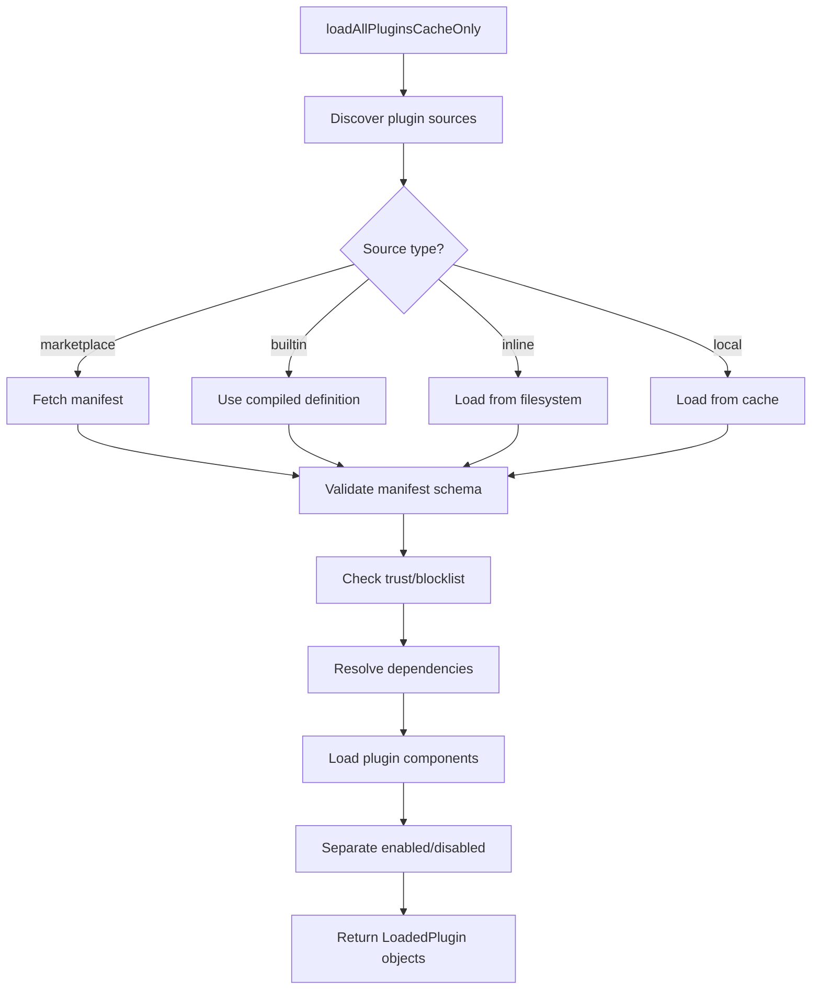
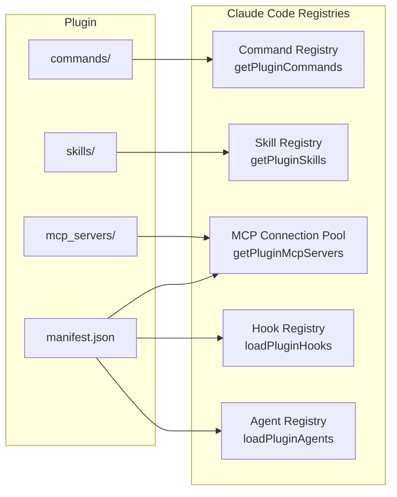

# Plugins System Deep Dive

> A comprehensive analysis of how Claude Code discovers, loads, manages, and secures plugins — self-contained extensions that contribute commands, skills, hooks, and MCP servers.

## 1. Architecture Overview

The plugins system in Claude Code allows third-party extensions to contribute multiple capabilities through a single package. Unlike bundled skills (compiled into the binary) or disk-based skills (user-authored .md files), plugins are marketplace-distributed units with a formal manifest, trust model, versioning, and management UI.

```mermaid
graph TD
    subgraph "Plugin Sources"
        MP[Marketplace<br/>api.anthropic.com]
        BP[Built-in<br/>src/plugins/builtin]
        IP[Inline<br/>--plugin-dir flag]
        LP[Local<br/>~/.claude/plugins/]
    end

    subgraph "Loading Pipeline"
        PL[pluginLoader.ts]
        LO[loadAllPluginsCacheOnly]
        PM[Plugin manifest validation]
        TV[Trust Verification]
        DR[Dependency Resolution]
    end

    subgraph "Contributed Capabilities"
        PC[Plugin Commands<br/>.md files]
        PS[Plugin Skills<br/>SKILL.md dirs]
        PH[Plugin Hooks<br/>beforeQuery/afterQuery]
        PM2[Plugin MCP Servers]
        PA[Plugin Agents]
    end

    subgraph "CLI Integration"
        UI[/plugin command]
        PM3[PluginSettings component]
        MO[PluginOptionsDialog]
        TW[PluginTrustWarning]
    end

    MP --> PL
    BP --> PL
    IP --> PL
    LP --> PL

    PL --> LO
    LO --> TV
    TV --> DR
    DR --> PM
    PM --> PC
    PM --> PS
    PM --> PH
    PM --> PM2
    PM --> PA

    UI --> PM3
    PM3 --> MO
    PM3 --> TW
```

## 2. Plugin Manifest Format

Plugins are distributed as `.mcpb` files (MCP Bundle — a zip archive) or as directory structures. The manifest is defined in `src/utils/plugins/schemas.ts`:

```typescript
export interface PluginManifest {
  name: string
  description: string
  version: string
  // Optional metadata
  icon?: string
  author?: string
  license?: string
  homepage?: string
  repository?: string
  // Capability declarations
  commands?: string[]          // Paths to command .md files
  skills?: string[]            // Names/selectors for skills
  skillsPaths?: string[]       // Additional skill directories
  commandsPaths?: string[]     // Additional command directories
  commandsMetadata?: Record<string, CommandMetadata>
  hooks?: Record<string, HookConfig>
  mcpServers?: Record<string, McpServerConfig>
  userConfig?: UserConfigField[]
  requires?: string[]          // Plugin dependency IDs
  platform?: string[]          // Platform restrictions (darwin, win32, linux)
}
```

### Built-in Plugin Definition

Built-in plugins use TypeScript definitions instead of manifest files:

```typescript
export type BuiltinPluginDefinition = {
  name: string
  description: string
  version: string
  defaultEnabled?: boolean      // Default true
  isAvailable?: () => boolean   // Platform/lifecycle gating
  skills?: BundledSkillDefinition[]
  hooks?: HooksSettings
  mcpServers?: Record<string, McpServerConfig>
}
```

## 3. Plugin Lifecycle: Discovery to Integration

### 3.1 Discovery

Plugins are discovered from multiple sources at startup:

- **Official Marketplace**: Plugins hosted on `api.anthropic.com/mcp-registry/`. Fetched and cached locally. Searched via `marketplaceManager.ts`.
- **Built-in Commands**: Compiled into the CLI binary via `src/plugins/builtin/`. Always available unless explicitly disabled.
- **Inline Plugins**: Passed via `--plugin-dir /path/to/plugin` CLI flag. Loaded directly from the filesystem.
- **Installed Plugins**: Previously installed from marketplace, stored in `~/.claude/plugins/`. Cached for offline use.
- **Managed Plugins**: Enterprise-managed via policy. Enforced by `managedPlugins.ts`.

### 3.2 Loading Pipeline

The main entry point is `loadAllPluginsCacheOnly()` in `pluginLoader.ts`:



The `LoadedPlugin` type carries resolved paths and configuration:

```typescript
export type LoadedPlugin = {
  name: string
  manifest: PluginManifest
  path: string              // Root directory on disk
  source: string            // Marketplace identifier (e.g., "slack@anthropic")
  repository: string        // Full repository identifier
  enabled: boolean          // Current enabled state
  isBuiltin: boolean        // True for compiled-in plugins
  hooksConfig?: HooksSettings
  mcpServers?: Record<string, McpServerConfig>
  commandsPath?: string     // Default commands directory
  commandsPaths?: string[]  // Additional command paths
  skillsPath?: string       // Default skills directory
  skillsPaths?: string[]    // Additional skill directories
  commandsMetadata?: Record<string, CommandMetadata>
  userConfig?: Record<string, string>  // Saved user preferences
}
```

### 3.3 Trust Verification

Plugins from marketplaces undergo a trust verification process. The `PluginTrustWarning` component (`src/commands/plugin/PluginTrustWarning.tsx`) displays trust information before installation.

Trust model tiers:

| Source | Trust Level | UX |
|--------|-------------|-----|
| Official Anthropic marketplace | Full trust | Auto-install, no warning |
| User-added marketplace | Medium trust | Warning on first install from that marketplace |
| Local directory / --plugin-dir | Medium trust | Warning — user explicitly chose the path |
| Blocklisted | No trust | Refused to load, error displayed |

Blocklists are managed by `pluginBlocklist.ts` and can be updated remotely via enterprise policy.

### 3.4 Commands and Skills Loading

Plugin commands are loaded by `getPluginCommands()` and plugin skills by `getPluginSkills()` in `loadPluginCommands.ts`. Both are memoized:

```typescript
export const getPluginCommands = memoize(async (): Promise<Command[]> => { ... })
export const getPluginSkills = memoize(async (): Promise<Command[]> => { ... })
```

#### Command Loading Process

The `loadCommandsFromDirectory()` function walks the plugin's commands directory tree:

```typescript
async function loadCommandsFromDirectory(
  commandsPath: string,
  pluginName: string,
  sourceName: string,
  pluginManifest: PluginManifest,
  pluginPath: string,
  config: LoadConfig = { isSkillMode: false },
  loadedPaths: Set<string> = new Set(),
): Promise<Command[]> {
  // Step 1: Recursively collect all .md files
  const markdownFiles = await collectMarkdownFiles(commandsPath, commandsPath, loadedPaths)
  // Step 2: Transform SKILL.md directories (a directory with SKILL.md becomes one command)
  const processedFiles = transformPluginSkillFiles(markdownFiles)
  // Step 3: Convert each file to a Command
  for (const file of processedFiles) {
    const command = createPluginCommand(commandName, file, ...)
    commands.push(command)
  }
  return commands
}
```

#### Supported File Patterns

Plugin commands support three file organization patterns:

1. **Flat files**: `commands/review-pr.md` becomes `pluginName:review-pr`
2. **SKILL.md directories**: `commands/code-review/SKILL.md` becomes `pluginName:code-review`
3. **Nested namespaces**: `commands/github/pr/review.md` becomes `pluginName:github:pr:review`

#### Variable Substitution

Plugin command content supports several substitution variables:

- `${CLAUDE_PLUGIN_ROOT}` — resolves to the plugin's installation directory
- `${CLAUDE_PLUGIN_DATA}` — resolves to the plugin's data directory
- `${CLAUDE_SKILL_DIR}` — for skills, resolves to the skill's subdirectory within the plugin
- `${CLAUDE_SESSION_ID}` — resolves to the current session ID
- `${user_config.X}` — resolves to saved user option values (sensitive keys masked)
- `` !`command` `` — inline shell commands (executed via `executeShellCommandsInPrompt`)

#### Metadata Overrides

Plugin manifests can specify `commandsMetadata` to override frontmatter fields:

```typescript
commandsMetadata: {
  "review-pr": {
    source: "commands/custom-review.md",
    description: "Review a pull request with AI assistance",
    argumentHint: "<pr-number>",
    model: "sonnet",
    allowedTools: ["Read", "Write", "Bash"],
  }
}
```

This allows the plugin author to provide metadata without modifying the .md file itself.

### 3.5 Capability Registration

Once loaded, plugin capabilities are registered into the applicable registries:



## 4. Plugin CLI Commands

### 4.1 The `/plugin` Command

The main plugin management interface is a React component rendered by the `/plugin` command (`src/commands/plugin/plugin.tsx`):

```typescript
export async function call(onDone, _context, args?): Promise<React.ReactNode> {
  return <PluginSettings onComplete={onDone} args={args} />
}
```

The `PluginSettings` component provides:
- **Installed plugin list** with enable/disable toggles
- **Marketplace browser** for discovering new plugins
- **Trust warnings** before installing from new sources
- **Configuration dialogs** for plugins that declare `userConfig` fields
- **Marketplace management** for adding/removing marketplace sources

### 4.2 Plugin UI Components

| Component | File | Purpose |
|-----------|------|---------|
| `PluginSettings` | `PluginSettings.tsx` | Main plugin management UI — orchestrates all sub-views |
| `ManagePlugins` | `ManagePlugins.tsx` | Installed plugin list with enable/disable |
| `BrowseMarketplace` | `BrowseMarketplace.tsx` | Marketplace search and browse |
| `AddMarketplace` | `AddMarketplace.tsx` | Add custom marketplace URL |
| `ManageMarketplaces` | `ManageMarketplaces.tsx` | View/manage marketplace sources |
| `PluginTrustWarning` | `PluginTrustWarning.tsx` | Trust verification dialog before install |
| `PluginOptionsDialog` | `PluginOptionsDialog.tsx` | Per-plugin configuration dialog |
| `PluginOptionsFlow` | `PluginOptionsFlow.tsx` | Guided multi-step configuration flow |
| `ValidatePlugin` | `ValidatePlugin.tsx` | Plugin validation checks |
| `DiscoverPlugins` | `DiscoverPlugins.tsx` | Plugin discovery interface |
| `PluginErrors` | `PluginErrors.tsx` | Error display component |
| `UnifiedInstalledCell` | `UnifiedInstalledCell.tsx` | Unified cell for installed plugin display |
| `PluginDetailsHelpers` | `pluginDetailsHelpers.tsx` | Helper functions for detail views |

### 4.3 Service Layer

The service layer handles the actual installation and management operations:

- **`PluginInstallationManager.ts`** — Orchestrates the full installation process: download from marketplace, validate manifest, extract files, verify trust, register capabilities
- **`pluginCliCommands.ts`** — CLI-facing command implementations (install, uninstall, update, list)
- **`pluginOperations.ts`** — Low-level file operations (copy, remove, symlink)
- **`marketplaceManager.ts`** — Marketplace API communication (list, search, get details)
- **`marketplaceHelpers.ts`** — URL parsing and validation

### 4.4 The `/reload-plugins` Command

The `/reload-plugins` command (`src/commands/reload-plugins/`) allows refreshing plugins at runtime without restarting the CLI. It:

1. Clears all plugin caches (commands, skills, MCP)
2. Re-scans plugin directories
3. Re-fetches marketplace manifests
4. Updates AppState with fresh plugin data
5. Increments `mcp.pluginReconnectKey` to trigger MCP server reconnection

## 5. Plugin Update Mechanism

Plugin updates are handled by `pluginAutoupdate.ts`. The autoupdate system:

1. **Check interval**: Periodically queries the marketplace for newer versions
2. **Version comparison**: Uses semver comparison from `pluginVersioning.ts`
3. **Background download**: Downloads updated `.mcpb` files without blocking
4. **Atomic extraction**: Uses temp directories and renames to prevent corruption
5. **Config preservation**: Preserves `userConfig` values across updates
6. **Notification**: Shows update notification via the notification system

```typescript
// Simplified update flow
async function checkForUpdates(): Promise<void> {
  const installed = await getInstalledPlugins()
  for (const plugin of installed) {
    const latest = await marketplaceManager.getLatestVersion(plugin.source)
    if (semver.gt(latest.version, plugin.manifest.version)) {
      await downloadAndInstallUpdate(plugin, latest)
      await notifyUser(plugin.name, latest.version)
    }
  }
}
```

## 6. Plugin Security Model

### 6.1 Trust Levels

```
Official Anthropic Marketplace
  -> Verified signature
  -> Auto-trusted, no warnings
  -> Can be blocked by enterprise policy

Third-Party Marketplace (user-added)
  -> No signature verification
  -> Warning displayed on first install
  -> Subsequent installs from same marketplace are warned once per session

Local Directory / --plugin-dir
  -> User explicitly specified the path
  -> Warning shown (confirmation required)
  -> Assumed trusted after confirmation

Blocklisted (pluginBlocklist.ts)
  -> Cannot be installed or loaded
  -> Error message explaining why
```

### 6.2 Policy Integration

Plugin behavior is governed by enterprise policies:

- **`pluginOnlyPolicy.ts`** — When active, restricts skill/MCP loading to plugin-sourced content only. User-authored local skills and MCP servers are blocked.
- **`pluginBlocklist.ts`** — Maintains a blocklist of known malicious or disallowed plugin IDs. Can be updated via policy settings.
- **`pluginFlagging.ts`** — Flags plugins exhibiting suspicious behavior (e.g., unexpected network requests, excessive file system access).

### 6.3 Content Security

Plugin commands/skills follow the same security model as user-authored skills:

- Shell command execution (!\`command\`) is gated by the same permission system
- `${CLAUDE_PLUGIN_ROOT}` substitution is controlled — plugins cannot read outside their directory
- Sensitive user config values are masked in skill content sent to the model
- MCP servers contributed by plugins are subject to the same allow/deny policies as manual servers

## 7. Plugin vs MCP vs Built-in Tools

| Aspect | Plugin | MCP Server | Built-in Tool |
|--------|--------|------------|---------------|
| **Distribution** | Marketplace / .mcpb / directory | Any URL or local binary | Compiled into CLI |
| **Capabilities** | Commands + Skills + Hooks + MCP | Tools + Resources + Prompts | Single typed function |
| **Trust Model** | Manifest verification + Marketplace rep | Server URL / executable path | Full trust |
| **Versioning** | Semver manifest with auto-update | Server version | CLI version |
| **User Control** | Plugin UI (/plugin) with enable/disable | MCP UI (/mcp) | Not user-controllable |
| **Isolation** | Same process (Node.js) | stdio subprocess or remote | Same process (TypeScript) |
| **Contributes To** | Command + Skill + MCP + Hook registries | Tool + Prompt registries | Direct tool list |
| **Configuration** | userConfig fields, option dialogs | .mcp.json, env vars | CLI flags |
| **Performance Impact** | Loaded on startup, cached | Connected on startup, streamed | Lazy-loaded |

## 8. Notable Implementation Details

### 8.1 Built-in Plugin Registry

Built-in plugins register via `registerBuiltinPlugin()` in `builtinPlugins.ts`:

```typescript
export function registerBuiltinPlugin(definition: BuiltinPluginDefinition): void {
  BUILTIN_PLUGINS.set(definition.name, definition)
}
```

Currently, no built-in plugins are registered (the init function `initBuiltinPlugins()` in `src/plugins/bundled/index.ts` is scaffolding). But the infrastructure supports:
- `pluginId = "name@builtin"` format to distinguish from marketplace plugins
- Per-plugin `isAvailable()` hooks for platform/lifecycle gating
- `defaultEnabled` setting (defaults to `true`)
- User-enabled/disabled state persisted in settings via `enabledPlugins`

### 8.2 Plugin MCP Server Integration

Plugins can declare MCP server configurations in their manifest. These are processed by `mcpPluginIntegration.ts`:

```typescript
export async function getPluginMcpServers(
  plugin: LoadedPlugin,
  mcpErrors: PluginError[],
): Promise<Record<string, ScopedMcpServerConfig> | null>
```

Plugin MCP servers are:
- **Namespaced** as `plugin:pluginName:serverName` to avoid key collisions with manual servers
- **Deduplicated** against manually-configured servers by content signature (manual wins)
- **Suppressed** if they duplicate an earlier plugin's server (first-loaded wins)
- **Policy-filtered** via the same allow/deny rules as manual servers

### 8.3 Dependency Resolution

Plugin dependencies are resolved by `dependencyResolver.ts`:

- Supports graph-based dependency resolution
- Detects circular dependencies
- Performs version compatibility checking via semver ranges
- Reports missing dependencies with actionable error messages

### 8.4 Plugin Loading Errors

Errors during plugin loading are collected and propagated through the system:

```typescript
// Error type hierarchy
type PluginError = {
  type: 'mcp-config-invalid' | 'mcpb-download-failed' | 'mcpb-extract-failed'
      | 'mcpb-invalid-manifest' | 'plugin-not-found' | 'mcp-server-suppressed-duplicate'
      | /* ... more types */
  source: string
  plugin?: string
  serverName?: string
  duplicateOf?: string
  message?: string
}
```

Errors are deduplicated by a composite key (`type:source:plugin`) in `useManageMCPConnections.ts` to prevent showing the same error multiple times.

### 8.5 Cold Start Performance

Plugin loading is optimized for startup performance:

- `loadAllPluginsCacheOnly()` uses only local caches — no network calls on the critical startup path
- Plugin MCP servers are loaded in parallel via `Promise.all`
- Manifest files are parsed with lightweight parsing (not full schema validation on every load)
- Startup check tasks (`performStartupChecks.tsx`) run deferred after the main UI renders

## Key Source Files

| File | Purpose |
|------|---------|
| `src/plugins/builtinPlugins.ts` | Built-in plugin registry |
| `src/plugins/bundled/index.ts` | Built-in plugin initialization |
| `src/commands/plugin/plugin.tsx` | Plugin CLI command entry |
| `src/commands/plugin/PluginSettings.tsx` | Main plugin management UI |
| `src/commands/plugin/BrowseMarketplace.tsx` | Marketplace browser |
| `src/commands/plugin/PluginTrustWarning.tsx` | Trust verification dialog |
| `src/services/plugins/PluginInstallationManager.ts` | Install orchestration |
| `src/services/plugins/pluginCliCommands.ts` | CLI command implementations |
| `src/services/plugins/pluginOperations.ts` | Low-level file operations |
| `src/utils/plugins/pluginLoader.ts` | Plugin loading pipeline |
| `src/utils/plugins/loadPluginCommands.ts` | Command/skill loading |
| `src/utils/plugins/mcpPluginIntegration.ts` | MCP server integration |
| `src/utils/plugins/schemas.ts` | Plugin manifest schema |
| `src/utils/plugins/marketplaceManager.ts` | Marketplace API client |
| `src/utils/plugins/pluginAutoupdate.ts` | Auto-update mechanism |
| `src/utils/plugins/dependencyResolver.ts` | Dependency resolution |
| `src/utils/plugins/pluginBlocklist.ts` | Security blocklist |
| `src/utils/plugins/pluginPolicy.ts` | Policy integration |
| `src/utils/plugins/reconciler.ts` | State reconciliation |
| `src/utils/plugins/pluginVersioning.ts` | Semver versioning |
| `src/types/plugin.ts` | Plugin type definitions |
