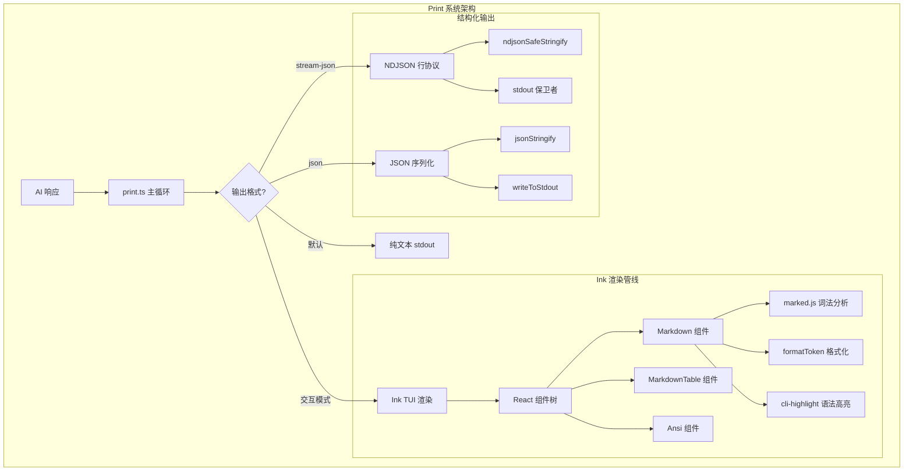
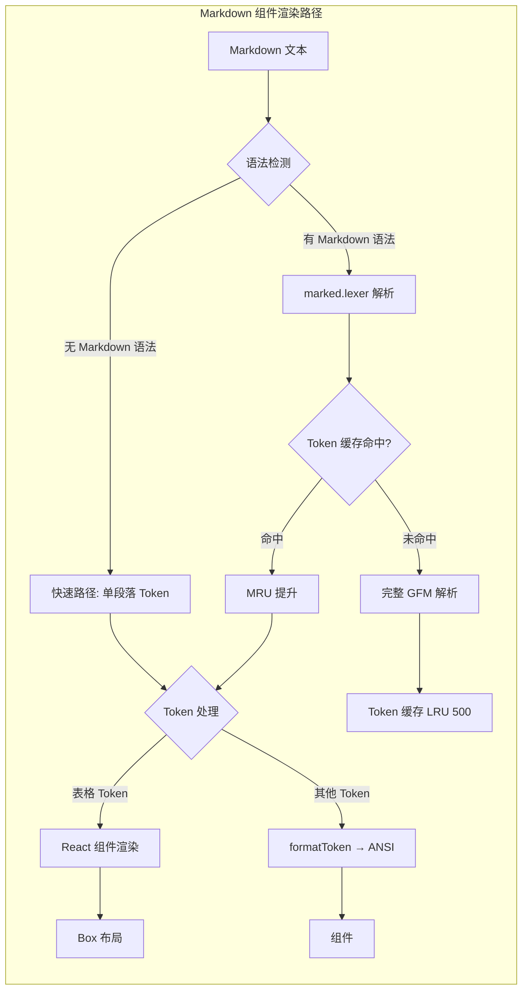
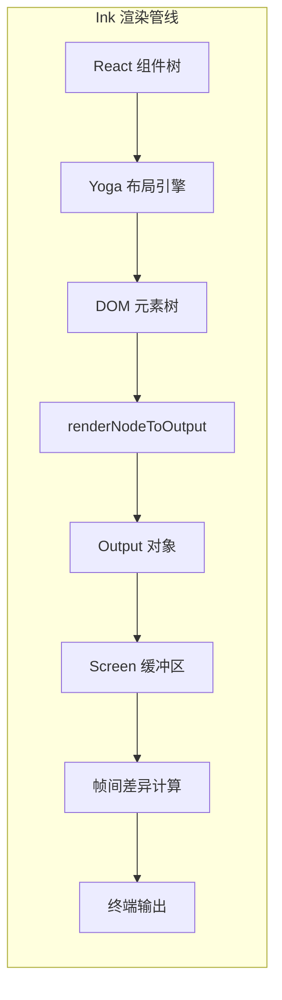
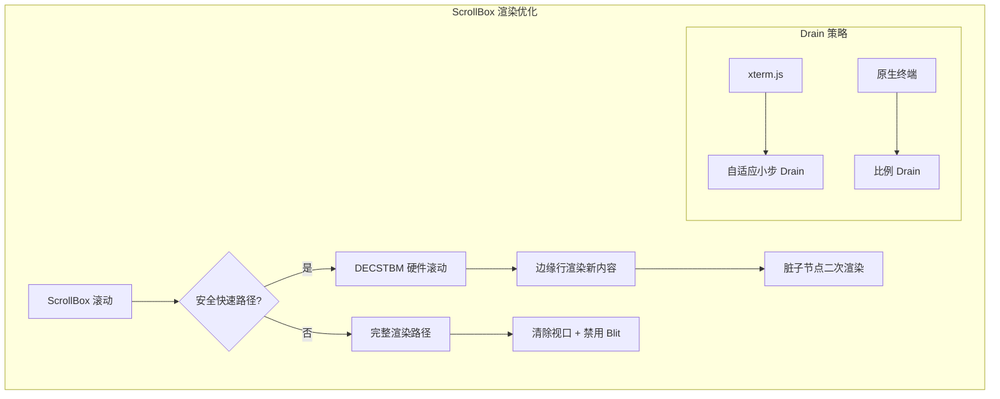
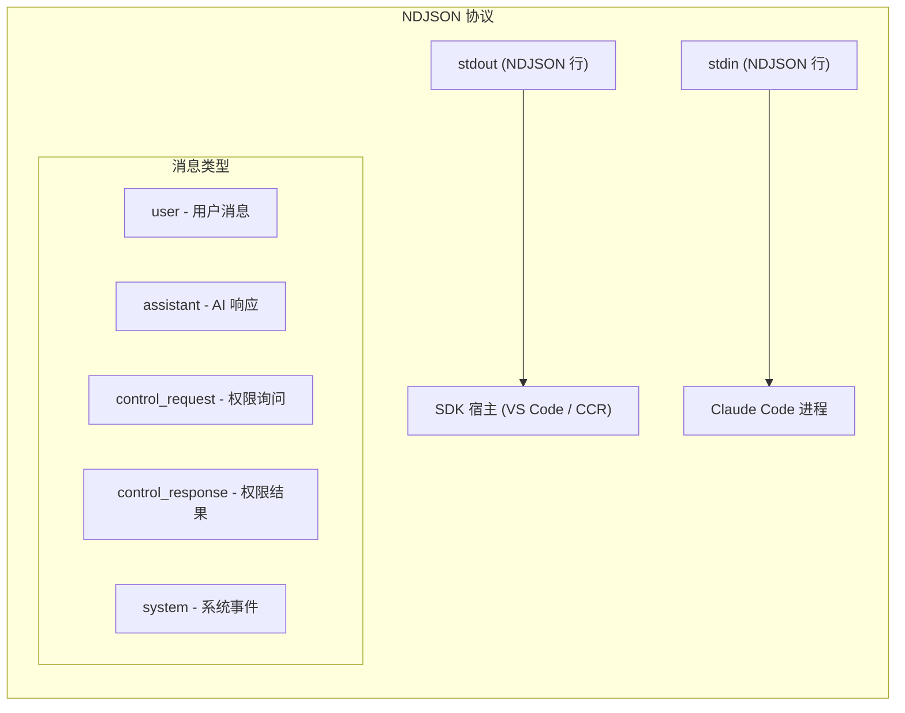
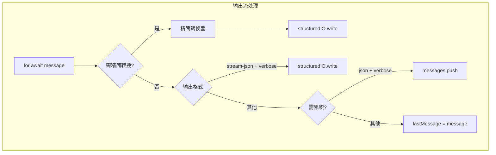
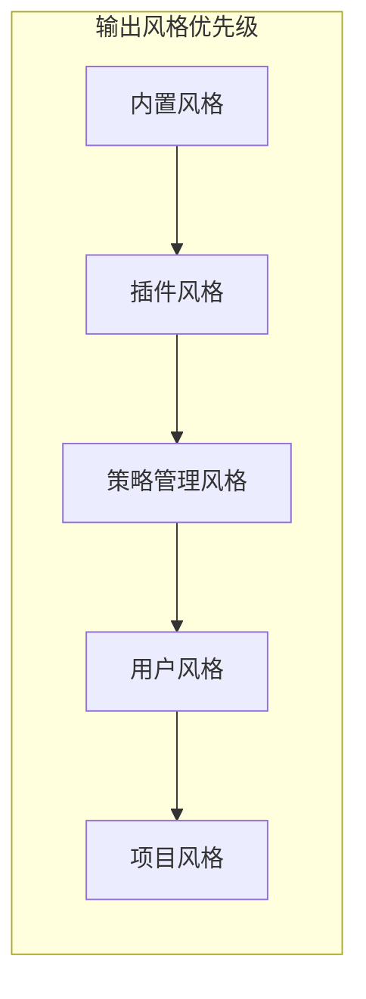
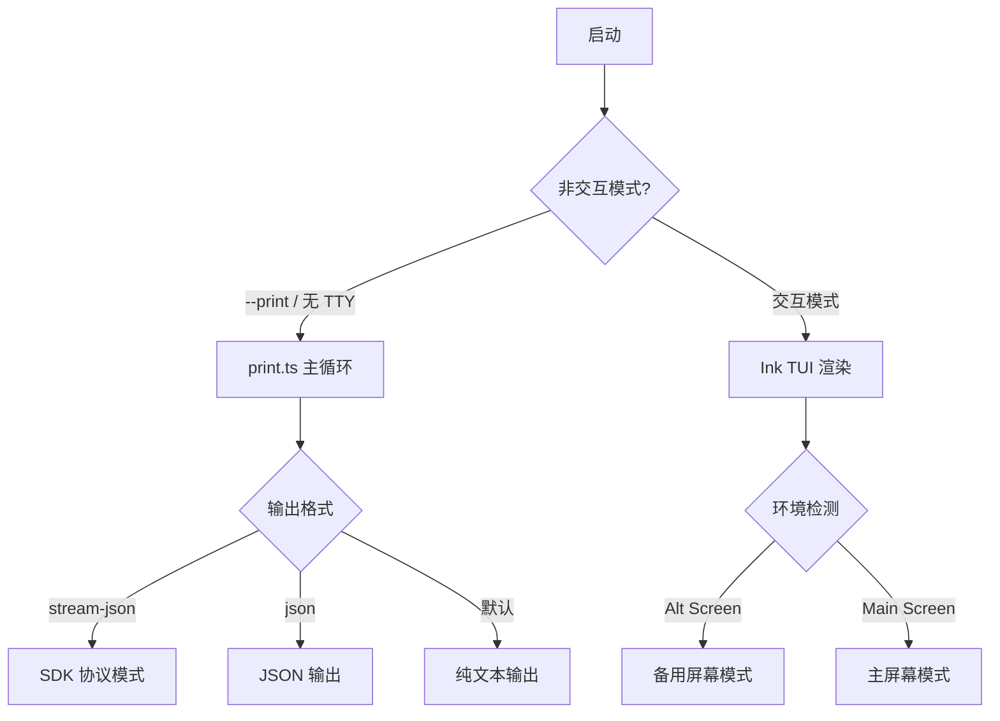

# Print/Output 系统深度分析

## 概述

Claude Code 的 Print/Output 系统是 CLI 的核心输出管道，负责将所有 AI 响应和系统信息以正确的格式呈现给用户。这个系统覆盖了从底层终端控制序列到高层结构化数据输出的完整链路，总代码量超过 5500 行（`src/cli/print.ts`），并依赖散布在 `src/utils/`、`src/ink/`、`src/components/` 等多个目录下的辅助模块。

Print 系统在 Claude Code 中承担着双重职责：

1. **交互模式（Interactive）**：通过 Ink 框架在终端中渲染完整的 TUI，包含聊天历史、Markdown 渲染、代码高亮、滚动画板等
2. **非交互模式（Non-interactive / `--print`）**：以纯文本或结构化格式（JSON/NDJSON）将结果输出到 stdout，供管道或 SDK 消费者使用



## 核心文件与职责

Print 系统的实现分布在以下核心文件中：

| 文件 | 行数 | 核心职责 |
|------|------|----------|
| `src/cli/print.ts` | 5594 | 主循环、输出格式分发、会话管理 |
| `src/cli/structuredIO.ts` | 860 | SDK 结构化 I/O 协议（NDJSON 行协议） |
| `src/cli/ndjsonSafeStringify.ts` | 33 | NDJSON 安全序列化（转义行分隔符） |
| `src/utils/markdown.ts` | 382 | Markdown 到 ANSI 终端的格式化 |
| `src/utils/cliHighlight.ts` | 55 | cli-highlight 加载器 |
| `src/utils/markdownConfigLoader.ts` | 601 | Markdown 配置文件加载器 |
| `src/utils/process.ts` | 69 | stdout/stderr 写入工具 |
| `src/utils/streamJsonStdoutGuard.ts` | 124 | stdout 非 JSON 数据保护 |
| `src/ink/render-node-to-output.ts` | 1463 | Ink 节点到终端输出的递归渲染 |
| `src/ink/output.ts` | ~500 | 操作收集与 Screen 应用 |
| `src/ink/renderer.ts` | ~200 | Ink Frame 渲染器 |
| `src/ink/stringWidth.ts` | 223 | 终端宽度计算 |
| `src/components/Markdown.tsx` | 236 | React Markdown 渲染组件 |
| `src/components/MarkdownTable.tsx` | 322 | React Markdown 表格组件 |
| `src/components/design-system/color.ts` | 31 | 主题感知颜色函数 |
| `src/constants/outputStyles.ts` | 217 | 内置输出风格定义 |

## Markdown 终端渲染

### marked.js 集成

Claude Code 使用 `marked` 库进行 Markdown 词法分析。在 `src/utils/markdown.ts` 中，`configureMarked()` 函数对 marked 进行了定制配置：

```typescript
export function configureMarked(): void {
  if (markedConfigured) return
  markedConfigured = true
  marked.use({
    tokenizer: {
      del() {
        return undefined  // 禁用删除线解析
      },
    },
  })
}
```

关键设计决策：**禁用删除线解析**。AI 模型经常使用 `~` 符号表示"近似"（如 `~100`），而很少有意使用删除线格式。通过禁用删除线令牌化，避免了大量误解析。

### 双路径渲染策略

`src/components/Markdown.tsx` 实现了精妙的双路径渲染策略：



核心优化包括：

1. **快速语法检测**：`hasMarkdownSyntax()` 使用单次正则检测前 500 字符，若完全无 Markdown 语法则跳过 marked.lexer 的完整 GFM 解析（~3ms），直接构造单段落 Token

2. **MRU Token 缓存**：500 条上限的 LRU 缓存，按内容哈希索引。滚动历史消息时，已解析的 Token 直接命中缓存，避免反复解析

3. **流式 Markdown 渲染**：`StreamingMarkdown` 组件通过在最后一个稳定块的边界处分割来实现增量解析——只重新解析不稳定的后缀部分

### formatToken 函数

`formatToken()` 是 Markdown 渲染的核心函数，它将 marked 的 Token 树递归转换为 ANSI 转义序列字符串。处理以下 Token 类型：

- **blockquote**：使用 `chalk.dim` 的竖线前缀 + `chalk.italic` 斜体文本
- **code**：委托给 cli-highlight 执行语法高亮
- **codespan**：内联代码，使用主题色 `permission` 着色
- **em/strong**：分别使用 `chalk.italic` 和 `chalk.bold`
- **heading**：h1 使用 `chalk.bold.italic.underline`，h2+ 仅使用 `chalk.bold`
- **link**：使用 OSC 8 超链接转义序列，邮箱链接被特殊处理为纯文本
- **list**：递归支持嵌套列表，深度 1 使用数字，深度 2 使用字母，深度 3 使用罗马数字
- **table**：自动列宽计算、对齐处理、ANSI 感知文本换行

GitHub Issue 引用自动转换为超链接：

```typescript
const ISSUE_REF_PATTERN =
  /(^|[^\w./-])([A-Za-z0-9][\w-]*\/[A-Za-z0-9][\w.-]*)#(\d+)\b/g
```

匹配 `owner/repo#NNN` 格式，转换为指向 `https://github.com/owner/repo/issues/NNN` 的 OSC 8 超链接。

## 代码语法高亮

### cli-highlight 集成

代码语法高亮通过 `cli-highlight` 库实现，该库内部使用 `highlight.js`。加载策略是**单例延迟加载**：

```typescript
let cliHighlightPromise: Promise<CliHighlight | null> | undefined

async function loadCliHighlight(): Promise<CliHighlight | null> {
  try {
    const cliHighlight = await import('cli-highlight')
    const highlightJs = await import('highlight.js')
    loadedGetLanguage = highlightJs.getLanguage
    return {
      highlight: cliHighlight.highlight,
      supportsLanguage: cliHighlight.supportsLanguage,
    }
  } catch {
    return null
  }
}
```

延迟加载的设计意图：
- Markdown 组件在首次渲染时以 `<Suspense>` 包裹——后备方案使用 `highlight={null}` 显示纯文本
- cli-highlight 加载完成后（~50ms），组件自动切换为高亮版本
- 共享 Promise 确保多个组件不会重复加载

### 语言检测与回退

在 `formatToken` 的 code 分支中：

```typescript
if (token.lang) {
  if (highlight.supportsLanguage(token.lang)) {
    language = token.lang
  } else {
    // 回退到 plaintext
  }
}
```

语言不支持时不会静默失败，而是回退到 `plaintext` 并记录调试日志，避免高亮错误毁坏输出。

## 终端输出格式化

### Ink TUI 渲染引擎

Claude Code 使用定制的 Ink 渲染引擎（fork 自 `vadimdemedes/ink`）来实现终端 UI。其核心渲染管线包括：



关键特性：
- **Yoga 布局**：使用 Facebook 的 Yoga 跨平台布局引擎，支持 Flexbox
- **双缓冲**：前帧/后帧双缓冲架构，仅发送变更区域
- **DECSTBM 滚动优化**：通过终端硬件滚动指令优化 ScrollBox 的滚动性能

### renderNodeToOutput 递归渲染

`src/ink/render-node-to-output.ts`（1463 行）是整个 Ink 渲染引擎的核心。它将 DOM 元素树递归渲染为 Output 操作，然后应用到 Screen 缓冲区。

关键节点类型处理：

- **ink-text**：文本节点。处理 ANSI 样式、OSC 8 超链接、文本换行（`wrap`/`wrap-trim`/`truncate`/`truncate-middle`/`truncate-end`）
- **ink-box**：容器节点。处理背景色填充、滚动容器（ScrollBox）、溢出裁剪
- **ink-root**：根节点。递归渲染子节点
- **ink-raw-ansi**：预渲染 ANSI 内容。直接输出，跳过样式重应用

滚动优化策略：



xterm.js 和原生终端采用不同的 pendingScrollDelta drain 策略，确保 VS Code 集成和独立终端的滚动体验都丝滑流畅。

### 字符串宽度计算

`src/ink/stringWidth.ts` 实现了精确的终端字符串宽度计算。优先使用 Bun 原生实现（`Bun.stringWidth`），回退到 JavaScript 实现。

JavaScript 回退实现的关键特性：
- **纯 ASCII 快速路径**：跳过所有 Unicode 处理
- **ANSI 剥离**：宽度计算前先移除 ANSI 转义序列
- **Emoji 处理**：字素分段器正确处理 ZWJ 序列、肤色修饰符、国旗
- **零宽字符**：全面的零宽字符检测（组合变音符号、梵文连接符、泰语元音符号等）

### stdout 保卫者

当使用 `--output-format=stream-json` 时，依赖库的任何 `console.log` 都可能破坏 NDJSON 流。`installStreamJsonStdoutGuard()` 通过包装 `process.stdout.write` 来解决这个问题：

```typescript
process.stdout.write = function(chunk, encodingOrCb, cb) {
  // 缓冲直到遇到换行符
  // 每个完整行执行 JSON.parse
  // 合法的 JSON 行 → 转发到原始 stdout
  // 非法的 JSON 行 → 重定向到 stderr
}
```

这将所有非 JSON 输出自动分流到 stderr，确保 NDJSON 流始终保持干净。

## 结构化输出模式

### NDJSON 行协议

SDK 模式使用 NDJSON（Newline-Delimited JSON）进行通信。`StructuredIO` 类管理整个协议：



`ndjsonSafeStringify()` 确保 JSON 串中不包含 JavaScript 行终结符（U+2028 LINE SEPARATOR、U+2029 PARAGRAPH SEPARATOR），这些字符会被某些接收端错误地识别为行分隔符：

```typescript
const JS_LINE_TERMINATORS = /
|
/g
function escapeJsLineTerminators(json: string): string {
  return json.replace(JS_LINE_TERMINATORS, c =>
    c === '
' ? '\\u2028' : '\\u2029',
  )
}
```

### JSON 输出模式

`--output-format=json` 模式在会话结束时将所有消息序列化为 JSON：

```
# 非 verbose 模式：仅输出最后一条 result 消息
writeToStdout(jsonStringify(lastMessage) + '\n')

# verbose 模式：输出完整消息数组
writeToStdout(jsonStringify(messages) + '\n')
```

内存优化：仅在 `json + verbose` 模式下才在内存中累积完整消息数组。默认模式仅保留 `lastMessage`。

### 纯文本输出模式

默认输出模式根据结果子类型格式化：

| 子类型 | 输出 |
|--------|------|
| `success` | 直接输出 `lastMessage.result`（追加换行符） |
| `error_during_execution` | `Execution error` |
| `error_max_turns` | `Error: Reached max turns (N)` |
| `error_max_budget_usd` | `Error: Exceeded USD budget ($X)` |
| `error_max_structured_output_retries` | `Error: Failed to provide valid structured output...` |

### 输出流控制

主循环输出流在 `print.ts` 的 `runHeadlessStreaming()` 中处理：



## 输出风格系统

Claude Code 支持可扩展的输出风格，定义在 `src/constants/outputStyles.ts` 中：



加载流程为：加载所有风格 → 检查是否有强制风格（`forceForPlugin`）→ 多强制风格时选择第一个并记录警告 → 否则使用用户设置的风格。

内置输出风格包括：

- **default**（null）：标准行为
- **Explanatory**：在编写代码前后提供教育性见解
- **Learning**：要求用户参与 2-10 行的手写练习

每种风格本质上是一个系统提示扩展，通过 `prompt` 字段向 AI 注入行为指令。

## 错误与警告格式化

### 双通道输出

错误输出遵循"格式感知"策略：

```typescript
function emitLoadError(message: string, outputFormat: string | undefined): void {
  if (outputFormat === 'stream-json') {
    // 结构化的 JSON 错误对象
    process.stdout.write(jsonStringify(errorResult) + '\n')
  } else {
    // 纯文本到 stderr
    process.stderr.write(message + '\n')
  }
}
```

- **stream-json 模式**：结构化 JSON 错误对象输出到 stdout
- **其他模式**：纯文本错误到 stderr

### EPIPE 处理

`registerProcessOutputErrorHandlers()` 在 stdout/stderr 上安装 EPIPE 错误处理器，防止管道断裂（如 `claude -p '...' | head -1`）导致内存泄漏或崩溃。

## 关键函数责任矩阵

| 函数/类 | 文件 | 职责 |
|---------|------|------|
| `print()` | `src/cli/print.ts:450` | 非交互模式主入口，初始化会话、运行主循环、输出结果 |
| `runHeadlessStreaming()` | `src/cli/print.ts:976` | 非交互模式下异步迭代 AI 响应 |
| `StructuredIO` | `src/cli/structuredIO.ts:135` | SDK 结构化 I/O 协议实现 |
| `StructuredIO.read()` | `src/cli/structuredIO.ts:215` | 按行读取并解析 stdin 消息 |
| `StructuredIO.write()` | `src/cli/structuredIO.ts:465` | 写入 NDJSON 到 stdout |
| `StructuredIO.createCanUseTool()` | `src/cli/structuredIO.ts:533` | 创建 SDK 权限询问函数（Hook vs SDK 竞速） |
| `applyMarkdown()` | `src/utils/markdown.ts:36` | Markdown → ANSI 字符串入口 |
| `formatToken()` | `src/utils/markdown.ts:49` | 递归格式化 Markdown Token |
| `Markdown` | `src/components/Markdown.tsx:78` | React Markdown 渲染组件 |
| `StreamingMarkdown` | `src/components/Markdown.tsx:186` | 流式 Markdown 增量渲染组件 |
| `MarkdownTable` | `src/components/MarkdownTable.tsx:72` | 响应式 Markdown 表格渲染 |
| `loadCliHighlight()` | `src/utils/cliHighlight.ts:23` | 延迟加载 cli-highlight |
| `renderNodeToOutput()` | `src/ink/render-node-to-output.ts:387` | DOM 节点 → Output 操作递归渲染 |
| `Output` | `src/ink/output.ts:170` | 写/裁剪/清除 操作收集器 |
| `createRenderer()` | `src/ink/renderer.ts:34` | Ink Frame 渲染器工厂 |
| `stringWidth()` | `src/ink/stringWidth.ts:220` | 终端显示宽度计算 |
| `getBaseRenderOptions()` | `src/utils/renderOptions.ts:68` | Ink 渲染选项（含 stdin 覆盖） |
| `getAllOutputStyles()` | `src/constants/outputStyles.ts:137` | 加载所有输出风格（含缓存） |
| `installStreamJsonStdoutGuard()` | `src/utils/streamJsonStdoutGuard.ts:49` | NDJSON 流保护 |
| `ndjsonSafeStringify()` | `src/cli/ndjsonSafeStringify.ts:30` | NDJSON 安全序列化 |
| `writeToStdout()` | `src/utils/process.ts:28` | 安全写入 stdout（EPIPE 感知） |
| `createCanUseToolWithPermissionPrompt()` | `src/cli/print.ts:4149` | 创建带权限提示的工具许可函数（中止竞速） |
| `getCanUseToolFn()` | `src/cli/print.ts:4267` | 根据配置创建 CanUseTool 函数（stdio/MCP/无） |
| `handleInitializeRequest()` | `src/cli/print.ts:4336` | 处理 SDK 初始化请求 |
| `removeInterruptedMessage()` | `src/cli/print.ts:4875` | 移除中断消息及其哨兵 |
| `color()` | `src/components/design-system/color.ts:9` | 主题感知颜色函数 |

## 输出缓冲与流式控制

### 内存管理

主循环在输出流处理中采用内存优化策略：

- **默认模式**：仅保留 `lastMessage`，不累积历史
- **json+verbose 模式**：累积完整 `messages[]` 数组
- **stream-json 模式**：每条消息立即通过 `structuredIO.write()` 流式输出

### 精简输出模式

当 `CLAUDE_CODE_STREAMLINED_OUTPUT=true` 且输出格式为 `stream-json` 时，`createStreamlinedTransformer()` 会对 AI 响应进行实时精简转换，去除冗余中间字段，降低 SDK 消费端的处理负担。

### 消息过滤

在累积过程中，以下消息类型被过滤，不进入 `lastMessage`：

```
control_response, control_request, control_cancel_request
system (session_state_changed, task_notification, task_started, task_progress, post_turn_summary)
stream_event, keep_alive, streamlined_text, streamlined_tool_use_summary, prompt_suggestion
```

确保 `lastMessage` 始终停留在有意义的 `result` 消息上。

## Markdown 表格渲染

Markdown 表格是渲染中特别复杂的部分，因为终端宽度有限且需要处理 ANSI 格式化文本。

`MarkdownTable` 组件实现了：

1. **列宽计算**：三阶段算法——最小宽度（最长单词）、理想宽度（完整内容）、可用宽度（终端宽度 - 边框开销）
2. **空间分配**：如果理想宽度总和小于可用宽度，直接使用；否则按比例缩放到最小宽度后，再分配剩余空间
3. **硬换行**：当即使最小宽度也超限时，允许单词内断行
4. **行数检测**：如果换行后行数超过 `MAX_ROW_LINES`（4），自动切换到垂直键值对格式
5. **ANSI 感知换行**：`wrapText` 函数在换行时保留 ANSI 样式，正确处理跨行样式连续性

安全边距 `SAFETY_MARGIN = 4` 防止终端尺寸变化导致的边界闪烁。

## 与 Ink TUI 的集成

### 渲染模式路由

在 `main.tsx` 中，渲染模式根据终端环境和参数路由：



### 初始化流程

在 `print.ts` 的函数 `print()`（行 ~450）中，非交互模式的初始化流程包括：

1. 创建 `StructuredIO` 实例
2. 安装 `streamJsonStdoutGuard`（如需要）
3. 注册 Hook 事件处理器（`registerHookEventHandler`）
4. 加载初始消息（`loadInitialMessages`，支持 continue/resume）
5. 设置 `CanUseToolFn`（权限询问机制）
6. 注册 EPIPE 处理器
7. 生成模型选项（`ensureModelStringsInitialized`）
8. 进入主循环（`runHeadlessStreaming`）
9. 根据输出格式处理最终结果

### 错误处理路径

主循环的错误通过 `gracefulShutdownSync()` 处理，设置 `process.exitCode` 并在返回前清理资源。`emitLoadError()` 函数提供统一的错误输出接口，即使在会话加载失败时也能正确格式化。

## 总结

Claude Code 的 Print/Output 系统是一个多层次、高度优化的输出管道，融合了：

- **marked.js** 的 Markdown 解析与 ANSI 格式化
- **cli-highlight** / **highlight.js** 的代码语法高亮
- **Ink TUI 引擎**的终端渲染（Yoga 布局、DECSTBM 滚动优化、双缓冲差异）
- **NDJSON 行协议**的 SDK/IDE 集成
- **安全序列化**（行终结符转义、stdout 保卫者）
- **内存优化**（按需累积、智能过滤）
- **EPIPE 容错**（管道断裂保护）

整个系统在交互式终端体验和结构化输出之间取得了平衡，既支持人类友好的富文本终端 UI，也支持机器可解析的流式 JSON 协议，为 Claude Code 的多种部署形态（独立 CLI、VS Code 扩展、CCR 远程会话）提供了统一的输出基础设施。
