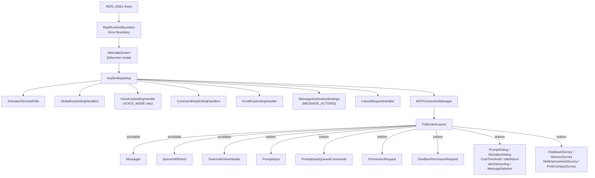
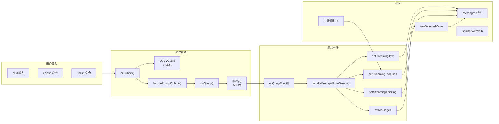

# REPL Screen 深度解析：Claude Code 的交互核心

> 本文基于 `src/screens/REPL.tsx`（5061 行）源码，全面剖析 Claude Code 主交互界面的架构设计与实现细节。

## 概述

`REPL.tsx` 是 Claude Code 整个 TUI 系统的**核心组件**，它是一个 5061 行的巨型 React 组件（使用 Ink 框架渲染终端 UI），承载了用户与 Claude 之间的全部交互流程——从输入提交、消息渲染、流式输出、工具调用可视化，到权限对话框、会话恢复、快捷键处理等。

REPL 的名称源自 "Read-Eval-Print Loop" 的传统概念，但在 Claude Code 中它是一个远更复杂的交互系统：不再是简单的输入-求值-输出循环，而是一个包含**异步查询生命周期**、**流式内容渲染**、**工具调用管理**、**多模态对话框系统**和**键盘导航**的完整 TUI 框架。

## 1. 核心架构

### 1.1 组件层级总览

REPL 的渲染树可以概括为以下结构（简化版）：

```
<ReplRuntimeBoundary>                    // 错误边界
  <AlternateScreen>                      // 全屏模式（可选）
    <KeybindingSetup>                    // 快捷键上下文
      <AnimatedTerminalTitle />          // 终端标题动画
      <GlobalKeybindingHandlers />       // 全局快捷键
      <VoiceKeybindingHandler />         // 语音输入（可选）
      <CommandKeybindingHandlers />      // 命令快捷键
      <ScrollKeybindingHandler />        // 滚动快捷键
      <MessageActionsKeybindings />      // 消息操作快捷键
      <CancelRequestHandler />           // 取消请求处理器
      <MCPConnectionManager>             // MCP 连接管理
        <FullscreenLayout>              // 全屏布局
          scrollable={                    // 滚动内容区
            <TeammateViewHeader />
            <Messages />                 // 消息列表
            <AwsAuthStatusBox />
            <SpinnerWithVerb />          // 加载旋转指示器
            <PromptInputQueuedCommands />
          }
          bottom={                        // 底部（非滚动）
            <PermissionRequest />
            <SandboxPermissionRequest />
            <PromptDialog />
            <ElicitationDialog />
            <CostThresholdDialog />
            <IdleReturnDialog />
            <IdeOnboardingDialog />
            <MessageSelector />
            <AutoRunIssueNotification />
            <PromptInput />             // 输入框
            <FeedbackSurvey />
            <SkillImprovementSurvey />
            <IssueFlagBanner />
            <SessionBackgroundHint />
            <CompanionSprite />
            <DevBar />
          }
        </FullscreenLayout>
      </MCPConnectionManager>
    </KeybindingSetup>
  </AlternateScreen>
</ReplRuntimeBoundary>
```

### 1.2 模块组成

| 子模块 | 源码位置 | 功能 |
|--------|----------|------|
| `Messages` | `src/components/Messages.tsx` | 消息列表渲染（用户、助手、工具消息） |
| `PromptInput` | `src/components/PromptInput/PromptInput.tsx` | 文本输入框（含 typeahead） |
| `FullscreenLayout` | `src/components/FullscreenLayout.tsx` | 全屏布局容器（滚动 + 底部固定） |
| `SpinnerWithVerb` | `src/components/Spinner.tsx` | 加载动画（旋转 + 状态文字） |
| `PermissionRequest` | `src/components/permissions/PermissionRequest.tsx` | 工具权限确认对话框 |
| `MessageSelector` | `src/components/MessageSelector.tsx` | 历史消息选择/回退 |
| `ScrollKeybindingHandler` | `src/components/ScrollKeybindingHandler.tsx` | 全屏模式下的键盘滚动 |
| `CancelRequestHandler` | `src/hooks/useCancelRequest.js` | Ctrl+C 取消请求处理 |

## 2. 组件组合分析

### 2.1 Messages — 消息渲染引擎

`Messages` 是 REPL 中渲染消息列表的核心组件，接收以下关键 props：

```typescript
// REPL 第 4624 行：Messages 的 prop 传递
<Messages
  messages={displayedMessages}
  tools={tools}
  commands={commands}
  verbose={verbose}
  toolJSX={toolJSX}
  toolUseConfirmQueue={toolUseConfirmQueue}
  inProgressToolUseIDs={...}
  streamingToolUses={streamingToolUses}
  streamingText={visibleStreamingText}
  showAllInTranscript={showAllInTranscript}
  conversationId={conversationId}
  scrollRef={scrollRef}
  cursor={cursor}
  setCursor={setCursor}
/>
```

消息渲染的关键特性：
- **去重与排序**：`Messages.tsx` 内部调用 `normalizeMessages()` 和 `reorderMessagesInUI()` 进行消息去重和排序
- **分界标记**：支持 `unseenDivider` 属性，在新消息处显示"未读消息"分割线
- **流式内容**：`streamingText` 属性直接注入当前正在流式输出的文本块
- **虚拟滚动**：通过 `scrollRef` 与 `FullscreenLayout` 的 `ScrollBox` 集成，仅在 fullscreen 模式下启用

### 2.2 PromptInput — 用户输入交互

`PromptInput` 是 REPL 底部固定的输入组件，位于 `FullscreenLayout` 的 `bottom` 插槽中，不受滚动影响。其 props 传递（REPL 第 4957-4960 行）：

```
<PromptInput
  commands={commands}
  onSubmit={onSubmit}
  onAgentSubmit={onAgentSubmit}
  inputValue={inputValue}
  setInputValue={setInputValue}
  inputMode={inputMode}
  stashedPrompt={stashedPrompt}
  setStashedPrompt={setStashedPrompt}
  showBashesDialog={showBashesDialog}
  setShowBashesDialog={setShowBashesDialog}
  pastedContents={pastedContents}
  setPastedContents={setPastedContents}
  isMessageSelectorVisible={isMessageSelectorVisible}
  setIsMessageSelectorVisible={setIsMessageSelectorVisible}
  ...
/>
```

PromptInput 的关键能力：
- **Typeahead 补全**：基于输入历史、命令名称、文件路径提供自动补全建议
- **多模式输入**：支持 `prompt`（普通文本）、`bash`（Shell 命令）两种输入模式，通过 `inputMode` 状态切换
- **粘贴内容管理**：`pastedContents` 记录用户粘贴的文本和图片，按下 Ctrl+P 可查看/管理
- **输入抑制（Suppression）**：用户输入期间（`isPromptInputActive`），中断对话框自动隐藏，避免按键意外响应权限请求

### 2.3 SpinnerWithVerb — 加载状态指示

在查询执行期间，`SpinnerWithVerb` 展示一个旋转动画和当前状态描述：

```typescript
<SpinnerWithVerb
  mode={streamMode}           // 'requesting' | 'responding' | 'tool-use'
  spinnerTip={spinnerTip}     // 上下文相关的提示（从 tipScheduler 获取）
  responseLengthRef={responseLengthRef}
  apiMetricsRef={apiMetricsRef}  // TTFT/OTPS 性能指标
  loadingStartTimeRef={loadingStartTimeRef}
  totalPausedMsRef={totalPausedMsRef}
  pauseStartTimeRef={pauseStartTimeRef}
/>
```

时间跟踪通过 `loadingStartTimeRef`、`totalPausedMsRef` 和 `pauseStartTimeRef` 三个 ref 实现精确的"暂停时间排除"，当权限对话框弹出时（`focusedInputDialog === 'tool-permission'`），暂停计时累积到 `totalPausedMsRef`，不计入"活跃处理时间"。

### 2.4 FullscreenLayout — 布局容器

`FullscreenLayout` 提供终端的全屏布局：
- **scrollable 插槽**：可滚动的内容区（消息列表、Spinner、工具面板等）
- **bottom 插槽**：固定底部区（输入框、对话框、状态指示器），`flexShrink={0}` 不受滚动影响
- **overlay 插槽**：覆盖层（权限请求对话框），渲染在 Z 轴上层
- **modal 插槽**：模态框（local-jsx 命令的居中面板，如 `/mcp`, `/config`）
- **divider 标记**：`unseenDivider` 计算未读消息位置，通过 `dividerYRef` 追踪

## 3. 状态管理

REPL 的状态管理横跨多个存储层级，形成一个分层架构：

### 3.1 状态层级

| 层级 | 机制 | 用途 |
|------|------|------|
| **AppState**（全局） | Zustand store (`useAppState`) | 权限上下文、MCP 客户端、verbose、tasks |
| **Local State**（REPL 级） | React `useState` | isLoading、messages、streamingToolUses、screen |
| **Refs**（同步读写） | `useRef` | messagesRef、streamModeRef、abortControllerRef |

### 3.2 核心状态变量一览

```typescript
// AppState 订阅（REPL 第 650-671 行）
const toolPermissionContext = useAppState(s => s.toolPermissionContext);
const verbose = useAppState(s => s.verbose);
const mcp = useAppState(s => s.mcp);
const plugins = useAppState(s => s.plugins);
const tasks = useAppState(s => s.tasks);
const elicitation = useAppState(s => s.elicitation);

// REPL 本地状态
const [localCommands, setLocalCommands] = useState(initialCommands);
const [screen, setScreen] = useState<Screen>('prompt');  // 'prompt' | 'transcript'
const [messages, rawSetMessages] = useState<MessageType[]>(initialMessages ?? []);
const messagesRef = useRef(messages);                     // 同步消息引用

// 查询生命周期状态
const queryGuard = React.useRef(new QueryGuard()).current; // 状态机
const isQueryActive = React.useSyncExternalStore(queryGuard.subscribe, queryGuard.getSnapshot);
const [isExternalLoading, setIsExternalLoadingRaw] = React.useState(false);
const isLoading = isQueryActive || isExternalLoading;     // 派生状态

// 流式输出状态
const [streamingToolUses, setStreamingToolUses] = useState<StreamingToolUse[]>([]);
const [streamingThinking, setStreamingThinking] = useState<StreamingThinking | null>(null);
const [streamingText, setStreamingText] = useState<string | null>(null);

// 对话框优先级
const [focusedInputDialog, ...] = function getFocusedInputDialog() { ... }

// 队列
const [toolUseConfirmQueue, setToolUseConfirmQueue] = useState<ToolUseConfirm[]>([]);
const [promptQueue, setPromptQueue] = useState<PromptRequestQueueItem[]>([]);
const [sandboxPermissionRequestQueue, setSandboxPermissionRequestQueue] = useState<...>([]);
```

### 3.3 QueryGuard 状态机

`QueryGuard` 是 REPL 查询生命周期的**同步状态机**（REPL 第 932 行），用于替代传统的 `isLoading` boolean + 异步 setState 模式，解决了竞态条件和状态不同步问题：

```
状态转换图：
  IDLE → tryStart() → RUNNING (返回 generation)
  RUNNING → end(generation) → IDLE (校验 generation 防止回调穿透)
  RUNNING → forceEnd() → IDLE (跳过 finally 路径)
```

核心接口：
- `tryStart()`：原子性检查并转换 idle→running，返回 generation 号（正在执行时返回 null）
- `end(generation)`：校验 generation 后转换 running→idle
- `forceEnd()`：强制结束（用于 Esc 取消）
- `isActive`：当前是否在运行中（通过 `useSyncExternalStore` 订阅）

### 3.4 消息的同步反射模式

REPL 采用了一种**双重存储模式**来保证消息数据的同步性（REPL 第 1230-1254 行）：

```typescript
const setMessages = useCallback((action: React.SetStateAction<MessageType[]>) => {
  const prev = messagesRef.current;
  const next = typeof action === 'function' ? action(messagesRef.current) : action;
  messagesRef.current = next;  // 写 ref（立即生效）
  // ... 边界条件处理 ...
  rawSetMessages(next);         // 写 React state（批处理）
}, []);
```

这个模式确保了在 React 批处理周期之间，回调函数（如 `onQuery` 的 finally 块）能立即读取到最新的消息状态。

## 4. 消息渲染管线

消息渲染是 REPL 最复杂的子系统之一，涉及从用户提交到最终显示的完整管线：

### 4.1 整体流程

```
用户输入
   │
   ▼
onSubmit(input, helpers)
   │
   ├── repinScroll()                    // 滚动到底部
   ├── addToHistory()                   // 添加到历史记录
   ├── setInputValue('')                // 清空输入
   ├── setUserInputOnProcessing(input)  // 显示占位符
   ├── queryGuard.tryStart()            // 锁定查询状态机
   │
   ▼
handlePromptSubmit(input, helpers, ...)
   │
   ├── processUserInput(input)          // 解析命令、展开 skill、构建消息
   │   ├── /slash commands → 命令执行
   │   ├── !bash commands → bash 模式
   │   └── plain text → createUserMessage()
   │
   ▼
onQuery(newMessages, abortController, shouldQuery, ...)
   │
   ├── queryGuard.tryStart()            // 并发守卫
   ├── setMessages([...old, ...newMessages])  // 追加用户消息
   ├── getToolUseContext(...)            // 构建工具上下文
   ├── buildEffectiveSystemPrompt(...)   // 构建系统提示
   │
   ▼
query({messages, systemPrompt, ...})    // API 调用 + 流式处理
   │
   ▼
onQueryEvent(event)                     // 流式事件迭代器
   │
   ├── assistant message → setMessages()
   ├── content delta → setResponseLength() + setStreamingText()
   ├── tool_use block → setStreamingToolUses()
   ├── thinking block → setStreamingThinking()
   └── compact boundary → setMessages(filter) + setConversationId()
```

### 4.2 消息类型

消息系统使用一个联合类型 `MessageType`，包含多种子类型：

```typescript
type MessageType = UserMessage | AssistantMessage | SystemMessage
  | ProgressMessage | AttachmentMessage | HookResultMessage
  | CompactBoundaryMessage ...
```

消息通过 `handleMessageFromStream()`（来自 `src/utils/messages.js`）进行统一的流式事件分派。

### 4.3 消息的 Deferred 渲染

为了在流式输出期间保持输入响应性，REPL 使用了 React 18 的 `useDeferredValue`（REPL 第 1350 行）：

```typescript
const deferredMessages = useDeferredValue(messages);
const deferredBehind = messages.length - deferredMessages.length;
```

- 在流式输出期间，`messages` 频繁更新（每次 content delta），`deferredMessages` 以较低的优先级渲染
- 查询完成后或显示流式文本时，切换为同步模式（`usesSyncMessages = showStreamingText || !isLoading`）
- 当 `deferredBehind > 0` 时写入调试日志，便于性能分析

## 5. 流式消息显示

流式显示是用户体验的核心环节，涉及三个并行的状态流：

### 5.1 文本流（streamingText）

```typescript
const onStreamingText = useCallback(
  (f: (current: string | null) => string | null) => {
    if (!showStreamingText) return;  // reducedMotion 时禁用
    setStreamingText(f);
  }, [showStreamingText]
);

const visibleStreamingText = streamingText && showStreamingText
  ? streamingText.substring(0, streamingText.lastIndexOf('\n') + 1) || null
  : null;
```

关键设计决策：
- **按行显示**：`lastIndexOf('\n')` 截取最后一个换行符之前的内容，实现逐行而不是逐字符的输出效果
- **Reduced Motion**：通过 `useAppState(s => s.settings.prefersReducedMotion)` 控制，无障碍用户可关闭流式动画
- **终端兼容性**：`hasCursorUpViewportYankBug()` 检测特定终端上的重绘问题，自动禁用流式文本

### 5.2 工具调用流（streamingToolUses）

Claude 逐步构建工具调用时，流式事件产生 `StreamingToolUse` 对象数组：

```typescript
const [streamingToolUses, setStreamingToolUses] = useState<StreamingToolUse[]>([]);
```

`StreamingToolUse` 包含：
- 工具名称和输入参数（逐步填充）
- 流式状态（partial / complete）
- 生成的 tool_use ID

这些数据驱动 `Messages` 组件中工具调用的可视化渲染，让用户看到工具被"构建"的过程。

### 5.3 Thinking 块流（streamingThinking）

当 Claude 启用思考（thinking）能力时：

```typescript
const [streamingThinking, setStreamingThinking] = useState<StreamingThinking | null>(null);

// 30 秒后自动隐藏已完成的 thinking 块
useEffect(() => {
  if (streamingThinking && !streamingThinking.isStreaming && streamingThinking.streamingEndedAt) {
    const elapsed = Date.now() - streamingThinking.streamingEndedAt;
    const remaining = 30000 - elapsed;
    if (remaining > 0) {
      const timer = setTimeout(setStreamingThinking, remaining, null);
      return () => clearTimeout(timer);
    }
  }
}, [streamingThinking]);
```

- `isStreaming` 标志区分正在流式输出中和已完成的 thinking 块
- 完成后 30 秒自动从界面上消失，避免占据屏幕空间
- 在 transcript 模式下（`hidePastThinking={true}`）可完全隐藏

## 6. 工具调用可视化

工具调用是 Claude Code 的核心交互模式，REPL 通过多层次方式将其可视化：

### 6.1 工具调用的生命周期

```
Assistant 消息构建 tool_use block
  │
  ├── 流式阶段：streamingToolUses 实时显示
  │
  ├── 执行阶段：PermissionRequest（如需审批）
  │     ├── toolUseConfirmQueue 存储待审批项
  │     └── onCancel/onReject 处理拒绝
  │
  ├── 进度阶段：ProgressMessage 由工具发出
  │     └── inProgressToolUseIDs 跟踪运行中的工具
  │
  └── 完成阶段：完整的 tool_use + tool_result 进入消息历史
```

### 6.2 权限队列（toolUseConfirmQueue）

```typescript
const [toolUseConfirmQueue, setToolUseConfirmQueue] = useState<ToolUseConfirm[]>([]);

// 当 focusedInputDialog === 'tool-permission' 时渲染
{toolPermissionOverlay = focusedInputDialog === 'tool-permission'
  ? <PermissionRequest
      key={toolUseConfirmQueue[0]?.toolUseID}
      onDone={() => setToolUseConfirmQueue(([_, ...tail]) => tail)}
      toolUseConfirm={toolUseConfirmQueue[0]!}
      toolUseContext={getToolUseContext(...)}
      verbose={verbose}
    />
  : null}
```

权限请求采用队列机制允许多个工具调用依次等待审批，`focusedInputDialog` 决定当多个对话框同时激活时的显示优先级。

### 6.3 工具状态报告

- `ProgressMessage`：工具执行中的进度更新（Bash 输出、文件写入）
- `inProgressToolUseIDs`：Set<string> 跟踪当前正在执行的工具调用
- `hasInterruptibleToolInProgressRef`：用于判断是否可以安全中断当前工具

## 7. 用户输入处理

### 7.1 onSubmit — 输入提交枢纽

`onSubmit` 函数是 REPL 中最复杂的回调之一（REPL 第 3174 行），涵盖以下职责：

1. **滚动处理**：调用 `repinScroll()` 将视图滚动到底部
2. **立即命令（/immediate）**：检测命令行前缀 `/` 并判断是否为 immediate 类型，直接执行 `local-jsx` 命令
3. **空闲回归检测**：检查 `tengu_willow_mode` 和空闲时间，决定是否弹出 `IdleReturnDialog`
4. **历史记录**：调用 `addToHistory()` 记录输入到历史列表
5. **Stash 管理**：处理 stashedPrompt 的保存/恢复
6. **推测接受**：处理 Prompt Suggestion 的「猜测模式」接受
7. **远程模式**：如果处于 remote/direct-connect/SSH 模式，通过 `activeRemote.sendMessage()` 发送
8. **本地查询**：调用 `handlePromptSubmit()` 进行完整本地查询流程

### 7.2 handlePromptSubmit — 核心处理

`handlePromptSubmit` 来自 `src/utils/handlePromptSubmit.js`，职责包括：
- 解析输入（slash 命令、bash 命令、普通文本）
- 展开 skill 引用
- 构建 `UserMessage` 对象
- 调用 `onQuery` 或执行命令逻辑

### 7.3 输入模式

```typescript
const [inputMode, setInputMode] = useState<PromptInputMode>('prompt');
type PromptInputMode = 'prompt' | 'bash';
```

- **prompt 模式**：普通对话，输入直接作为用户消息发送给 Claude
- **bash 模式**：输入以 `!` 前缀，Shell 命令直接执行，输出注入到对话上下文

### 7.4 Typeahead 与命令补全

PromptInput 内部使用 `commands` 列表和前次输入历史进行自动补全。`useMergedCommands`（第 864-865 行）将三类命令源合并：

```typescript
const commandsWithPlugins = useMergedCommands(localCommands, plugins.commands);
const mergedCommands = useMergedCommands(commandsWithPlugins, mcp.commands);
```

### 7.5 队列处理器

当用户在当前查询执行期间提交新输入，输入会被排入命令队列（`useCommandQueue`）。`useQueueProcessor`（第 3937 行）在查询完成后自动按序处理队列中的命令。

## 8. 布局管理

### 8.1 主布局：FullscreenLayout

`FullscreenLayout` 是 REPL 的主要布局容器（REPL 第 4619 行），其结构为：

```
┌──────────────────────────────────────┐
│ ScrollKeybindingHandler              │
├──────────────────────────────────────┤
│ scrollable (flexGrow)                │
│  ┌────────────────────────────────┐  │
│  │ TeammateViewHeader             │  │
│  │ Messages (消息列表)            │  │
│  │ AwsAuthStatusBox               │  │
│  │ Tool JSX (非居中)              │  │
│  │ TungstenLiveMonitor (ant-only) │  │
│  │ WebBrowserPanel (可选)         │  │
│  │ SpinnerWithVerb / BriefIdle    │  │
│  │ PromptInputQueuedCommands      │  │
│  └────────────────────────────────┘  │
│ overlay (Z 轴覆盖)                   │
│  └ PermissionRequest              ┘  │
│ modal (居中底部)                      │
│  └ 居中 local-jsx (/mcp, /config)  │
├──────────────────────────────────────┤
│ bottom (flexShrink=0, 不滚动)        │
│  ┌────────────────────────────────┐  │
│  │ PermissionStickyFooter        │  │
│  │ Tool JSX (立即命令)           │  │
│  │ TaskListV2 (展开模式)         │  │
│  │ 对话框层                      │  │
│  │ PromptInput (输入框)          │  │
│  │ Survey & 通知                 │  │
│  │ CompanionSprite               │  │
│  └────────────────────────────────┘  │
└──────────────────────────────────────┘
```

### 8.2 屏幕模式

```typescript
type Screen = 'prompt' | 'transcript';
const [screen, setScreen] = useState<Screen>('prompt');
```

- **prompt 模式**：主交互界面，包含输入框和消息列表
- **transcript 模式**：只读历史查看模式（Ctrl+O 切换），完全替代主界面

### 8.3 全屏 vs 滚动模式

REPL 通过 `isFullscreenEnvEnabled()` 检测是否应使用全屏模式：

- **全屏模式**：使用 `AlternateScreen` + `FullscreenLayout` + 虚拟滚动，在终端 alt 缓冲区提供完整的滚动体验
- **滚动模式**：标准 Ink 渲染，消息限制为 30 条，通过 Ctrl+E 查看全部

### 8.4 底部栏的优先级渲染

底部区域是 REPL 最复杂的渲染部分，通过 `focusedInputDialog` 决定当前哪个对话框获得焦点（REPL 第 2049 行）：

```
优先级排序（从高到低）：
1. isExiting / exitFlow → 退出流程
2. isMessageSelectorVisible → 消息选择器
3. isPromptInputActive →（抑制中断对话框）
4. sandbox-permission → Sandbox 权限
5. tool-permission → 工具权限确认
6. prompt → Prompt 对话框
7. worker-sandbox-permission → Worker Sandbox
8. elicitation → MCP Elicitation
9. cost → 费用阈值
10. idle-return → 空闲回归
11. ultraplan-choice → Ultraplan 选择
12. ultraplan-launch → Ultraplan 启动
13. ide-onboarding → IDE 引导
14. model-switch / undercover-callout → (ant-only)
15. effort-callout / remote-callout → 功能呼出
16. lsp-recommendation / plugin-hint → LSP/插件推荐
17. desktop-upsell → 桌面应用推广
```

## 9. 错误状态与恢复

### 9.1 ReplRuntimeBoundary

REPL 被一个 React Error Boundary 包裹（REPL 第 529 行）：

```typescript
class ReplRuntimeBoundary extends React.Component<{
  children: React.ReactNode;
}, ReplRuntimeBoundaryState> {
  override state = { error: null };
  static getDerivedStateFromError(error: Error) { return { error }; }
  override componentDidCatch(error: Error) { ... }
  override render() {
    if (this.state.error) {
      return <Box flexDirection="column" paddingX={1} paddingY={1}>
        <Text color="warning">REPL entered restored fallback mode.</Text>
        <Text dimColor>{this.state.error.message}</Text>
        <Text dimColor>This session stays open so missing modules can be restored incrementally.</Text>
      </Box>;
    }
    return this.props.children;
  }
}
```

错误边界确保即使 REPL 树的部分组件崩溃，终端会话也不会完全崩溃，而是进入"降级回退模式"。

### 9.2 错误恢复机制

- **`onInit()` 错误处理**（第 3853 行）：REPL 初始化时的错误通过 `addNotification` 显示为"startup degraded"通知，而不是导致会话终止
- **状态恢复**：`resume()` 回调（第 1767 行）处理从磁盘恢复会话时的完整状态重建
- **紧凑化恢复**：`runPostCompactCleanup()` 在消息紧凑化后执行清理，确保内存状态与磁盘状态一致

## 10. 键盘快捷键与导航

### 10.1 快捷键层级

快捷键通过多个 Handler 组件分层处理：

```
GlobalKeybindingHandlers（全局快捷键）
  ├── Ctrl+O：切换 transcript 模式
  ├── Ctrl+P：粘贴内容选择器
  ├── Ctrl+B：会话背景化
  └── ...

CommandKeybindingHandlers（命令快捷键）
  ├── 映射的 Slash 命令快捷键
  └── ...

ScrollKeybindingHandler（滚动快捷键）
  ├── g/G：顶部/底部
  ├── j/k：上/下滚动
  ├── PgUp/PgDn：翻页
  ├── Home/End：行首/行尾
  └── ...

CancelRequestHandler（取消快捷键）
  ├── Ctrl+C/Esc：取消当前请求
  ├── 双击 Ctrl+C：退出程序
  └── ...

MessageActionsKeybindings（消息操作）
  ├── 消息选择/复制/编辑
  └── ...
```

### 10.2 快捷键的激活条件

每个 Handler 通过 `isActive` 属性控制是否响应按键，REPL 第 500-1550 行中有大量关于 `focusedInputDialog` 的判断逻辑，确保对话框激活时快捷键不会意外触发。

### 10.3 Transcript 模式快捷键

在 transcript 模式下（相当于 less pager），支持独有的快捷键：

| 按键 | 功能 |
|------|------|
| `/` | 打开搜索栏 |
| `n` / `N` | 下一个/上一个匹配 |
| `q` | 退出 transcript 模式 |
| `v` | 在 $EDITOR 中打开完整转录 |
| `[` | 切换 dump 模式（终端原生搜索） |
| `j` / `k` | 逐行滚动 |
| `g` / `G` | 跳转到顶部/底部 |

搜索栏通过 `TranscriptSearchBar` 组件（REPL 第 368 行）实现，使用 `useSearchInput` hook 处理行内编辑，并利用 `useSearchHighlight` 进行屏幕高亮。

## 11. REPL 与 Agent Loop 的集成

### 11.1 查询生命周期与 Agent Loop 的关系

REPL 的查询生命周期是 Agent Loop 的前端驱动：

```
用户提交 → onQuery → query() → [API Stream]
    ↑                            │
    │                            ▼
    │                    onQueryEvent() (delegate)
    │                            │
    │                            ▼
    │                    setMessages() / setStreaming*()
    │                            │
    │                            ▼
    │                    Spinner / Messages / ToolUI (渲染)
    │                            │
    └──────────────── query 完全结束 ──┘
                            │
                            ▼
                    onTurnComplete() callback
```

### 11.2 后台会话与工作线程

REPL 通过以下方式与后台任务交互：

- **`handleBackgroundSession`**（REPL 第 2608 行）：Ctrl+B 将当前会话放入后台
- **`useSessionBackgrounding`**（REPL 第 2607 行）：管理会话的前台/后台切换
- **`viewingAgentTaskId`**（REPL 第 671 行）：当用户查看 Agent 子任务时，REPL switch 到该任务的消息流
- **`SessionBackgroundHint`**（REPL 第 4960 行）：在底部栏显示后台会话提示

### 11.3 Swarm 协同

REPL 支持多 Agent 协同工作（Swarm）：

- **`registerLeaderToolUseConfirmQueue`**（REPL 第 1211 行）：注册领导者的权限队列，供子任务使用
- **`handleIncomingPrompt`**（REPL 第 4044 行）：接收来自队友或任务列表的输入作为新轮次
- **`useQueueProcessor`**（REPL 第 3937 行）：按序处理队列中的用户和系统消息

### 11.4 远程/SSH/直接连接模式

REPL 通过三个平行的 Hook 支持三种远程执行模式：

```typescript
const remoteSession = useRemoteSession({...});    // --remote (WebSocket → CCR)
const directConnect = useDirectConnect({...});    // claude connect (WebSocket → server)
const sshRemote = useSSHSession({...});           // claude ssh (ChildProcess)

const activeRemote = sshRemote.isRemoteMode ? sshRemote
  : directConnect.isRemoteMode ? directConnect
  : remoteSession;
```

## 12. 性能优化

### 12.1 React 编译器优化

REPL 使用 `react/compiler-runtime` 的 `_c` 缓存机制，如 `TranscriptModeFooter` 组件的 `$` 数组缓存：

```typescript
function TranscriptModeFooter(t0) {
  const $ = _c(9);
  // ... 条件性创建 JSX，通过 $ 数组进行记忆化比较
}
```

### 12.2 useDeferredValue 消息延迟

流式输出期间通过 `useDeferredValue` 延迟消息渲染，确保输入框始终流畅响应。

### 12.3 流式文本的 Ref 优化

`streamModeRef` 和 `responseLengthRef` 使用 ref 而不是 state 存储频繁变化的值，避免不必要的全组件重渲染。

### 12.4 条件性死代码消除

通过 `feature()` 编译时常量和 `"external" === 'ant'` 条件，ant-only 的功能（如 Tungsten、Proactive、Buddy）在外部构建中被完全消除：

```typescript
const useFrustrationDetection = "external" === 'ant'
  ? require('../components/FeedbackSurvey/useFrustrationDetection.js').useFrustrationDetection
  : () => ({ state: 'closed', handleTranscriptSelect: () => {} });
```

### 12.5 终端标题动画的隔离

`AnimatedTerminalTitle`（REPL 第 484 行）被提取为独立的叶子组件，960ms 的动画 tick 只重渲染这个 null 组件，而不是整个 REPL 树。

## 13. Mermaid 图表

### 13.1 组件树



### 13.2 消息渲染数据流



### 13.3 对话框优先级系统

```mermaid
graph TD
    FI["focusedInputDialog<br/>优先级判断"]
    subgraph High["高优先级"]
        EXIT["isExiting / exitFlow"]
        MSGSEL["isMessageSelectorVisible<br/>MessageSelector"]
    end
    subgraph Suppressed["输入抑制"]
        TYPING["isPromptInputActive<br/>← 用户输入中<br/>(所有中断对话框隐藏)"]
    end
    subgraph Permission["权限类"]
        SP["sandbox-permission<br/>SandboxPermissionRequest"]
        TP["tool-permission<br/>PermissionRequest"]
        PROMPT["prompt<br/>PromptDialog"]
        WSP["worker-sandbox-permission"]
        ELICIT["elicitation<br/>ElicitationDialog"]
    end
    subgraph Info["信息/设置类"]
        COST["cost<br/>CostThresholdDialog"]
        IDLE["idle-return<br/>IdleReturnDialog"]
        ULTRA["ultraplan-choice/launch"]
        IDE["ide-onboarding"]
        MS["model-switch / undercover<br/>(ant-only)"]
        EFFORT["effort-callout<br/>remote-callout"]
        LSP["lsp-recommendation<br/>plugin-hint"]
    end

    FI --> EXIT
    FI --> MSGSEL
    FI --> TYPING
    FI --> SP
    FI --> TP
    FI --> PROMPT
    FI --> WSP
    FI --> ELICIT
    FI --> COST
    FI --> IDLE
    FI --> ULTRA
    FI --> IDE
    FI --> MS
    FI --> EFFORT
    FI --> LSP
```



## 14. 关键设计模式总结

### 14.1 Zustand Ref 同步模式

REPL 中最关键的设计模式之一是 Zustand 风格的"ref 是源头，React state 是渲染投影"：

```
messagesRef (同步, useRef)
    ↑ 实时写入
    ↓ 实时读取
  setMessages() 包装器
    │
    ▼
rawSetMessages() (React batch)
    │
    ▼
messages (渲染用 state)
```

### 14.2 查询状态机模式

使用 `QueryGuard` 替代 isLoading boolean，避免异步竞态：

```
tryStart() → running → end() → idle
                ↑            ↑
          UI 锁定      finally 块执行
```

### 14.3 冻结状态模式

在进入 transcript 模式时，`frozenTranscriptState` 存储消息长度快照而非克隆整个数组，内存效率更高：

```typescript
const [frozenTranscriptState, setFrozenTranscriptState] = useState<{
  messagesLength: number;
  streamingToolUsesLength: number;
} | null>(null);
```

### 14.4 事件源模式

流式输出采用事件源模式（REPL 第 2825 行）：

```typescript
for await (const event of query({...})) {
  onQueryEvent(event);
}
```

每个 API 流事件由 `onQueryEvent` 统一处理，分派到不同的状态更新路径。

## 15. 总结

REPL 是 Claude Code 的**交互中枢**，5016 行的组件代码体现了多种复杂 TUI 设计模式的无缝集成：

- **组件组合**：通过 Ink 框架的盒子模型和 Flexbox 构建终端 UI，利用 `FullscreenLayout` 实现滚动/固定区域分离
- **状态管理**：采用 Zustand + React state + ref 的三层架构，平衡响应性能与渲染效率
- **流式渲染**：使用 React 18 的 `useDeferredValue` 和自定义的逐行渲染逻辑，在流式输出时保持界面流畅
- **异步生命周期**：通过 `QueryGuard` 状态机和 generation 校验，确保查询生命周期的安全性和避免竞态
- **层次化交互**：`focusedInputDialog` 优先级系统管理多达 18+ 种对话框的显示与冲突解决
- **死代码消除**：通过编译时常量 `feature()` 和 `"external" === 'ant'`，在外部构建中彻底移除 ant-only 功能模块
- **错误弹性**：`ReplRuntimeBoundary` 错误边界和降级回退模式，确保核心会话在局部故障时继续运行
