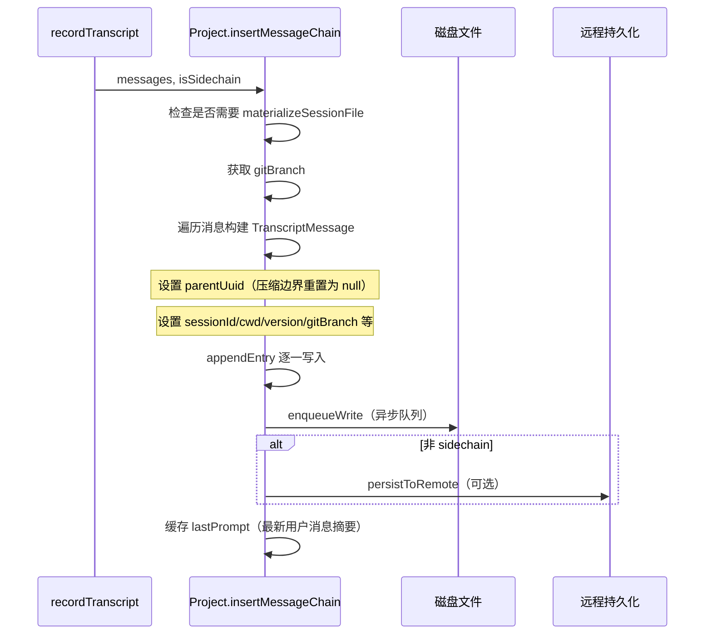
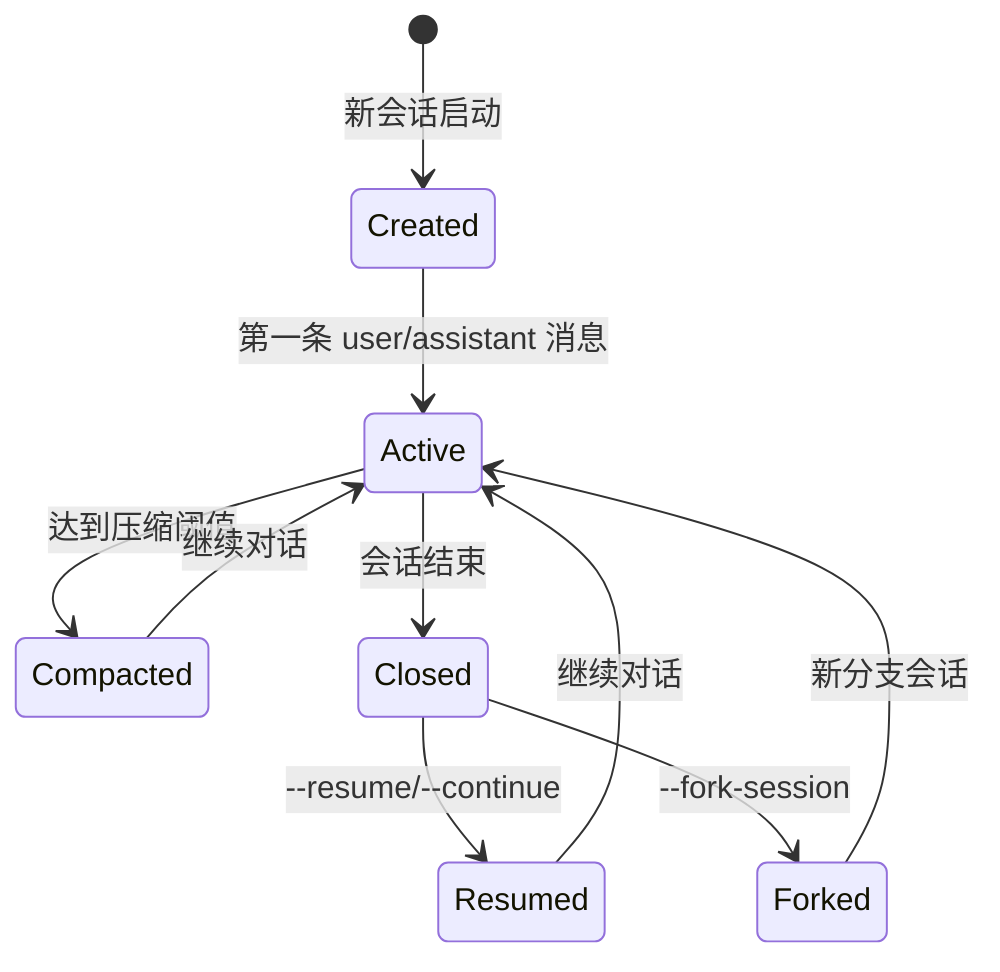
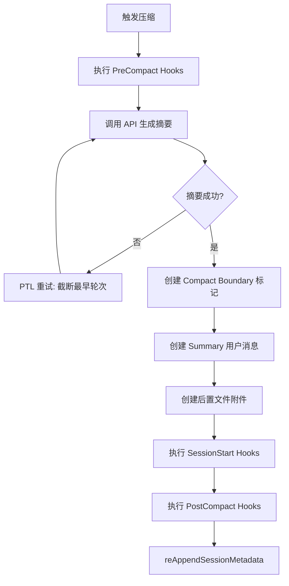
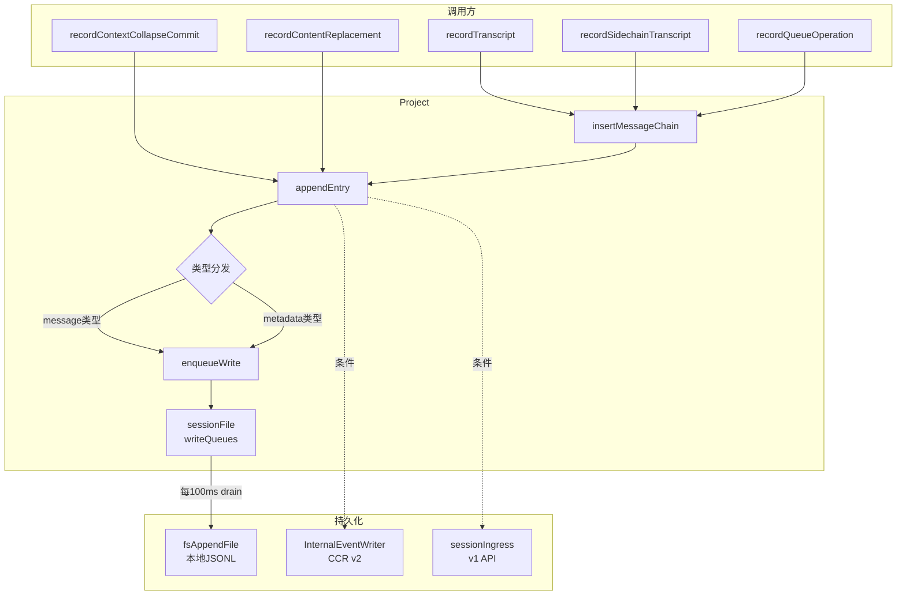
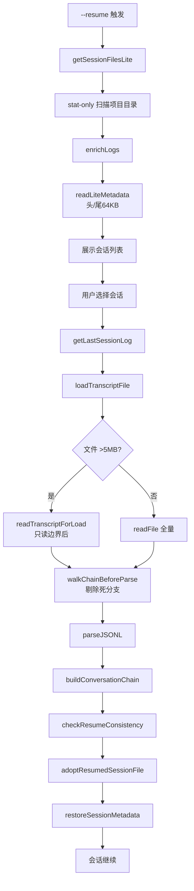

# 会话存储系统深度分析

## 概述

会话存储系统是 Claude Code 最核心的持久化基础设施，负责将每一次 CLI 交互完整记录到磁盘，并支持断点续传（`--resume`）、分支管理（`--fork`）、会话压缩（compact）等高级功能。该系统的实现集中在 `src/utils/sessionStorage.ts`（5105 行，仓库中单体最大的文件之一）以及辅助模块 `src/utils/sessionStoragePortable.ts` 和服务端压缩模块 `src/services/compact/`。

## 一、文件格式规范

### 1.1 JSONL 格式

会话文件采用 **JSONL（JSON Lines）** 格式存储，每一行是一个独立的 JSON 对象，以换行符 `\n` 分隔。文件扩展名为 `.jsonl`，存储在路径：

```
~/.claude/projects/<sanitized-cwd>/<sessionId>.jsonl
```

其中 `<sanitized-cwd>` 是当前工作目录经过清理后的安全路径名（非字母数字字符替换为 `-`，超长路径截断并追加哈希后缀），`<sessionId>` 是 UUID v4。

**格式示例**：

```
{"parentUuid":null,"type":"user","uuid":"a1b2...","timestamp":"2025-01-01T00:00:00.000Z",...}
{"parentUuid":"a1b2...","type":"assistant","uuid":"c3d4...","timestamp":"2025-01-01T00:00:01.000Z",...}
{"type":"summary","leafUuid":"c3d4...","summary":"用户询问了关于...",...}
{"type":"custom-title","customTitle":"修复登录bug","sessionId":"..."}
```

### 1.2 条目类型（Entry Types）

系统定义了丰富的条目类型，`src/utils/sessionStorage.ts` 中的 `appendEntry()` 方法（第 1128 行）通过类型分发处理每一种条目：

| 类型 | 用途 | 写入条件 |
|------|------|----------|
| `user` | 用户消息 | 始终写入 |
| `assistant` | 助手回复 | 始终写入 |
| `attachment` | 附件消息 | 始终写入 |
| `system` | 系统消息 | 始终写入 |
| `summary` | 压缩摘要 | 始终追加 |
| `custom-title` | 用户自定义标题 | 始终追加 |
| `ai-title` | AI 生成的标题 | 始终追加 |
| `last-prompt` | 最近一次提示 | 始终追加 |
| `task-summary` | 任务进度摘要 | 始终追加 |
| `tag` | 会话标签 | 始终追加 |
| `agent-name` | Agent 名称 | 始终追加 |
| `agent-color` | Agent 颜色 | 始终追加 |
| `agent-setting` | Agent 设置 | 始终追加 |
| `mode` | 会话模式 | 始终追加 |
| `worktree-state` | Worktree 状态 | 始终追加 |
| `pr-link` | PR 链接 | 始终追加 |
| `file-history-snapshot` | 文件历史快照 | 始终追加 |
| `attribution-snapshot` | 归因快照 | 始终追加 |
| `content-replacement` | 内容替换记录 | 始终追加 |
| `marble-origami-commit` | Context Collapse 提交 | 始终追加 |
| `marble-origami-snapshot` | Context Collapse 快照 | 始终追加 |
| `queue-operation` | 队列操作 | 始终追加 |
| `speculation-accept` | 推测接受 | 始终追加 |
| `progress`（遗留） | 进度消息（已废弃） | 不再写入 |

关键设计原则：**`progress` 类型的消息不参与 `parentUuid` 链**（`isChainParticipant()` 第 154 行）。这是 PR #23537 的修复——将进度消息纳入链会导致恢复时出现链分叉。

### 1.3 树形结构（parentUuid 链）

会话中的每条 `user/assistant/attachment/system` 消息都带有 `parentUuid` 字段，形成一个单向链表：

```
parentUuid=null → user:A → parentUuid=A → assistant:B → parentUuid=B → user:C → ...
```

`buildConversationChain()`（第 2069 行）从最新的叶子消息出发，沿 `parentUuid` 反向遍历直到 `null`，然后反转数组得到正序对话链。该函数包含循环检测（`seen` 集合），防止畸形数据导致无限循环。

## 二、Project 类——核心管理器

### 2.1 类职责

`sessionStorage.ts` 第 532-1384 行定义了 `Project` 类（注意：并非 `SessionManager`，代码中使用 `Project` 命名），采用单例模式通过 `getProject()`（第 443 行）访问。其核心职责包括：

- **会话文件生命周期管理**：创建、写入、清空会话文件
- **写队列调度**：异步批量写入，支持每文件独立队列
- **元数据缓存**：维护会话标题、标签、Agent 名称/颜色等缓存
- **远程持久化**：通过 CCR v2 内部事件或 Session Ingress API 写入远程
- **消息去重**：通过 `messageSet`（UUID 集合）防止重复写入

### 2.2 写队列机制

`Project` 类实现了一套高效的异步写队列（第 606-686 行）：

```
enqueueWrite(filePath, entry)
    → 写入 per-file queue
    → scheduleDrain() 启动 100ms 定时器
        → drainWriteQueue() 批量写入
            → 每批次最大 100MB（MAX_CHUNK_BYTES）
            → 达到上限时先刷出当前 chunk 再继续
```

核心设计：

```typescript
// 第 606-616 行
private enqueueWrite(filePath: string, entry: Entry): Promise<void> {
  return new Promise<void>(resolve => {
    let queue = this.writeQueues.get(filePath)
    if (!queue) {
      queue = []
      this.writeQueues.set(filePath, queue)
    }
    queue.push({ entry, resolve })
    this.scheduleDrain()
  })
}
```

- **`FLUSH_INTERVAL_MS`**：默认 100ms，启用远程持久化时降至 10ms
- **批量合并**：多个条目合并为一次 `fsAppendFile` 调用
- **背压控制**：`trackWrite()` 维护 `pendingWriteCount`，允许调用者 `await flush()`

### 2.3 insertMessageChain——消息写入核心

`insertMessageChain()`（第 993 行）是消息写入的主入口，处理完整的消息链写入流程：



消息写入时的关键字段：

```typescript
// 第 1039-1064 行
const transcriptMessage: TranscriptMessage = {
  parentUuid: isCompactBoundary ? null : effectiveParentUuid,
  logicalParentUuid: isCompactBoundary ? parentUuid : undefined,
  isSidechain,
  teamName: teamInfo?.teamName,
  agentName: teamInfo?.agentName,
  promptId: message.type === 'user' ? (getPromptId() ?? undefined) : undefined,
  agentId,
  ...message,
  userType: getUserType(),
  entrypoint: getEntrypoint(),
  cwd: getCwd(),
  sessionId,
  version: VERSION,
  gitBranch,
  slug,
}
```

### 2.4 元数据管理

`reAppendSessionMetadata()`（第 721 行）是元数据管理的核心方法，它的设计非常精妙：

- **尾部刷新检查**：读取文件尾部 64KB（`LITE_READ_BUF_SIZE`），检查是否有 SDK 外部写入更新的标题/标签
- **无条件重新写入**：即使值已经存在于尾部，也强制重写——因为压缩操作会将元数据推离尾部窗口
- **写入顺序**：`lastPrompt` 最先写入，然后是 `customTitle`、`tag`、`agent-name`、`agent-color` 等——因为标题和标签是尾部读取中最关键的字段
- **SDK 安全**：对于 SDK 可修改的字段（`customTitle`、`tag`），先通过尾部扫描吸收外部写入的值；对于 SDK 不可修改的字段（`lastPrompt`、`agent-*`、`mode`），直接使用缓存
- **外部写入者安全**：`reAppendSessionMetadata` 第 740-762 行使用 `findLast()` 和 `extractLastJsonStringField()` 从尾部检测 SDK 的 `renameSession`/`tagSession` 写入

## 三、会话生命周期

### 3.1 生命周期总览



### 3.2 创建阶段

新会话启动时，`Project` 实例的 `sessionFile` 为 `null`。所有写入操作先缓存到 `pendingEntries` 数组（第 552 行）：

```typescript
// 第 1128-1141 行
async appendEntry(entry: Entry, sessionId: UUID = getSessionId() as UUID) {
  if (this.shouldSkipPersistence()) return
  // ...
  if (this.sessionFile === null) {
    this.pendingEntries.push(entry)
    return
  }
```

这种**延迟物化**设计确保仅包含元数据的短会话不会创建空文件。

### 3.3 激活（物化）

当第一条 `user` 或 `assistant` 消息到达时，`materializeSessionFile()`（第 976 行）被调用：

1. 调用 `ensureCurrentSessionFile()` 确定文件路径
2. 写入缓存的元数据（`reAppendSessionMetadata()`）
3. 刷新 `pendingEntries` 中的缓冲条目

`ensureCurrentSessionFile()`（第 1271 行）简单地将 `sessionFile` 设为 `getTranscriptPath()` 的返回值，该值基于当前的 `sessionId` 和 `sessionProjectDir` 计算。

### 3.4 关闭与写入

会话关闭时，`flushSessionStorage()`（第 1583 行）确保所有挂起写入完成。清理处理器中的 `reAppendSessionMetadata()` 将元数据写回文件尾部，确保下一次恢复时可以读取。

## 四、压缩机制

### 4.1 触发条件

压缩分为**自动压缩**和**手动压缩**两种：

- **自动压缩**：`autoCompactIfNeeded()`（`src/services/compact/autoCompact.ts` 第 241 行）在每次对话轮次后检查令牌数是否超过阈值
- **手动压缩**：用户通过 `/compact` 命令触发

令牌阈值计算：

```
autocompactThreshold = effectiveContextWindow - 13000（AUTOCOMPACT_BUFFER_TOKENS）
```

连续失败 3 次后停止自动压缩（`MAX_CONSECUTIVE_AUTOCOMPACT_FAILURES = 3`），避免无限重试浪费 API 调用（第 68-70 行）。

### 4.2 压缩流程



`compactConversation()`（`src/services/compact/compact.ts` 第 387 行）的实现：

1. **PreCompact Hooks**：执行用户自定义的压缩前钩子，可注入自定义指令
2. **API 调用**：通过 `streamCompactSummary()` 调用 API 生成对话摘要，支持 prompt cache 共享（forked agent 路径）
3. **PTL 重试**：如果摘要请求本身触发 Prompt Too Long，逐次截断最早的 API 轮次最多 5 次（`MAX_PTL_RETRIES`）
4. **创建压缩边界**：`createCompactBoundaryMessage()` 创建类型为 `system`、`subtype` 为 `compact_boundary` 的边界标记
5. **创建摘要消息**：`getCompactUserSummaryMessage()` 将 API 返回的摘要组装为用户消息，标记为 `isCompactSummary: true`
6. **后置附件**：`createPostCompactFileAttachments()` 读取最近访问的文件作为附件，跳过压缩后保留消息中已有的文件
7. **重新写入元数据**：`reAppendSessionMetadata()` 确保标题/标签在尾部窗口中

`streamCompactSummary()`（第 1136 行）实现了两种压缩路径：

- **Forked Agent 路径（缓存共享）**：通过 `runForkedAgent()` 复用主会话的 prompt cache，设置 `skipCacheWrite: true` 避免污染缓存
- **直接流式路径**：降级到常规 `queryModelWithStreaming()` 调用，设置 `maxOutputTokensOverride` 限制输出

### 4.3 压缩边界的读取侧处理

在 `loadTranscriptFile()`（第 3472 行）中，压缩边界被特殊处理：

- `parentUuid` 被设为 `null`，截断 `buildConversationChain()` 的回溯
- `logicalParentUuid` 保留对上一轮次最后一条消息的引用（仅用于统计）
- 读取时，遇到 `compact_boundary` 即清空之前累积的 `contextCollapseCommits` 和 `contextCollapseSnapshot`（第 3654-3657 行）

### 4.4 预压缩跳过优化

对于大文件（>5MB），`readTranscriptForLoad()`（位于 `sessionStoragePortable.ts`）仅读取压缩边界之后的字节，避免加载整个文件：

```typescript
// sessionStorage.ts 第 3536-3556 行
if (size > SKIP_PRECOMPACT_THRESHOLD) {
  const scan = await readTranscriptForLoad(filePath, size)
  buf = scan.postBoundaryBuf
  // 恢复边界之前的元数据（标题、标签等）
  metadataLines = await scanPreBoundaryMetadata(filePath, scan.boundaryStartOffset)
}
```

`scanPreBoundaryMetadata()`（第 3157 行）使用**字节级标记匹配**高效扫描元数据，不经过逐行 JSON 解析。它通过预定义的类型标记数组快速识别元数据行：

```typescript
// 第 3113-3123 行
const METADATA_TYPE_MARKERS = [
  '"type":"summary"',
  '"type":"custom-title"',
  '"type":"tag"',
  // ... 共 9 种类型
]
```

对于没有标记的 chunk，整个跳过，不做行分割。

### 4.5 Partial Compact（部分压缩）

`partialCompactConversation()`（第 772 行）支持两种方向：

- **`up_to`**：压缩指定消息之前的对话，保留之后的消息（保留 prompt cache）
- **`from`**：压缩指定消息之后的对话，保留之前的消息

## 五、会话恢复（Resume）流程

### 5.1 恢复总览


### 5.2 轻量级扫描（getSessionFilesLite）

`getSessionFilesLite()`（第 4975 行）仅通过 `stat()` 获取文件名和修改时间，返回 `isLite: true` 的日志条目。这是 O(n) 的纯元数据操作，无文件读取。

`getStatOnlyLogsForWorktrees()`（第 4113 行）支持多 worktree 的跨目录扫描，通过前缀匹配将 worktree 路径映射到项目目录。

### 5.3 Lite 元数据提取（enrichLogs）

`enrichLogs()`（第 5077 行）分批处理 Lite 日志，对每个文件执行：

1. 打开文件，读取头部和尾部各 64KB（`readLiteMetadata()`，第 4739 行）
2. 从头部提取：`isSidechain`、`cwd`（projectPath）、`teamName`、`agentSetting`
3. 从尾部提取：`lastPrompt`、`customTitle`、`tag`、`gitBranch`、PR 链接等
4. 过滤掉 sidechain 和 team 会话

`extractFirstPromptFromChunk()`（第 4818 行）从头部块中提取用户的第一条有意义的提示，跳过：
- `tool_result` 消息
- `isMeta` 标记的系统消息
- `isCompactSummary` 压缩摘要
- 斜杠命令（/clear 等）
- 以 `<小写标签>` 开头的自动生成消息

### 5.4 完整加载（loadTranscriptFile）

当用户选择恢复某个会话时，`loadTranscriptFile()`（第 3472 行）执行完整的文件加载。其返回类型包含了极为丰富的信息：

```typescript
export async function loadTranscriptFile(
  filePath: string,
  opts?: { keepAllLeaves?: boolean },
): Promise<{
  messages: Map<UUID, TranscriptMessage>
  summaries: Map<UUID, string>
  customTitles: Map<UUID, string>
  tags: Map<UUID, string>
  agentNames: Map<UUID, string>
  agentColors: Map<UUID, string>
  agentSettings: Map<UUID, string>
  prNumbers: Map<UUID, number>
  // ... 共 16 个字段
}>
```

加载流程：

1. **预压缩跳过**：文件 >5MB 时仅读取边界之后的内容
2. **死分支剔除**：`walkChainBeforeParse()`（第 3306 行）在 JSON 解析之前，通过字节级扫描识别并丢弃死分支
3. **元数据预加载**：恢复边界之前的 session-scoped 元数据
4. **主解析**：`parseJSONL<Entry>()` 解析所有条目
5. **应对遗留数据**：
   - `progressBridge`：桥接遗留的 `progress` 类型消息链
   - `applyPreservedSegmentRelinks()`：重连保留段的引用
   - `applySnipRemovals()`：应用裁剪删除
6. **叶子 UUID 计算**：从终端消息回溯找到最近的 `user/assistant` 消息

### 5.5 死分支剔除优化

`walkChainBeforeParse()` 是重要的性能优化（第 3306 行）：

- **原理**：每次回退（Ctrl-Z）/分支都会在追加式 JSONL 中留下孤儿链分支
- **效果**：41MB 文件 99% 死分支时，解析时间从 56ms 降至 3.9ms（-93%）；151MB 文件 92% 死分支时从 47.3ms 降至 9.4ms（-80%）
- **实现**：扫描 `{"parentUuid":` 前缀，追踪叶子到根的链，丢弃不在链中的行
- **门控**：只有当丢弃的字节 >= 50% 时才执行拼接，避免对死分支少的情况反而增加开销
- **依赖两个关键不变量**（经 25000+ 行验证无违规）：(1) 转录消息序列化时 `parentUuid` 是第一个 key；(2) 顶层 `uuid` 检测通过后缀检查 + 深度检查消除歧义

### 5.6 链构建与一致性检查

```typescript
// 第 2069-2094 行
export function buildConversationChain(
  messages: Map<UUID, TranscriptMessage>,
  leafMessage: TranscriptMessage,
): TranscriptMessage[] {
  const transcript: TranscriptMessage[] = []
  const seen = new Set<UUID>()
  let currentMsg = leafMessage
  while (currentMsg) {
    if (seen.has(currentMsg.uuid)) break  // 循环检测
    seen.add(currentMsg.uuid)
    transcript.push(currentMsg)
    currentMsg = currentMsg.parentUuid
      ? messages.get(currentMsg.parentUuid)
      : undefined
  }
  transcript.reverse()
  return recoverOrphanedParallelToolResults(messages, transcript, seen)
}
```

链构建后调用 `recoverOrphanedParallelToolResults()`（第 2118 行）恢复单亲遍历遗漏的**并行工具结果**——因为流式输出可能产生多个 `assistant` 消息（每个 `content_block_stop` 一个），每个 `tool_result` 指向不同的 assistant，形成 DAG 而非链表。

`checkResumeConsistency()`（第 2224 行）通过 `turn_duration` 检查点验证恢复的一致性，比较链重建后的位置与写入时记录的消息计数，检测写→读的漂移。

### 5.7 接管会话文件

`adoptResumedSessionFile()`（第 1530 行）在恢复的最后阶段执行：

1. 设置 `project.sessionFile = getTranscriptPath()`（指向已存在的文件）
2. 调用 `reAppendSessionMetadata(true)`（`skipTitleRefresh` 设置为 `true`——防止 `--name` 选项被磁盘上的旧值覆盖）

## 六、分支管理

### 6.1 分支类型

Claude Code 支持三种分支/分叉场景：

| 机制 | 说明 | 文件位置 |
|------|------|----------|
| `--fork-session` | 创建独立的新会话文件，消息保留原始 sessionId | 新的 `.jsonl` 文件 |
| `isSidechain` | 子 Agent 的侧链消息 | 主会话文件（`isSidechain: true`） |
| Agent 独立文件 | 彻底的子 Agent 隔离 | `subagents/<agentId>.jsonl` |

### 6.2 子 Agent 侧链

当子 Agent（AgentTool）生成消息时：

- `isSidechain: true` 标记这些消息属于侧链
- `agentId` 字段标识源 Agent
- 侧链消息写入主会话文件（`isAgentSidechain` 为 false 时）或独立的 Agent 文件
- 在主链的叶子检测中，`isSidechain` 消息被跳过（`walkChainBeforeParse()` 第 3404 行）

关键的去重规则（第 1237-1243 行）：
- Agent 侧链写入*绕过*主会话的 UUID 去重——因为分支继承的父消息共享 UUID，如果对侧链进行去重，持久化的侧链转录将不完整
- 但侧链 UUID 不加入主 `messageSet`，防止 `recordTranscript` 重复记录到主会话文件

### 6.3 Agent 独立转录文件

`getAgentTranscriptPath()`（第 247 行）返回子 Agent 的专用文件路径：

```
~/.claude/projects/<sanitized-path>/<sessionId>/subagents/agent-<agentId>.jsonl
```

`getAgentTranscript()`（第 4190 行）从该文件加载完整的 Agent 对话链，包括该 Agent 的 `contentReplacements` 记录。

## 七、性能考量

### 7.1 大型会话文件的挑战

会话文件可以增长到多个 GB（`inc-3930`），系统通过多重优化应对：

| 问题 | 解决方案 | 代码位置 |
|------|----------|----------|
| 百万行文件解析 | `walkChainBeforeParse()` 预过滤 | 第 3306 行 |
| 大文件完整加载 | 预压缩跳过（只读边界后内容） | 第 3536 行 |
| OOM 风险 | `MAX_TRANSCRIPT_READ_BYTES = 50MB` | 第 229 行 |
| 墓碑重写 OOM | `MAX_TOMBSTONE_REWRITE_BYTES = 50MB` | 第 123 行 |
| 频繁的 JSON 解析 | 字节级标记匹配（`scanPreBoundaryMetadata`） | 第 3157 行 |
| 单次写入过大 | `MAX_CHUNK_BYTES = 100MB` 分块 | 第 568 行 |
| 重复文件读取 | `getSessionMessages` 记忆化 | 第 3842 行 |
| 墓碑尾部拼接 | 快速路径：仅修改尾部最后几行 | 第 871-918 行 |

### 7.2 字节级优化

`walkChainBeforeParse()` 使用纯 Buffer 操作，避免字符串分配：

```typescript
// 第 3310 行
const PARENT_PREFIX = Buffer.from('{"parentUuid":')
const UUID_KEY = Buffer.from('"uuid":"')
const SIDECHAIN_TRUE = Buffer.from('"isSidechain":true')
```

`pickDepthOneUuidCandidate()`（第 3275 行）通过字符串感知的大括号深度计数器消除歧义——因为嵌套对象中的 `"uuid"` 字段也会匹配，需要确保只找顶层对象。

`resolveMetadataBuf()`（第 3130 行）实现了一种"载波"机制：跨 chunk 边界检查不完整的元数据行，但只对行首 25 字节包含元数据标记的载波进行拼接——99% 的普通内容行直接丢弃。

### 7.3 墓碑优化

`removeMessageByUuid()`（第 871 行）用于删除失败的流式尝试产生的孤儿消息：

- **快速路径**：读取尾部 64KB，通过 `lastIndexOf` + `indexOf` 定位目标行，执行 `ftruncate` + 重写后续行（常见情况：目标是最新条目，仅需一次 `ftruncate`）
- **慢速路径**：目标不在尾部窗口中时，全文件读取 + 过滤 + 重写。但受 `MAX_TOMBSTONE_REWRITE_BYTES = 50MB` 保护

### 7.4 记忆化

`getSessionMessages` 使用 `lodash-es/memoize` 进行记忆化（第 3842 行），避免相同会话 ID 的重复文件读取：

```typescript
const getSessionMessages = memoize(
  async (sessionId: UUID): Promise<Set<UUID>> => {
    const { messages } = await loadSessionFile(sessionId)
    return new Set(messages.keys())
  },
)
```

压缩完成后调用 `clearSessionMessagesCache()`（第 3854 行）清空缓存，因为旧的 UUID 集合已失效。

### 7.5 CCR v2 远程持久化的内存优化

CCR v2 路径通过 `InternalEventWriter` 将转录消息写入内部事件流，其 `hydrateFromCCRv2InternalEvents()`（第 1632 行）支持：
- 主线程事件和子 Agent 事件分别从不同 reader 读取
- 子 Agent 事件按 `agent_id` 分组后写入各自独立文件
- 服务器端负责压缩过滤，客户端只收到从最新压缩边界开始的事件

## 八、关键接口与类型

### 8.1 核心类型

```typescript
// 第 101 行
type Transcript = (UserMessage | AssistantMessage | AttachmentMessage | SystemMessage)[]

// 第 264 行
export type AgentMetadata = {
  agentType: string
  worktreePath?: string
  description?: string
}

// 第 1386 行
export type TeamInfo = {
  teamName?: string
  agentName?: string
}

// 第 4064 行
export type SessionLogResult = {
  logs: LogOption[]           // 展示就绪的日志
  allStatLogs: LogOption[]    // 纯 stat 日志列表
  nextIndex: number           // 渐进加载继续索引
}

// 第 4579 行
type LiteMetadata = {
  firstPrompt: string
  gitBranch?: string
  isSidechain: boolean
  projectPath?: string
  teamName?: string
  customTitle?: string
  summary?: string
  tag?: string
  agentSetting?: string
  prNumber?: number
  prUrl?: string
  prRepository?: string
}
```

### 8.2 关键导出函数

| 函数 | 行号 | 用途 |
|------|------|------|
| `getTranscriptPath()` | 202 | 获取当前会话 JSONL 路径 |
| `getAgentTranscriptPath()` | 247 | 获取子 Agent 转录文件路径 |
| `sessionIdExists()` | 401 | 检查会话 ID 是否存在 |
| `recordTranscript()` | 1408 | 记录消息链（含去重） |
| `removeTranscriptMessage()` | 1472 | 删除消息（墓碑机制） |
| `loadTranscriptFile()` | 3472 | 加载完整转录文件 |
| `buildConversationChain()` | 2069 | 根据 parentUuid 构建对话链 |
| `getLastSessionLog()` | 3869 | 获取某会话的最新 LogOption |
| `getSessionFilesLite()` | 4975 | stat-only 扫描所有会话文件 |
| `enrichLogs()` | 5077 | 分批富化 Lite 日志 |
| `saveCustomTitle()` | 2617 | 保存自定义标题 |
| `saveTag()` | 2690 | 保存会话标签 |
| `saveAiGeneratedTitle()` | 2667 | 保存 AI 生成的标题（与 custom-title 独立） |
| `compactConversation()` | compact.ts:387 | 执行完全压缩 |
| `partialCompactConversation()` | compact.ts:772 | 执行部分压缩 |
| `adoptResumedSessionFile()` | 1530 | 接管已存在的会话文件 |
| `flushSessionStorage()` | 1583 | 确保所有写入完成 |
| `clearSessionMessagesCache()` | 3854 | 压缩后清除 UUID 缓存 |
| `hydrateRemoteSession()` | 1587 | 从远程 API 恢复会话 |
| `hydrateFromCCRv2InternalEvents()` | 1632 | 从 CCR v2 事件恢复会话 |

### 8.3 远程持久化

系统支持三种持久化模式：

1. **本地文件**：默认模式，写入 `~/.claude/projects/` 下的 JSONL 文件
2. **Session Ingress API**：v1 远程持久化，通过 `sessionIngress.appendSessionLog()` 发送，失败时调用 `gracefulShutdownSync(1)`
3. **CCR v2 内部事件**：通过注册的 `InternalEventWriter`/`InternalEventReader` 读写内部事件流

远程持久化启用时，`FLUSH_INTERVAL_MS` 降至 10ms，消息延迟更短。

## 九、数据流图

### 9.1 写入数据流



### 9.2 恢复数据流



## 十、设计原则

### 10.1 只追加（Append-Only）

所有写入操作都是文件尾部追加，从不修改已写入的行。这使得写入操作非常快（O(1) amortized），但也引入了死数据积累的问题。压缩机制和 `walkChainBeforeParse()` 优化在读取侧解决了这一问题。

### 10.2 延迟物化（Lazy Materialization）

会话文件只在第一条 `user/assistant` 消息到达时才创建。这种设计优点是：
- 空会话不产生文件
- 仅含元数据的简短操作不创建文件
- 支持 `--no-session-persistence` 完全禁用

### 10.3 读取侧缓存

系统采用多层读取缓存：
1. **头部/尾部 64KB 读取**：`readLiteMetadata()` 避免全文件加载
2. **记忆化消息集合**：`getSessionMessages` 防止文件被多次解析
3. **预压缩跳过**：大文件跳过压缩边界前的所有内容
4. **Lite 扫描**：`getSessionFilesLite()` 仅 stat 不读内容

### 10.4 外部写入者安全

系统通过尾部扫描检测 SDK 等外部进程的写入：

```typescript
// reAppendSessionMetadata() 第 740-753 行
// 从尾部读取最新的 customTitle，吸收 SDK renameSession 的写入
const tailLines = tail.split('\n')
const titleLine = tailLines.findLast(l =>
  l.startsWith('{"type":"custom-title"'),
)
if (titleLine) {
  const tailTitle = extractLastJsonStringField(titleLine, 'customTitle')
  if (tailTitle !== undefined) {
    this.currentSessionTitle = tailTitle || undefined
  }
}
```

### 10.5 向后兼容

系统设计时考虑了遗留数据格式：
- `isLegacyProgressEntry()` 检测旧版 `progress` 条目
- `progressBridge` 映射桥接旧版链中的进度消息（第 3617-3639 行）
- `applyPreservedSegmentRelinks()` 处理保留段的引用重连
- `applySnipRemovals()` 应用旧版裁剪操作

### 10.6 性能与可靠性的平衡

`sessionsStorage.ts` 中多处体现了性能与可靠性的权衡：
- `removeMessageByUuid()` 的快速路径（尾部拼接）牺牲了通用性换取了 99% 场景的 O(1) 性能
- `walkChainBeforeParse()` 只在丢弃 >50% 字节时才执行拼接，避免内存复制开销超过解析节省
- `MAX_TOMBSTONE_REWRITE_BYTES` 和 `MAX_TRANSCRIPT_READ_BYTES` 限制防止了大文件场景的 OOM
- `reAppendSessionMetadata()` 无条件重写所有元数据，宁可多次 IO 也要确保恢复时能读到最新状态

## 总结

`sessionStorage.ts` 是 Claude Code 中最核心且最复杂的文件之一，它实现了一个高效、可靠、支持多种高级功能的会话存储系统。其关键设计特点包括：JSONL 追加式写入、基于 `parentUuid` 的树形消息结构、异步批量写队列、字节级读取优化、压缩边界标记机制、以及多层缓存加速。该系统在处理数 GB 级的大型会话文件时仍能保持良好的性能，是 Claude Code 持久化和恢复体验的基石。
