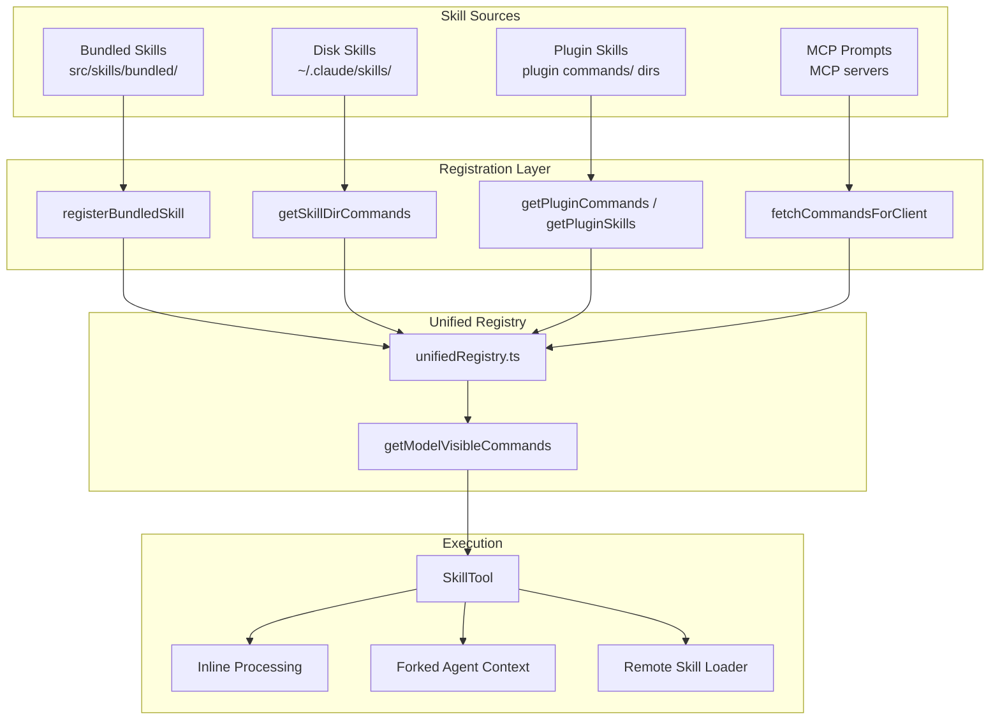
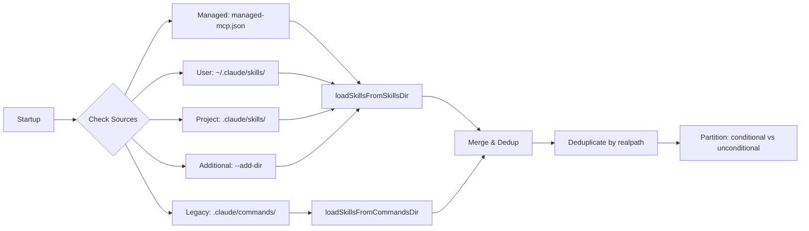
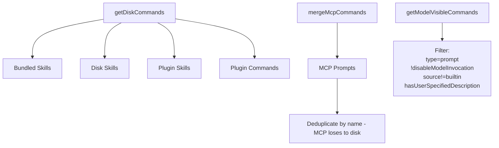

# Skills System Deep Dive

> A comprehensive analysis of how Claude Code discovers, registers, loads, and executes skills — the model-invocable prompt commands that extend Claude's capabilities.

## 1. Architecture Overview

The skills system in Claude Code is a multi-source prompt injection pipeline. Skills are essentially Markdown prompts with YAML frontmatter that get merged into the conversation context when invoked. The system has four parallel source channels:



## 2. The SKILL.md Format Specification

Skills follow a strict directory-based convention: each skill lives in its own directory and must contain a `SKILL.md` file. The file uses YAML frontmatter delimited by `---` followed by Markdown body content.

### Frontmatter Fields

| Field | Type | Default | Description |
|-------|------|---------|-------------|
| `name` | string | dirname | Display name for the skill |
| `description` | string | auto-extract | One-line summary shown in the Skill tool listing |
| `when_to_use` | string | undefined | Context hint telling the model when to invoke this skill |
| `allowed-tools` | string/list | [] | Comma-separated tools the skill is permitted to use |
| `argument-hint` | string | undefined | Arg format hint (e.g., `<pr-number>`) |
| `arguments` | string/list | undefined | Named argument definitions |
| `model` | string | undefined | Model override (e.g., `sonnet`, `opus`, `haiku`) |
| `disable-model-invocation` | bool | false | When true, skill is user-only (not model-discoverable) |
| `user-invocable` | bool | true | When false, skill is hidden from `/` listing |
| `context` | `inline` or `fork` | undefined | Execution context — `fork` runs as a sub-agent |
| `agent` | string | undefined | Agent type to use for forked execution |
| `effort` | string/int | undefined | Effort level override (e.g., `high`, `low`, or integer) |
| `version` | string | undefined | Version string |
| `paths` | string/list | undefined | Gitignore-style path patterns for conditional activation |
| `hooks` | object | undefined | Hook configuration (beforeQuery, afterQuery, etc.) |
| `shell` | string | undefined | Shell command to execute inline in the prompt |

### Body Content

The Markdown body after frontmatter is the actual prompt injected into the conversation. It supports several substitution variables:

- `${CLAUDE_SKILL_DIR}` — resolves to the skill's own directory
- `${CLAUDE_SESSION_ID}` — resolves to the current session ID
- `` !`command` `` — inline shell command execution (disabled for MCP skills)
- `$ARGUMENTS` — positional argument substitution (via `substituteArguments`)

### Source: `loadSkillsDir.ts`

The core parsing logic is in the `parseSkillFrontmatterFields()` function (lines ~150-220 of `loadSkillsDir.ts`):

```typescript
export function parseSkillFrontmatterFields(
  frontmatter: FrontmatterData,
  markdownContent: string,
  resolvedName: string,
  descriptionFallbackLabel: 'Skill' | 'Custom command' = 'Skill',
): { ... }
```

The `createSkillCommand()` function (lines ~250-340) converts the parsed data into a `Command` object with type `'prompt'`, including the critical `getPromptForCommand` async method that performs string substitution and shell command execution at invocation time.

Here is a real-world example from the bundled `verify` skill:

```markdown
---
description: Verify a code change by running the app, the relevant command,
  or a focused server flow and reporting concrete evidence.
---

# Verify

Use this skill when a task is not finished until the change is exercised.
...
```

## 3. Skill Discovery Pipeline

### 3.1 Startup Scanning

The function `getSkillDirCommands()` in `loadSkillsDir.ts` is the main entry point, memoized by `cwd`. At startup it scans four categories of directories:



The `/skills/` directory only supports the directory format (each skill as `skill-name/SKILL.md`). The legacy `/commands/` directory additionally supports flat `.md` files.

`--bare` mode skips all auto-discovery (managed/user/project/legacy) and only loads explicit `--add-dir` paths. This is used for minimal environments.

### 3.2 Dynamic Skill Discovery

Skills can also be discovered dynamically during a session. When files are read, written, or edited, the system walks up from the file path to the CWD checking for `.claude/skills/` directories:

```typescript
export async function discoverSkillDirsForPaths(
  filePaths: string[],
  cwd: string,
): Promise<string[]>
```

This walking starts at the file's parent directory and climbs to CWD. Discovered directories are loaded and their skills become available. The system sorts by path depth (deepest first) so skills closer to the file take precedence. The walk also checks gitignore status — skills in gitignored directories (e.g., `node_modules/.claude/skills/`) are silently skipped.

### 3.3 Conditional Skills (Path-Triggered)

Skills with a `paths` frontmatter field are stored separately and only activated when a matching file is touched. This uses the `ignore` library (gitignore-style matching):

```typescript
export function activateConditionalSkillsForPaths(
  filePaths: string[],
  cwd: string,
): string[]
```

When a file matching the pattern is operated on (Read/Write/Edit/Grep), the conditional skill is promoted from the conditional store to the dynamic skills map, making it visible to the model. Telemetry events `tengu_dynamic_skills_changed` are emitted with source `conditional_paths` on each activation.

### 3.4 Deduplication

Deduplication uses `realpath()` to resolve symlinks, preventing the same skill file from appearing multiple times through different path aliases:

```typescript
const fileIds = await Promise.all(
  allSkillsWithPaths.map(({ skill, filePath }) =>
    skill.type === 'prompt'
      ? getFileIdentity(filePath)
      : Promise.resolve(null),
  ),
)
```

The first occurrence wins — duplicate skills from later directories are silently dropped with a debug log.

## 4. Bundled Skills

### 4.1 Registration

Bundled skills are registered programmatically at startup via `registerBundledSkill()` in `bundledSkills.ts`. They are compiled into the CLI binary:

```typescript
export type BundledSkillDefinition = {
  name: string
  description: string
  aliases?: string[]
  whenToUse?: string
  argumentHint?: string
  allowedTools?: string[]
  model?: string
  disableModelInvocation?: boolean
  userInvocable?: boolean
  isEnabled?: () => boolean
  hooks?: HooksSettings
  context?: 'inline' | 'fork'
  agent?: string
  files?: Record<string, string>
  getPromptForCommand: (...) => Promise<ContentBlockParam[]>
}
```

Init is called from `src/skills/bundled/index.ts`:

```typescript
export function initBundledSkills(): void {
  registerUpdateConfigSkill()
  registerKeybindingsSkill()
  registerVerifySkill()
  registerDebugSkill()
  registerLoremIpsumSkill()
  registerSkillifySkill()
  registerRememberSkill()
  registerSimplifySkill()
  registerBatchSkill()
  registerStuckSkill()
  // Feature-gated skills
  if (feature('KAIROS') || feature('KAIROS_DREAM')) registerDreamSkill()
  if (feature('REVIEW_ARTIFACT')) registerHunterSkill()
  if (feature('AGENT_TRIGGERS')) registerLoopSkill()
  if (feature('AGENT_TRIGGERS_REMOTE')) registerScheduleRemoteAgentsSkill()
  if (feature('BUILDING_CLAUDE_APPS')) registerClaudeApiSkill()
  if (shouldAutoEnableClaudeInChrome()) registerClaudeInChromeSkill()
  if (feature('RUN_SKILL_GENERATOR')) registerRunSkillGeneratorSkill()
}
```

The `registerBundledSkill()` function creates a `Command` object with `source: 'bundled'` and `loadedFrom: 'bundled'`:

```typescript
const command: Command = {
  type: 'prompt',
  name: definition.name,
  description: definition.description,
  hasUserSpecifiedDescription: true,
  allowedTools: definition.allowedTools ?? [],
  source: 'bundled',
  loadedFrom: 'bundled',
  isEnabled: definition.isEnabled,
  isHidden: !(definition.userInvocable ?? true),
  progressMessage: 'running',
  getPromptForCommand: definition.getPromptForCommand,
}
```

### 4.2 Reference File Extraction

Bundled skills can embed reference files (examples, schemas, templates) that are lazily extracted to disk on first invocation. The extraction uses safe file operations:

```typescript
async function extractBundledSkillFiles(
  skillName: string,
  files: Record<string, string>,
): Promise<string | null>
```

Key security measures:
- Files are extracted to `getBundledSkillsRoot()` + nonce directory
- O_NOFOLLOW | O_EXCL flags prevent symlink attacks
- 0o700 directory and 0o600 file permissions
- Path traversal attacks are blocked by `resolveSkillFilePath()` which rejects absolute paths and `..` components
- On EEXIST, the file is NOT overwritten — no unlink+retry to avoid following intermediate symlinks

The skill prompt gets a `Base directory for this skill: <dir>` prefix so the model can read/grep the extracted files.

## 5. SkillTool Implementation

### 5.1 Tool Definition

The `SkillTool` is defined in `src/tools/SkillTool/SkillTool.ts` with the name `"Skill"`. It uses a lazy Zod schema for input:

```typescript
export const inputSchema = lazySchema(() =>
  z.object({
    skill: z.string().describe('The skill name'),
    args: z.string().optional().describe('Optional arguments for the skill'),
  }),
)
```

### 5.2 Validation Flow

The `validateInput()` method performs a multi-step validation:

1. **Format check**: Strips optional leading `/`
2. **Remote canonical intercept**: Checks for `_canonical_<slug>` prefix (experimental ant-only feature)
3. **Command lookup**: Calls `getAllCommands(context)` which merges local and MCP commands via `uniqBy`
4. **Capability checks**: Verifies `disableModelInvocation` isn't set
5. **Type check**: Confirms the command is prompt-based

### 5.3 Permission Model

The `checkPermissions()` method implements a multi-layer permission system:

1. **Deny rules first**: Checks if the skill name matches any deny rules (exact match or `prefix:*` wildcard)
2. **Remote canonical auto-allow**: ant-only experimental skills auto-grant (but still respect user-configured deny rules)
3. **Allow rules**: Checks configured allow rules (including wildcard prefixes like `review:*`)
4. **Safe property check**: Auto-allows skills that only have safe properties (a defined allowlist in `SAFE_SKILL_PROPERTIES`)
5. **Default ask**: Falls through to user permission dialog with suggested allow rules (exact + prefix)

The safe property check is an allowlist of known-safe `Command` properties. Any new property automatically requires permission.

### 5.4 Execution Modes

The `call()` method supports three execution modes:

#### Inline (Default)
The skill prompt is processed via `processPromptSlashCommand()` which:
- Substitutes arguments via `substituteArguments`
- Expands `${CLAUDE_SKILL_DIR}` and `${CLAUDE_SESSION_ID}`
- Executes inline shell commands (!\`command\`) via `executeShellCommandsInPrompt`
- Returns processed messages that get injected into the conversation via `newMessages`

The tool also returns a `contextModifier` function that:
- Updates `allowedTools` in the permission context
- Carries `[1m]` suffix over (extended thinking budget)
- Overrides effort level if the skill specifies one

#### Forked (context: 'fork')
When a skill specifies `context: fork`, it runs as a sub-agent:

```typescript
async function executeForkedSkill(...):
```

The forked execution:
1. Creates a new agent ID
2. Prepares a forked command context via `prepareForkedCommandContext()`
3. Runs `runAgent()` with isolated token budget
4. Tracks progress via SkillToolProgress messages
5. Returns extracted result text
6. Cleans up invokedSkills state on completion

#### Remote (Experimental)
Canonical skills from the AKI/GCS backend are loaded on-demand for ant-internal use:

```typescript
async function executeRemoteSkill(
  slug: string,
  commandName: string,
  parentMessage: AssistantMessage,
  context: ToolUseContext,
): Promise<ToolResult<Output>>
```

This handles:
- Loading SKILL.md from GCS with local caching (cacheHit tracking)
- Telemetry: urlScheme, fileCount, totalBytes, fetchMethod
- Base directory prefix injection for relative refs
- `${CLAUDE_SKILL_DIR}` and `${CLAUDE_SESSION_ID}` substitution
- Direct user message injection — no shell command expansion (security boundary for untrusted remote content)

### 5.5 Prompt Construction

The Skill Tool prompt (from `prompt.ts`) is injected into the system prompt, telling the model how to use skills. The prompt is memoized:

```typescript
export const getPrompt = memoize(async (_cwd: string): Promise<string> => {
  return `Execute a skill within the main conversation

When users ask you to perform tasks, check if any of the available skills match.
Skills provide specialized capabilities and domain knowledge.

...
- If you see a <COMMAND_NAME_TAG> tag in the current conversation turn, the skill has ALREADY been loaded
  - follow the instructions directly instead of calling this tool again
`
})
```

### 5.6 Budget-Aware Skill Listing

The skill listing that appears in system reminders is budget-aware — it gets 1% of the context window:

```typescript
export const SKILL_BUDGET_CONTEXT_PERCENT = 0.01
export const CHARS_PER_TOKEN = 4
export const DEFAULT_CHAR_BUDGET = 8_000  // Fallback: 1% of 200k x 4
```

The `formatCommandsWithinBudget()` function intelligently truncates:
- Bundled skills always get full descriptions
- Non-bundled descriptions are truncated to fit within the char budget
- In extreme cases, non-bundled skills become name-only
- Each entry is capped at 250 chars (`MAX_LISTING_DESC_CHARS`)
- Telemetry events track truncation mode when USER_TYPE === 'ant'

## 6. The Unified Registry

The `unifiedRegistry.ts` file coordinates the four parallel PromptCommand sources:



```typescript
export function getModelVisibleCommands(allCommands: Command[]): Command[] {
  return allCommands.filter(
    cmd =>
      cmd.type === 'prompt' &&
      !cmd.disableModelInvocation &&
      cmd.source !== 'builtin' &&
      (cmd.loadedFrom === 'bundled' ||
        cmd.loadedFrom === 'skills' ||
        cmd.loadedFrom === 'commands_DEPRECATED' ||
        cmd.hasUserSpecifiedDescription ||
        cmd.whenToUse),
  )
}
```

## 7. Skill Change Detection

Skills use a signal-based notification system for dynamic changes:

```typescript
const skillsLoaded = createSignal()

export function onDynamicSkillsLoaded(callback: () => void): () => void {
  return skillsLoaded.subscribe(() => {
    try { callback() }
    catch (error) { logError(error) }
  })
}
```

This signal fires when:
- Dynamic skills are discovered via file path walking
- Conditional skills are activated by matching file paths
- Other modules (like the command cache) need to be invalidated

The `clearSkillCaches()` function clears the main memoized caches and conditional skill state:

```typescript
export function clearSkillCaches() {
  getSkillDirCommands.cache?.clear?.()
  loadMarkdownFilesForSubdir.cache?.clear?.()
  conditionalSkills.clear()
  activatedConditionalSkillNames.clear()
}
```

## 8. Skill vs Command vs Tool

| Concept | Type | Visibility | Purpose |
|---------|------|------------|---------|
| **Skill** | `Command` (type: 'prompt') | Model + User | Prompt injection via SkillTool |
| **Command** | `Command` (type: 'prompt' or 'jsx') | User | Slash-command (/help, /clear, /plugin) |
| **Tool** | `Tool` | Model | Function calling (Read, Write, Edit, Bash, Skill) |

- **Skills** are `Command` objects with `type: 'prompt'` that get invoked through the `SkillTool`. The model sees them as listed capabilities.
- **Commands** can be either prompt-based (like skills) or JSX-based (CLI interactive commands like `/plugin`, `/mcp`, `/commit`).
- **Tools** are the primitive function-calling layer — the model uses them directly as named functions with typed schemas.

## 9. MCP Skill Builders (Dependency Cycle Breaker)

A noteworthy design pattern is the `registerMCPSkillBuilders` / `getMCPSkillBuilders` pattern in `mcpSkillBuilders.ts`. This module solves a dependency cycle:

```
client.ts → mcpSkills.ts → loadSkillsDir.ts → … → client.ts
```

The solution is a write-once registry that stores two functions from `loadSkillsDir.ts` (createSkillCommand, parseSkillFrontmatterFields) that MCP skill discovery needs. Registration happens at `loadSkillsDir.ts` module init time via:

```typescript
registerMCPSkillBuilders({
  createSkillCommand,
  parseSkillFrontmatterFields,
})
```

This indirection exists because Bun-bundled binaries cannot resolve non-literal dynamic imports at runtime (the specifier resolves against a `/bunfs/` path, not the source tree).

## Key Source Files

| File | Purpose |
|------|---------|
| `src/skills/bundledSkills.ts` | Bundled skill registration and file extraction |
| `src/skills/loadSkillsDir.ts` | Disk-based skill loading, parsing, dynamic discovery |
| `src/skills/unifiedRegistry.ts` | Four-source command unification |
| `src/skills/mcpSkillBuilders.ts` | MCP skill adapter (dependency-cycle breaker) |
| `src/skills/mcpSkills.ts` | MCP skills stub (currently returns empty array) |
| `src/skills/bundled/index.ts` | Bundled skill initialization |
| `src/tools/SkillTool/SkillTool.ts` | The Skill tool implementation |
| `src/tools/SkillTool/prompt.ts` | System prompt for the Skill tool |
| `src/tools/SkillTool/constants.ts` | SKILL_TOOL_NAME = 'Skill' |
