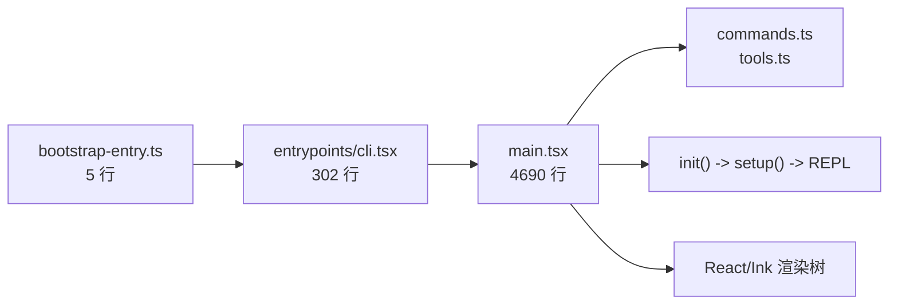
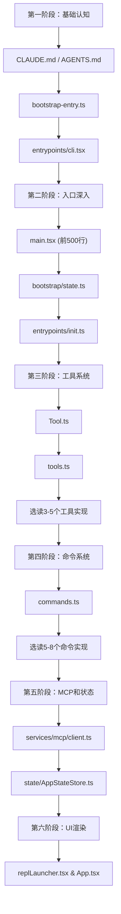

# 源码阅读地图

> 在深入研究每一行代码之前，先从高空俯瞰整个源码树的布局、关键入口和阅读路线。

## 源码树概况

Claude Code 的源码位于 `claude-code-rev/src/` 目录下，是**通过 source map 逆向恢复**的产物，并非原始上游仓库。这意味着部分代码可能存在占位符（shim）和兼容层。

截至当前分析，`src/` 目录包含 **784 个文件**，分布在约 **40 个子目录**中。总代码量极其庞大（`main.tsx` 单文件就达 4690 行），是典型的生产级 CLI 应用。

### 顶层文件

| 文件 | 行数 | 作用 |
| --- | --- | --- |
| `bootstrap-entry.ts` | 5 | 终极入口，注入 MACRO 后导入 cli.tsx |
| `bootstrapMacro.ts` | ~30 | 定义 MACRO 全局变量（VERSION、BUILD_TIME 等） |
| `entrypoints/cli.tsx` | 302 | 13 条快速路径分发器 |
| `main.tsx` | 4690 | Commander CLI 主入口 + action handler |
| `commands.ts` | 754 | 102+ 命令的统一注册入口 |
| `tools.ts` | 389 | 50+ 工具的静态导入 + 条件 require() |
| `Tool.ts` | 792 | 工具系统的核心类型定义 |
| `Task.ts` | ~100 | 任务管理核心类型 |
| `replLauncher.tsx` | ~200 | REPL 循环的 Ink 渲染启动器 |

### 关键子目录

```
src/
├── entrypoints/       # 入口点：cli.tsx, init.ts, mcp.ts
├── commands/          # 102+ 个子命令实现
├── tools/             # 50+ 个工具实现（每个工具一个子目录）
├── components/        # Ink React UI 组件（~50+ 组件）
├── screens/           # 屏幕级组件（REPL、Setup 等）
├── services/          # 服务层
│   ├── mcp/           #   MCP 客户端（23 文件）
│   ├── analytics/     #   分析埋点
│   ├── api/           #   HTTP API 客户端
│   └── policyLimits/  #   策略限制
├── bootstrap/         # 启动引导层状态和逻辑
│   └── state.ts       #   Bootstrap State（1758 行）
├── state/             # AppState 管理
│   ├── AppState.tsx   #   React Context + pub/sub
│   └── AppStateStore.ts # 状态存储器
├── bridge/            # 远程控制桥接（~30 文件）
├── assistant/         # KAIROS 助手模式
├── buddy/             # 同伴精灵系统
├── cli/               # CLI 工具函数（exit, print 等）
├── context/           # React Context 定义
├── coordinator/       # 多 Agent 协调器
├── daemon/            # 守护进程系统
├── hooks/             # React Hooks
├── ink/               # Ink 渲染引擎封装
├── jobs/              # 后台作业
├── keybindings/       # 按键绑定
├── memdir/            # 内存目录
├── migrations/        # 启动时迁移脚本
├── plugins/           # 插件系统
├── proactive/         # 主动行为系统
├── skills/            # 技能系统
├── ssh/               # SSH 远程连接
├── tasks/             # 任务系统
├── types/             # 类型定义
├── utils/             # 工具函数（~100+ 文件）
├── vim/               # Vim 模式
└── voice/             # 语音模式
```

## 三个核心入口

理解代码的起点是三个入口层，它们形成一条调用链：



### 第一入口：bootstrap-entry.ts

这是整个程序的**终极入口**。只有 5 行代码，作用极其明确：

```typescript
import { ensureBootstrapMacro } from './bootstrapMacro'
ensureBootstrapMacro()
await import('./entrypoints/cli.tsx')
```

核心逻辑：
1. 调用 `ensureBootstrapMacro()`，在 `globalThis.MACRO` 上注入版本号、构建时间等编译时常量
2. 通过动态 `import()` 加载 `cli.tsx`——注意是动态 import，允许 Bun bundle 做模块级分离

这个文件的极简设计是有意为之：**它只做最必要的事就交出控制权**，避免任何额外开销拖慢启动速度。

### 第二入口：entrypoints/cli.tsx

这是**快速路径分发器**。302 行代码定义了 13 条快速路径，大部分路径使用**动态 import** 按需加载模块：

- `--version` / `-v`：纯常量输出，零额外模块加载
- `--dump-system-prompt`：导出系统提示词（内部功能）
- `--claude-in-chrome-mcp`：Chrome MCP 服务模式
- `--chrome-native-host`：Chrome 原生消息宿主
- `--computer-use-mcp`：Computer Use MCP 服务
- `--daemon-worker`：守护进程工作模式
- `remote-control` / `rc` / `remote` / `sync` / `bridge`：远程控制
- `daemon`：守护进程管理模式
- `ps` / `logs` / `attach` / `kill` / `--bg` / `--background`：后台会话管理
- `new` / `list` / `reply`：模板作业命令
- `environment-runner`：BYOC 环境运行器
- `self-hosted-runner`：自托管运行器
- `--worktree --tmux`：tmux 工作树模式

关键设计原则：**未命中快速路径的请求才加载完整的 main.tsx**，大幅提升 CLI 响应速度。

### 第三入口：main.tsx

一旦未命中快速路径，`cli.tsx` 最后会动态 import `main.tsx`（4690 行），这是 Commander 的主 CLI 框架入口。

`main.tsx` 做的事：
1. 设置 Commander 命令结构（带子命令） 
2. 注册 `action handler`（整个 CLI 的核心）
3. 在 action handler 中依次调用 `init()` -> `setup()` -> `launchRepl()`

## 核心模块一览

### 工具系统 (tools/)

`tools.ts` 统一注册了 50+ 工具。每个工具通常有自己独立的子目录：

```
tools/
├── AgentTool/          # 子 Agent 调用
├── BashTool/           # Shell 命令执行
├── FileEditTool/       # 文件编辑
├── FileReadTool/       # 文件读取
├── FileWriteTool/      # 文件写入
├── GlobTool/           # 文件搜索
├── GrepTool/           # 文本搜索
├── WebFetchTool/       # 网页抓取
├── WebSearchTool/      # 网络搜索
├── TaskCreateTool/     # 创建子任务
├── TaskStopTool/       # 停止子任务
├── SkillTool/          # 技能执行
├── ConfigTool/         # 配置管理
├── ToolSearchTool/     # 工具搜索（元工具）
├── SyntheticOutputTool/ # 合成输出
├── ...                 # 总计 50+
```

工具的注册遵循 DCE 模式：核心静态工具直接 import，条件工具通过 feature() + require() 按需加载。

### 命令系统 (commands/)

`commands.ts` 统一注册了 102+ 命令。每个命令通常也是独立的文件或 index.js 子目录：

```
commands/
├── add-dir/
├── autofix-pr/
├── backfill-sessions/
├── btw/
├── commit.js
├── config/
├── help/
├── init.js
├── install.tsx
├── mcp/
├── review.js
├── skills/
├── ...                # 总计 102+
```

### Ink 组件 (components/)

50+ 个 React 组件构成了整个终端 UI：

```
components/
├── App.tsx              # 顶层组件，提供 3 层 Context
├── AgentProgressLine.tsx # Agent 执行进度
├── BashModeProgress.tsx  # Bash 执行模式
├── BridgeDialog.tsx      # 远程控制对话框
├── ...                   # 总计 50+
```

### MCP 服务 (services/mcp/)

23 个文件组成的完整 MCP 客户端实现：

```
services/mcp/
├── client.ts            # MCP 客户端核心
├── config.ts            # .mcp.json 配置解析
├── types.ts             # 类型定义
├── MCPConnectionManager.tsx # 连接管理器（React 组件）
├── officialRegistry.ts  # 官方 MCP Registry 预取
├── auth.ts              # OAuth 授权
├── ...                  # 总计 23 文件
```

### 启动状态 (bootstrap/state.ts)

1758 行的巨型单文件，管理启动过程中的全部全局状态。包含 8 个状态域。

### 应用状态 (state/)

包含 AppState 的 React Context 封装（`AppState.tsx` + `AppStateStore.ts`），以及 `onChangeAppState.ts` 桥梁。

## 读取顺序建议

对于想要深度理解源码的读者，建议按以下顺序阅读：

```
第一阶段：基础认知（30 分钟）
  1. CLAUDE.md / AGENTS.md     -> 项目背景和团队指引
  2. bootstrap-entry.ts         -> 程序的起点
  3. entrypoints/cli.tsx        -> 快速路径分发器

第二阶段：入口深入（2 小时）
  4. main.tsx（前 500 行）     -> Commander 设置和 action handler 入口
  5. bootstrap/state.ts         -> 理解 8 个状态域
  6. entrypoints/init.ts        -> 初始化流程

第三阶段：工具系统（3 小时）
  7. Tool.ts                    -> 工具接口定义
  8. tools.ts                   -> 工具注册表和 DCE 模式
  9. 选读 3-5 个工具实现       -> 理解工具执行流程

第四阶段：命令系统（1 小时）
  10. commands.ts               -> 命令注册表
  11. 选读 5-8 个命令实现      -> 理解命令执行流程

第五阶段：MCP 和状态（2 小时）
  12. services/mcp/client.ts    -> MCP 客户端核心
  13. state/AppStateStore.ts    -> 状态存储器
  14. state/onChangeAppState.ts -> 状态通信桥

第六阶段：UI 渲染（1 小时）
  15. replLauncher.tsx          -> REPL 启动
  16. components/App.tsx        -> 组件树根
  17. screens/                  -> 屏幕级别组件
```



## 与教程各章节的对应关系

| 教程章节 | 对应源码文件 | 对应本文部分 |
| --- | --- | --- |
| 启动流程与 CLI 入口 | `bootstrap-entry.ts` -> `cli.tsx` -> `main.tsx` | 三个核心入口 |
| 工具系统架构 | `Tool.ts`, `tools.ts`, `tools/*` | 工具系统概览 |
| 命令系统实现 | `commands.ts`, `commands/*` | 命令系统概览 |
| Ink TUI 渲染引擎 | `components/`, `screens/`, `replLauncher.tsx` | Ink 组件概览 |
| MCP 客户端架构 | `services/mcp/*` | MCP 服务概览 |
| 三层状态管理 | `bootstrap/state.ts`, `state/*` | 状态管理概览 |

## 源码树状态说明

因为源码是从 source map 恢复（restored）的，部分代码状态需要特别注意：

### 完全可用的代码（restored）
- `main.tsx`（4690 行）——从 source map 完整恢复
- `Tool.ts`（792 行）——同样完整可用
- `bootstrap/state.ts`（1758 行）——完整可用
- `src/services/mcp/*`——23 个文件全部可用
- `src/commands/*`——所有命令实现可用

### 需要 shim 的代码
- `shims/` 目录下的文件——原始代码可能引用了私有 npm 包，需要提供兼容实现
- `vendor/` 目录下的文件——第三方依赖的本地拷贝

### 不完整的部分
- 部分 `.node` 原生模块（如 `image-processor.node`）是平台特定的二进制文件
- 某些 `ANT-ONLY` 标记的代码片段可能在外部构建中被 DCE 消除

## 常见读源码误区

### 误区 1：从头到尾线性阅读
**不要**从 `bootstrap-entry.ts` 开始逐行读到 `main.tsx` 的 4690 行。应该按功能模块跳跃式阅读，先理解整体结构，再深入细节。

### 误区 2：把所有工具都看一遍
50+ 个工具的实现方式各不相同。应该先理解 `Tool.ts` 的接口定义和 `tools.ts` 的注册机制，然后选 3-5 个典型工具深入（建议：BashTool、FileReadTool、AgentTool、WebSearchTool）。

### 误区 3：忽略 DCE 代码
大量代码被 `feature()` 守卫或 `USER_TYPE` 条件包裹。阅读时要识别哪些代码在当前构建中实际生效。`feature('xxx')` 在 bundle 时被替换为 `true` 或 `false`，不可达分支不会产生运行时开销。

### 误区 4：试图运行完整源码
`claude-code-rev` 是恢复版本，不是原始构建管线。直接运行大概率失败。逆向恢复工程的目的是**学习架构和实现**，不是获得可运行的二进制文件。

### 误区 5：忽视 shims/ 和 vendor/
这两个目录是代码恢复过程中的关键信息。`shims/` 告诉你原始代码依赖了什么外部接口，`vendor/` 展示哪些依赖被内部化了。阅读这些目录可以理解架构的演进历史。

## 小练习

1. **找到所有入口**：在 `src/entrypoints/` 目录下找到除 `cli.tsx` 之外的其他入口文件，分别描述它们的使用场景。
2. **统计工具数量**：运行 `find src/tools -maxdepth 1 -type d | wc -l`，对比 tools.ts 中注册的工具数量，理解差异原因。
3. **绘制你的阅读地图**：根据本文的读取顺序建议，制定你自己的阅读计划，标记每天打算阅读的文件范围。
