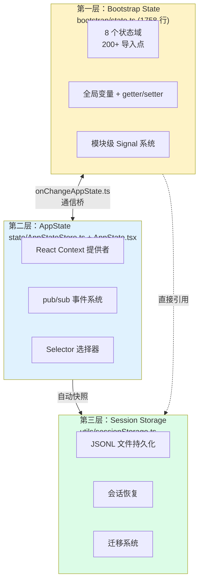
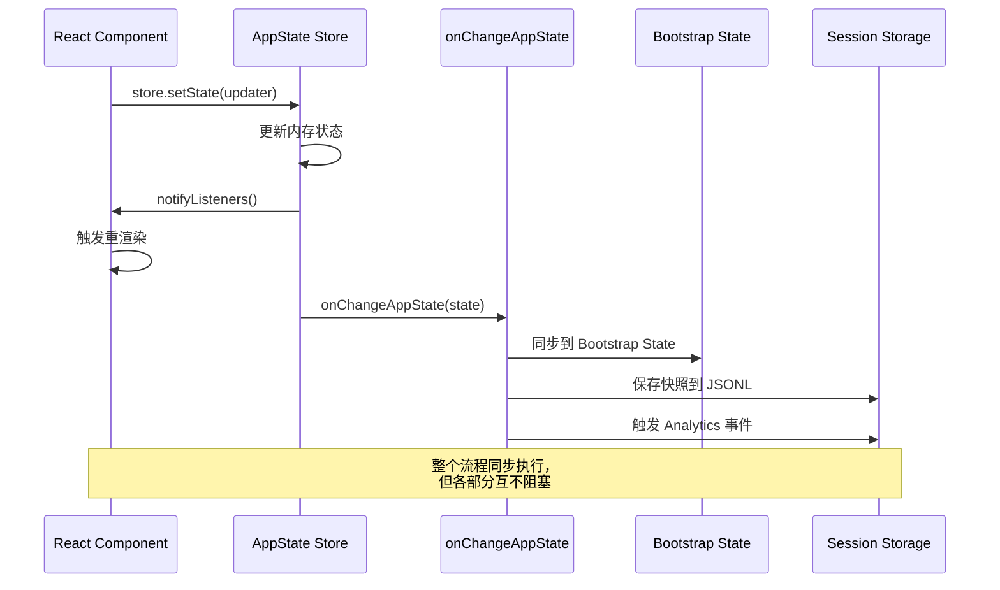
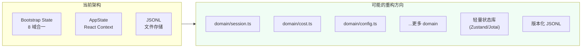

# 三层状态管理

> Claude Code 的状态管理是一个三层架构：Bootstrap State（全局启动状态）-> AppState（React 应用状态）-> Session Storage（会话持久化）。这三个层次各有独立的数据域、访问方式和生命周期。

## 三层状态的架构总览



### 各层对比

| 维度 | Bootstrap State | AppState | Session Storage |
| --- | --- | --- | --- |
| 实现方式 | 模块级变量 + getter/setter | React Context + pub/sub | JSONL 文件 |
| 范围 | 全局（所有模块） | React 组件树 | 磁盘持久化 |
| 行数 | 1758 | ~700+（Store + State） | ~300+ |
| 变更通知 | 直接调用 | pub/sub + selector | 文件写入 |
| 生命周期 | 进程生命周期 | React 树生命周期 | 持久存储 |
| 用例 | 配置、遥测、会话信息 | UI 状态、用户设置 | 会话历史、消息 |

## Bootstrap State（第一层）

Bootstrap State 是 `bootstrap/state.ts` 中的 1758 行单文件，管理**全局启动状态**。

### 8 个状态域

```typescript
// bootstrap/state.ts —— 状态结构（简化）
type State = {
  // 域 1：路径信息
  originalCwd: string;         // 原始工作目录
  projectRoot: string;         // 项目根目录（稳定标识）
  
  // 域 2：成本统计
  totalCostUSD: number;        // 总成本
  totalAPIDuration: number;    // API 总耗时
  totalToolDuration: number;   // 工具总耗时
  totalAPIDurationWithoutRetries: number;  // 不含重试的 API 耗时
  turnToolCount: number;       // 本轮工具调用次数
  
  // 域 3：会话标识
  sessionId: SessionId;        // 当前会话 ID
  conversationId: SessionId;   // 对话 ID
  
  // 域 4：远程模式
  isRemoteMode: boolean;       // 是否远程控制模式
  
  // 域 5：额外目录
  additionalDirectories: string[];  // 附加工作目录
  
  // 域 6：模型设置
  mainLoopModelOverride: string | undefined;  // 主循环模型覆盖
  mainThreadAgentType: string | undefined;    // Agent 类型
  
  // 域 7：遥测属性
  attributedCounters: Map<string, AttributedCounter>;  // 可归因计数器
  
  // 域 8：Telemetry/OpenTelemetry
  meter?: Meter;
  tracer?: BasicTracerProvider;
  logger?: LoggerProvider;
  // ... 更多 OTel 相关状态
};
```

### 实现模式：模块级 getter/setter

Bootstrap State 不使用 React 的 `useState`，而是使用全局模块变量的 getter/setter 模式：

```typescript
// bootstrap/state.ts —— getter/setter 模式
let totalCostUSD = 0;
let totalAPIDuration = 0;
let isRemoteMode = false;
let sessionId: SessionId = createSessionId();

export function getTotalCostUSD() { return totalCostUSD; }
export function addToTotalCostUSD(amount: number) { totalCostUSD += amount; }

export function getSessionId() { return sessionId; }
export function setSessionId(id: SessionId) { sessionId = id; }

export function getIsRemoteMode() { return isRemoteMode; }
export function setIsRemoteMode(v: boolean) { isRemoteMode = v; }
```

这种模式的特点：
- **简单直接**：无框架依赖，所有模块都可以访问
- **非响应式**：变更不触发 UI 更新，需要读取最新值
- **跨模块访问**：不依赖 React 组件树，在任何模块中都可以 get/set
- **200+ 导入点**：bootstrap/state.ts 是整个代码库中导入最多的文件之一

### Signal 系统

Bootstrap State 也包含一个简单的 Signal 系统，用于跨模块的变更通知：

```typescript
// bootstrap/state.ts —— Signal 系统
import { createSignal } from 'src/utils/signal.js';

// 创建 signal
export const onSessionChange = createSignal<SessionId>();

// 使用 signal
onSessionChange.emit(newSessionId);

// 监听 signal
onSessionChange.listen((sessionId) => {
  console.log('Session changed:', sessionId);
});
```

## AppState（第二层）

AppState 管理 React 组件树相关的状态。它使用 React Context + pub/sub + selector 模式实现。

### AppStateStore

```typescript
// state/AppStateStore.ts —— 状态存储（569 行，伪代码）
export class AppStateStore {
  private state: AppState;
  private listeners: Set<(state: AppState) => void> = new Set();
  private selectors: Map<string, Selector> = new Map();
  
  constructor(initialState: AppState) {
    this.state = initialState;
  }
  
  // 获取完整状态
  getState(): AppState {
    return this.state;
  }
  
  // 更新状态（类似 Redux 的 dispatch）
  setState(updater: (prev: AppState) => AppState) {
    this.state = updater(this.state);
    this.notifyListeners();
  }
  
  // 订阅状态变化
  subscribe(listener: (state: AppState) => void) {
    this.listeners.add(listener);
    return () => this.listeners.delete(listener);
  }
  
  // selector 模式
  select<T>(selector: (state: AppState) => T): T {
    return selector(this.state);
  }
  
  private notifyListeners() {
    for (const listener of this.listeners) {
      listener(this.state);
    }
  }
}
```

### AppStateProvider

```tsx
// state/AppState.tsx —— React Context 提供者（199 行，伪代码）
const AppStateContext = createContext<AppStateStore | null>(null);

export function AppStateProvider({ initialState, onChangeAppState, children }: Props) {
  const storeRef = useRef<AppStateStore>();
  
  if (!storeRef.current) {
    storeRef.current = new AppStateStore(initialState);
  }
  
  const store = storeRef.current;
  
  // onChangeAppState 通信
  useEffect(() => {
    const unsub = store.subscribe((state) => {
      onChangeAppState(state);
    });
    return unsub;
  }, [store, onChangeAppState]);
  
  return (
    <AppStateContext.Provider value={store}>
      {children}
    </AppStateContext.Provider>
  );
}
```

### 在组件中使用 AppState

```tsx
// 自定义 Hook：读取 AppState
function useAppState() {
  const store = useContext(AppStateContext);
  const [state, setState] = useState(store.getState());
  
  useEffect(() => {
    return store.subscribe((newState) => {
      setState(newState);  // 触发 React 重渲染
    });
  }, [store]);
  
  return state;
}

// 自定义 Hook：带 selector 的 AppState
function useAppStateSelector<T>(selector: (state: AppState) => T): T {
  const store = useContext(AppStateContext);
  const [value, setValue] = useState(() => selector(store.getState()));
  
  useEffect(() => {
    return store.subscribe((newState) => {
      const newValue = selector(newState);
      setValue(newValue);  // 只有选中值变化才触发重渲染
    });
  }, [store, selector]);
  
  return value;
}
```

## 通信桥：onChangeAppState

Bootstrap State 和 AppState 之间的通信通过 `onChangeAppState.ts` 实现：

```typescript
// state/onChangeAppState.ts —— 状态通信桥（伪代码）
export function onChangeAppState(state: AppState) {
  // 同步 Bootstrap State
  bootstrap.setState({
    totalCostUSD: state.totalCostUSD,
    totalAPIDuration: state.totalAPIDuration,
    totalToolDuration: state.totalToolDuration,
    sessionId: state.sessionId,
  });
  
  // 持久化到 Session Storage
  saveSessionSnapshot(state);
  
  // 触发 Analytics
  trackStateChange(state);
}
```



## 状态管理的设计问题

从源码分析可以看出 Claude Code 的状态管理存在一些设计缺陷：

### 问题 1：Bootstrap State 过度集中

1758 行的单文件管理 8 个完全不相关的状态域（路径、成本、会话、遥测、远程模式等）。这是典型的**单文件膨胀**问题，重构建议是拆分为 8 个独立的模块文件。

### 问题 2：全局可变状态

Bootstrap State 使用全局模块变量，任何模块都可以直接修改：

```typescript
// 任何地方都可以直接修改
import { addToTotalCostUSD } from '../bootstrap/state.js';
addToTotalCostUSD(100);
```

这种模式的缺点：
- 变更不可追踪（没有 Redux 式的 action log）
- 并发修改不安全（多个异步操作同时修改）
- 容易产生隐蔽的 bug

### 问题 3：两层状态重叠

Bootstrap State 和 AppState 之间存在部分重叠的状态域：

| 状态项 | Bootstrap State | AppState | 问题 |
| --- | --- | --- | --- |
| sessionId | 有 | 有 | 需要同步，可能不一致 |
| totalCostUSD | 有 | 有 | 需要通信桥同步 |
| isRemoteMode | 有 | 无 | 部分模块直接读 bootstrap |

这种重叠意味着某些状态在两层之间需要同步（通过 `onChangeAppState`），增加了复杂性和出错可能。

### 问题 4：忘记优化

从 restore 的代码看，状态管理可能是代码库中**最早实现的部分之一**，没有及时采用更现代的模式（如 Zustand、Jotai 等）。这导致了：

- 手动实现 pub/sub 系统
- 手动实现 selector
- 手动实现 Context Provider

## 会话存储（第三层）

`utils/sessionStorage.ts` 实现 JSONL 格式的会话持久化：

```typescript
// utils/sessionStorage.ts —— 会话存储（伪代码）
export class SessionStorage {
  private sessionDir: string;
  private logStream: WriteStream;
  
  constructor(sessionId: string) {
    this.sessionDir = path.join(CLAUDE_DIR, 'sessions', sessionId);
    fs.mkdirSync(this.sessionDir, { recursive: true });
    this.logStream = fs.createWriteStream(
      path.join(this.sessionDir, 'messages.jsonl'),
      { flags: 'a' }
    );
  }
  
  // 每条消息一行 JSON
  append(message: Message) {
    this.logStream.write(JSON.stringify(message) + '\n');
  }
  
  // 读取所有消息
  async readAll(): Promise<Message[]> {
    const content = fs.readFileSync(
      path.join(this.sessionDir, 'messages.jsonl'),
      'utf8'
    );
    return content
      .split('\n')
      .filter(Boolean)
      .map(line => JSON.parse(line));
  }
  
  // 快照存储（含中间状态）
  saveSnapshot(state: AppState) {
    fs.writeFileSync(
      path.join(this.sessionDir, 'snapshot.json'),
      JSON.stringify(state)
    );
  }
}
```

### JSONL 格式示例

```
{"role":"user","content":"写一个 Fibonacci 函数","ts":1700000000000}
{"role":"assistant","content":"我来帮你写...","ts":1700000000100}
{"role":"tool_use","name":"FileWriteTool","input":{"path":"fib.ts","content":"..."},"ts":1700000000200}
{"role":"tool_result","tool_use_id":"...","content":"文件已创建","ts":1700000000300}
```

JSONL（JSON Lines）的每行是一个完整的 JSON 对象，行末换行分隔。这种格式的优势：
1. **追加写入**：不需要读取整个文件，可以直接 append
2. **可流式处理**：可以按行流式读取
3. **人类可读**：每行一个独立消息
4. **易于切割**：可以按行号或时间戳分片

## 状态迁移和版本管理

`src/migrations/` 目录下的迁移脚本在启动时运行，确保配置和状态格式与代码版本匹配：

```typescript
// migrations/ —— 迁移系统（伪代码）
const migrations = [
  { version: 1, migrate: async (state) => { /* 初始结构 */ } },
  { version: 2, migrate: async (state) => { /* 添加新字段 */ } },
  { version: 3, migrate: async (state) => { /* 修改字段名 */ } },
  // ... 更多迁移
];

export async function runMigrations() {
  const currentVersion = readStateVersion();
  
  for (const migration of migrations.slice(currentVersion)) {
    await migration.migrate(state);
    writeStateVersion(migration.version);
  }
}
```

## 状态管理的演进可能

基于当前架构的问题分析，未来的重构方向可能包括：

1. **Bootstrap State 拆分**：将 1758 行单文件拆分为 8 个独立的状态模块
2. **统一状态层**：合并 Bootstrap State 和 AppState 的功能，避免重复和同步问题
3. **引入轻量级状态库**：使用 Zustand 或 Jotai 替换手动实现的 pub/sub
4. **不可变状态**：使用 Immer 或原生不可变模式，减少意料之外的修改
5. **状态变更日志**：引入 action log，方便调试和问题追踪



## 小练习

1. **状态追踪**：在 `bootstrap/state.ts` 中添加一个 wrapper，记录所有 state 修改操作的调用栈，分析哪些模块在频繁修改全局状态。
2. **实现 Action Log**：参考 Redux 的 middleware 模式，给 `AppStateStore.setState` 添加 action 日志，记录每次变更的名称、旧值和新值。
3. **JSONL 解析器**：实现一个独立的 JSONL 解析器，支持基于时间范围或消息类型的过滤查询。
4. **Context 性能分析**：在 `AppStateProvider` 中添加渲染计数，分析状态变化导致的子组件重渲染范围，理解 Context 的传播范围问题。
