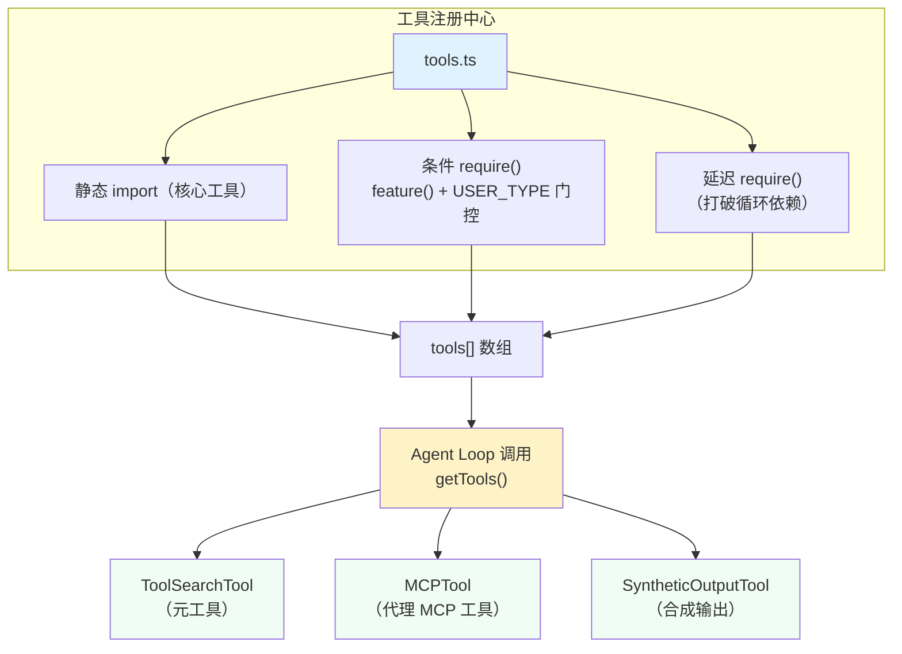
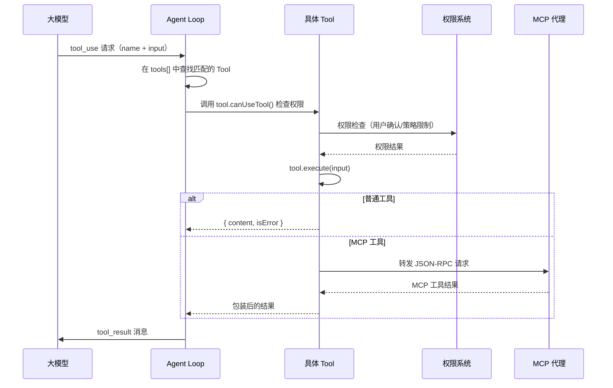
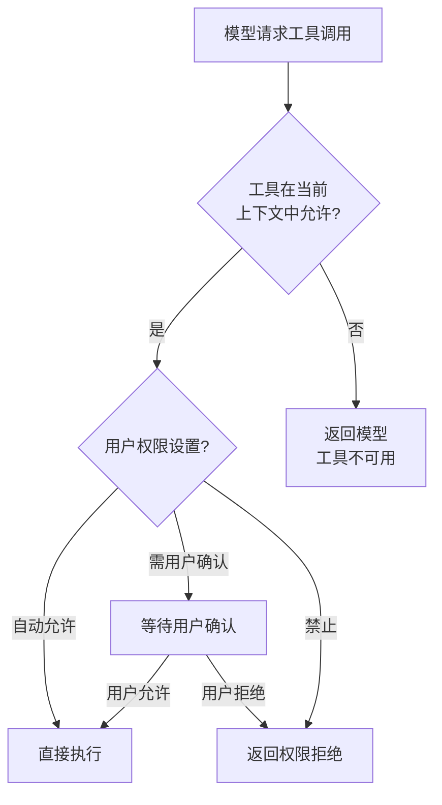

# 工具系统架构

> 工具系统是 Claude Code Agent 能力的核心。模型通过调用工具来与文件系统、终端、网络和外部服务交互。本文深入拆解工具系统的接口定义、注册机制、执行流程和权限门控。

## 工具系统概览

Claude Code 的工具系统包含 50+ 个工具，是所有系统组件中规模最大、设计模式最统一的部分。



### 规模数据

| 度量 | 数值 |
| --- | --- |
| 工具总数 | 50+ |
| tools.ts 行数 | 389 |
| Tool.ts 类型定义行数 | 792 |
| 静态 import 工具 | ~30+ |
| 条件 require() 工具 | ~10+ |
| 禁用列表 | 2 个（ALL_AGENT / CUSTOM_AGENT） |
| 工具子目录 | 50+ |

## 工具接口定义

所有工具都实现 `Tool` 接口（定义在 `Tool.ts` 中）：

```typescript
// src/Tool.ts —— 工具核心类型（简化）
export type Tool = {
  name: string;
  description: string;
  parameters: ToolInputJSONSchema;  // JSON Schema 格式
  execute: (params: ToolParams) => Promise<ToolResult>;
  isEnabled?: () => boolean;         // 是否可用
  // 可选扩展
  canUseTool?: CanUseToolFn;         // 使用权限检查
  createPrompt?: () => string;       // 动态提示词生成
  cleanup?: () => void;              // 资源清理
};

export type ToolParams = {
  input: Record<string, unknown>;    // 工具输入
  context: ToolExecutionContext;     // 执行上下文
};

export type ToolResult = {
  content: ToolResultContent[];      // 结果内容
  isError?: boolean;                 // 是否执行出错
  meta?: Record<string, unknown>;    // 元数据
};
```

这个接口设计的关键特性：

| 属性 | 必要性 | 说明 |
| --- | --- | --- |
| `name` | 必需 | 工具的唯一标识符，模型通过名称引用 |
| `description` | 必需 | 工具的描述文本，模型选择工具时的依据 |
| `parameters` | 必需 | JSON Schema 格式的参数定义，模型生成调用参数 |
| `execute` | 必需 | 工具执行的异步函数 |
| `isEnabled` | 可选 | 动态启用/禁用，用于条件工具 |
| `canUseTool` | 可选 | 细致的权限检查，如用户确认 |
| `createPrompt` | 可选 | 工具在系统提示词中注入动态内容 |
| `cleanup` | 可选 | 工具退出时的资源释放 |

## 工具注册机制

工具注册的核心代码在 `tools.ts` 中，采用三种不同的加载模式：

### 模式 1：静态 import（核心工具）

```typescript
// tools.ts —— 静态工具直接 import
import { AgentTool } from './tools/AgentTool/AgentTool.js'
import { BashTool } from './tools/BashTool/BashTool.js'
import { FileEditTool } from './tools/FileEditTool/FileEditTool.js'
import { FileReadTool } from './tools/FileReadTool/FileReadTool.js'
import { FileWriteTool } from './tools/FileWriteTool/FileWriteTool.js'
import { GlobTool } from './tools/GlobTool/GlobTool.js'
import { GrepTool } from './tools/GrepTool/GrepTool.js'
import { WebFetchTool } from './tools/WebFetchTool/WebFetchTool.js'
import { WebSearchTool } from './tools/WebSearchTool/WebSearchTool.js'
// ... ~30+ 个静态 import
```

这些是所有构建中都包含的核心工具。它们在模块评估时就全部加载。

### 模式 2：条件 require()（DCE 门控工具）

```typescript
// tools.ts —— 通过 feature() + require() 实现 DCE
const REPLTool = process.env.USER_TYPE === 'ant'
  ? require('./tools/REPLTool/REPLTool.js').REPLTool
  : null

const SleepTool = feature('PROACTIVE') || feature('KAIROS')
  ? require('./tools/SleepTool/SleepTool.js').SleepTool
  : null

const cronTools = feature('AGENT_TRIGGERS')
  ? [require('./tools/ScheduleCronTool/CronCreateTool.js').CronCreateTool, ...]
  : []

const MonitorTool = feature('MONITOR_TOOL')
  ? require('./tools/MonitorTool/MonitorTool.js').MonitorTool
  : null
```

条件工具的设计意图：
- `process.env.USER_TYPE === 'ant'`：仅在内部构建中编译（外部构建被 DCE）
- `feature('xxx')`：在 Bun bundle 时被替换为常量，不可达分支被完全消除
- 这些工具在最终构建产物中要么全有，要么全无，**零运行时开销**

### 模式 3：延迟 require()（打破循环依赖）

```typescript
// tools.ts —— 延迟 require() 打破循环依赖
const getTeamCreateTool = () =>
  require('./tools/TeamCreateTool/TeamCreateTool.js').TeamCreateTool

const getTeamDeleteTool = () =>
  require('./tools/TeamDeleteTool/TeamDeleteTool.js').TeamDeleteTool
```

这些工具被包裹在函数中，仅在实际调用时执行 `require()`。这打破了 `tools.ts` 与这些工具模块之间的循环依赖。

### 合并工具数组

```typescript
// tools.ts —— 最终工具数组
export function getTools(): Tool[] {
  return [
    ...Object.values(staticTools),     // 静态 import 的工具
    ...cronTools,                        // 条件工具（数组类型）
    REPLTool, SleepTool,                // 条件工具（可能为 null）
    getTeamCreateTool(),                // 延迟加载的工具
  ].filter(Boolean);                    // 过滤 null/undefined
}
```

## 工具分类

50+ 工具可以按功能分类：

### 文件操作工具
| 工具名 | 用途 |
| --- | --- |
| `FileReadTool` | 读取文件内容 |
| `FileWriteTool` | 写入文件内容 |
| `FileEditTool` | 精准编辑文件（行替换） |
| `GlobTool` | 文件名模式搜索 |
| `GrepTool` | 文件内容文本搜索 |
| `NotebookEditTool` | Jupyter Notebook 编辑 |

### 执行工具
| 工具名 | 用途 |
| --- | --- |
| `BashTool` | 执行 Shell 命令 |
| `AgentTool` | 启动子 Agent（fork 模式） |
| `PowerShellTool` | Windows PowerShell 执行 |

### 网络工具
| 工具名 | 用途 |
| --- | --- |
| `WebFetchTool` | HTTP 网页抓取 |
| `WebSearchTool` | 搜索引擎查询 |
| `TungstenTool` | 高级网页抓取（Tungsten 引擎） |

### 任务管理工具
| 工具名 | 用途 |
| --- | --- |
| `TaskCreateTool` | 创建子任务 |
| `TaskGetTool` | 查询子任务状态 |
| `TaskUpdateTool` | 更新子任务 |
| `TaskListTool` | 列出子任务 |
| `TaskStopTool` | 停止子任务 |

### MCP 工具
| 工具名 | 用途 |
| --- | --- |
| `MCPTool` | MCP 服务器工具代理（动态创建） |
| `ListMcpResourcesTool` | 列出 MCP 资源 |
| `ReadMcpResourceTool` | 读取 MCP 资源 |

### 配置工具
| 工具名 | 用途 |
| --- | --- |
| `ConfigTool` | 读写配置 |
| `ToolSearchTool` | 搜索可用工具（元工具） |

### 特殊工具
| 工具名 | 用途 |
| --- | --- |
| `SyntheticOutputTool` | 生成合成输出（压缩/总结模式） |
| `SkillTool` | 执行用户定义的技能 |
| `AskUserQuestionTool` | 向用户提问 |

## 工具执行流程

当模型决定调用工具时，执行流程如下：



### 权限门控

工具系统维护两个明确的禁用列表：

```typescript
// tools.ts —— 权限门控
export const ALL_AGENT_DISALLOWED_TOOLS = [
  'AgentTool',     // 子 Agent 不能在 Agent 内部使用
  'BashTool',      // 子 Agent 不能执行 Shell 命令
  // ...
]

export const CUSTOM_AGENT_DISALLOWED_TOOLS = [
  ...ALL_AGENT_DISALLOWED_TOOLS,
  'ConfigTool',    // 自定义 Agent 不能修改配置
  // ...
]
```



## ToolSearchTool：元工具设计

`ToolSearchTool` 是一个特殊的**元工具**——它本身也是一个工具，但功能是搜索其他工具：

```typescript
// ToolSearchTool —— 工具的搜索引擎
export class ToolSearchTool implements Tool {
  name = 'ToolSearch';
  description = 'Searches available tools by keyword';
  
  async execute({ input }: ToolParams) {
    const { query } = input;
    // 在所有已注册工具中搜索
    return allTools
      .filter(t => t.name.includes(query) || t.description.includes(query))
      .map(t => ({ name: t.name, description: t.description }));
  }
}
```

设计意图：当模型不确定应该使用哪个工具时，可以先调用 `ToolSearchTool` 进行搜索，然后根据搜索结果选择合适的工具。这是一个典型的**元认知（meta-cognition）** 模式。

## MCPTool：代理包装器

`MCPTool` 不是单一的工具，而是 MCP 服务器提供的工具的**动态代理**：

```typescript
// MCPTool —— 将 MCP 工具包装为统一的 Tool 接口
class MCPTool implements Tool {
  name: string;          // 从 MCP 服务器获取
  description: string;   // 从 MCP 服务器获取
  parameters: JSONSchema; // 从 MCP 服务器获取
  
  async execute({ input }: ToolParams) {
    // 调用 MCP 服务器的 tools/call 方法
    return this.mcpConnection.callTool(this.name, input);
  }
}
```

每个 MCP 服务器暴露的工具在连接建立后会自动创建对应的 `MCPTool` 实例，并注册到工具列表中。这使得模型可以像调用内置工具一样调用外部 MCP 服务。

## SyntheticOutputTool：特殊合成输出工具

```typescript
// SyntheticOutputTool —— 合成输出工具
export class SyntheticOutputTool implements Tool {
  name = SYNTHETIC_OUTPUT_TOOL_NAME;  // 特殊名称
  // ...
  
  async execute({ input }: ToolParams) {
    // 将输出写入缓冲区而非直接返回
    // 用于压缩/总结模式的中间结果存储
  }
}
```

设计意图：当模型处于压缩或总结模式时，其输出不应直接流式展示给用户，而是应该缓存为中间结果。SyntheticOutputTool 提供了这个"输出到缓冲区"的通道。

## 工具注册的 DCE 模式详解

`feature()` 函数在 Bun bundle 构建时被替换为布尔常量：

```typescript
// 源码中的条件判断
if (feature('PROACTIVE')) {
  const SleepTool = require('./tools/SleepTool/SleepTool.js').SleepTool
  tools.push(SleepTool)
}

// 外部构建中的等价代码（feature('PROACTIVE') = false）
if (false) {  // Bun DCE 识别为不可达代码
  // 整个块被消除，不产生任何字节码
  const SleepTool = require('./tools/SleepTool/SleepTool.js').SleepTool
  tools.push(SleepTool)
}
```

Bun bundle 的 DCE 优势：
1. 不会加载 `SleepTool` 模块（无磁盘 I/O）
2. 不会解析 `SleepTool` 的依赖树
3. 生成的 bundle 体积更小
4. 运行时无任何条件判断开销

## 与命令系统的比较

| 维度 | 工具系统 | 命令系统 |
| --- | --- | --- |
| 调用者 | AI 模型（通过 tool_use） | 用户（通过 / 命令） |
| 接口 | `Tool` 接口（execute） | Commander 子命令 + action |
| 注册方式 | `tools.ts` 统一注册 | `commands.ts` 四管道加载 |
| 数量 | 50+ | 102+ |
| DCE 机制 | `feature()` + `USER_TYPE` | 同上 + index.js 占位符 |
| 权限控制 | 两级禁用列表 | 策略限制 |

## 小练习

1. **实现一个自定义工具**：参考 `Tool.ts` 的接口定义，实现一个 `WeatherTool`，能够根据城市名查询天气。注册到 `tools.ts` 中。
2. **追踪工具执行路径**：在 `Tool.ts` 的 `execute` 方法中添加日志，观察一次完整对话中工具的调用顺序和频率。
3. **理解 MCP 工具代理**：在 `MCPTool` 中添加断点，观察 MCP 工具被包装为内置工具后，模型如何感知和选择使用它。
4. **分析权限门控**：阅读 `ALL_AGENT_DISALLOWED_TOOLS` 的完整列表，理解为什么某些工具在子 Agent 中被禁用。
