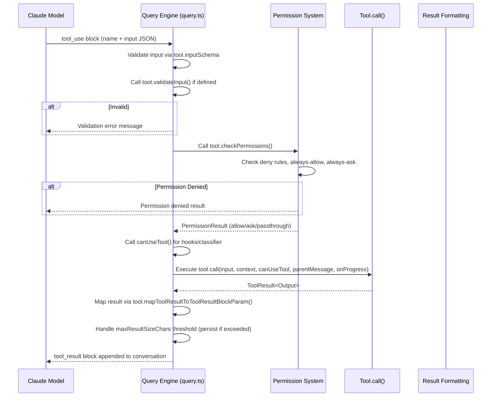

# Tools: Deep Dive

> An exhaustive analysis of the Claude Code tool system — from the `Tool` interface through registration, execution, permission checking, and rendering.

- Source: `src/Tool.ts`, `src/tools.ts`, `src/tools/*`
- Key pattern: All 60+ tools are created with `buildTool()`, registered in `getAllBaseTools()`, filtered by permission context, and merged with MCP tools via `assembleToolPool()`.

---

## 1. Tool Interface (`src/Tool.ts`)

Every tool in Claude Code conforms to the `Tool<Input, Output, Progress>` generic interface (line 362-695). The interface defines all the contracts a tool must satisfy:

### Core Identity
- **`name: string`** — Unique tool name (e.g. `'Bash'`, `'Read'`, `'Edit'`)
- **`aliases?: string[]`** — Backward-compatible aliases for renamed tools
- **`searchHint?: string`** — 3--10 word keyword string for ToolSearch

### Execution
- **`call(args, context, canUseTool, parentMessage, onProgress)`** — The core execution function. Receives parsed input, a `ToolUseContext`, a permission gate callback, the parent assistant message, and an optional progress callback. Returns `ToolResult<Output>`.
- **`inputSchema: Input`** — A Zod schema (lazy, wrapped in `lazySchema()`) for parsing model-supplied arguments.
- **`outputSchema?: ZodType<unknown>`** — Optional Zod schema for the return value.

### Lifecycle & Permissions
- **`isEnabled(): boolean`** — Whether the tool is available in the current environment
- **`isConcurrencySafe(input): boolean`** — Whether parallel invocations are safe (default: `false`)
- **`isReadOnly(input): boolean`** — Whether the tool mutates state (default: `false`)
- **`isDestructive?(input): boolean`** — Whether the operation is irreversible (delete, overwrite, send)
- **`validateInput?(input, context): ValidationResult`** — Called first; rejects malformed input before permissions
- **`checkPermissions(input, context): PermissionResult`** — Determines if the user is asked for permission
- **`preparePermissionMatcher?(input)`** — Builds a matcher closure for hook `if` conditions

### Prompt & Description
- **`description(input, options): string`** — Short description shown to the model
- **`prompt(options): string`** — Full system prompt section for the tool

### Rendering (Ink/React UI)
- **`renderToolUseMessage(input, options): ReactNode`** — Rendered while the tool is being called
- **`renderToolResultMessage(output, ...): ReactNode`** — Rendered after the tool completes
- **`renderToolUseProgressMessage(...): ReactNode`** — Rendered during execution
- **`renderToolUseRejectedMessage(...): ReactNode`** — Rendered when permission is denied
- **`renderToolUseErrorMessage(...): ReactNode`** — Rendered on execution errors
- **`renderToolUseTag?(input): ReactNode`** — Metadata badge (timeout, model, resume ID)
- **`renderGroupedToolUse?(toolUses): ReactNode | null`** — Group render for parallel instances
- **`renderToolUseQueuedMessage?(): ReactNode`** — Shown when queued

### Tool Result Serialization
- **`mapToolResultToToolResultBlockParam(content, toolUseID): ToolResultBlockParam`** — Converts output to the API's tool_result block format
- **`maxResultSizeChars: number`** — Threshold above which results are persisted to disk and replaced with a file path reference

### Utility
- **`getToolUseSummary?(input): string | null`** — Short one-line summary
- **`getActivityDescription?(input): string | null`** — Present-tense spinner description
- **`toAutoClassifierInput(input): unknown`** — Compact representation for the auto-mode security classifier
- **`userFacingName(input): string`** — Name displayed in the UI
- **`isSearchOrReadCommand?(input): { isSearch, isRead, isList }`** — For collapsible display
- **`isOpenWorld?(input): boolean`** — Whether the tool writes files outside the project
- **`backfillObservableInput?(input): void`** — Mutates input copies for legacy compatibility
- **`extractSearchText?(out): string`** — Text for transcript search indexing

### Key Supporting Types

```typescript
// src/Tool.ts, line 321
type ToolResult<T> = {
  data: T
  newMessages?: Message[]       // Side-channel messages appended to conversation
  contextModifier?: (ctx: ToolUseContext) => ToolUseContext  // Context mutation
  mcpMeta?: { _meta?, structuredContent? }  // MCP protocol metadata
}

// src/Tool.ts, line 158
type ToolUseContext = {
  options: { commands, debug, mainLoopModel, tools, thinkingConfig, mcpClients, ... }
  abortController: AbortController
  getAppState(): AppState
  setAppState(f: (prev: AppState) => AppState): void
  messages: Message[]
  agentId?: AgentId
  requestPrompt?: (source, toolInputSummary?) => (request) => Promise<Response>
  // ... 50+ fields
}
```

### `buildTool()` (line 783-792)

All tool definitions go through `buildTool()` which fills in safe defaults:

```typescript
const TOOL_DEFAULTS = {
  isEnabled: () => true,
  isConcurrencySafe: () => false,
  isReadOnly: () => false,
  isDestructive: () => false,
  checkPermissions: (input) => Promise.resolve({ behavior: 'allow', updatedInput: input }),
  toAutoClassifierInput: () => '',
  userFacingName: () => '',
}
```

Then spreads `{ ...TOOL_DEFAULTS, userFacingName: () => def.name, ...def }`. Every tool in the codebase uses `buildTool()` — this centralizes the default behavior so individual tools only override what they need.

---

## 2. Tool Registration (`src/tools.ts`)

### Static Imports

The first ~100 lines are static ESM imports:

```typescript
// src/tools.ts, lines 2-97
import { AgentTool } from './tools/AgentTool/AgentTool.js'
import { SkillTool } from './tools/SkillTool/SkillTool.js'
import { BashTool } from './tools/BashTool/BashTool.js'
import { FileEditTool } from './tools/FileEditTool/FileEditTool.js'
import { FileReadTool } from './tools/FileReadTool/FileReadTool.js'
import { FileWriteTool } from './tools/FileWriteTool/FileWriteTool.js'
import { GlobTool } from './tools/GlobTool/GlobTool.js'
import { NotbookEditTool } from './tools/NotebookEditTool/NotebookEditTool.js'
import { WebFetchTool } from './tools/WebFetchTool/WebFetchTool.js'
import { TaskStopTool } from './tools/TaskStopTool/TaskStopTool.js'
import { BriefTool } from './tools/BriefTool/BriefTool.js'
import { TaskOutputTool } from './tools/TaskOutputTool/TaskOutputTool.js'
import { WebSearchTool } from './tools/WebSearchTool/WebSearchTool.js'
import { TodoWriteTool } from './tools/TodoWriteTool/TodoWriteTool.js'
import { ExitPlanModeV2Tool } from './tools/ExitPlanModeTool/ExitPlanModeV2Tool.js'
import { TestingPermissionTool } from './tools/testing/TestingPermissionTool.js'
import { GrepTool } from './tools/GrepTool/GrepTool.js'
import { TungstenTool } from './tools/TungstenTool/TungstenTool.js'
import { AskUserQuestionTool } from './tools/AskUserQuestionTool/AskUserQuestionTool.js'
import { LSPTool } from './tools/LSPTool/LSPTool.js'
import { ListMcpResourcesTool } from './tools/ListMcpResourcesTool/ListMcpResourcesTool.js'
import { ReadMcpResourceTool } from './tools/ReadMcpResourceTool/ReadMcpResourceTool.js'
import { ToolSearchTool } from './tools/ToolSearchTool/ToolSearchTool.js'
import { EnterPlanModeTool } from './tools/EnterPlanModeTool/EnterPlanModeTool.js'
import { EnterWorktreeTool } from './tools/EnterWorktreeTool/EnterWorktreeTool.js'
import { ExitWorktreeTool } from './tools/ExitWorktreeTool/ExitWorktreeTool.js'
import { ConfigTool } from './tools/ConfigTool/ConfigTool.js'
import { TaskCreateTool } from './tools/TaskCreateTool/TaskCreateTool.js'
import { TaskGetTool } from './tools/TaskGetTool/TaskGetTool.js'
import { TaskUpdateTool } from './tools/TaskUpdateTool/TaskUpdateTool.js'
import { TaskListTool } from './tools/TaskListTool/TaskListTool.js'
```

### Conditional (Feature-Gated) Requires

Tools behind feature flags or environment checks use dynamic `require()` with dead-code elimination:

```typescript
// Internal/Ant-only tools
const REPLTool = process.env.USER_TYPE === 'ant' ? require(...) : null
const SuggestBackgroundPRTool = process.env.USER_TYPE === 'ant' ? require(...) : null

// Feature-gated tools
const SleepTool = feature('PROACTIVE') || feature('KAIROS') ? require(...) : null
const cronTools = feature('AGENT_TRIGGERS') ? [CronCreateTool, CronDeleteTool, CronListTool] : []
const RemoteTriggerTool = feature('AGENT_TRIGGERS_REMOTE') ? require(...) : null
const MonitorTool = feature('MONITOR_TOOL') ? require(...) : null
const SendUserFileTool = feature('KAIROS') ? require(...) : null
const PushNotificationTool = feature('KAIROS') || feature('KAIROS_PUSH_NOTIFICATION') ? require(...) : null
const SubscribePRTool = feature('KAIROS_GITHUB_WEBHOOKS') ? require(...) : null
const OverflowTestTool = feature('OVERFLOW_TEST_TOOL') ? require(...) : null
const CtxInspectTool = feature('CONTEXT_COLLAPSE') ? require(...) : null
const TerminalCaptureTool = feature('TERMINAL_PANEL') ? require(...) : null
const WebBrowserTool = feature('WEB_BROWSER_TOOL') ? require(...) : null
const SnipTool = feature('HISTORY_SNIP') ? require(...) : null
const ListPeersTool = feature('UDS_INBOX') ? require(...) : null
const WorkflowTool = feature('WORKFLOW_SCRIPTS') ? require(...) : null

// Env-gated
const VerifyPlanExecutionTool = process.env.CLAUDE_CODE_VERIFY_PLAN === 'true' ? require(...) : null
const getPowerShellTool = () => isPowerShellToolEnabled() ? require(...) : null
```

### Lazy Requires (Circular Dependency Break)

Team tools use lazy getter functions to break circular import chains:

```typescript
const getTeamCreateTool = () => require('./tools/TeamCreateTool/TeamCreateTool.js').TeamCreateTool
const getTeamDeleteTool = () => require('./tools/TeamDeleteTool/TeamDeleteTool.js').TeamDeleteTool
const getSendMessageTool = () => require('./tools/SendMessageTool/SendMessageTool.js').SendMessageTool
```

### `getAllBaseTools()` (line 193-251)

This is the single source of truth for all available tools:

```typescript
export function getAllBaseTools(): Tools {
  return [
    AgentTool, TaskOutputTool, BashTool,
    ...(hasEmbeddedSearchTools() ? [] : [GlobTool, GrepTool]),
    ExitPlanModeV2Tool, FileReadTool, FileEditTool, FileWriteTool, NotebookEditTool,
    WebFetchTool, TodoWriteTool, WebSearchTool, TaskStopTool, AskUserQuestionTool,
    SkillTool, EnterPlanModeTool,
    ...(process.env.USER_TYPE === 'ant' ? [ConfigTool, TungstenTool] : []),
    ...(SuggestBackgroundPRTool ? [SuggestBackgroundPRTool] : []),
    ...(WebBrowserTool ? [WebBrowserTool] : []),
    ...(isTodoV2Enabled() ? [TaskCreateTool, TaskGetTool, TaskUpdateTool, TaskListTool] : []),
    ...(OverflowTestTool ? [OverflowTestTool] : []),
    ...(CtxInspectTool ? [CtxInspectTool] : []),
    ...(TerminalCaptureTool ? [TerminalCaptureTool] : []),
    ...(isEnvTruthy(process.env.ENABLE_LSP_TOOL) ? [LSPTool] : []),
    ...(isWorktreeModeEnabled() ? [EnterWorktreeTool, ExitWorktreeTool] : []),
    getSendMessageTool(),
    ...(ListPeersTool ? [ListPeersTool] : []),
    ...(isAgentSwarmsEnabled() ? [getTeamCreateTool(), getTeamDeleteTool()] : []),
    ...(VerifyPlanExecutionTool ? [VerifyPlanExecutionTool] : []),
    ...(process.env.USER_TYPE === 'ant' && REPLTool ? [REPLTool] : []),
    ...(WorkflowTool ? [WorkflowTool] : []),
    ...(SleepTool ? [SleepTool] : []),
    ...cronTools,
    ...(RemoteTriggerTool ? [RemoteTriggerTool] : []),
    ...(MonitorTool ? [MonitorTool] : []),
    BriefTool,
    ...(SendUserFileTool ? [SendUserFileTool] : []),
    ...(PushNotificationTool ? [PushNotificationTool] : []),
    ...(SubscribePRTool ? [SubscribePRTool] : []),
    ...(getPowerShellTool() ? [getPowerShellTool()] : []),
    ...(SnipTool ? [SnipTool] : []),
    ...(process.env.NODE_ENV === 'test' ? [TestingPermissionTool] : []),
    ListMcpResourcesTool, ReadMcpResourceTool,
    ...(isToolSearchEnabledOptimistic() ? [ToolSearchTool] : []),
  ]
}
```

### `getTools()` and `assembleToolPool()`

`getTools()` (line 271-327) applies environment filters:
1. `CLAUDE_CODE_SIMPLE` mode: returns only `[BashTool, FileReadTool, FileEditTool]` (or `[REPLTool]` in REPL mode)
2. Special tool filtering: removes `ListMcpResourcesTool`, `ReadMcpResourceTool`, and `SyntheticOutputTool` from the base set (they are injected elsewhere)
3. REPL mode: hides `REPL_ONLY_TOOLS` primitives
4. Deny rules: calls `filterToolsByDenyRules()` to remove tools denied by permissions
5. Enabled check: filters by `tool.isEnabled()`

`assembleToolPool()` (line 345-367) merges built-in tools with MCP tools:
1. Gets built-in tools via `getTools()`
2. Filters MCP tools by deny rules
3. Sorts both sets alphabetically for prompt-cache stability
4. Deduplicates by name via `uniqBy()` (built-in wins on conflict)

---

## 3. Tool Execution Pipeline

The full lifecycle of a tool call flows through:



### Step-by-step for a File Read:

1. **Model emits** `tool_use { name: "Read", input: { file_path: "/src/index.ts" } }`
2. **Input parsing**: `FileReadTool.inputSchema` (a Zod `strictObject`) validates `file_path` is a string, applies `expandPath()` and `lazySchema()`
3. **validateInput**: Checks for blocked device paths (`/dev/zero`, `/dev/random`, etc.), checks file exists
4. **checkPermissions**: Calls `checkReadPermissionForTool()` from the filesystem permission system
5. **canUseTool**: Permission hooks run (classifier, `/always-allow` rules)
6. **call()**: `readFileAsync()` is invoked, optionally with line range. PDFs go through `readPDF()`. Images are resized and downsampled
7. **Result rendering**: Progress message `"Reading src/index.ts"` shown, then content displayed with syntax highlighting
8. **Serialization**: `mapToolResultToToolResultBlockParam()` wraps content in `tool_result` block. If content exceeds `maxResultSizeChars`, it's persisted to disk with a preview path reference

---

## 4. Tool Categories

### 4.1 File System Tools

| Tool | File | Purpose |
|------|------|---------|
| `BashTool` | `BashTool/BashTool.tsx` | Execute shell commands |
| `FileEditTool` | `FileEditTool/FileEditTool.ts` | In-place file edits with diffs |
| `FileReadTool` | `FileReadTool/FileReadTool.ts` | Read files (text, PDF, images) |
| `FileWriteTool` | `FileWriteTool/FileWriteTool.ts` | Create or overwrite files |
| `GlobTool` | `GlobTool/GlobTool.ts` | File pattern matching |
| `GrepTool` | `GrepTool/GrepTool.ts` | Content search via ripgrep |
| `NotebookEditTool` | `NotebookEditTool/NotebookEditTool.ts` | Jupyter notebook cell editing |
| `ConfigTool` | `ConfigTool/ConfigTool.ts` | Get/set Claude Code settings |
| `LSPTool` | `LSPTool/LSPTool.ts` | LSP operations (go-to-definition, references, hover, etc.) |

**BashTool** is the most complex tool (~2000+ lines). Key implementation details:
- Uses `lazySchema()` for input schema with fields: `command`, `timeout`, `description`, `run_in_background`, `dangerouslyDisableSandbox`, `_simulatedSedEdit`
- `isSearchOrReadBashCommand()` (line 95-172) classifies commands as search, read, list, or write for collapsible UI display
- Silent commands (`mv`, `cp`, `rm`, etc.) show "Done" instead of "(No output)"
- Auto-backgrounding in assistant mode after `ASSISTANT_BLOCKING_BUDGET_MS` (15 seconds)
- Sandbox support via `SandboxManager`
- sed edit detection with preview/approval flow
- Extensive permission checking via `bashToolHasPermission()` with command AST parsing, wildcard matching, and exact-match rules

**FileEditTool** (`FileEditTool/FileEditTool.ts`, line 86):
- `name: FILE_EDIT_TOOL_NAME` (constant from `FileEditTool/constants.ts`)
- `searchHint: 'modify file contents in place'`
- `maxResultSizeChars: 100_000`
- `strict: true` — enables strict API parameter enforcement
- Uses `findActualString()` and `getPatchForEdit()` for string matching and patch generation
- `MAX_EDIT_FILE_SIZE: 1 GiB` guard
- Integrates with LSP diagnostics, file history tracking, git diff, and skill directory discovery
- `backfillObservableInput()` for legacy field compatibility

### 4.2 Search & Web Tools

| Tool | File | Purpose |
|------|------|---------|
| `WebSearchTool` | `WebSearchTool/WebSearchTool.ts` | Web search via Claude API's built-in web_search |
| `WebFetchTool` | `WebFetchTool/WebFetchTool.ts` | Fetch and process URL content |
| `ToolSearchTool` | `ToolSearchTool/ToolSearchTool.ts` | Search deferred tools by keyword |

**WebSearchTool** (`WebSearchTool/WebSearchTool.ts`, line 152):
- `shouldDefer: true` — not loaded in initial system prompt; discovered via ToolSearch
- Delegates to Claude API's `web_search_20250305` beta tool schema
- Spawns a sub-query with `queryModelWithStreaming()` to perform the actual search
- Supports `allowed_domains` and `blocked_domains` filtering
- `max_uses: 8` hardcoded search limit per call
- Only enabled for `firstParty`, `vertex`, or `foundry` API providers

**WebFetchTool** (`WebFetchTool/WebFetchTool.ts`, line 66):
- `shouldDefer: true`; takes `url` and `prompt` inputs
- `isPreapprovedHost()` / `isPreapprovedUrl()` checks for pre-approved domains
- Calls `getURLMarkdownContent()` to fetch and convert to markdown
- Applies a prompt via `applyPromptToMarkdown()` to extract/proces content

### 4.3 Task Management Tools

| Tool | File | Purpose |
|------|------|---------|
| `TodoWriteTool` | `TodoWriteTool/TodoWriteTool.ts` | Legacy: update session task checklist |
| `TaskCreateTool` | `TaskCreateTool/TaskCreateTool.ts` | Create a task in the task list |
| `TaskGetTool` | `TaskGetTool/TaskGetTool.ts` | Retrieve a task by ID |
| `TaskUpdateTool` | `TaskUpdateTool/TaskUpdateTool.ts` | Update task status, metadata, dependencies |
| `TaskListTool` | `TaskListTool/TaskListTool.ts` | List all tasks |
| `TaskStopTool` | `TaskStopTool/TaskStopTool.ts` | Stop a running background task |
| `TaskOutputTool` | `TaskOutputTool/TaskOutputTool.tsx` | Get output from any task type |

**TodoWriteTool** vs **TaskTools**: TodoWriteTool is the legacy task system (V1). TaskCreate/TaskGet/TaskUpdate/TaskList are V2 (`isTodoV2Enabled()` gated). They are mutually exclusive — `TodoWriteTool.isEnabled()` returns `!isTodoV2Enabled()`, and the V2 tools only appear when `isTodoV2Enabled()` is true.

**TaskUpdateTool** (`TaskUpdateTool/TaskUpdateTool.ts`, line 88):
- Supports `'deleted'` as a special status value to permanently remove tasks
- Can set arbitrary metadata (set a key to `null` to delete it)
- Runs `executeTaskCompletedHooks()` when tasks transition to completed
- Supports teammate mailbox notifications for multi-agent scenarios

### 4.4 Agent & Coordination Tools

| Tool | File | Purpose |
|------|------|---------|
| `AgentTool` | `AgentTool/AgentTool.tsx` | Spawn sub-agents (fork/team/background) |
| `SkillTool` | `SkillTool/SkillTool.ts` | Execute slash-command skills |
| `SendMessageTool` | `SendMessageTool/SendMessageTool.ts` | Communicate with teammates |
| `BriefTool` | `BriefTool/BriefTool.ts` | Send messages to the user |
| `TeamCreateTool` | `TeamCreateTool/TeamCreateTool.ts` | Create agent teams |
| `TeamDeleteTool` | `TeamDeleteTool/TeamDeleteTool.ts` | Delete agent teams |

**AgentTool** (`AgentTool/AgentTool.tsx`):
- Takes `description`, `prompt`, `subagent_type`, `model`, `run_in_background`
- Supports multi-agent spawns via `name`, `team_name`, `mode`
- `isolation: 'worktree'` creates a temporary git worktree
- Built-in agent types: `generalPurposeAgent`, `exploreAgent`, `planAgent`, `verificationAgent`, `claudeCodeGuideAgent`
- Two execution paths:
  1. **In-process (fork)**: `forkSubagent.ts` — spawns a child agent that inherits parent context
  2. **Remote async**: `resumeAgent.ts` — background agent with progress notifications

**SkillTool** (`SkillTool/SkillTool.ts`, line 331):
- All commands (local + MCP skills) are loaded via `getAllCommands()`
- Executes a skill in a forked sub-agent context via `runAgent()`
- Supports remote skills (gated by `feature('EXPERIMENTAL_SKILL_SEARCH')`)
- `resolveSkillModelOverride()` for model selection
- Permission checks via `getRuleByContentsForTool()`

### 4.5 MCP & Integration Tools

| Tool | File | Purpose |
|------|------|---------|
| `MCPTool` | `MCPTool/MCPTool.ts` | Generic MCP tool proxy |
| `ListMcpResourcesTool` | `ListMcpResourcesTool/ListMcpResourcesTool.ts` | List MCP server resources |
| `ReadMcpResourceTool` | `ReadMcpResourceTool/ReadMcpResourceTool.ts` | Read specific MCP resource |
| `McpAuthTool` | `McpAuthTool/McpAuthTool.ts` | MCP server authentication flow |

**MCPTool** is a stub whose properties are overridden at runtime in `mcpClient.ts`:
- `name: 'mcp'` — placeholder; replaced with `mcp__serverName__toolName`
- `isMcp: true` — marks it as an MCP proxy tool
- `isOpenWorld() { return false }`
- `checkPermissions()` returns `'passthrough'` so every MCP call is subject to the general permissions system
- Schema is `z.object({}).passthrough()` — accepts any input since MCP tools define their own schemas

### 4.6 Planning & Mode Tools

| Tool | File | Purpose |
|------|------|---------|
| `EnterPlanModeTool` | `EnterPlanModeTool/EnterPlanModeTool.ts` | Switch to plan mode |
| `ExitPlanModeV2Tool` | `ExitPlanModeTool/ExitPlanModeV2Tool.ts` | Exit plan mode with prompt-based permissions |
| `EnterWorktreeTool` | `EnterWorktreeTool/EnterWorktreeTool.ts` | Create isolated git worktree |
| `ExitWorktreeTool` | `ExitWorktreeTool/ExitWorktreeTool.ts` | Exit worktree mode |

**ExitPlanModeV2Tool** (`ExitPlanModeTool/ExitPlanModeV2Tool.ts`, line 147):
- Accepts `allowedPrompts` — semantic permission prompts the model pre-negotiates
- Accepts `toolConfigs` — pre-approved setting changes
- On exit, applies the permission updates and persists the plan
- Supports teammate plan approval via mailbox messaging

### 4.7 System & Support Tools

| Tool | File | Purpose |
|------|------|---------|
| `ConfigTool` | `ConfigTool/ConfigTool.ts` | Read/write settings |
| `SleepTool` | `SleepTool/SleepTool.ts` | Agent pause/resume (PROACTIVE/KAIROS) |
| `MonitorTool` | `MonitorTool/MonitorTool.ts` | System monitoring |
| `TungstenTool` | `TungstenTool/TungstenTool.ts` | Internal terminal bridge (stub, always disabled) |
| `REPLTool` | `REPLTool/REPLTool.tsx` | REPL mode wrapper (Ant-only) |
| `PowerShellTool` | `PowerShellTool/PowerShellTool.tsx` | Windows PowerShell execution (conditional) |

### 4.8 Feature-Gated Tools

| Tool | Feature Flag | Purpose |
|------|-------------|---------|
| `CronCreateTool` | `AGENT_TRIGGERS` | Schedule cron tasks |
| `CronDeleteTool` | `AGENT_TRIGGERS` | Delete cron tasks |
| `CronListTool` | `AGENT_TRIGGERS` | List cron tasks |
| `RemoteTriggerTool` | `AGENT_TRIGGERS_REMOTE` | Remote trigger execution |
| `PushNotificationTool` | `KAIROS` / `KAIROS_PUSH_NOTIFICATION` | Push notifications |
| `SendUserFileTool` | `KAIROS` | Send files to user |
| `SubscribePRTool` | `KAIROS_GITHUB_WEBHOOKS` | GitHub PR webhooks |
| `WebBrowserTool` | `WEB_BROWSER_TOOL` | Headless browser |
| `SnipTool` | `HISTORY_SNIP` | Conversation history snip |
| `WorkflowTool` | `WORKFLOW_SCRIPTS` | Workflow script execution |

### 4.9 Testing Tools

| Tool | File | Purpose |
|------|------|---------|
| `TestingPermissionTool` | `testing/TestingPermissionTool.tsx` | Permission dialog test tool |
| `OverflowTestTool` | `OverflowTestTool/OverflowTestTool.ts` | Context overflow testing |

---

## 5. Permission System

### `ALL_AGENT_DISALLOWED_TOOLS` (`src/constants/tools.ts`, line 36-46)

Tools blocked from sub-agent use:

```typescript
export const ALL_AGENT_DISALLOWED_TOOLS = new Set([
  TASK_OUTPUT_TOOL_NAME,
  EXIT_PLAN_MODE_V2_TOOL_NAME,
  ENTER_PLAN_MODE_TOOL_NAME,
  ...(process.env.USER_TYPE === 'ant' ? [] : [AGENT_TOOL_NAME]),  // ant users can nest
  ASK_USER_QUESTION_TOOL_NAME,
  TASK_STOP_TOOL_NAME,
  ...(feature('WORKFLOW_SCRIPTS') ? [WORKFLOW_TOOL_NAME] : []),
])
```

### `ASYNC_AGENT_ALLOWED_TOOLS` (line 55-71)

Tools available to background agents:

```typescript
export const ASYNC_AGENT_ALLOWED_TOOLS = new Set([
  FILE_READ_TOOL_NAME, WEB_SEARCH_TOOL_NAME, TODO_WRITE_TOOL_NAME,
  GREP_TOOL_NAME, WEB_FETCH_TOOL_NAME, GLOB_TOOL_NAME,
  ...SHELL_TOOL_NAMES, FILE_EDIT_TOOL_NAME, FILE_WRITE_TOOL_NAME,
  NOTEBOOK_EDIT_TOOL_NAME, SKILL_TOOL_NAME, SYNTHETIC_OUTPUT_TOOL_NAME,
  TOOL_SEARCH_TOOL_NAME, ENTER_WORKTREE_TOOL_NAME, EXIT_WORKTREE_TOOL_NAME,
])
```

### `COORDINATOR_MODE_ALLOWED_TOOLS` (line 107-112)

```typescript
export const COORDINATOR_MODE_ALLOWED_TOOLS = new Set([
  AGENT_TOOL_NAME, TASK_STOP_TOOL_NAME, SEND_MESSAGE_TOOL_NAME,
  SYNTHETIC_OUTPUT_TOOL_NAME,
])
```

### Permission Flow per Tool

Each tool implements `checkPermissions()` which returns a `PermissionResult`:
- `{ behavior: 'allow' }` — auto-approved
- `{ behavior: 'ask', message: '...' }` — shows a permission dialog
- `{ behavior: 'passthrough', message: '...' }` — passes to the general permission system

The general system (`permissions.ts`) layers:
1. **Deny rules** — blanket or pattern-based denials
2. **Always-allow rules** — patterns auto-approved
3. **Always-ask rules** — always prompt
4. **Classifier** (auto-mode) — AI-based security classification
5. **Denial tracking** — repeated denials cause fallback to prompting mode

---

## 6. Tool Search Mechanism (`ToolSearchTool`)

When the total number of tools (built-in + MCP) exceeds a threshold, less-used tools are **deferred**. They are replaced with a single `ToolSearch` tool that the model can call to discover and load deferred tools.

**`isDeferredTool(tool)`** logic (from `ToolSearchTool/prompt.ts`, line 62):
- Tools with `shouldDefer: true` are always deferred
- Tools without `alwaysLoad: true` that exceed the threshold are deferred
- ToolSearch is never deferred

The `ToolSearchTool` (`ToolSearchTool/ToolSearchTool.ts`, line 304):
- Takes `query` (keyword or `select:<tool_name>`) and `max_results`
- Searches deferred tool names, descriptions, search hints, and aliases
- Returns matching deferred tools with their full descriptions
- Results are memoized per tool name via `getToolDescriptionMemoized()`

---

## 7. `SyntheticOutputTool`

`SyntheticOutputTool` (`SyntheticOutputTool/SyntheticOutputTool.ts`, line 28) is a special tool for **non-interactive SDK sessions** (e.g., CI/CD pipelines). It allows Claude to return structured JSON output following a user-defined JSON Schema.

- Created dynamically via `createSyntheticOutputTool(jsonSchema)` which compiles an Ajv validator
- Cached weakly by schema object reference to avoid recompilation overhead
- Not included in the base tool set; injected separately in `main.tsx` when `isSyntheticOutputToolEnabled()` returns true
- Constant name: `SYNTHETIC_OUTPUT_TOOL_NAME = 'StructuredOutput'`

---

## 8. Error Handling Patterns

Tools use several error handling strategies:

1. **`validateInput()`** — Returns `ValidationResult` with `{ result: false, message, errorCode }`. Called before permissions. Prevents malformed input from reaching the execution pipeline.

2. **Thrown errors in `call()`** — Caught by the query engine, mapped to error results. Can throw `TelemetrySafeError` to control what appears in analytics.

3. **`renderToolUseErrorMessage()`** — Custom error UI per tool (e.g., GrepTool shows "File not found" instead of a raw stack trace).

4. **`maxResultSizeChars` overflow** — When output exceeds the threshold, it's persisted to the tool-results directory. The model receives a preview with a file path reference. Hard errors are avoided by the storage layer.

5. **Timeout handling** — BashTool supports configurable timeouts (`getDefaultTimeoutMs()`, `getMaxTimeoutMs()`). Background tasks have separate timeout tracking.

6. **AbortController** — All tools receive `context.abortController.signal`. Long-running tools (Bash, Agent) check this signal and cleanly abort.

---

## 9. Complete Tool Inventory

Every tool registered in `getAllBaseTools()`, with file paths:

| # | Tool Name | File | Category |
|---|-----------|------|----------|
| 1 | `AgentTool` | `AgentTool/AgentTool.tsx` | Agent |
| 2 | `TaskOutputTool` | `TaskOutputTool/TaskOutputTool.tsx` | Task |
| 3 | `BashTool` | `BashTool/BashTool.tsx` | File System |
| 4 | `GlobTool` | `GlobTool/GlobTool.ts` | File System |
| 5 | `GrepTool` | `GrepTool/GrepTool.ts` | File System |
| 6 | `ExitPlanModeV2Tool` | `ExitPlanModeTool/ExitPlanModeV2Tool.ts` | Planning |
| 7 | `FileReadTool` | `FileReadTool/FileReadTool.ts` | File System |
| 8 | `FileEditTool` | `FileEditTool/FileEditTool.ts` | File System |
| 9 | `FileWriteTool` | `FileWriteTool/FileWriteTool.ts` | File System |
| 10 | `NotebookEditTool` | `NotebookEditTool/NotebookEditTool.ts` | File System |
| 11 | `WebFetchTool` | `WebFetchTool/WebFetchTool.ts` | Web |
| 12 | `TodoWriteTool` | `TodoWriteTool/TodoWriteTool.ts` | Task |
| 13 | `WebSearchTool` | `WebSearchTool/WebSearchTool.ts` | Web |
| 14 | `TaskStopTool` | `TaskStopTool/TaskStopTool.ts` | Task |
| 15 | `AskUserQuestionTool` | `AskUserQuestionTool/AskUserQuestionTool.tsx` | System |
| 16 | `SkillTool` | `SkillTool/SkillTool.ts` | Agent |
| 17 | `EnterPlanModeTool` | `EnterPlanModeTool/EnterPlanModeTool.ts` | Planning |
| 18 | `ConfigTool` | `ConfigTool/ConfigTool.ts` | System (Ant-only) |
| 19 | `TungstenTool` | `TungstenTool/TungstenTool.ts` | System (Ant-only, disabled) |
| 20 | `SuggestBackgroundPRTool` | `SuggestBackgroundPRTool/SuggestBackgroundPRTool.ts` | Internal (Ant-only) |
| 21 | `WebBrowserTool` | `WebBrowserTool/WebBrowserTool.ts` | Web (feature-gated) |
| 22 | `TaskCreateTool` | `TaskCreateTool/TaskCreateTool.ts` | Task (V2) |
| 23 | `TaskGetTool` | `TaskGetTool/TaskGetTool.ts` | Task (V2) |
| 24 | `TaskUpdateTool` | `TaskUpdateTool/TaskUpdateTool.ts` | Task (V2) |
| 25 | `TaskListTool` | `TaskListTool/TaskListTool.ts` | Task (V2) |
| 26 | `OverflowTestTool` | `OverflowTestTool/OverflowTestTool.ts` | Testing (feature-gated) |
| 27 | `CtxInspectTool` | `CtxInspectTool/CtxInspectTool.ts` | Debug (feature-gated) |
| 28 | `TerminalCaptureTool` | `TerminalCaptureTool/TerminalCaptureTool.ts` | System (feature-gated) |
| 29 | `LSPTool` | `LSPTool/LSPTool.ts` | File System (env-gated) |
| 30 | `EnterWorktreeTool` | `EnterWorktreeTool/EnterWorktreeTool.ts` | Planning |
| 31 | `ExitWorktreeTool` | `ExitWorktreeTool/ExitWorktreeTool.ts` | Planning |
| 32 | `SendMessageTool` | `SendMessageTool/SendMessageTool.ts` | Agent |
| 33 | `ListPeersTool` | `ListPeersTool/ListPeersTool.ts` | System (feature-gated) |
| 34 | `TeamCreateTool` | `TeamCreateTool/TeamCreateTool.ts` | Agent (feature-gated) |
| 35 | `TeamDeleteTool` | `TeamDeleteTool/TeamDeleteTool.ts` | Agent (feature-gated) |
| 36 | `VerifyPlanExecutionTool` | `VerifyPlanExecutionTool/VerifyPlanExecutionTool.ts` | Planning (env-gated) |
| 37 | `REPLTool` | `REPLTool/REPLTool.tsx` | System (Ant-only) |
| 38 | `WorkflowTool` | `WorkflowTool/WorkflowTool.ts` | System (feature-gated) |
| 39 | `SleepTool` | `SleepTool/SleepTool.ts` | System (feature-gated) |
| 40 | `CronCreateTool` | `ScheduleCronTool/CronCreateTool.ts` | Cron (feature-gated) |
| 41 | `CronDeleteTool` | `ScheduleCronTool/CronDeleteTool.ts` | Cron (feature-gated) |
| 42 | `CronListTool` | `ScheduleCronTool/CronListTool.ts` | Cron (feature-gated) |
| 43 | `RemoteTriggerTool` | `RemoteTriggerTool/RemoteTriggerTool.ts` | System (feature-gated) |
| 44 | `MonitorTool` | `MonitorTool/MonitorTool.ts` | System (feature-gated) |
| 45 | `BriefTool` | `BriefTool/BriefTool.ts` | Agent |
| 46 | `SendUserFileTool` | `SendUserFileTool/SendUserFileTool.ts` | System (feature-gated) |
| 47 | `PushNotificationTool` | `PushNotificationTool/PushNotificationTool.ts` | System (feature-gated) |
| 48 | `SubscribePRTool` | `SubscribePRTool/SubscribePRTool.ts` | GitHub (feature-gated) |
| 49 | `PowerShellTool` | `PowerShellTool/PowerShellTool.tsx` | File System (conditional) |
| 50 | `SnipTool` | `SnipTool/SnipTool.ts` | System (feature-gated) |
| 51 | `TestingPermissionTool` | `testing/TestingPermissionTool.tsx` | Testing |
| 52 | `ListMcpResourcesTool` | `ListMcpResourcesTool/ListMcpResourcesTool.ts` | MCP |
| 53 | `ReadMcpResourceTool` | `ReadMcpResourceTool/ReadMcpResourceTool.ts` | MCP |
| 54 | `ToolSearchTool` | `ToolSearchTool/ToolSearchTool.ts` | System |
| 55 | `SyntheticOutputTool` | `SyntheticOutputTool/SyntheticOutputTool.ts` | System (dynamic) |

---

## 10. Directory Structure

```
src/tools/
  AgentTool/               -- Sub-agent spawning (25 files: ts, tsx)
  AskUserQuestionTool/     -- Interactive user questions
  BashTool/                -- Shell command execution (18 files)
  BriefTool/               -- Messages to user
  ConfigTool/              -- Settings read/write
  DiscoverSkillsTool/      -- Skill discovery
  EnterPlanModeTool/       -- Plan mode entry
  EnterWorktreeTool/       -- Worktree entry
  ExitPlanModeTool/        -- Plan mode exit
  ExitWorktreeTool/        -- Worktree exit
  FileEditTool/            -- In-place file edits
  FileReadTool/            -- File reading
  FileWriteTool/           -- File writing
  GlobTool/                -- File pattern matching
  GrepTool/                -- Content searching
  LSPTool/                 -- LSP operations
  ListMcpResourcesTool/    -- MCP resource listing
  MCPTool/                 -- MCP tool proxy
  McpAuthTool/             -- MCP auth flow
  MonitorTool/             -- System monitor
  NotebookEditTool/        -- Jupyter notebook editing
  OverflowTestTool/        -- Context overflow testing
  PowerShellTool/          -- Windows PowerShell
  REPLTool/                -- REPL mode
  ReadMcpResourceTool/     -- MCP resource reading
  RemoteTriggerTool/       -- Remote triggers
  ReviewArtifactTool/      -- Artifact review
  ScheduleCronTool/        -- Cron scheduling (3 tools)
  SendMessageTool/         -- Teammate messaging
  SkillTool/               -- Skill execution
  SnipTool/                -- History snip
  SuggestBackgroundPRTool/ -- PR suggestions
  SyntheticOutputTool/     -- Structured JSON output
  TaskCreateTool/          -- Task creation (V2)
  TaskGetTool/             -- Task retrieval (V2)
  TaskListTool/            -- Task listing (V2)
  TaskOutputTool/          -- Task output
  TaskStopTool/            -- Task stopping
  TaskUpdateTool/          -- Task updating (V2)
  TeamCreateTool/          -- Team creation
  TeamDeleteTool/          -- Team deletion
  TerminalCaptureTool/     -- Terminal capture
  TodoWriteTool/           -- Todo list (V1)
  ToolSearchTool/          -- Tool discovery
  TungstenTool/            -- Terminal bridge (stub)
  VerifyPlanExecutionTool/ -- Plan verification
  WebBrowserTool/          -- Headless browser
  WebFetchTool/            -- URL content fetching
  WebSearchTool/           -- Web searching
  WorkflowTool/            -- Workflow scripts
  shared/                  -- Shared utilities
  testing/                 -- Testing tools
  utils.ts                 -- Shared tool utilities
```
